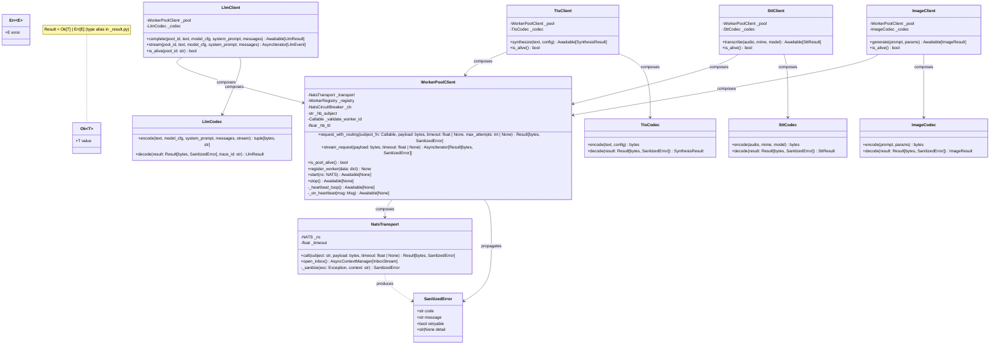
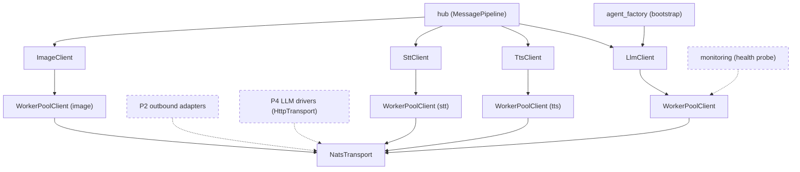

## Context

This is Phase 1 of the stage-axis refactor epic #1277. The frame and analyze stages were
skipped at this level because the epic-level SSoT
(`artifacts/analyses/1277-stage-axis-refactor-strategy.mdx`) covers the full analytical
context: root-cause (N×M duplication axis), 3-layer target architecture, U1-U5
architectural decisions, and the debt drain map. Readers should consult that document for
the "why"; this spec answers the "how, exactly" for the atomic PR.

The immediate antecedent is #1235, which extracted `NatsWorkerClientBase` from the 4
clients via inheritance. Phase 1 replays that work as composition, not inheritance, and
then deletes the base class.

### Fixed decisions from #1277 SSoT (U1–U5)

All five architectural decisions from the epic are **fixed** for this spec. The spec's job
is purely about contract surfaces, not architectural shape.

| Decision | Locked to |
|---|---|
| U1 — Result[T,E] native | `Ok[T]` / `Err[E]` / `SanitizedError`; no exceptions across layer boundaries |
| U2 — Composition over inheritance | Domain clients compose `WorkerPoolClient`; `NatsWorkerClientBase` deleted |
| U3 — CB per-pool | One `NatsCircuitBreaker` per `WorkerPoolClient` instance; never shared |
| U4 — Heartbeat in pool | `WorkerPoolClient` owns the heartbeat subscription and `WorkerRegistry` |
| U5 — Tests by layer | Transport, pool, domain each have independent unit-test suites |

### Consensus artifact

Two implementation-blocking decisions (B1 streaming, B2 routing) were resolved via
3-voice expert consensus (`artifacts/analyses/1278-nats-transport-workerpool-consensus.mdx`,
`ec2333f2`). All open items are closed as of v2.

## Goal

Replace the 4-client inheritance chain (`Nats{Llm,Tts,Stt,Image}Client →
NatsWorkerClientBase → NatsDriverBase`) with a 3-layer composition (`domain client →
WorkerPoolClient → NatsTransport`) so that NATS transport bugs require changes in exactly
one file and domain clients carry only codec + business logic.

## Out of scope

The following sub-issues appear in the epic body's "absorbed sub-issues" list but are **not
covered by this PR** and must not be closed as absorbed:

- **#840** — worker-side `lyra adapter llm` subprocess, supervisor config, and heartbeat
  publisher. This is worker-side infrastructure; Phase 1 covers only the hub-side client
  stack.
- **#1067** — voiceCLI cross-repo STT/TTS BlobRef contract. This is a BlobStore/contract
  territory issue requiring a separate cross-repo coordination.

Both are tracked separately. The epic body's "absorbed sub-issues" line is incorrect for
these two items and should be corrected in a separate epic-maintenance pass (do not modify
the GitHub issue directly from this PR).

## Users

Internal consumers only — no external user-facing surface changes:

| Consumer | Role |
|---|---|
| `bootstrap/factory/llm_overlay.py` | constructs and starts the LLM client |
| `bootstrap/factory/voice_overlay.py` | constructs and starts TTS + STT clients |
| `bootstrap/factory/hub_builder.py` | wires LLM client into hub |
| `bootstrap/factory/wiring_helpers.py` | injects LLM client into agent factory |
| `tests/llm/test_nats_llm_client_provider.py` | unit tests LlmClient (canonical pilot) |
| `tests/nats/test_nats_{tts,stt,image}_client.py` | unit tests TTS, STT, Image |
| `tests/nats/test_worker_client_base.py` | deleted in S6 |
| `tests/integration/test_worker_error_e2e.py` | smoke test retained |

## Expected Behavior

### Happy path — non-streaming LLM completion

1. Hub calls `LlmClient.complete(pool_id, text, model_cfg, system_prompt)`.
2. `LlmCodec.encode(...)` builds a canonical `LlmRequest` bytes payload.
3. `LlmClient` calls `pool.request_with_routing(lambda _: SUBJECTS.generate_request, payload, max_attempts=1)`.
4. `WorkerPoolClient` checks circuit breaker (`cb.is_open()` → False).
5. `WorkerPoolClient` checks worker registry (`registry.any_alive()` → True).
6. `WorkerPoolClient` picks the best worker from `registry.scored()`.
7. `WorkerPoolClient` emits structured log `{pool, worker_id, subject, attempt, result}` before calling transport.
8. `WorkerPoolClient` delegates to `transport.call(subject, payload, timeout)`.
9. `NatsTransport` executes `nc.request(subject, payload, timeout=timeout)`.
10. `NatsTransport` returns `Ok(raw_bytes)` on success.
11. `WorkerPoolClient` forwards `Ok(raw_bytes)` to the domain client.
12. `LlmCodec.decode(Ok(raw_bytes), trace_id)` validates via `LlmResponse.model_validate_json`,
    records circuit breaker success, returns `LlmResult(result=text, ...)`.

### Error path — transport failure (never raises)

1. Step 9 raises `nats.errors.NoRespondersError`.
2. `NatsTransport.call` catches it, calls `_sanitize(exc)` → `"NoRespondersError"`.
3. Returns `Err(SanitizedError(code="transport.no_responders", message="...", retryable=True))`.
4. `WorkerPoolClient` calls `registry.mark_stale(worker_id)` (code is `transport.no_responders`).
5. `WorkerPoolClient` records circuit breaker failure.
6. `WorkerPoolClient` returns `Err(SanitizedError(...))` to domain client.
7. `LlmCodec.decode(Err(...))` maps to `LlmResult(error=..., worker_error=...)`.
8. Hub receives `LlmResult` with populated `worker_error` field — no exception raised at
   any layer.

The same pattern applies to TTS (`SynthesisResult`), STT (`SttResult`), and Image
(`ImageResult`). The `SanitizedError.message` field contains only `type(exc).__name__`
(never `str(exc)`) — this is the single site enforcing the #1212 sanitization rule.

### Error path — decode failure (never raises, CB unaffected)

1. Transport returns `Ok(raw_bytes)` (transport succeeded).
2. `LlmCodec.decode(Ok(raw_bytes), trace_id)` calls `LlmResponse.model_validate_json(raw_bytes)`.
3. `model_validate_json` raises `ValidationError` (malformed wire payload, schema drift).
4. `LlmCodec.decode` wraps the exception: returns `LlmResult(error="decode.validation_error", ...)`.
5. Pool does NOT see the decode failure. CB does NOT record a failure.

Design rationale: the circuit breaker protects against worker failures, not against schema
drift between worker and hub. A `ValidationError` on decode means the worker replied
correctly (transport-level success) but the payload does not match the expected schema.
That is a deploy/coordination concern, not a worker-health concern. Marking the worker
stale or opening the CB on decode failure would incorrectly penalize a healthy worker for a
hub-side schema mismatch.

## Data Model & Consumers

### Class diagram



### Consumer flowchart



Solid edges = in-scope consumers for this PR. Dashed edges = downstream phases that will
also consume these layers but are not wired here.

### Consumer table

| Consumer | Fields / methods consumed | Status |
|---|---|---|
| `hub (MessagePipeline)` | `LlmClient.complete`, `LlmClient.stream`, `LlmClient.is_alive` | This issue |
| `hub (MessagePipeline)` | `TtsClient.synthesize`, `SttClient.transcribe`, `ImageClient.generate` | This issue |
| `bootstrap/factory/llm_overlay.py` | `LlmClient.__init__`, `LlmClient.start/stop` | This issue |
| `bootstrap/factory/voice_overlay.py` | `TtsClient.__init__`, `SttClient.__init__`, `start/stop` | This issue |
| `monitoring` | `WorkerPoolClient.is_pool_alive()` | Future phase |
| `P2 outbound adapters` | `NatsTransport.call` | Phase 2 |
| `P4 LLM drivers` | `NatsTransport` (HTTP variant) | Phase 4 |

## Breadboard

### Layer 1 — `src/lyra/transport/nats_request_response.py`

Pure wire transport. No domain knowledge. No circuit breaker. No heartbeat.

| Method | Signature | Returns | Raises | Notes |
|---|---|---|---|---|
| `__init__` | `(nc: NATS, *, default_timeout: float = 120.0)` | — | — | Stores nc ref; no subscription |
| `call` | `(subject: str, payload: bytes, *, timeout: float \| None = None) -> Awaitable[Result[bytes, SanitizedError]]` | `Ok(bytes)` or `Err(SanitizedError)` | never | Catches `TimeoutError`, `NoRespondersError`, `nats.errors.Error`; delegates to `_sanitize` |
| `open_inbox` | `() -> AsyncContextManager[InboxStream]` | `InboxStream` on `__aenter__` | never (yields Err) | CM creates inbox + subscribes on enter; unsubscribes + drains on exit. Both events logged at INFO. Messages iterator yields `Err(SanitizedError)` on timeout or sanitized exception; never raises. |
| `_sanitize` | `(exc: Exception, *, context: str = "", payload_kb: float = 0.0) -> SanitizedError` | `SanitizedError` | never | Single site of `type(exc).__name__` sanitization (#1212 rule) |

`InboxStream` is a typed dataclass:

```python
@dataclass(frozen=True)
class InboxStream:
    inbox_subject: str
    messages: AsyncIterator[Result[bytes, SanitizedError]]
```

**P4 `HttpTransport` asymmetry (intentional):** `HttpTransport` implements `call(...)` and
raises `NotImplementedError` on `open_inbox()` with message
`"HTTP transport does not provide inbox-based streaming; use codec-level SSE."`.
Streaming over HTTP is a codec-level concern (SSE) handled inside the HTTP driver.
The P4 author (#1281) must be informed of this asymmetry before P1 merges.

`Result[T, E]` type definition lives in `src/lyra/transport/_result.py` (~25 lines):

```python
from dataclasses import dataclass
from typing import Generic, TypeVar, Union

T = TypeVar("T"); E = TypeVar("E")

@dataclass(frozen=True)
class Ok(Generic[T]):  value: T

@dataclass(frozen=True)
class Err(Generic[E]): error: E

Result = Union[Ok[T], Err[E]]
```

`SanitizedError` lives in `src/lyra/transport/_result.py` alongside `Result`:

```python
@dataclass(frozen=True)
class SanitizedError:
    code: str        # e.g. "transport.no_responders", "transport.timeout"
    message: str     # sanitized: type(exc).__name__ only, no str(exc)
    retryable: bool
    detail: str | None = None
```

Error codes emitted by `NatsTransport`:
- `transport.no_responders` — `NoRespondersError`
- `transport.timeout` — `TimeoutError`
- `transport.payload_too_large` — `nats.errors.Error` with "max_payload"
- `transport.error` — other `nats.errors.Error`

Target: ~150 lines. Under 300-line cap.

### Layer 2 — `src/lyra/transport/worker_pool_client.py`

Generic worker-pool semantics. Domain-agnostic (no `LlmRequest`, no `TtsRequest`).

| Method | Signature | Returns | Raises | Notes |
|---|---|---|---|---|
| `__init__` | `(transport: NatsTransport, *, hb_subject: str, validate_worker_id: Callable[[str], None], hb_ttl: float = 15.0, cb_failure_threshold: int = 3, cb_recovery_timeout: float = 60.0)` | — | — | All class-attrs from `NatsWorkerClientBase` become constructor args |
| `start` | `(nc: NATS) -> Awaitable[None]` | — | — | Subscribes to `hb_subject`, starts `_heartbeat_loop` task |
| `stop` | `() -> Awaitable[None]` | — | — | Cancels heartbeat task, unsubscribes |
| `request_with_routing` | `(subject_fn: Callable[[str], str], payload: bytes, *, timeout: float \| None = None, max_attempts: int \| None = None) -> Awaitable[Result[bytes, SanitizedError]]` | `Result[bytes, SanitizedError]` | never | Pool MUST emit structured log `{pool, worker_id, subject, attempt, result}` BEFORE each `transport.call()`. Mandatory. Calls `registry.mark_stale(worker_id)` on `Err` with code `transport.timeout` or `transport.no_responders` only. `max_attempts=None` exhausts scored workers. |
| `stream_request` | `(payload: bytes, *, timeout: float \| None = None) -> AsyncIterator[Result[bytes, SanitizedError]]` | async iterator | never | Composes `transport.open_inbox()` CM with CB + registry semantics |
| `is_pool_alive` | `() -> bool` | `bool` | — | `nc.is_connected and registry.any_alive()` |
| `register_worker` | `(data: dict) -> None` | — | — | Called from heartbeat handlers; public (may be called externally in tests or future tooling) |
| `_on_heartbeat` | `(msg: Msg) -> Awaitable[None]` | — | — | Parse JSON, validate worker_id, feed `WorkerRegistry`; logic from `NatsWorkerClientBase._on_heartbeat` |
| `_heartbeat_loop` | `() -> Awaitable[None]` | — | — | Inner async task; cancellation-safe |

CB and registry are composed internally — not exposed as public attributes:
- `NatsCircuitBreaker` imported from `roxabi_nats.circuit_breaker`
- `WorkerRegistry` imported from `lyra.nats.worker_registry` (unchanged)

`WorkerHandle` is NOT exposed publicly. `_registry.scored()` is a private iterator inside
the pool.

Heartbeat subscription lifecycle (was inherited from `NatsDriverBase`):
- `start(nc)` calls `nc.subscribe(hb_subject, cb=self._on_heartbeat)` and spawns the
  `asyncio.Task(_heartbeat_loop())`.
- `stop()` cancels the task and calls `sub.unsubscribe()`.

**LLM routing shape:** `pool.request_with_routing(lambda _: SUBJECTS.generate_request, payload, max_attempts=1)` — queue-group subject, constant regardless of worker_id, one attempt. Same method as per-worker routing.

**TTS/STT/Image routing shape:** `pool.request_with_routing(per_worker_tts, payload, max_attempts=None)` where `per_worker_tts` is imported from `roxabi_contracts.voice` (or analogous module). `max_attempts=None` exhausts scored workers.

Target: ~200 lines. Under 300-line cap.

### Layer 3 — Domain clients (4 clients + 4 codec classes)

Each domain client is ≤80 lines: thin wrappers delegating encode/decode to a dedicated
Codec class. Codec classes carry the encode + decode logic (~120 lines max to accommodate
non-trivial LLM payload construction). The Codec separation ensures `LlmClient` itself
stays ≤80 lines while `LlmCodec` stays ≤120 lines.

**`src/lyra/llm/llm_client.py`** (replaces `src/lyra/nats/nats_llm_client.py`):

| Method | Signature | Calls | Notes |
|---|---|---|---|
| `__init__` | `(pool: WorkerPoolClient, codec: LlmCodec, *, timeout: float \| None = None)` | — | No `nc` arg; pool is pre-constructed |
| `complete` | `(pool_id, text, model_cfg, system_prompt, *, messages) -> Awaitable[LlmResult]` | `codec.encode(...)`, `pool.request_with_routing(lambda _: SUBJECTS.generate_request, payload, max_attempts=1)`, `codec.decode(result)` | CB check delegated to pool |
| `stream` | `(pool_id, text, model_cfg, system_prompt, *, messages) -> AsyncIterator[LlmEvent]` | `codec.encode(...)`, `pool.stream_request(payload, timeout=timeout)` | Pool composes `transport.open_inbox()` CM; no transport primitives in domain layer |
| `is_alive` | `(pool_id: str) -> bool` | `pool.is_pool_alive()` | |

**`src/lyra/llm/llm_codec.py`**:

| Method | Signature | Notes |
|---|---|---|
| `encode` | `(text, model_cfg, system_prompt, messages, stream) -> tuple[bytes, str]` | Builds `LlmRequest`; `_parse_llm_timeout` inlined |
| `decode` | `(result: Result[bytes, SanitizedError], trace_id: str) -> LlmResult` | Validates `LlmResponse.model_validate_json`; maps `Err` to `LlmResult(worker_error=...)`; wraps `ValidationError` in `LlmResult(error="decode.validation_error")` — pool CB unaffected |

**`src/lyra/nats/nats_tts_client.py`** (thinned in place):

| Method | Signature | Calls | Notes |
|---|---|---|---|
| `__init__` | `(pool: WorkerPoolClient, codec: TtsCodec)` | — | No `nc` arg |
| `synthesize` | `(text, config) -> Awaitable[SynthesisResult]` | `codec.encode(text, config)`, `pool.request_with_routing(per_worker_tts, payload, max_attempts=None)`, `codec.decode(result)` | Score-routed via `request_with_routing` |
| `is_alive` | `() -> bool` | `pool.is_pool_alive()` | |

**`src/lyra/nats/nats_tts_codec.py`**:

| Method | Signature | Notes |
|---|---|---|
| `encode` | `(text, config) -> bytes` | Builds `TtsRequest` bytes |
| `decode` | `(result: Result[bytes, SanitizedError]) -> SynthesisResult` | Maps to `SynthesisResult` via `_tts_result_from_wire`; wraps decode errors in `SynthesisResult(error=...)` — CB unaffected |

**`src/lyra/nats/nats_stt_client.py`** (thinned in place):

| Method | Signature | Calls | Notes |
|---|---|---|---|
| `__init__` | `(pool: WorkerPoolClient, codec: SttCodec)` | — | No `nc` arg |
| `transcribe` | `(audio, mime, model) -> Awaitable[SttResult]` | `codec.encode(audio, mime, model)`, `pool.request_with_routing(per_worker_stt, payload, max_attempts=None)`, `codec.decode(result)` | Score-routed |
| `is_alive` | `() -> bool` | `pool.is_pool_alive()` | |

**`src/lyra/nats/nats_stt_codec.py`**:

| Method | Signature | Notes |
|---|---|---|
| `encode` | `(audio, mime, model) -> bytes` | Builds `SttRequest` bytes |
| `decode` | `(result: Result[bytes, SanitizedError]) -> SttResult` | Maps via `_stt_result_from_wire`; wraps decode errors in `SttResult(error=...)` — CB unaffected |

**`src/lyra/nats/nats_image_client.py`** (thinned in place):

| Method | Signature | Calls | Notes |
|---|---|---|---|
| `__init__` | `(pool: WorkerPoolClient, codec: ImageCodec)` | — | No `nc` arg |
| `generate` | `(prompt, params) -> Awaitable[ImageResult]` | `codec.encode(prompt, params)`, `pool.request_with_routing(per_worker_image, payload, max_attempts=None)`, `codec.decode(result)` | Score-routed |
| `is_alive` | `() -> bool` | `pool.is_pool_alive()` | |

**`src/lyra/nats/nats_image_codec.py`**:

| Method | Signature | Notes |
|---|---|---|
| `encode` | `(prompt, params) -> bytes` | Builds `ImageRequest` bytes |
| `decode` | `(result: Result[bytes, SanitizedError]) -> ImageResult` | Maps `ImageResponse`; wraps decode errors in `ImageResult(error=...)` — CB unaffected |

### Construction wiring — bootstrap layer

Bootstrap files touched minimally. The DI composition happens in:

- `bootstrap/factory/llm_overlay.py`:
  ```python
  transport = NatsTransport(nc, default_timeout=timeout)
  pool = WorkerPoolClient(transport, hb_subject=SUBJECTS.heartbeat,
                          validate_worker_id=validate_worker_id)
  await pool.start(nc)
  codec = LlmCodec()
  return LlmClient(pool, codec)
  ```

- `bootstrap/factory/voice_overlay.py`: same pattern for TTS/STT/Image pools and codecs.

- `bootstrap/factory/hub_builder.py` and `wiring_helpers.py`: type annotations updated
  from `NatsLlmClient | None` to `LlmClient | None`. No logic changes.

The 3-layer construction must happen in the overlay factories so teardown (`pool.stop()`)
is managed at the same lifecycle level as startup.

## Slices

The PR is atomic (merged as one). Slices are internal development steps with clear
demo points. A slice is "done" when its evidence criteria are met and all prior
slices' tests still pass.

| Slice | Scope | Demo | Acceptance evidence |
|---|---|---|---|
| S1 | Introduce `Result[T,E]`, `Ok`, `Err`, `SanitizedError`, `InboxStream` in `src/lyra/transport/_result.py` | `python -c "from lyra.transport._result import Ok, Err, SanitizedError; print(Ok(1))"` | File exists; pyright passes; 0 new deps |
| S2 | Build `NatsTransport` in `src/lyra/transport/nats_request_response.py`; write `tests/transport/test_nats_rr.py` | `uv run pytest tests/transport/test_nats_rr.py` | All transport error paths return `Result` (not raise); `_raise_nats_failure` not imported; `open_inbox()` CM tested including subscription cleanup on early `break` |
| S3 | Build `WorkerPoolClient` in `src/lyra/transport/worker_pool_client.py`; write `tests/transport/test_worker_pool_client.py` | `uv run pytest tests/transport/` | CB open → `Err` returned; heartbeat loop starts/stops cleanly; registry feeds correctly; `request_with_routing` structured log emitted on every attempt; `stream_request` composes `open_inbox()` |
| S4 | Migrate `LlmClient` + `LlmCodec` as canonical pilot; rewrite `tests/llm/test_nats_llm_client_provider.py` by layer | `uv run pytest tests/llm/` | `NatsWorkerClientBase` not imported in `llm_client.py`; `LlmCodec` has independent unit tests; all LLM provider tests pass with fake `WorkerPoolClient` |
| S5 | Migrate `NatsTtsClient`/`TtsCodec`, `NatsSttClient`/`SttCodec`, `NatsImageClient`/`ImageCodec`; rewrite their tests by layer | `uv run pytest tests/nats/test_nats_{tts,stt,image}_client.py` | `NatsWorkerClientBase` import removed from all 3 clients; `_raise_nats_failure` gone; `_is_no_responders` gone; each codec tested independently; no `_registry` access in domain code |
| S6 | Delete `src/lyra/nats/_worker_client_base.py`; delete `tests/nats/test_worker_client_base.py`; update bootstrap factories; final sweep | `uv run pytest` (full suite) | File not found for `_worker_client_base`; 0 grep hits for `NatsWorkerClientBase`; smoke test passes |

## Success Criteria

### Transport boundary

- [ ] `grep -rn "_raise_nats_failure" src/lyra/nats/` → 0 occurrences (was 5: tts×2, stt×2, image×1)
- [ ] `grep -rn "_is_no_responders" src/lyra/nats/` → 0 occurrences (was 2: tts×1, stt×1)
- [ ] `grep -rn "NatsWorkerClientBase" src/lyra/` → 0 occurrences (was 7 across 5 files)
- [ ] `src/lyra/nats/_worker_client_base.py` does not exist

### Sanitization

- [ ] `grep -rn "str(exc)" src/lyra/nats/ src/lyra/llm/` → 0 occurrences
- [ ] `grep -rn 'f".*{exc}' src/lyra/llm/llm_client.py src/lyra/nats/nats_tts_client.py src/lyra/nats/nats_stt_client.py src/lyra/nats/nats_image_client.py` → 0 occurrences
- [ ] `grep -rn "_sanitize\|SanitizedError" src/lyra/transport/nats_request_response.py` → ≥1 (the single sanitization site)

### Architecture

- [ ] `grep -rn "from lyra.nats._worker_client_base" src/lyra/` → 0 occurrences
- [ ] `grep -rn "NatsDriverBase" src/lyra/nats/` → 0 occurrences (was in base class; removed with it)
- [ ] `src/lyra/transport/nats_request_response.py` exists and is ≤150 lines
- [ ] `src/lyra/transport/worker_pool_client.py` exists and is ≤200 lines
- [ ] Each domain client (`llm_client.py`, `nats_tts_client.py`, `nats_stt_client.py`, `nats_image_client.py`) is ≤80 lines
- [ ] Each codec class (`llm_codec.py`, `nats_tts_codec.py`, `nats_stt_codec.py`, `nats_image_codec.py`) is ≤120 lines
- [ ] `grep -rn "_registry" src/lyra/llm/ src/lyra/nats/nats_tts_client.py src/lyra/nats/nats_stt_client.py src/lyra/nats/nats_image_client.py` → 0 occurrences

### Tests

- [ ] `uv run pytest tests/transport/` → all pass (new transport + pool tests)
- [ ] `uv run pytest tests/llm/` → all pass (restructured by layer)
- [ ] `uv run pytest tests/nats/test_nats_tts_client.py tests/nats/test_nats_stt_client.py tests/nats/test_nats_image_client.py` → all pass
- [ ] `uv run pytest tests/integration/test_worker_error_e2e.py` → all pass (smoke test)
- [ ] `uv run pytest` (full suite) → all pass or delta is new xfail with comment

### LOC and debt

- [ ] LOC delta across `src/lyra/nats/nats_*_client.py` + `src/lyra/nats/_worker_client_base.py` is ≤ −1200 lines (target ~−1500; floor enforced)
- [ ] `uv run ruff check .` → 0 new errors
- [ ] `uv run pyright` → 0 new type errors

### Routing and observability

- [ ] `grep -rn "pool._registry\|pool\.scored_workers" src/lyra/llm/ src/lyra/nats/nats_tts_client.py src/lyra/nats/nats_stt_client.py src/lyra/nats/nats_image_client.py` → 0 occurrences
- [ ] `request_with_routing` emits structured log before every `transport.call()` — verified by unit test asserting log record presence

### No A/B path

- [ ] `grep -rn "NatsWorkerClientBase\|NatsLlmClient\|NatsTtsClient\|NatsSttClient\|NatsImageClient" src/lyra/bootstrap/` → 0 occurrences for the old names (new names: `LlmClient`, etc.)

### Falsifiable failure condition

If a NATS transport bug for a **pure wire concern** (timeout, no-responders, max-payload,
malformed protocol) is filed post-merge and the fix touches more than 1 file in
`src/lyra/transport/`, Phase 1's architectural goal is unmet. Coordinated changes (transport
adds a new error code AND pool maps it) are NOT a failure — those are expected cross-layer
extensions.
