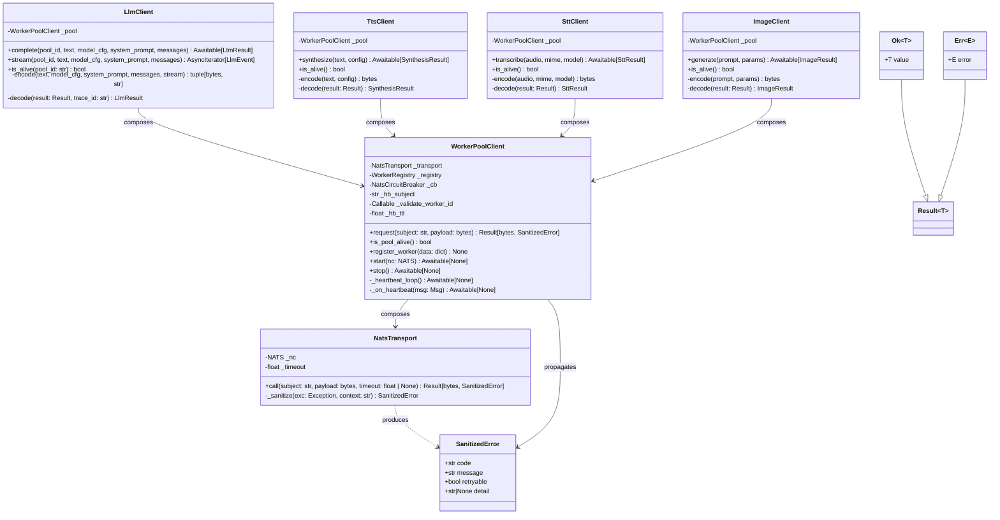
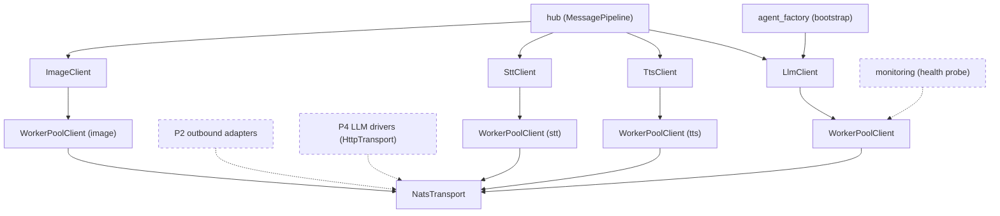

## Context

This is Phase 1 of the stage-axis refactor epic #1277. The frame and analyze stages were
skipped at this level because the epic-level SSoT
(`artifacts/analyses/1277-stage-axis-refactor-strategy.mdx`) covers the full analytical
context: root-cause (N×M duplication axis), 3-layer target architecture, U1-U5
architectural decisions, and the debt drain map. Readers should consult that document for
the "why"; this spec answers the "how, exactly" for the atomic PR.

The immediate antecedent is #1235, which extracted `NatsWorkerClientBase` from the 4
clients via inheritance. Phase 1 replays that work as composition, not inheritance, and
then deletes the base class.

## Goal

Replace the 4-client inheritance chain (`Nats{Llm,Tts,Stt,Image}Client →
NatsWorkerClientBase → NatsDriverBase`) with a 3-layer composition (`domain client →
WorkerPoolClient → NatsTransport`) so that NATS transport bugs require changes in exactly
one file and domain clients carry only codec + business logic.

## Users

Internal consumers only — no external user-facing surface changes:

| Consumer | Role |
|---|---|
| `bootstrap/factory/llm_overlay.py` | constructs and starts the LLM client |
| `bootstrap/factory/voice_overlay.py` | constructs and starts TTS + STT clients |
| `bootstrap/factory/hub_builder.py` | wires LLM client into hub |
| `bootstrap/factory/wiring_helpers.py` | injects LLM client into agent factory |
| `tests/llm/test_nats_llm_client_provider.py` | unit tests LlmClient (canonical pilot) |
| `tests/nats/test_nats_{tts,stt,image}_client.py` | unit tests TTS, STT, Image |
| `tests/nats/test_worker_client_base.py` | deleted in S6 |
| `tests/integration/test_worker_error_e2e.py` | smoke test retained |

## Expected Behavior

### Happy path — non-streaming LLM completion

1. Hub calls `LlmClient.complete(pool_id, text, model_cfg, system_prompt)`.
2. `LlmClient.encode(...)` builds a canonical `LlmRequest` bytes payload.
3. `LlmClient` calls `pool.request(payload)` where `pool: WorkerPoolClient`.
4. `WorkerPoolClient` checks circuit breaker (`cb.is_open()` → False).
5. `WorkerPoolClient` checks worker registry (`registry.any_alive()` → True).
6. `WorkerPoolClient` picks the best worker from `registry.ordered_by_score()`.
7. `WorkerPoolClient` delegates to `transport.call(subject, payload, timeout)`.
8. `NatsTransport` executes `nc.request(subject, payload, timeout=timeout)`.
9. `NatsTransport` returns `Ok(raw_bytes)` on success.
10. `WorkerPoolClient` forwards `Ok(raw_bytes)` to the domain client.
11. `LlmClient.decode(Ok(raw_bytes))` validates via `LlmResponse.model_validate_json`,
    records circuit breaker success, returns `LlmResult(result=text, ...)`.

### Error path — transport failure (never raises)

1. Step 8 raises `nats.errors.NoRespondersError`.
2. `NatsTransport.call` catches it, calls `_sanitize(exc)` → `"NoRespondersError"`.
3. Returns `Err(SanitizedError(code="transport.no_responders", message="...", retryable=True))`.
4. `WorkerPoolClient` records circuit breaker failure, marks worker stale.
5. `WorkerPoolClient` returns `Err(SanitizedError(...))` to domain client.
6. `LlmClient.decode(Err(...))` maps to `LlmResult(error=..., worker_error=...)`.
7. Hub receives `LlmResult` with populated `worker_error` field — no exception raised at
   any layer.

The same pattern applies to TTS (`SynthesisResult`), STT (`SttResult`), and Image
(`ImageResult`). The `SanitizedError.message` field contains only `type(exc).__name__`
(never `str(exc)`) — this is the single site enforcing the #1212 sanitization rule.

## Data Model & Consumers

### Class diagram



### Consumer flowchart



Solid edges = in-scope consumers for this PR. Dashed edges = downstream phases that will
also consume these layers but are not wired here.

### Consumer table

| Consumer | Fields / methods consumed | Status |
|---|---|---|
| `hub (MessagePipeline)` | `LlmClient.complete`, `LlmClient.stream`, `LlmClient.is_alive` | This issue |
| `hub (MessagePipeline)` | `TtsClient.synthesize`, `SttClient.transcribe`, `ImageClient.generate` | This issue |
| `bootstrap/factory/llm_overlay.py` | `LlmClient.__init__`, `LlmClient.start/stop` | This issue |
| `bootstrap/factory/voice_overlay.py` | `TtsClient.__init__`, `SttClient.__init__`, `start/stop` | This issue |
| `monitoring` | `WorkerPoolClient.is_pool_alive()` | Future phase |
| `P2 outbound adapters` | `NatsTransport.call` | Phase 2 |
| `P4 LLM drivers` | `NatsTransport` (HTTP variant) | Phase 4 |

## Breadboard

### Layer 1 — `src/lyra/transport/nats_request_response.py`

Pure wire transport. No domain knowledge. No circuit breaker. No heartbeat.

| Method | Signature | Returns | Raises | Notes |
|---|---|---|---|---|
| `__init__` | `(nc: NATS, *, default_timeout: float = 120.0)` | — | — | Stores nc ref; no subscription |
| `call` | `(subject: str, payload: bytes, *, timeout: float \| None = None) -> Awaitable[Result[bytes, SanitizedError]]` | `Ok(bytes)` or `Err(SanitizedError)` | never | Catches `TimeoutError`, `NoRespondersError`, `nats.errors.Error`; delegates to `_sanitize` |
| `_sanitize` | `(exc: Exception, *, context: str = "", payload_kb: float = 0.0) -> SanitizedError` | `SanitizedError` | never | Single site of `type(exc).__name__` sanitization (#1212 rule) |

`Result[T, E]` type definition lives in `src/lyra/transport/_result.py` (~25 lines):

```python
from dataclasses import dataclass
from typing import Generic, TypeVar, Union

T = TypeVar("T"); E = TypeVar("E")

@dataclass(frozen=True)
class Ok(Generic[T]):  value: T

@dataclass(frozen=True)
class Err(Generic[E]): error: E

Result = Union[Ok[T], Err[E]]
```

`SanitizedError` lives in `src/lyra/transport/_result.py` alongside `Result`:

```python
@dataclass(frozen=True)
class SanitizedError:
    code: str        # e.g. "transport.no_responders", "transport.timeout"
    message: str     # sanitized: type(exc).__name__ only, no str(exc)
    retryable: bool
    detail: str | None = None
```

Error codes emitted by `NatsTransport`:
- `transport.no_responders` — `NoRespondersError`
- `transport.timeout` — `TimeoutError`
- `transport.payload_too_large` — `nats.errors.Error` with "max_payload"
- `transport.error` — other `nats.errors.Error`

Target: ~150 lines. Under 300-line cap.

### Layer 2 — `src/lyra/transport/worker_pool_client.py`

Generic worker-pool semantics. Domain-agnostic (no `LlmRequest`, no `TtsRequest`).

| Method | Signature | Returns | Raises | Notes |
|---|---|---|---|---|
| `__init__` | `(transport: NatsTransport, *, hb_subject: str, validate_worker_id: Callable[[str], None], hb_ttl: float = 15.0, cb_failure_threshold: int = 3, cb_recovery_timeout: float = 60.0)` | — | — | All class-attrs from `NatsWorkerClientBase` become constructor args |
| `start` | `(nc: NATS) -> Awaitable[None]` | — | — | Subscribes to `hb_subject`, starts `_heartbeat_loop` task |
| `stop` | `() -> Awaitable[None]` | — | — | Cancels heartbeat task, unsubscribes |
| `request` | `(subject: str, payload: bytes, *, timeout: float \| None = None) -> Awaitable[Result[bytes, SanitizedError]]` | `Result[bytes, SanitizedError]` | never | CB check → registry check → transport.call → CB record |
| `is_pool_alive` | `() -> bool` | `bool` | — | `nc.is_connected and registry.any_alive()` |
| `_on_heartbeat` | `(msg: Msg) -> Awaitable[None]` | — | — | Parse JSON, validate worker_id, feed `WorkerRegistry`; logic from `NatsWorkerClientBase._on_heartbeat` |
| `_heartbeat_loop` | `() -> Awaitable[None]` | — | — | Inner async task; cancellation-safe |

CB and registry are composed internally — not exposed as public attributes:
- `NatsCircuitBreaker` imported from `roxabi_nats.circuit_breaker`
- `WorkerRegistry` imported from `lyra.nats.worker_registry` (unchanged)

Heartbeat subscription lifecycle (was inherited from `NatsDriverBase`):
- `start(nc)` calls `nc.subscribe(hb_subject, cb=self._on_heartbeat)` and spawns the
  `asyncio.Task(_heartbeat_loop())`.
- `stop()` cancels the task and calls `sub.unsubscribe()`.

Target: ~200 lines. Under 300-line cap.

### Layer 3 — Domain clients (4 files)

Each domain client is ~80 lines. Thin wrappers: encode → request → decode.

**`src/lyra/llm/llm_client.py`** (replaces `src/lyra/nats/nats_llm_client.py`):

| Method | Signature | Calls | Notes |
|---|---|---|---|
| `__init__` | `(pool: WorkerPoolClient, *, timeout: float \| None = None)` | — | No `nc` arg; pool is pre-constructed |
| `complete` | `(pool_id, text, model_cfg, system_prompt, *, messages) -> Awaitable[LlmResult]` | `pool.request(SUBJECTS.generate_request, payload)` | CB check delegated to pool |
| `stream` | `(pool_id, text, model_cfg, system_prompt, *, messages) -> AsyncIterator[LlmEvent]` | `pool.request` (streaming variant) [chi:1] | See note below |
| `is_alive` | `(pool_id: str) -> bool` | `pool.is_pool_alive()` | |
| `encode` | `(text, model_cfg, system_prompt, messages, stream) -> tuple[bytes, str]` | — | Builds `LlmRequest`; `_parse_llm_timeout` inlined |
| `decode` | `(result: Result[bytes, str], trace_id: str) -> LlmResult` | — | Validates `LlmResponse`; maps `Err` to `LlmResult(worker_error=...)` |

[chi:1] Stream path: `NatsTransport.call` is request-reply; streaming requires an
ephemeral inbox (`nc.new_inbox()` + `nc.subscribe(inbox)` + `nc.publish`). Two options:
(a) add `NatsTransport.stream(subject, payload, inbox_timeout)` returning
`AsyncIterator[Result[bytes, SanitizedError]]`; (b) keep streaming logic in `WorkerPoolClient`
as a separate `stream_request` method. This is the one `[NEEDS CLARIFICATION]` item
for the streaming path. The non-streaming path is fully specified above.

**`src/lyra/nats/nats_tts_client.py`** (renamed/thinned in place):

| Method | Calls | Notes |
|---|---|---|
| `synthesize(text, config)` | `pool.request(per_worker_tts(worker_id), payload)` | Score-routed (TTS uses per-worker subjects, unlike LLM) |
| `encode(text, config)` | — | Builds `TtsRequest` bytes |
| `decode(result)` | — | Maps to `SynthesisResult` via `_tts_result_from_wire` |

[chi:2] TTS uses per-worker subjects (`lyra.voice.tts.request.{worker_id}`) vs. LLM's
queue-group subject. The spec assumes `WorkerPoolClient.request` accepts the subject as an
argument (the domain client picks the subject, pool picks the worker to route to). The
TTS client iterates over `pool._registry.ordered_by_score()` to pick the worker and
constructs the per-worker subject itself. This is consistent with the current
`NatsTtsClient` approach — verify this doesn't break pool encapsulation or expose
`_registry` as a public attribute. [NEEDS CLARIFICATION]

**`src/lyra/nats/nats_stt_client.py`** (thinned in place):
Same pattern as TTS. `decode` uses `_stt_result_from_wire`.

**`src/lyra/nats/nats_image_client.py`** (thinned in place):
Same pattern. `encode` builds `ImageRequest`, `decode` maps `ImageResponse`.

### Construction wiring — bootstrap layer

Bootstrap files touched minimally. The DI composition happens in:

- `bootstrap/factory/llm_overlay.py`:
  ```python
  transport = NatsTransport(nc, default_timeout=timeout)
  pool = WorkerPoolClient(transport, hb_subject=SUBJECTS.heartbeat,
                          validate_worker_id=validate_worker_id)
  await pool.start(nc)
  return LlmClient(pool)
  ```

- `bootstrap/factory/voice_overlay.py`: same pattern for TTS/STT/Image pools.

- `bootstrap/factory/hub_builder.py` and `wiring_helpers.py`: type annotations updated
  from `NatsLlmClient | None` to `LlmClient | None`. No logic changes.

The 3-layer construction must happen in the overlay factories so teardown (`pool.stop()`)
is managed at the same lifecycle level as startup.

## Slices

The PR is atomic (merged as one). Slices are internal development steps with clear
demo points. A slice is "done" when its evidence criterion is met and all prior
slices' tests still pass.

| Slice | Scope | Demo | Acceptance evidence |
|---|---|---|---|
| S1 | Introduce `Result[T,E]`, `Ok`, `Err`, `SanitizedError` in `src/lyra/transport/_result.py` | `python -c "from lyra.transport._result import Ok, Err, SanitizedError; print(Ok(1))"` | File exists; pyright passes; 0 new deps |
| S2 | Build `NatsTransport` in `src/lyra/transport/nats_request_response.py`; write `tests/transport/test_nats_rr.py` | `uv run pytest tests/transport/test_nats_rr.py` | All transport error paths return `Result` (not raise); `_raise_nats_failure` not imported |
| S3 | Build `WorkerPoolClient` in `src/lyra/transport/worker_pool_client.py`; write `tests/transport/test_worker_pool_client.py` | `uv run pytest tests/transport/` | CB open → `Err` returned; heartbeat loop starts/stops cleanly; registry feeds correctly |
| S4 | Migrate `LlmClient` as canonical pilot; rewrite `tests/llm/test_nats_llm_client_provider.py` by layer | `uv run pytest tests/llm/` | `NatsWorkerClientBase` not imported in `llm_client.py`; all LLM provider tests pass with fake `WorkerPoolClient` |
| S5 | Migrate `NatsTtsClient`, `NatsSttClient`, `NatsImageClient`; rewrite their tests by layer | `uv run pytest tests/nats/test_nats_{tts,stt,image}_client.py` | `NatsWorkerClientBase` import removed from all 3; `_raise_nats_failure` gone from all 3; `_is_no_responders` gone |
| S6 | Delete `src/lyra/nats/_worker_client_base.py`; delete `tests/nats/test_worker_client_base.py`; update bootstrap factories; final sweep | `uv run pytest` (full suite) | File not found for `_worker_client_base`; 0 grep hits for `NatsWorkerClientBase`; smoke test passes |

## Success Criteria

### Transport boundary

- [ ] `grep -rn "_raise_nats_failure" src/lyra/nats/` → 0 occurrences (was 5: tts×2, stt×2, image×1)
- [ ] `grep -rn "_is_no_responders" src/lyra/nats/` → 0 occurrences (was 2: tts×1, stt×1)
- [ ] `grep -rn "NatsWorkerClientBase" src/lyra/` → 0 occurrences (was 7 across 5 files)
- [ ] `src/lyra/nats/_worker_client_base.py` does not exist

### Sanitization

- [ ] `grep -rn "str(exc)" src/lyra/transport/nats_request_response.py` → 0 occurrences
- [ ] `grep -rn 'f".*{exc}' src/lyra/llm/llm_client.py src/lyra/nats/nats_tts_client.py src/lyra/nats/nats_stt_client.py src/lyra/nats/nats_image_client.py` → 0 occurrences
- [ ] `grep -rn "_sanitize\|SanitizedError" src/lyra/transport/nats_request_response.py` → ≥1 (the single sanitization site)

### Architecture

- [ ] `grep -rn "from lyra.nats._worker_client_base" src/lyra/` → 0 occurrences
- [ ] `grep -rn "NatsDriverBase" src/lyra/nats/` → 0 occurrences (was in base class; removed with it)
- [ ] `src/lyra/transport/nats_request_response.py` exists and is ≤150 lines
- [ ] `src/lyra/transport/worker_pool_client.py` exists and is ≤200 lines
- [ ] Each domain client (`llm_client.py`, `nats_tts_client.py`, `nats_stt_client.py`, `nats_image_client.py`) is ≤100 lines

### Tests

- [ ] `uv run pytest tests/transport/` → all pass (new transport + pool tests)
- [ ] `uv run pytest tests/llm/` → all pass (restructured by layer)
- [ ] `uv run pytest tests/nats/test_nats_tts_client.py tests/nats/test_nats_stt_client.py tests/nats/test_nats_image_client.py` → all pass
- [ ] `uv run pytest tests/integration/test_worker_error_e2e.py` → all pass (smoke test)
- [ ] `uv run pytest` (full suite) → all pass or delta is new xfail with comment

### LOC and debt

- [ ] LOC delta: net negative across the 4 client files + 1 base file; target ~−1500 across `src/lyra/nats/nats_*_client.py` + `_worker_client_base.py`
- [ ] `uv run ruff check .` → 0 new errors
- [ ] `uv run pyright` → 0 new type errors

### Sub-issues and A/B

- [ ] No A/B path: `grep -rn "NatsWorkerClientBase\|NatsLlmClient\|NatsTtsClient\|NatsSttClient\|NatsImageClient" src/lyra/bootstrap/` → 0 occurrences for the old names (new names: `LlmClient`, etc.)
- [ ] Sub-issue #840 closed as absorbed by this PR
- [ ] Sub-issue #1067 closed as absorbed by this PR

### Falsifiable failure condition

If a NATS transport bug is filed after merge and the fix touches more than 1 file in
`src/lyra/transport/`, Phase 1 has failed its architectural goal.

## Open items

| # | Item | Where to resolve |
|---|---|---|
| [chi:1] | Streaming path: `NatsTransport.stream` vs `WorkerPoolClient.stream_request` — which layer owns the ephemeral inbox subscription lifecycle | Implementer decides in S4; document in CLAUDE.md |
| [chi:2] | TTS per-worker subject routing: does domain client expose `_registry` or does `WorkerPoolClient` expose a `scored_workers()` iterator for callers that need per-worker subjects | Resolve in S5 design; update this spec before merge |
