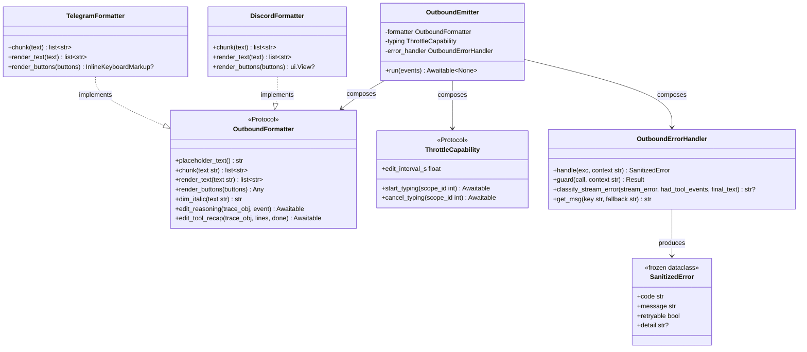
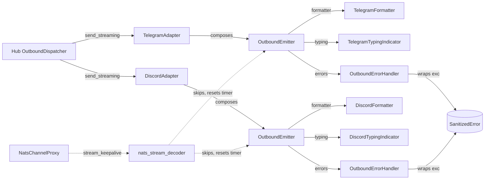

## Context

Promoted from `artifacts/frames/1279-outbound-stage-extraction-frame.mdx`. Parent epic #1277 — stage-axis decomposition (`artifacts/analyses/1277-stage-axis-refactor-strategy.mdx`). Phase 1 (#1278, closed 2026-05-20) shipped `Result[T, E]` / `SanitizedError` / `NatsTransport` / `WorkerPoolClient` in `src/lyra/transport/`. This phase pivots the outbound adapter layer from a per-target axis (telegram_outbound + discord_outbound + _shared_streaming_emitter) to a stage-axis composition (formatter / throttle / error_handler / emitter).

Today's outbound surface measured: 369 + 361 + 462 = 1192 LOC across the 3 files; 29 `str(exc)`-family call sites + 15 broad-catch `except Exception/BaseException` sites concentrated there — the empirical signature of the cascade producer (#1212→#1256). `boundary-broad-catch` outbound subset target: 15 → ≤5; `defensive-narrow-payloads` outbound subset target: partial drain.

The shared `StreamingSession` orchestrator in `src/lyra/adapters/shared/_shared_streaming_emitter.py` is already a partial stage extraction — it owns the platform-agnostic placeholder → debounced edits → final delivery algorithm via a `PlatformCallbacks` dataclass. Phase 2 promotes that latent stage into an explicit `OutboundEmitter` in `src/lyra/outbound/`, splits the callback bundle into typed capabilities (Formatter, Throttle, ErrorHandler), and rewires Telegram + Discord to compose them.

## Goal

Replace per-target outbound files with a stage-based composition: a generic `OutboundEmitter` consumes platform-specific `OutboundFormatter` + `ThrottleCapability` + `OutboundErrorHandler`, so per-platform code shrinks to thin formatter implementations and bus-bound error paths flow exclusively through `SanitizedError`.

## Users

- **Primary:** `TelegramAdapter` and `DiscordAdapter` (`src/lyra/adapters/{telegram,discord}/`) — their outbound paths are rewired. Hub `OutboundDispatcher` consumes the same `ChannelAdapter.send()` / `send_streaming()` Protocol; no upstream changes.
- **Secondary:**
  - Engineers maintaining outbound bug-classes (`boundary-broad-catch`, `defensive-narrow-payloads`, bus-bound `str(exc)` leak) — single-point fix instead of N-site cascade.
  - Phase 6 (#1283 bootstrap/DI) — outbound stages become injectable in the wiring layer.
  - Future outbound platforms (Slack, Matrix) — composition cost from ~500 LOC → <100 LOC (epic SSoT §10).

## Expected Behavior

For an inbound user message that triggers a streaming LLM turn on Telegram:

1. Hub renders → `RenderEvent` stream → `TelegramAdapter.send_streaming(original_msg, events)`.
2. `TelegramAdapter` constructs an `OutboundEmitter(formatter=TelegramFormatter(...), typing=TelegramTypingIndicator(...), error_handler=OutboundErrorHandler(...))`.
3. `OutboundEmitter.run(events)` — identical observable behavior to today's `StreamingSession.run(events)`:
   - peek first event; empty stream → fallback path
   - send placeholder via `formatter.placeholder_text()` + platform send
   - drive debounced edits via `formatter.chunk()` + bot API
   - finalize via edit-in-place or overflow `send_message`
4. Any exception inside an edit/send call is wrapped by `OutboundErrorHandler.handle(exc, context=...)` → `SanitizedError(code, message=type(exc).__name__, retryable, detail=None)` → logged with `type(exc).__name__` only (no `str(exc)`). No exception escapes the emitter except `StreamChunkTimeout` (re-raised, terminal — preserved from today).
5. Bus-side keepalive (#687): while `NatsChannelProxy.send_streaming()` is waiting on an idle producer, it publishes `stream_keepalive` chunks every 30s on `lyra.outbound.<platform>.<bot_id>` (subject naming per ADR-035); `nats_stream_decoder` treats them as no-op that resets the per-chunk timer (codec sentinel parallel to existing `stream_error` per ADR-036; chunk envelope unversioned per `src/lyra/nats/CLAUDE.md`, so additive sentinel does not require schema bump).

Behavior identical to today for: typing indicator lifecycle (start at message receipt, cancel at first chunk for streaming / start of send for non-streaming), reasoning trace rendering (Slice 4 / #1101 gate upstream), tool recap card (debounced + final), error-turn `❌` prefix, MarkdownV2 escaping on Telegram, Discord chunk-and-reply mechanics, circuit-breaker (lives in `OutboundDispatcher` — not duplicated in emitter, preserved end-to-end).

## Data Model & Consumers

### Consumer summary

| Consumer | Fields/Methods Consumed | When | Status |
|---|---|---|---|
| `OutboundEmitter` | `OutboundFormatter.chunk` / `render_text` / `placeholder_text` / `dim_italic` | every streaming turn | this issue |
| `OutboundEmitter` | `ThrottleCapability.start_typing` / `cancel_typing` / `edit_interval_s` | turn start, turn end, debounce loop | this issue |
| `OutboundEmitter` | `OutboundErrorHandler.handle` | every bus-bound boundary call | this issue |
| `OutboundEmitter` | `OutboundErrorHandler.classify_stream_error` | terminal delivery branch | this issue |
| `TelegramAdapter` | `OutboundEmitter(formatter, typing, error_handler)` | constructed once per turn | this issue |
| `DiscordAdapter` | `OutboundEmitter(formatter, typing, error_handler)` | constructed once per turn | this issue |
| `nats_stream_decoder` | `event_type == "stream_keepalive"` sentinel | per chunk, transport layer | this issue (#687) |
| Phase 6 (#1283) DI wiring | Constructor signatures of `OutboundEmitter` + stages | bootstrap composition | future, fields must be public/keyword-only |
| Phase 3 (#1280) inbound | None (orthogonal — independent stages) | — | out of scope |

## Breadboard

### Affordances

| ID | Element | Type | Handler | Data in / out |
|---|---|---|---|---|
| N1 | `OutboundFormatter` Protocol (incl. `edit_reasoning` + `edit_tool_recap` with no-op defaults) | module API | `src/lyra/outbound/formatter.py` | text str → list[str] chunks; buttons → platform widget; trace_obj+event → rendered trace |
| N2 | `ThrottleCapability` Protocol + `STREAMING_EDIT_INTERVAL` | module API | `src/lyra/outbound/throttle.py` | scope_id → async start/cancel; constant float |
| N3 | `OutboundErrorHandler` (carries `get_msg` i18n lookup; `guard(call, context) → Result`) | class | `src/lyra/outbound/error_handler.py` | exc + context → SanitizedError; classify_stream_error; i18n lookup |
| N4 | `OutboundEmitter` (composes N1+N2+N3; constructor signature `(formatter, typing, error_handler)` — keyword-only, public, Phase-6 DI-friendly) | class | `src/lyra/outbound/emitter.py` | events AsyncIterator → orchestrated platform calls |
| N5 | `TelegramFormatter` | class | `src/lyra/adapters/telegram/telegram_formatter.py` | impl of N1 for Telegram (MarkdownV2 escape, 4096 chunk); `edit_reasoning` renders dim italic via `bot.edit_message_text`; `edit_tool_recap` edits text |
| N6 | `DiscordFormatter` | class | `src/lyra/adapters/discord/discord_formatter.py` | impl of N1 for Discord (DISCORD_MAX_LENGTH chunk, ui.View buttons); `edit_reasoning` renders dim italic; `edit_tool_recap` builds + edits Embed |
| N7 | `TelegramTypingIndicator` | class | `src/lyra/adapters/telegram/telegram_outbound.py` (kept here, thin) | impl of N2 wrapping `_typing_worker` |
| N8 | `DiscordTypingIndicator` | class | `src/lyra/adapters/discord/discord_outbound.py` (kept here, thin) | impl of N2 wrapping `_discord_typing_worker` |
| S1 | `NatsChannelProxy.send_streaming` keepalive task (per ADR-035 subject naming) | code path | `src/lyra/nats/nats_channel_proxy.py` | publishes `stream_keepalive` chunks every 30s while idle |
| S2 | `NatsRenderEventCodec.decode` sentinel (per ADR-036 chunk protocol; parallel to existing `stream_error`) | code path | `src/lyra/nats/render_event_codec.py` | recognizes `stream_keepalive` as non-terminal sentinel |
| S3 | `decode_stream_events` skip | code path | `src/lyra/adapters/nats/nats_stream_decoder.py` | resets per-chunk timer, doesn't yield to caller |

### Wiring (current → target)

| Current (per-target axis) | Target (stage-axis) |
|---|---|
| `telegram_outbound.build_streaming_callbacks` (212 LOC closure factory) | `TelegramAdapter._make_emitter()` → constructs `OutboundEmitter(TelegramFormatter(...), TelegramTypingIndicator(...), OutboundErrorHandler(...))` |
| `discord_outbound.build_streaming_callbacks` (210 LOC closure factory) | `DiscordAdapter._make_emitter()` → same pattern with Discord stages |
| `_shared_streaming_emitter.StreamingSession.run` | `OutboundEmitter.run` (rename + relocate; same algorithm) |
| `_shared_streaming_emitter.py.PlatformCallbacks` (12-field dataclass) | Split into `OutboundFormatter` (7 methods, incl. `edit_reasoning` + `edit_tool_recap` with no-op defaults) + `ThrottleCapability` (2 methods + 1 constant) + `OutboundErrorHandler` (4 methods incl. `get_msg` i18n lookup + `guard`). Send-mechanics callbacks (`send_placeholder`, `edit_placeholder_text`, `send_trace_placeholder`, `send_message`, `send_fallback`) become emitter-internal helpers parameterized by `formatter` |
| `_shared_streaming_state.STREAMING_EDIT_INTERVAL` constant | move to `outbound/throttle.py` (re-exported from old path for one cycle; transitional shim deleted in same PR at S7) |
| `_shared_streaming_state.classify_stream_error` | move to `outbound/error_handler.py` as a method on `OutboundErrorHandler` (signature loses `msg_fn` arg — now uses `self.get_msg`) |
| `_shared_streaming_state.IntermediateTextState` + `StreamState` | stay in `adapters/shared/_shared_streaming_state.py` (pure state machines, no platform knowledge). NOT moved into `outbound/` to avoid circular import with `OutboundErrorHandler` (StreamState.build_display_text calls classify_stream_error). Imported by `OutboundEmitter` via stable path |
| `OutboundAdapterBase.send_streaming` (concrete, builds StreamingSession) | unchanged surface; now builds `OutboundEmitter`. Base remains `__init__`-less (Discord MRO invariant) |
| Existing `except Exception:  # noqa: BLE001 — DEBT:boundary-broad-catch` (13 sites in StreamingSession + per-platform closures) | replaced by `await self._handler.guard(call, context="...")` where `call` is a 0-arg callable returning a coroutine; `OutboundErrorHandler.guard` is the single catch site; returns `Result[T, SanitizedError]` |
| `StreamingSession.run` re-raises `stream_error` (line 462 today) | `OutboundEmitter.run` preserves the same re-raise semantics for `StreamChunkTimeout` AND captured `stream_error`. The `Result` type is used internally at the guard boundary; the public `run()` signature returns `None` and re-raises terminal errors. The `Result` boundary is observable inside the emitter (handler.guard returns Result), not at the adapter API |

## Slices

| # | Slice | Files touched | Demo-able evidence |
|---|---|---|---|
| 1 | Scaffold `src/lyra/outbound/` package; relocate `StreamingSession` → `OutboundEmitter` (rename only, behavior identical); keep `_shared_streaming_emitter.py` as transient re-export shim. Insert `lyra.outbound` into `.importlinter` `layers` between `lyra.infrastructure` and `lyra.adapters` so layering is structural from day 1. | `src/lyra/outbound/{__init__,emitter}.py` (new), `src/lyra/adapters/shared/_shared_streaming_emitter.py` (shim), `.importlinter` | existing test suite green; `from lyra.outbound import OutboundEmitter` imports; `lint-imports` green |
| 2 | Add `OutboundErrorHandler` + `SanitizedError`-routed `guard(call, context) → Result`. Migrate 13 broad-catch sites in `OutboundEmitter` to `await handler.guard(...)`. Move `classify_stream_error` + `get_msg` lookup onto handler. | `src/lyra/outbound/error_handler.py` (new), `src/lyra/outbound/emitter.py`, `src/lyra/adapters/shared/_shared_streaming_state.py` (re-export shim) | `grep -nE 'except Exception' src/lyra/outbound/emitter.py` → 1 site (handler-local); rest delegated |
| 3 | Define `ThrottleCapability` Protocol. Move `STREAMING_EDIT_INTERVAL` into `outbound/throttle.py`. `OutboundEmitter` constructor accepts `typing: ThrottleCapability`. Per-platform `TelegramTypingIndicator` + `DiscordTypingIndicator` wrap existing typing workers (kept in `*_outbound.py` for thinness). | `src/lyra/outbound/throttle.py` (new), `src/lyra/outbound/emitter.py`, per-platform `*_outbound.py` | `OutboundEmitter.__init__` accepts ThrottleCapability; typing-tail unit tests pass; edit-interval debounce unchanged. Slice ordered BEFORE per-platform formatter slices so emitter signature is stable when adapters wire it (architect review). |
| 4 | Define `OutboundFormatter` Protocol (incl. `edit_reasoning` + `edit_tool_recap` with no-op defaults) + `TelegramFormatter` impl (≤200 LOC). Rewire `TelegramAdapter._make_emitter()`. Delete `telegram_outbound.build_streaming_callbacks`. | `src/lyra/outbound/formatter.py` (new), `src/lyra/adapters/telegram/telegram_formatter.py` (new), `src/lyra/adapters/telegram/telegram_outbound.py` (shrunk) | `wc -l telegram_formatter.py` ≤200; Telegram smoke test (mock bot) green |
| 5 | `DiscordFormatter` impl (≤200 LOC). Rewire `DiscordAdapter` similarly. Delete `discord_outbound.build_streaming_callbacks`. | `src/lyra/adapters/discord/discord_formatter.py` (new), `src/lyra/adapters/discord/discord_outbound.py` (shrunk) | `wc -l discord_formatter.py` ≤200; Discord smoke test green |
| 6 | #687 keepalive: `NatsChannelProxy.send_streaming` keepalive task (30s interval) per ADR-035; codec sentinel parallel to `stream_error` per ADR-036; consumer skip in decoder. Add old-adapter compatibility test: an adapter that does not recognize `stream_keepalive` falls through to the existing "unknown event_type" warning path without crashing (verified per `nats/CLAUDE.md` schema_version exemption for envelope). | `src/lyra/nats/nats_channel_proxy.py`, `src/lyra/nats/render_event_codec.py`, `src/lyra/adapters/nats/nats_stream_decoder.py` | unit test: 300s synthetic delay → adapter receives full response, no decoder timeout; old-adapter compat test green |
| 7 | Cleanup: delete `_shared_streaming_emitter.py` shim + `_shared_streaming_state.py` re-exports added in S2. Update `OutboundAdapterBase` + `src/lyra/adapters/CLAUDE.md` references. Commit `tools/snapshots/outbound-broad-catch-baseline.txt` (6m comparison snapshot). | Removals + `src/lyra/adapters/CLAUDE.md` + `tools/snapshots/` | grep proofs in acceptance criteria; baseline file present |

**Smart-splitting evaluated:** 7 slices, ~22 binary ACs → trigger fires. Splitting rejected — slices are sequentially dependent (S2 needs S1's emitter; S3 needs S1's emitter to accept ThrottleCapability; S4/S5 need S3's throttle Protocol + S2's handler; S6 is NATS-layer companion absorbed per epic body; S7 is cleanup). Splitting into multiple PRs would require throw-away shims at each boundary and would NOT meet the "1 PR" target in the epic body. Document choice; proceed as one PR with slice-aligned commits for reviewer-readability.

## Success Criteria

- [ ] `src/lyra/outbound/` exists with `__init__.py`, `formatter.py`, `throttle.py`, `error_handler.py`, `emitter.py`
- [ ] `src/lyra/adapters/telegram/telegram_formatter.py` exists ∧ `wc -l` ≤200
- [ ] `src/lyra/adapters/discord/discord_formatter.py` exists ∧ `wc -l` ≤200
- [ ] `src/lyra/adapters/shared/_shared_streaming_emitter.py` deleted by end of PR (no transitional shim remains in merged code)
- [ ] `grep -rnE 'str\(exc\)|str\(e\)|str\(err\)|f"[^"]*\{exc[^}]*\}|f"[^"]*\{e[^a-z_][^}]*\}' src/lyra/outbound src/lyra/adapters/telegram/telegram_outbound.py src/lyra/adapters/discord/discord_outbound.py src/lyra/adapters/telegram/telegram_formatter.py src/lyra/adapters/discord/discord_formatter.py | grep -v '^[^:]*:[0-9]*: *#'` → 0 matches (excludes commented-out lines; covers both `str(exc)`-family and f-string formatting of exception vars)
- [ ] `log.exception` / `log.debug("...: %s", exc)` style remains allowed (those go to stdout, not the NATS bus) — verified by a positive control test that the grep above does NOT match `log.debug("Failed: %s", exc)`
- [ ] `grep -cE 'except (Exception|BaseException)' src/lyra/outbound/*.py src/lyra/adapters/telegram/telegram_outbound.py src/lyra/adapters/discord/discord_outbound.py` ≤5 total (down from 15); each remaining annotated with `# noqa: BLE001 — <justification>`
- [ ] `OutboundErrorHandler.guard()` is the single broad-catch site in `src/lyra/outbound/emitter.py`; all other except-clauses inside `outbound/` use typed exceptions or no exceptions
- [ ] `OutboundErrorHandler.handle(exc, context)` returns a frozen `SanitizedError` with `message == type(exc).__name__` (verified by unit test asserting no `str(exc)` leakage on `httpx.ConnectError("server=10.0.0.5:4222 token=ABC")`)
- [ ] Existing tests pass: `tests/adapters/test_streaming_emitter_toolcall_v2.py` and any other test under `tests/adapters/` that imports `_shared_streaming_emitter` — either pass unchanged via shim during transition OR are rewritten to import from `lyra.outbound`
- [ ] Smoke test (new, in `tests/outbound/`): mock `TelegramAdapter` sends a 3-chunk text reply through `OutboundEmitter`; assert `bot.send_message` called with platform-correct kwargs (parse_mode=MarkdownV2, reply_to_message_id on first chunk, reply_markup on last)
- [ ] Smoke test (new, in `tests/outbound/`): mock `DiscordAdapter` sends a 3-chunk text reply through `OutboundEmitter`; assert `messageable.send` called with View on last chunk, `.reply()` on first if reply scope
- [ ] Unit test (new, in `tests/nats/`): `NatsChannelProxy.send_streaming()` publishes ≥3 `stream_keepalive` envelopes during a 90-second idle producer (interval=30s); seq numbers monotonic
- [ ] Unit test (new, in `tests/nats/`): `decode_stream_events` consuming `event_type=stream_keepalive` does NOT yield to caller and DOES reset the per-chunk timer (verified by interleaving keepalive + real chunk and asserting no `StreamChunkTimeout` raised)
- [ ] Integration: a 5-second `_CHUNK_TIMEOUT_SECONDS` override + no keepalives + no chunks still raises `StreamChunkTimeout` (no-keepalive dead-stream detection preserved)
- [ ] `.importlinter` updated (Slice 1, structural): `lyra.outbound` inserted into the `clean-architecture-layers` `layers` stanza between `lyra.infrastructure` and `lyra.adapters`. Verified by `uv run lint-imports` passing AND a negative-control commit that imports `lyra.adapters.discord` from `lyra.outbound` fails the linter.
- [ ] `.importlinter` `forbidden` contract added (Slice 7, transitional): `lyra.adapters` MUST NOT import from `lyra.adapters.shared._shared_streaming_emitter` (guards against re-introducing the shim).
- [ ] Pre-commit grep for bus-bound `str(exc)` on outbound layer NOT added in this PR — accepted as deferred (DEBT note in `tools/check_outbound_str_exc.sh` placeholder or `DEBT:enforcement-deferred` annotation in `src/lyra/outbound/CLAUDE.md`); the merge-time AC grep above is the gate for THIS PR
- [ ] `src/lyra/outbound/CLAUDE.md` added with: stage roster, composition contract, "no second CB layer here" invariant (per `src/lyra/transport/CLAUDE.md`), "no `__init__` on OutboundAdapterBase — Discord MRO" reminder. NO new ADR introduced (ADR work owned by Phase 7 #1284 per epic body); CLAUDE.md links forward to "ADR pending — Phase 7" without coupling.
- [ ] All file-length quality gates pass for new files (≤300 line default, exemptions only if justified and added to `tools/file_exemptions.txt` with reason). `_shared_streaming_emitter.py`, `telegram_outbound.py`, `discord_outbound.py` removed from `tools/file_exemptions.txt` after the PR shrinks them below the gate.
- [ ] Folder-size gate: `ls src/lyra/adapters/discord/*.py | wc -l` ≤ 12 (currently 10; adding `discord_formatter.py` = 11). `ls src/lyra/adapters/telegram/*.py | wc -l` ≤ 12 (currently 6; adding `telegram_formatter.py` = 7).
- [ ] `src/lyra/outbound/` folder-size: ≤ 12 files (target = 5: `__init__.py`, `formatter.py`, `throttle.py`, `error_handler.py`, `emitter.py`, `CLAUDE.md`).
- [ ] MRO constraint preserved on Discord: `OutboundAdapterBase` keeps NO `__init__`; `DiscordAdapter.__init__` still flows to `discord.Client` first (verified by smoke test instantiating `DiscordAdapter`)
- [ ] `StreamChunkTimeout` re-raise semantics preserved: dead-stream + no keepalives → `OutboundEmitter.run()` raises `StreamChunkTimeout` (test asserts). Note: this is the only exception that escapes the emitter; all others are converted to `SanitizedError` via guard and either re-raised as the captured `stream_error` at run() end (same as today) or logged + swallowed for non-terminal edits.
- [ ] No second circuit-breaker layer introduced in `src/lyra/outbound/` (verified by inspection; documented in `src/lyra/outbound/CLAUDE.md` per `src/lyra/transport/CLAUDE.md` invariant)
- [ ] **6-month falsifiability baseline**: `tools/snapshots/1279-outbound-baseline.txt` committed at merge time containing: (a) `grep -rn 'except (Exception|BaseException)' src/lyra/outbound src/lyra/adapters/telegram/telegram_outbound.py src/lyra/adapters/discord/discord_outbound.py` (raw count), (b) `wc -l` for the 4 new outbound files + 2 per-platform formatter files, (c) sibling-fix PR list since 2026-05-19 for outbound bus-bound classes. Used as the 6m comparison baseline per frame `failure_in_6mo`. Per `[[lyra-stage-axis-refactor]]` memory, retain alongside epic strategy doc.

## Resolved Open Questions

The 3 questions from the initial spec draft are all resolved in the design above:

1. **`PlatformCallbacks` dataclass fate.** Resolved: transitional shim during S1→S5, deleted at S7 (same PR). Recorded in Slices S1 and S7 + Wiring table.
2. **`IntermediateTextState` + `StreamState` location.** Resolved: STAY in `src/lyra/adapters/shared/_shared_streaming_state.py`. Moving them into `outbound/state.py` would create a circular import (`StreamState.build_display_text` calls `classify_stream_error` which now lives on `OutboundErrorHandler` in `outbound/`). Recorded in Wiring table.
3. **`OutboundErrorHandler.guard()` API shape.** Resolved: callable form — `guard(call: Callable[[], Awaitable[T]], *, context: str) → Result[T, SanitizedError]`. Matches `send_with_retry(lambda: ..., label=...)` precedent in `_shared.py`. Recorded in Wiring table + classDiagram.

These are now `[IMPLEMENTATION DETAIL]`-level: precise method signatures finalized at `/plan` or `/implement` without re-gating the spec.

## Deployment Safety Note

Phase 2 changes both producer (`lyra-hub` Quadlet unit owns `NatsChannelProxy.send_streaming`) and consumer (`lyra-telegram` + `lyra-discord` Quadlet units own `nats_stream_decoder`) for the #687 keepalive. Per `src/lyra/nats/CLAUDE.md`: the outer `NatsChunkEnvelope` is intentionally unversioned. `stream_keepalive` is added as a new `event_type` parallel to the existing `stream_error` synthetic terminal. **Roll-forward safe**: a pre-PR adapter receiving a `stream_keepalive` chunk falls through to the codec's "unknown event_type" path (existing safe default — logs warning, no crash). **Roll-back safe**: a post-PR hub with no keepalive task running publishes no `stream_keepalive` envelopes; consumer's skip branch is dormant. No simultaneous deploy required. Recorded as AC under Slice 6 ("old-adapter compat test").
