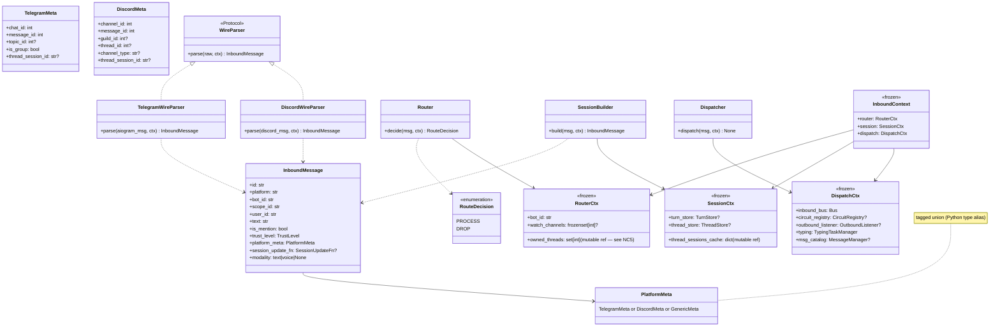
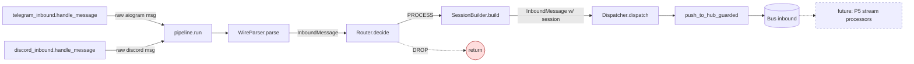
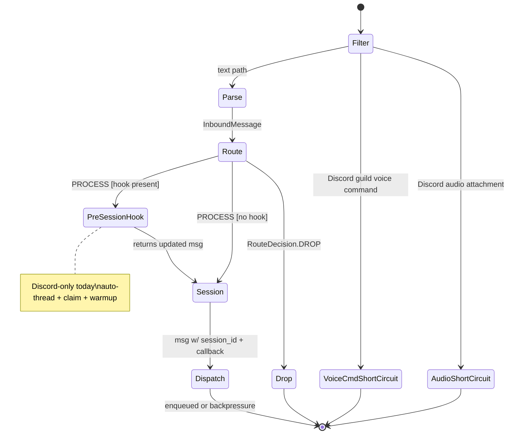

## Context

Promoted from [`artifacts/frames/1280-phase-3-inbound-stages-frame.mdx`](../frames/1280-phase-3-inbound-stages-frame.mdx). Phase 3 of Epic #1277 (stage-axis decomposition). SSoT: `artifacts/analyses/1277-stage-axis-refactor-strategy.mdx`.

Independent of P1 (#1278), P2 (#1279), P4 (#1281), P5 (#1282). Establishes the inbound stage layer that P5 stream processors (#1282) and P6 bootstrap DI (#1283) will compose against.

## Goal

Extract the inbound message pipeline (parse → session → route → dispatch) from per-platform adapter files into per-stage modules under `src/lyra/inbound/`, so the `handle_message` functions in `*_inbound.py` shrink to thin orchestrators and the duplicated routing/session logic between Telegram and Discord is unified at the stage layer.

## Users

- **Primary:** Lyra contributors modifying inbound behavior — today they must understand and keep two parallel implementations in lock-step; post-refactor they edit one stage module.
- **Primary:** ops/maintainers chasing inbound bugs — today a bug class implies a 2-file investigation per platform; post-refactor it's 1 module per stage.
- **Secondary:** Phase 5 (#1282) which will plug stream processors onto the inbound stages.
- **Secondary:** Phase 6 (#1283) which will flatten bootstrap wiring across all stages.
- **Secondary:** paused issues that benefit from the new structure (#475 channel rule engine, #1060 Discord watch_channels — both blocked-by #1284).

## Expected Behavior

### Today (per-platform axis)

```
Telegram aiogram event → telegram_inbound.handle_message (~70 LOC)
                          ├── bot filter
                          ├── adapter.normalize() → InboundMessage
                          ├── group + ¬mention → drop
                          ├── TurnStore.get_last_session → inject thread_session_id
                          ├── build _tg_session_update_fn closure
                          ├── start typing
                          └── push_to_hub_guarded

Discord Gateway event → discord_inbound.handle_message (230 LOC, # noqa C901 PLR0915)
                          ├── bot filter
                          ├── audio attachment detection → _handle_audio + return
                          ├── voice command dispatch (guild-only) → return on match
                          ├── pre-derive _is_mention, _is_dm, _is_thread, _in_owned_thread
                          ├── lazy ThreadStore.is_owned cold-path check
                          ├── compute _is_watch_channel
                          ├── _should_process = _is_dm | _is_mention | _in_owned_thread | _is_watch_channel → drop if false
                          ├── auto-thread creation (mention/watch + create_thread API)
                          ├── claim existing thread (mention in thread)
                          ├── ThreadStore.get_session for owned threads
                          ├── adapter.normalize() → InboundMessage
                          ├── DM session override (TurnStore.get_last_session priority)
                          ├── build _dm_session_update_fn or _dc_thread_session_update_fn closure
                          ├── start typing
                          └── push_to_hub_guarded
```

### After (stage axis)

```
Telegram aiogram event → telegram_inbound.handle_message (< 80 LOC)
                          ├── bot filter
                          └── pipeline.run(raw_event, ctx)

Discord Gateway event → discord_inbound.handle_message (< 80 LOC)
                          ├── bot filter
                          ├── audio attachment detection → delegate to discord_audio (unchanged)
                          ├── voice command dispatch (unchanged, guild-only short-circuit)
                          └── pipeline.run(raw_event, ctx)

src/lyra/inbound/pipeline.py: pipeline.run(raw, ctx)
       │
       ├── WireParser[Platform].parse(raw, ctx)        → InboundMessage
       │   (per-platform impl; uses existing *_normalize.py)
       │
       ├── Router.decide(msg, ctx)                     → RouteDecision (process | drop)
       │   (generic; reads PlatformMeta + ctx.owned_threads + ctx.watch_channels)
       │     - if RouteDecision.drop → return
       │
       ├── SessionBuilder.build(msg, ctx)              → InboundMessage (replaced w/ session_id + callback)
       │   (generic; injected with TurnStore + optional ThreadStore)
       │
       └── Dispatcher.dispatch(msg, ctx)               → None
           (generic; orchestrates typing + push_to_hub_guarded; on_drop cancels typing)
```

**Discord-only pre-pipeline steps** that stay in `discord_inbound.handle_message` (cannot be made generic without dragging Discord API surface into `src/lyra/inbound/`):

- Audio attachment delegation to `_handle_audio` — short-circuit, returns before pipeline
- Voice channel command dispatch — short-circuit, returns before pipeline

**Discord-only post-route side effects** (auto-thread creation, thread claim) move to a callback on `Router` or to a Discord-side helper invoked between `Router.decide` and `SessionBuilder.build`. See breadboard below.

**External contract preserved:** `InboundMessage` shape unchanged. `Bus[InboundMessage]` enqueue unchanged. `push_to_hub_guarded` signature unchanged. Hub-side consumers see no difference.

## Data Model & Consumers

### Data structure diagram



### Consumer map



### Consumer summary

| Consumer | Fields consumed | When | Status |
|---|---|---|---|
| Router | `InboundMessage.platform_meta`, `InboundMessage.is_mention`, `RouterCtx.owned_threads`, `RouterCtx.watch_channels` | after parse, before session | this issue |
| SessionBuilder | `InboundMessage.platform`, `InboundMessage.scope_id`, `InboundMessage.platform_meta`, `SessionCtx.turn_store`, `SessionCtx.thread_store`, `SessionCtx.thread_sessions_cache` | after route=PROCESS | this issue |
| Dispatcher | `InboundMessage` (final), `DispatchCtx.inbound_bus`, `DispatchCtx.circuit_registry`, `DispatchCtx.outbound_listener`, `DispatchCtx.msg_catalog`, `send_backpressure: Callable[[str], Awaitable[None]]` (call-site arg, ¬context) | tail of pipeline | this issue |
| `discord_threads.persist_thread_claim` | `InboundMessage.platform_meta` (DiscordMeta), `InboundContext.thread_store` | post-Router for Discord (callback) | this issue (callback, not moved) |
| P5 stream processors (future) | `InboundMessage` from Bus | downstream of Dispatcher | future (out of scope for P3) |
| `_handle_audio` (Discord) | raw Discord message | pre-pipeline short-circuit | unchanged |
| `handle_voice_message` (Telegram) | raw Telegram voice message | separate handler | unchanged |

## Breadboard

### Stage affordances (new — `src/lyra/inbound/`)

| ID | Affordance | Module | Handler signature | Reads | Writes |
|---|---|---|---|---|---|
| S1 | Define WireParser Protocol | `wire_parser.py` | `class WireParser(Protocol)` + `parse(raw, ctx) -> InboundMessage \| None` | — | — |
| S2 | Telegram wire parser impl | `wire_parser_telegram.py` | `class TelegramWireParser` calling existing `telegram_normalize` | aiogram msg | `InboundMessage` |
| S3 | Discord wire parser impl | `wire_parser_discord.py` | `class DiscordWireParser` calling existing `discord_normalize` | discord msg | `InboundMessage` |
| S4 | Router decision logic | `router.py` | `class Router` with `decide(msg, router_ctx) -> RouteDecision` (sync, pure) | `InboundMessage`, `RouterCtx` | — |
| S5 | SessionBuilder generic | `session_builder.py` | `class SessionBuilder` with `build(msg, session_ctx) -> InboundMessage` | TurnStore / ThreadStore / cache via `session_ctx` | builds session_update_fn closure + sets thread_session_id |
| S6 | Dispatcher generic | `dispatcher.py` | `class Dispatcher` with `dispatch(msg, dispatch_ctx, send_backpressure, on_drop) -> None` | `push_to_hub_guarded` | bus enqueue |
| S7 | Pipeline orchestrator | `pipeline.py` | `class InboundPipeline.run(raw, ctx, parser, *, pre_session_hook=None, send_backpressure, on_drop=None)` glues S1-S6 | all above | — |
| S8 | InboundContext + 3 sub-contexts | `context.py` | `@dataclass(frozen=True)` for `InboundContext`, `RouterCtx`, `SessionCtx`, `DispatchCtx`. Each stage receives only its sub-context. | — | — |
| S9 | CLAUDE.md for `src/lyra/inbound/` | `CLAUDE.md` | invariants doc | — | — |

### Wiring (consumers — `src/lyra/adapters/`)

| ID | Wiring | Module | Change |
|---|---|---|---|
| W1 | Telegram inbound handler | `telegram_inbound.py` | `handle_message` shrinks to: bot filter → build `_tg_backpressure` closure → `pipeline.run(msg, ctx, TelegramWireParser(), send_backpressure=_tg_backpressure, on_drop=_cancel_typing)` |
| W2 | Discord inbound handler | `discord_inbound.py` | `handle_message` shrinks to: bot filter → audio/voice short-circuits → build `_dc_backpressure` closure → `pipeline.run(msg, ctx, DiscordWireParser(), pre_session_hook=_discord_thread_hook, send_backpressure=_dc_backpressure, on_drop=_cancel_typing)` |
| W3 | Discord pre-session hook | `discord_inbound.py` (location TBD per NC1) | `_discord_thread_hook(msg, ctx) -> InboundMessage` — auto-thread create, claim, lazy `is_owned` warmup. Runs between Router=PROCESS and SessionBuilder. **Returns updated `InboundMessage`** so `DiscordMeta.thread_id` (set by auto-thread) propagates downstream. May also mutate `RouterCtx.owned_threads` (see NC5). |
| W4 | InboundContext construction | `telegram.py` / `adapter.py` (Discord) | Each adapter builds an `InboundContext(router=..., session=..., dispatch=...)` from its existing state, once per message. Mutable refs (`owned_threads`, `thread_sessions_cache`) are shared by reference so warm-up persists across messages. |

### Inbound message flow (state diagram)



## Slices

| # | Slice | Files touched | Demoable evidence |
|---|---|---|---|
| 1 | **Skeleton** — create `src/lyra/inbound/{__init__.py, context.py, wire_parser.py, router.py, session_builder.py, dispatcher.py, pipeline.py, CLAUDE.md}` with `Protocol`, `RouteDecision` enum, sub-context dataclasses, stubs only. Register `src/lyra/inbound/CLAUDE.md` in root `CLAUDE.md`. | new dir + root CLAUDE.md | imports compile; full test suite green; no behavior change |
| 2 | **Dispatcher** — move dispatch orchestration (typing + push_to_hub_guarded + on_drop) into `Dispatcher.dispatch(msg, dispatch_ctx, send_backpressure, on_drop)`. Both `*_inbound.py` build `send_backpressure` closure inline and call `Dispatcher.dispatch`. | `dispatcher.py`, `telegram_inbound.py`, `discord_inbound.py` | smoke: Telegram DM + Discord DM still receive a reply; backpressure path still triggers `Processing…`; existing integration tests pass |
| 3 | **Router** — extract `_should_process` and routing-flag derivation into `Router.decide(msg, router_ctx)`. Both `*_inbound.py` call it. Telegram group-no-mention check moves here. | `router.py`, `telegram_inbound.py`, `discord_inbound.py` | smoke: Telegram group-no-mention drops; Discord mention/owned-thread/watch-channel routes correctly |
| 4 | **SessionBuilder** — extract TurnStore-get-last-session + ThreadStore-get-session + DM-priority + callback construction into `SessionBuilder.build(msg, session_ctx)`. Both `*_inbound.py` call it. | `session_builder.py`, `telegram_inbound.py`, `discord_inbound.py` | smoke: DM continuity preserved both platforms; Discord owned-thread session restored; new thread starts fresh session |
| 5 | **WireParser + Pipeline** — wrap existing `*_normalize.py` behind `WireParser` Protocol; introduce `wire_parser_telegram.py` + `wire_parser_discord.py`. Wire `InboundPipeline.run(...)` to glue all stages. `*_inbound.py` use `pipeline.run`. | `wire_parser*.py`, `pipeline.py`, `*_inbound.py` | smoke: full inbound flow works both platforms; voice command short-circuit (Discord) still works |
| 6 | **Shrink + cleanup** — `*_inbound.py` reduced to ≤80 LOC each; drop `# noqa: C901, PLR0915 — DEBT:wiring-bootstrap-deps` on `discord_inbound.handle_message`; wire Discord auto-thread + claim into `_discord_thread_hook` (location per NC1 resolution); remove dead helpers; update any inbound integration tests that hit moved internals. | `*_inbound.py`, possibly `discord_threads.py`, possibly `tests/adapters/test_discord_*.py` | gate `check-file-length` passes; gate `ruff` passes without `C901`/`PLR0915` on inbound handlers; LOC delta -150 to -200 net (≥150 LOC reduction on `discord_inbound.py` alone) |

**Wiring seam tolerance (slices 2–5):** intermediate slices leave `*_inbound.py` in a partially migrated state where stage call sites coexist with not-yet-extracted inline logic. The LOC-reduction acceptance gates only pass at Slice 6. Each slice 2–5 is independently commit-able (and ships partial value: one stage drained per slice), but the full debt drain on `wiring-bootstrap-deps` lands only at Slice 6.

## Success Criteria

**Structural (binary):**

- [ ] `src/lyra/inbound/` directory exists with at minimum: `__init__.py`, `context.py`, `wire_parser.py`, `wire_parser_telegram.py`, `wire_parser_discord.py`, `router.py`, `session_builder.py`, `dispatcher.py`, `pipeline.py`, `CLAUDE.md`
- [ ] `WireParser` is a `typing.Protocol`; both Telegram and Discord implementations live in `src/lyra/inbound/` (not in `adapters/`)
- [ ] `router.py` has zero `import discord` and zero `import aiogram` statements (`grep -E 'import (discord|aiogram)' src/lyra/inbound/router.py` returns empty)
- [ ] `session_builder.py` has zero `import discord` and zero `import aiogram` statements; handles `turn_store=None ∧ thread_store=None` (test/CLI), `turn_store ∧ ¬thread_store` (Telegram), and `turn_store ∧ thread_store` (Discord). `isinstance(platform_meta, …Meta)` discriminators on `DiscordMeta` / `TelegramMeta` (both defined in `lyra.core.messaging.message`) ARE permitted in module code — same precedent as `router.py`. The actual layer invariant is the import-grep gate, not the isinstance pattern. **Spec amendment 2026-05-20** per consensus `artifacts/analyses/1280-phase-3-review-findings-consensus.mdx` § B3 (unanimous panel).
- [ ] `Dispatcher.dispatch` signature is `(msg, dispatch_ctx, send_backpressure, on_drop=None) -> None`; `send_backpressure` is passed per-call (not in context) since its closure depends on the raw message
- [ ] `InboundContext`, `RouterCtx`, `SessionCtx`, `DispatchCtx` are all `@dataclass(frozen=True)`; mutable references inside (`owned_threads: set`, `thread_sessions_cache: dict`) are documented as "frozen container, mutable contents shared by reference"

**LOC + complexity gates (binary, measured by `wc -l` and `ruff`):**

- [ ] `telegram_inbound.handle_message` ≤ 80 LOC (baseline today: 73 LOC — must not grow past 80)
- [ ] `discord_inbound.handle_message` ≤ 80 LOC (baseline today: ~225 LOC body — must drop ≥145 LOC)
- [ ] Every file in `src/lyra/inbound/` ≤ 300 LOC (project file-length gate)
- [ ] `src/lyra/inbound/` ≤ 12 files (project folder-size gate); add to `tools/folder_exemptions.txt` only if forced
- [ ] No `# noqa: C901` and no `# noqa: PLR0915` in `src/lyra/adapters/{telegram,discord}/*_inbound.py` or in `src/lyra/inbound/`

**DEBT drains (binary, measured by `grep`) — corrected per actual inbound annotations:**

- [ ] `discord_inbound.py:29` no longer carries `# noqa: C901, PLR0915 — DEBT:wiring-bootstrap-deps` (the function shrinks below complexity thresholds and the wiring concern moves into composed stages)
- [ ] `# noqa: BLE001 — DEBT:boundary-broad-catch` occurrences in `src/lyra/adapters/{telegram,discord}/*_inbound.py` drop from 3 to 0 (the 3 sites in `discord_inbound.py` either move into stages with explicit handling or stay annotated in the explicit stage module — carry-over must be documented in `src/lyra/inbound/CLAUDE.md`)
- [ ] `# noqa: TRY401 — DEBT:boundary-broad-catch` occurrences in inbound files drop from 1 to 0 (line 203 of current `discord_inbound.py`)
- [ ] `push_to_hub_guarded` in `src/lyra/adapters/shared/_shared.py` still carries `# noqa: PLR0913 — DEBT:wiring-bootstrap-deps` — NOT drained by P3 (out of scope; the 8-param signature is shared infrastructure)

**Note:** the Epic #1277 table claims P3 drains `adapter-dispatch-complexity` (2 sites) and `adapter-magic-constants` (4 sites). Verification (`grep`) shows those slugs live in `discord_outbound.py`, `discord_audio.py`, `discord_formatting.py` — none in inbound files. The Epic claim is incorrect; this spec corrects it. Those sites belong to P2 (outbound) and orthogonal audio/formatting cleanup. Flag for #1284 ADR.

**Tests (binary):**

- [ ] Unit tests added: `tests/inbound/test_router.py` covering DM, mention, owned-thread, watch-channel, group-no-mention, voice-cmd-already-handled cases for both platforms
- [ ] Unit tests added: `tests/inbound/test_session_builder.py` covering TurnStore-only, TurnStore+ThreadStore, DM-priority-over-thread, both-None cases
- [ ] Unit tests added: `tests/inbound/test_dispatcher.py` covering normal dispatch, circuit-open path, QueueFull path
- [ ] Unit tests added: `tests/inbound/test_pipeline.py` covering happy path, Route=DROP early return, pre_session_hook returning updated msg
- [ ] Existing integration tests in `tests/adapters/test_discord_*.py` and `tests/adapters/test_telegram_*.py` either pass unchanged OR are updated in the same PR with the rationale documented in the PR description
- [ ] Smoke evidence attached to PR (scripted runner output OR manual test log): Telegram DM + group-mention + voice; Discord DM + mention + watch-channel + auto-thread + owned-thread-continuation; all reach the hub

**Documentation (binary):**

- [ ] `src/lyra/inbound/CLAUDE.md` is created and registered in root `CLAUDE.md` "Key files" table
- [ ] `src/lyra/adapters/CLAUDE.md` updated to reference `src/lyra/inbound/` for stage logic (¬duplicate the invariants)
- [ ] PR description references this spec and the strategy doc, and notes the Epic #1277 DEBT slug correction

## Risks / non-goals reminders

- ¬change to `InboundMessage` schema. Routing flags computed by `Router` from `PlatformMeta`+context, not added as new fields.
- ¬move Discord thread API helpers (`persist_thread_claim`, `persist_thread_session`, `retrieve_thread_session`) out of `adapters/discord/discord_threads.py` — they import `discord` and stay platform-side.
- ¬change to outbound — Phase 2 (#1279) territory.
- ¬change to audio paths — `_handle_audio` (Discord), `handle_voice_message` (Telegram) stay; only the dispatch into them via `handle_message` is repositioned.
- ¬new dependencies; stays in current `uv` deps + `typing.Protocol`.

## Open clarifications

[NEEDS CLARIFICATION 1] — **Discord pre-session hook location**: the auto-thread creation, thread claim, and lazy `ThreadStore.is_owned` warm-up are Discord-specific side effects that run *after* Router decides PROCESS and *before* SessionBuilder builds. Options: (a) a `pre_session_hook: Callable[[InboundMessage, InboundContext], Awaitable[InboundMessage]]` parameter on `pipeline.run`, invoked between Router and SessionBuilder; the hook RETURNS the (possibly updated) `InboundMessage` so `DiscordMeta.thread_id` from auto-thread propagates downstream; (b) keep this block inside `discord_inbound.handle_message` between two `pipeline.run` call sites (splits the pipeline); (c) define a `RouteHook` Protocol with a no-op default and a Discord-only impl injected via `InboundContext`. **Recommended: (a)** — single-call pipeline, hook visible at adapter call site, return type lets Dispatcher derive `send_to_id` from updated `DiscordMeta.thread_id` without side channels.

[NEEDS CLARIFICATION 2] — **Router cold-path I/O** *(refined during /plan, 2026-05-20)*: today Discord routing performs an async `ThreadStore.is_owned` lookup mid-routing (lines 70-87 of `discord_inbound.py`) to warm `_owned_threads` lazily. Verified during planning: `_owned_threads` is **already eager-loaded** by `restore_hot_threads()` in `lifecycle.py:on_ready` — but only for threads within `_thread_hot_hours`. The lazy check covers revived-old-thread cases outside the hot window. So pure eager-load alone is insufficient.

Options re-evaluated:
- (a) make Router async so it can do I/O — works but Router gains a side effect + async test cost
- (b) lift the I/O into `pre_session_hook` (NC1) — too late, runs *after* Router decides
- (c) eager-load `_owned_threads` at adapter start — **already done for hot set**; doesn't cover cold revived threads
- (d) sync best-effort Router with background warmup — first cold-thread message dropped; changes user-facing behavior
- **(e) add a `pre_route_hook` to `pipeline.run`** — runs *after parse, before Router*. Discord supplies a hook that does cold-path `is_owned` warmup and mutates `RouterCtx.owned_threads`. Telegram supplies no hook. Router stays sync + pure; smoke parity preserved.

**Resolved: (e)** — surfaced during planning, confirmed 2026-05-20. Pipeline shape: `parse → pre_route_hook(opt) → Router → [DROP|PROCESS] → pre_session_hook(opt) → SessionBuilder → Dispatcher`.

[NEEDS CLARIFICATION 3] — **SessionBuilder: one generic class or Protocol+impls?** today there are two distinct session shapes: Telegram (TurnStore only, DM = group → uses TurnStore.get_last_session unconditionally), Discord (TurnStore for DM with priority; ThreadStore for owned threads; combined). Options: (a) single `SessionBuilder` class with branching on `SessionCtx.thread_store is not None` and `is_dm`-from-PlatformMeta; (b) `SessionBuilder` Protocol with `TelegramSessionBuilder` and `DiscordSessionBuilder`; (c) compose two small builders — `DmSessionBuilder` + `ThreadSessionBuilder` — and let Discord run both with DM priority. **Recommended: (a)** — keeps it generic per the issue spec ("session_builder.py — generic"), branches on store presence which is already part of context.

[NEEDS CLARIFICATION 4] — **`thread_sessions_cache` ownership and `owned_threads` mutability**: the Discord adapter today holds `_thread_sessions: dict[str, ThreadSession]` (a write-through cache for ThreadStore reads, populated by `retrieve_thread_session` and `persist_thread_session`) and `_owned_threads: set[int]` (a hot-set of thread IDs this bot owns, mutated by `.add()` 5× inside `handle_message` today). `InboundContext` is `@dataclass(frozen=True)`. Options: (a) hold mutable refs (`set`, `dict`) inside the frozen context — the *container reference* is frozen but its contents mutate; document this contract; (b) make Router/SessionBuilder take the mutable state via separate constructor args, leaving `InboundContext` purely immutable; (c) replace mutation with functional updates that return a new context (high overhead per-message). **Recommended: (a)** — pragmatic, matches today's behavior, documented in `RouterCtx` and `SessionCtx` field docstrings. Mutations are localized to: `pre_session_hook` (adds to `owned_threads` on auto-thread create + claim), `SessionBuilder` (writes through to `thread_sessions_cache` via `persist_thread_session`).

## References

- Frame: `artifacts/frames/1280-phase-3-inbound-stages-frame.mdx`
- Strategy doc: `artifacts/analyses/1277-stage-axis-refactor-strategy.mdx`
- Epic: #1277
- Sibling phases: #1278, #1279, #1281, #1282, #1283, #1284
- Absorbed: #1065, #1066
- Files: `src/lyra/adapters/telegram/telegram_inbound.py`, `src/lyra/adapters/discord/discord_inbound.py`, `src/lyra/adapters/shared/_shared.py` (`push_to_hub_guarded`), `src/lyra/core/messaging/message.py` (`InboundMessage`)
- Test surface: `tests/adapters/test_discord_*.py` (existing safety net), `tests/inbound/` (new unit tests)
- ADR pattern: composition over inheritance (strategy doc §7 U2)
