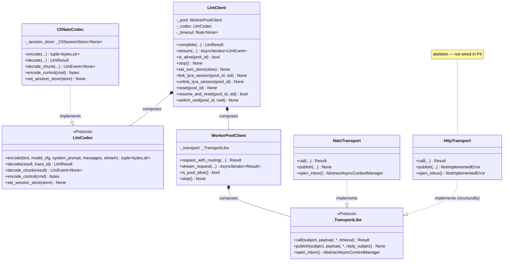
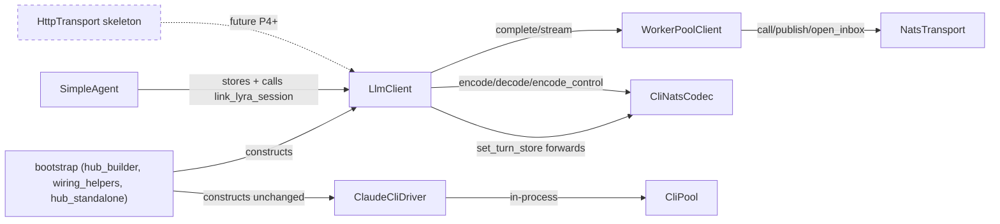

## Context

Promoted from: [`artifacts/frames/1281-phase-4-llm-codec-thinning-frame.mdx`](../frames/1281-phase-4-llm-codec-thinning-frame.mdx)
Epic SSoT: [`artifacts/analyses/1277-stage-axis-refactor-strategy.mdx`](../analyses/1277-stage-axis-refactor-strategy.mdx)
Substrate (already merged): Phase 1 (#1278/#1288) — `NatsTransport`, `WorkerPoolClient`, `SanitizedError`, `Result[T, SanitizedError]`.

**Actual code state at spec time (differs from issue body, which predated Phase 1 merge).** Verified by `grep -rn 'CliNatsDriver\|cli_nats_driver' src/` + read of `src/lyra/transport/worker_pool_client.py:28-44` (the `_TransportLike` structural Protocol):

Phase 1 already shipped the data-plane composition shape:
- `src/lyra/llm/llm_codec.py` (168 LOC) — concrete `LlmCodec` class (encode + decode + decode_chunk).
- `src/lyra/llm/llm_client.py` (87 LOC) — `LlmClient(pool: WorkerPoolClient, codec: LlmCodec)` — already thin (3-layer composition documented in module docstring).
- `src/lyra/transport/worker_pool_client.py:32-33` — module-level docstring already announces "P4 HttpTransport (#1281) will satisfy `call` only; `open_inbox` **and `publish`** raise NotImplementedError there".

What P4 actually adds:
1. Promote `LlmCodec` from concrete class → Protocol surface in `src/lyra/llm/codec.py`; current concrete impl becomes a named driver-codec (`CliNatsCodec`).
2. Delete `src/lyra/llm/drivers/cli_nats.py` (`CliNatsDriver`, 321 LOC) — functionally replaced by `LlmClient(pool, CliNatsCodec)`; control-plane methods absent from `LlmProvider` re-home onto `LlmClient` (see "Control-plane gap" below).
3. Add `src/lyra/transport/http_transport.py` (`HttpTransport.call()` only; `open_inbox()` and `publish()` raise `NotImplementedError` per the existing P1 docstring contract; matching `_TransportLike` Protocol structurally).
4. Rewire **seven call sites** that today reference `CliNatsDriver` / `cli_nats_driver` to use `LlmClient` instead.
5. **Out of scope:** `src/lyra/llm/drivers/cli.py` (`ClaudeCliDriver`, 86 LOC) wraps the in-process `CliPool` rather than a NATS transport — different shape, untouched in P4.

**Control-plane gap (architect-review finding, blocking).** `CliNatsDriver` exposes six methods that are NOT on the `LlmProvider` protocol but ARE actively called from outside the driver:

| Method | Called from | Today | After P4 (target) |
|---|---|---|---|
| `set_turn_store(store)` | `bootstrap/standalone/hub_standalone.py:170` | Wires `_CliSessionStore` (set/get_cli_session) for envelope session-id injection | Method on `LlmClient` that forwards to `CliNatsCodec` (codec needs the store for session-id encoding) |
| `link_lyra_session(pool_id, sid)` | `agents/simple_agent.py:248` | Sends `CliControlCmd` link via NATS | Method on `LlmClient` that calls `_pool.transport.publish` with a control envelope encoded by codec |
| `reset(pool_id)` | (defined; no direct call site in src/ but referenced in `LlmProvider` mirror surface) | Sends `CliControlCmd` reset via NATS | Method on `LlmClient` |
| `resume_and_reset(pool_id, sid)` | (defined; no direct call site found) | Sends `CliControlCmd` resume via NATS | Method on `LlmClient` |
| `switch_cwd(pool_id, cwd)` | (defined; no direct call site found) | Sends `CliControlCmd` cwd via NATS | Method on `LlmClient` |
| `unlink_lyra_session(pool_id)` | (defined; no direct call site found) | Sends `CliControlCmd` unlink via NATS | Method on `LlmClient` |

Methods without a current call site in `src/` are still preserved (test fixtures, future call sites may exist; grep at impl time is authoritative). Net surface added to `LlmClient`: six methods, each ≤10 LOC. `LlmClient` post-P4 LOC estimate: 87 → ~160 LOC.

## Goal

Make the LLM domain's stage-axis pivot complete and observable: a `LlmCodec` Protocol, a single concrete `CliNatsCodec`, an `HttpTransport` skeleton structurally satisfying `_TransportLike`, exactly one wired path through `LlmClient` (data + control plane both), and `CliNatsDriver` plus its `drivers/__init__.py` re-export excised.

## Users

- **Primary:** Lyra hub bootstrap (`src/lyra/bootstrap/factory/`, `src/lyra/bootstrap/standalone/`) — seven sites construct, type-annotate, or call `CliNatsDriver` today. P4 rewires all of them.
- **Secondary:**
  - `src/lyra/agents/simple_agent.py` — stores `_cli_nats_driver` and calls `link_lyra_session`. Field renamed to `_llm_client`; call site updated to use the new `LlmClient.link_lyra_session`.
  - Any caller of the `LlmProvider` Protocol (turn runners, streaming emitters) — wire-compatible; no signature change.
  - `ClaudeCliDriver` consumers — untouched.
  - Future provider authors — gain a documented `LlmCodec` Protocol + a `HttpTransport` skeleton to compose against.

## Expected Behavior

### Today (post-Phase 1 partial pivot)

```
bootstrap (hub) ──► CliNatsDriver(NatsDriverBase)
                      │  • 321 LOC; data-plane + control-plane (set_turn_store,
                      │    link_lyra_session, reset, …) + NATS inbox lifecycle
                      ▼
                   nats client (direct via NatsDriverBase)

bootstrap (hub) ──► LlmClient(pool, LlmCodec)         ◄── unused: post-P1 thin shape exists
                      │  • 87 LOC, data-plane only         but is NOT the wiring path today
                      ▼
                   WorkerPoolClient ──► NatsTransport
```

### After (stage axis, one wired path; control-plane re-homed)

```
bootstrap (hub) ──► LlmClient(pool, CliNatsCodec)
                      │  • ~160 LOC: data-plane (complete/stream) + control-plane
                      │    (set_turn_store/link_lyra_session/reset/resume_and_reset/
                      │     switch_cwd/unlink_lyra_session)
                      ▼
                   WorkerPoolClient ──► NatsTransport
                                          │
                                          └── (sibling, skeleton, ¬wired)
                                              HttpTransport.call() only
                                              HttpTransport.publish(...) NotImplementedError
                                              HttpTransport.open_inbox() NotImplementedError
```

- `src/lyra/llm/codec.py` defines `LlmCodec` as a Protocol.
- `src/lyra/llm/cli_nats_codec.py` defines `CliNatsCodec` (current `llm_codec.py` content, renamed).
- `src/lyra/llm/llm_client.py` expands to host control-plane methods, each delegating to `codec.encode_control(...)` + `_pool.transport.publish` (or `.call` where reply expected).
- `src/lyra/llm/drivers/cli_nats.py` is deleted; `src/lyra/llm/drivers/__init__.py` no longer re-exports `CliNatsDriver` (becomes empty or contains only `ClaudeCliDriver` if other plumbing already re-exports it).
- `src/lyra/llm/drivers/cli.py` (`ClaudeCliDriver`) is unchanged.
- `src/lyra/transport/http_transport.py` exists with `call(subject, payload, *, timeout)`, `publish(subject, payload, *, reply_subject) -> NoneType` raising `NotImplementedError`, `open_inbox()` raising `NotImplementedError("HTTP transport does not provide inbox-based streaming; use codec-level SSE.")`. Skeleton structurally satisfies `_TransportLike`.
- Seven bootstrap + agent sites rewired (W1–W7 below).
- `#1201` closes as subsumed once `CliNatsDriver` is deleted.

## Data Model & Consumers

### Data structure diagram (post-P4)



### Consumer map



### Consumer summary

| Consumer | Reads/uses | When | Status (this issue / future) |
|---|---|---|---|
| `factory/hub_builder.build_cli_nats_driver` | `LlmClient`, `CliNatsCodec`, `NatsTransport` | Process start | this issue (rewire) |
| `factory/wiring_helpers.CliPoolBundle.cli_nats_driver` field | `LlmClient \| None` (was `CliNatsDriver \| None`) | Bundle construction | this issue (type swap) |
| `factory/agent_factory` (≥7 sites: type annotations + 1 `noqa: F401 — DEBT:re-export-init`) | `LlmClient \| None` everywhere | Process start | this issue (rewire + drain debt) |
| `factory/unified.py:79-80` | `LlmClient.stop()` | Process stop | this issue (rewire; stop() already exists on LlmClient) |
| `standalone/hub_standalone.py:163,169-170,176,190,276` | `LlmClient.set_turn_store(stores.turn)` | Process start | this issue (rewire; new method on LlmClient) |
| `standalone/hub_standalone_helpers.py:25,113,124-125` | `LlmClient.stop()` | Process stop | this issue (rewire) |
| `agents/simple_agent.py:80,93,170-171,191-192,247-248` | `LlmClient.link_lyra_session(pool_id, sid)`, field `_llm_client` | Per turn | this issue (rewire; new method on LlmClient) |
| Hub bootstrap (Claude-direct CLI) | `ClaudeCliDriver`, `CliPool` | Process start | unchanged (untouched) |
| Turn runners / streaming emitters | `LlmProvider` protocol | Per turn | unchanged (wire-compatible) |
| Future Claude-direct-HTTP driver | `LlmClient`, `HttpTransport`, future codec | Future | future (skeleton only) |

## Breadboard

### Affordances (new — `src/lyra/llm/` + `src/lyra/transport/`)

| ID | Affordance | Type | Notes |
|---|---|---|---|
| C1 | `src/lyra/llm/codec.py` `LlmCodec` | Protocol | Defines `encode`, `decode`, `decode_chunk`, **`encode_control`**, **`set_session_store`** signatures. The two new methods support control-plane re-homing. |
| C2 | `src/lyra/llm/cli_nats_codec.py` `CliNatsCodec` | Concrete | Body == current `llm_codec.py` body + added `encode_control(cmd: CliControlCmd) -> bytes` (extracted from `CliNatsDriver._build_control_payload`) + `set_session_store(store) -> None` (stores the `_CliSessionStore` Protocol-typed handle for envelope session-id injection). |
| L1 | `src/lyra/llm/llm_client.py` `LlmClient` (expanded) | Modified | Adds 6 control-plane methods (`set_turn_store`, `link_lyra_session`, `unlink_lyra_session`, `reset`, `resume_and_reset`, `switch_cwd`). Each is a thin compose of `codec.encode_control(cmd)` + `_pool.transport.publish(...)` or `.call(...)`. `set_turn_store` forwards to `codec.set_session_store(store)`. Target LOC: ~160. |
| T1 | `src/lyra/transport/http_transport.py` `HttpTransport` | Concrete (skeleton) | `call(subject, payload, *, timeout) -> Result[bytes, SanitizedError]` ; `publish(subject, payload, *, reply_subject) -> None` raises `NotImplementedError` ; `open_inbox() -> AbstractAsyncContextManager` raises `NotImplementedError(consensus message)`. Structurally satisfies `_TransportLike`. No real HTTP I/O wired. |

### Removals

| ID | Removed | Notes |
|---|---|---|
| R1 | `src/lyra/llm/drivers/cli_nats.py` (321 LOC, `CliNatsDriver`) | Functionally replaced by `LlmClient(pool, CliNatsCodec)`. `_build_control_payload` body moves to `CliNatsCodec.encode_control`. |
| R2 | `src/lyra/llm/drivers/__init__.py` `CliNatsDriver` re-export | Becomes empty (no re-export). `drivers/` directory retained only if a sibling `cli.py` re-export is meaningful; otherwise `drivers/` keeps `cli.py` and an empty `__init__.py`. **Decision (closes OC4):** keep `drivers/` directory, retain `cli.py`, leave `__init__.py` empty (no implicit re-exports). |
| R3 | `src/lyra/llm/llm_codec.py` (renamed to `cli_nats_codec.py`) | Mechanical rename via `git mv` (preserves history); class symbol renamed `LlmCodec → CliNatsCodec`. |
| R4 | `src/lyra/bootstrap/factory/agent_factory.py:25` `noqa: F401 — DEBT:re-export-init` | Drained: the `CliNatsDriver` re-export disappears when the driver disappears. Confirmed by `grep` of `DEBT:re-export-init` showing 1 → 0 in `src/lyra/bootstrap/factory/`. |

### Wiring (consumers — full file list)

| ID | Change | Sites |
|---|---|---|
| W1 | `build_cli_nats_driver(...) -> CliNatsDriver` → `build_llm_client(...) -> LlmClient` (rename + return-type swap; the function builds NATS connection + WorkerPoolClient + CliNatsCodec + LlmClient, then calls `llm_client.set_turn_store(...)`-ready instance) | `src/lyra/bootstrap/factory/hub_builder.py:42,48-57,163,177` |
| W2 | `CliPoolBundle.cli_nats_driver: "CliNatsDriver \| None"` field renamed to `llm_client: "LlmClient \| None"` (or kept under `cli_nats_driver` name with type swap if rename creates churn — **decision: type swap only, keep name**) | `src/lyra/bootstrap/factory/wiring_helpers.py:49,82` |
| W3 | `agent_factory` type annotations: `cli_nats_driver: "CliNatsDriver \| None"` → `"LlmClient \| None"` everywhere (≥7 sites); remove `noqa: F401 — DEBT:re-export-init` block (the TYPE_CHECKING re-export becomes unnecessary or is updated) | `src/lyra/bootstrap/factory/agent_factory.py:25,52,67,69,126,140,192,207,222,230,251` |
| W4 | `cli_nats_driver = await build_cli_nats_driver(nc)` → `llm_client = await build_llm_client(nc)` ; `cli_nats_driver.set_turn_store(stores.turn)` → `llm_client.set_turn_store(stores.turn)` ; downstream uses propagate the rename | `src/lyra/bootstrap/standalone/hub_standalone.py:17,163,169-170,176,190,276` |
| W5 | Type annotation + `stop()` call rename | `src/lyra/bootstrap/standalone/hub_standalone_helpers.py:25,113,124-125` |
| W6 | `clipool.cli_nats_driver.stop()` reads against the renamed field (or unchanged name with swapped type, per W2 decision) | `src/lyra/bootstrap/factory/unified.py:79-80` |
| W7 | `SimpleAgent.__init__(cli_nats_driver=...)` kwarg renamed to `llm_client=...` ; `self._cli_nats_driver` → `self._llm_client` ; `self._llm_client.link_lyra_session(pool.pool_id, pool.session_id)` | `src/lyra/agents/simple_agent.py:80,93,170-171,191-192,247-248` |

Sites are 1-indexed line numbers at spec time (commit `91f7bd7a`); `grep -rn 'CliNatsDriver\|cli_nats_driver' src/` at impl time is the authoritative resolver.

### Tests & smoke

| ID | Affordance | Notes |
|---|---|---|
| TS1 | Unit tests for `LlmCodec` Protocol substitutability: `CliNatsCodec` satisfies `LlmCodec`; pyright `assert_type` or runtime `isinstance` check | `tests/llm/test_codec_protocol.py` (new) |
| TS2 | Control-plane methods unit-tested on `LlmClient` with a fake transport that records `publish` payloads; assert the encoded payload bytes match the legacy `CliNatsDriver._build_control_payload` output for each control cmd | `tests/llm/test_llm_client_control.py` (new) |
| TS3 | `HttpTransport` smoke: `call(...)` is awaitable (returns `Err` placeholder OR is callable without exception in skeleton); `publish(...)` raises `NotImplementedError`; `open_inbox()` raises with the exact consensus message | `tests/transport/test_http_transport.py` (new) |
| TS4 | Existing tests referencing `CliNatsDriver` → updated to assert on `LlmClient(pool, CliNatsCodec)` ; `grep -l 'CliNatsDriver' tests/` enumerates affected files at impl time | Mechanical updates |
| TS5 | End-to-end smoke: hub turn round-trip on clipool via `LlmClient(pool, CliNatsCodec)` — assert `LlmResult.result` non-null, `LlmResult.error` is None, `session_id` populated, same field set as pre-P4 | Existing CI smoke OR manual run documented in PR description |

## Slices

| # | Slice | Files | Demo |
|---|-------|-------|------|
| S1 | Promote codec to Protocol + rename concrete + add `encode_control`/`set_session_store` to codec | `src/lyra/llm/codec.py` (new), `src/lyra/llm/llm_codec.py` → `src/lyra/llm/cli_nats_codec.py` (renamed via `git mv` ; class symbol renamed; `encode_control` + `set_session_store` methods added) | `pyright` green ; `CliNatsCodec()` satisfies `LlmCodec` Protocol at type-check time. **Order within slice: `git mv` MUST precede any import updates so no commit leaves a dangling import window.** |
| S2 | Expand `LlmClient` with 6 control-plane methods | `src/lyra/llm/llm_client.py` (expanded ~87 → ~160 LOC) | `LlmClient` now exposes the full surface `SimpleAgent` and `hub_standalone` will call post-S3. Unit tests in TS2 pass against a fake transport. |
| S3 | Add `HttpTransport` skeleton (structurally satisfies `_TransportLike`) | `src/lyra/transport/http_transport.py` (new) | `HttpTransport.publish` raises NotImplementedError ; `HttpTransport.open_inbox` raises with consensus message ; `HttpTransport.call` is callable ; pyright accepts `HttpTransport` where `_TransportLike` is expected. |
| S4 | Rewire bootstrap (W1–W7) + delete `CliNatsDriver` (R1, R2, R4) | All seven W-sites + R1 + R2 + R4 | Hub start → LLM turn round-trip on clipool completes without behavioral change. `grep -rn 'CliNatsDriver\|cli_nats_driver' src/ → 0 hits`. `DEBT:re-export-init` in `agent_factory.py` drained. |
| S5 | Test + smoke updates (TS1–TS5) | `tests/llm/test_codec_protocol.py`, `tests/llm/test_llm_client_control.py`, `tests/transport/test_http_transport.py`, mechanical updates per TS4 | `pytest` green ; smoke documented. |

S1–S5 are intended to land as ONE PR. The slice split is for review ordering + commit hygiene, ¬for incremental merges (an intermediate state with `CliNatsDriver` deleted but bootstrap un-rewired would not boot). Recommended commit sequence: S1 → S2 → S3 → S4 → S5, each its own commit.

## Success Criteria

- [ ] `src/lyra/llm/codec.py` exists and defines `LlmCodec` as a `typing.Protocol` with `encode`, `decode`, `decode_chunk`, `encode_control`, `set_session_store` signatures.
- [ ] `src/lyra/llm/cli_nats_codec.py` exists with `CliNatsCodec` as the concrete implementation including the new `encode_control(cmd: CliControlCmd) -> bytes` and `set_session_store(store) -> None` methods; `src/lyra/llm/llm_codec.py` no longer exists; `git log --follow src/lyra/llm/cli_nats_codec.py` shows history continuity (the rename used `git mv`).
- [ ] `src/lyra/llm/drivers/cli_nats.py` no longer exists; `grep -rn 'CliNatsDriver' src/ tests/` returns 0 hits.
- [ ] `src/lyra/transport/http_transport.py` exists with `HttpTransport` class structurally satisfying `_TransportLike` (`call`, `publish`, `open_inbox` all defined). `HttpTransport.call(subject, payload, *, timeout)` is awaitable; `HttpTransport.publish(...)` raises `NotImplementedError`; `HttpTransport.open_inbox(...)` raises `NotImplementedError("HTTP transport does not provide inbox-based streaming; use codec-level SSE.")`.
- [ ] `LlmClient` exposes six new methods: `set_turn_store`, `link_lyra_session`, `unlink_lyra_session`, `reset`, `resume_and_reset`, `switch_cwd`. Each is a thin compose (≤10 LOC body). `set_turn_store` forwards to `codec.set_session_store`.
- [ ] All seven W-sites (W1–W7 in Wiring table) reference `LlmClient` / `llm_client` (or kept-name `cli_nats_driver` field per W2 decision) with the swapped type ; `grep -rn 'cli_nats_driver' src/` returns hits only at the W2 field name if retained, else 0 hits. `grep -rn 'from lyra.llm.drivers.cli_nats' src/` returns 0 hits.
- [ ] `src/lyra/bootstrap/factory/agent_factory.py:25` no longer carries the `noqa: F401 — DEBT:re-export-init` block (line removed; the TYPE_CHECKING import that required the noqa is gone).
- [ ] `src/lyra/llm/drivers/cli.py` (`ClaudeCliDriver`) is byte-identical or whitespace-only diff vs. pre-P4 (`git diff staging~N -- src/lyra/llm/drivers/cli.py` shows whitespace only).
- [ ] LOC ceilings: `codec.py` ≤ 80 ; `cli_nats_codec.py` ≤ 220 (current `llm_codec.py` 168 + ~50 for `encode_control`/`set_session_store`) ; `http_transport.py` ≤ 80 (skeleton) ; `llm_client.py` ≤ 200 (87 + 6 thin methods). **Note: the frame's "per-driver file ≤ 80 lines" target applied to the deleted `cli_nats.py` (321 → 0 LOC) ; codec files are not driver files and have their own ceiling.**
- [ ] Smoke test: a hub LLM turn over the clipool path completes via `LlmClient(pool, CliNatsCodec)` ; the returned `LlmResult` has `result` non-null, `error` is None, `session_id` populated, and the same field set as pre-P4 (`{result, session_id, error, warning}`). Verified by manual run on local dev OR by an existing CI smoke job, documented in PR description.

## Risks / non-goals reminders

- **¬wire `HttpTransport` to any real driver** — skeleton only. Wiring is a follow-up triggered by a future "add Claude-direct-HTTP provider" issue.
- **¬touch `ClaudeCliDriver` (`cli.py`)** — different transport shape (in-process `CliPool`). A future generalization is its own scope. **Caveat (product-lead-review note):** `ClaudeCliDriver` likely retains `boundary-broad-catch` sites — the frame's debt-drain claim ("LLM-domain broad-catch ≤ 3") applies to the post-P4 NATS path only; the in-process path is its own count, addressed by a separate future issue if it materializes.
- **¬rename `LlmClient`** — class name preserved. Its constructor argument types switch from concrete `LlmCodec` to `LlmCodec` Protocol; this is type-only, no runtime change.
- **¬change wire format** — encode/decode bytes remain byte-for-byte identical for both data envelopes (existing `LlmRequest`/`LlmResponse`) and control envelopes (existing `CliControlCmd`). `decode_chunk` semantics preserved verbatim.
- **¬touch `bootstrap/factory/*` beyond the seven W-sites** — Phase 6 (#1283) is the DI/bootstrap refactor; P4 only rewires the LLM construction + control path.
- **¬change `LlmProvider` Protocol** — call-site contract (`complete` / `stream` / `is_alive` / `stop`) stays frozen. Control-plane methods are NOT added to `LlmProvider` (they remain `LlmClient`-specific, ductypped at call sites like `simple_agent` that already do `isinstance`-equivalent driver checks today).

## Open clarifications

1. **(RESOLVED at spec stage)** Codec module name: `cli_nats_codec.py` retained. Rationale: matches issue body's example; "cli_nats" accurately encodes the NATS-based CliPool worker pair; `clipool_codec.py` would be ambiguous with the `CliPool` adapter (`src/lyra/core/cli/cli_pool.py`).
2. **(RESOLVED at spec stage)** Wiring sites: verified by `grep -rn 'CliNatsDriver\|cli_nats_driver' src/` — seven files (W1–W7); list is comprehensive at spec time. Impl re-runs the grep against current `staging` to catch any drift.
3. **(deferred to plan)** `HttpTransport.__init__` signature: skeleton has empty `__init__` since nothing wires it in P4. Plan-stage decides whether to add `base_url: str | None = None` placeholder for future use. **Default: empty `__init__`.**
4. **(RESOLVED at spec stage — R2)** `drivers/__init__.py` fate: directory retained with `cli.py`; `__init__.py` becomes empty (no implicit re-exports); the `CliNatsDriver` re-export and `__all__` entry both removed.
5. **(deferred to plan)** `CliPoolBundle.cli_nats_driver` field name: W2 decision is "keep name, swap type" (`cli_nats_driver: "LlmClient | None"`). Rename to `llm_client` is a cleaner but wider-blast change; plan-stage may revisit if the rename cost is low.

## References

- Frame: [`artifacts/frames/1281-phase-4-llm-codec-thinning-frame.mdx`](../frames/1281-phase-4-llm-codec-thinning-frame.mdx)
- Epic: #1277 ([`artifacts/analyses/1277-stage-axis-refactor-strategy.mdx`](../analyses/1277-stage-axis-refactor-strategy.mdx))
- Phase 1 substrate spec (HttpTransport contract surface): [`artifacts/specs/1278-nats-transport-workerpool-spec.mdx`](../specs/1278-nats-transport-workerpool-spec.mdx)
- Phase 1 consensus (`HttpTransport.open_inbox` semantics, §B1): [`artifacts/analyses/1278-nats-transport-workerpool-consensus.mdx`](../analyses/1278-nats-transport-workerpool-consensus.mdx)
- `_TransportLike` Protocol (the structural target `HttpTransport` must satisfy): `src/lyra/transport/worker_pool_client.py:28-44`
- Subsumed: #1201 (`stream()` async-generator duplication — driver duplication eliminated by deleting `CliNatsDriver`)
