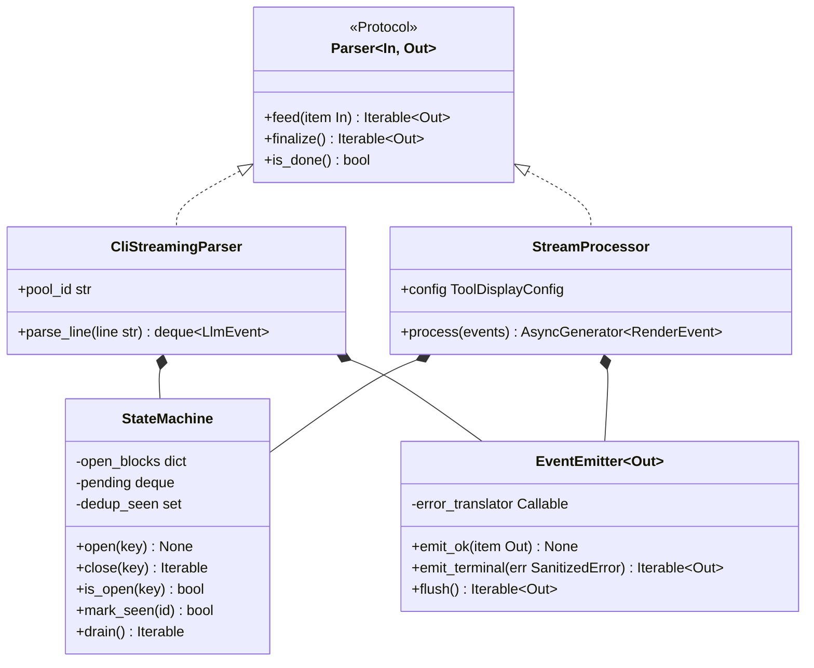
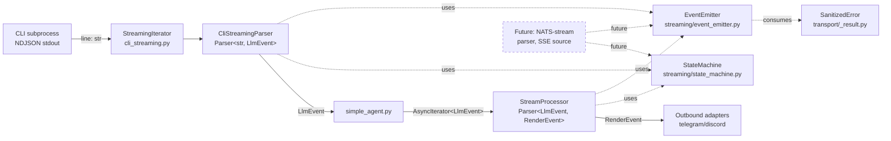

## Context

Promoted from `artifacts/frames/1282-phase-5-streaming-frame.mdx`. Parent epic #1277 — stage-axis decomposition (`artifacts/analyses/1277-stage-axis-refactor-strategy.mdx`). Phase 1 (#1278, merged 2026-05-20) shipped `Result[T, E]` / `SanitizedError` / `NatsTransport` / `WorkerPoolClient` in `src/lyra/transport/`. This phase pivots the streaming layer from a per-source axis (CLI NDJSON parser + hub stream processor) to a stage-axis composition (parser / state_machine / event_emitter).

Today's streaming surface measured:
- `src/lyra/core/processors/stream_processor.py` — 549 LOC, `process()` carries `noqa: C901, PLR0915 — DEBT:wiring-bootstrap-deps — event-type dispatch + terminal fallbacks` (stream_processor.py:201).
- `src/lyra/core/cli/cli_streaming_parser.py` — 366 LOC, `parse_line()` carries `noqa: C901, PLR0912, PLR0915 — DEBT:complexity-residual — protocol event dispatch` (cli_streaming_parser.py:127).

Both files re-implement the same kind of state tracking from different angles:
- **Open-block tracking**: parser tracks `_open_tool_blocks: dict[int, str]`, `_open_thinking_index: int | None`, `_emitted_tool_use_ids: set[str]`; processor tracks `_open_text_block_id`, `_open_reasoning_block_id`, `_open_tool_call_ids`, `_tool_id_to_name`.
- **Pending-event drain**: parser owns `_pending: deque[LlmEvent]` consumed by caller; processor yields `RenderEvent` directly from an `async for` loop with synthesized terminal events (`_synth_orphan_tool_ends`, `_close_reasoning_if_open`).
- **Terminal/error semantics**: both files convert upstream conditions into typed terminal events via ad-hoc branching; parser sanitizes `JSONDecodeError` to `WorkerError(code="cli.parse", message=type(exc).__name__, …)` (parser.py:148-163, #1252/#1219); processor sanitizes via the same `WorkerError` channel inside `process()`.

State-machine logic is therefore **triplicated**: path-a (`stream_event/content_block_*`) and path-b (`assistant/result`) inside the CLI parser, plus the protocol-translation layer in `stream_processor.py`. Each concern change (new event type, ordering tweak, retry boundary, sanitization rule) replicates across three sites.

The shared event vocabulary (`LlmEvent`, `RenderEvent` in `src/lyra/core/messaging/events.py` + `render_events.py`) is the seam between these two layers and stays unchanged. Phase 5 extracts the *structural* primitives that wrap the seam, not the seam itself.

## Goal

Extract a generic `Parser` Protocol, generic `StateMachine` primitives (open-block tracking, pending drain, dedup sets), and a `Result[T, SanitizedError]`-aware `EventEmitter` into a net-new `src/lyra/streaming/` package, so the CLI NDJSON parser and the hub stream processor compose them as thin per-source/per-stage implementations and the noqa complexity hotspots collapse.

## Users

- **Primary:** `CliStreamingParser` (refactored to compose new primitives) and `StreamProcessor` (refactored as a state-machine instance over `LlmEvent → RenderEvent`). Consumed by `simple_agent.py` (`StreamProcessor.process(events)`) and `cli_streaming.py` (`CliStreamingParser.parse_line(line)`).
- **Secondary:**
  - Engineers maintaining streaming bug-classes (`complexity-residual` on the two `noqa`-tagged methods; `boundary-broad-catch` on streaming sites).
  - Future stream sources (NATS-stream worker output via `lyra.outbound.<platform>.<bot_id>` stream subjects, SSE-style sources, …) — integration cost = thin parser implementing the Protocol, not re-inventing state tracking.
  - Phase 6 (bootstrap/DI) — streaming stages become injectable; both parser and processor can be unit-tested without ad-hoc fixtures.

## Expected Behavior

For a CLI streaming turn handled by the hub today:

1. CLI subprocess emits NDJSON lines on stdout.
2. `cli_streaming.py: StreamingIterator` reads lines; passes each to `CliStreamingParser.parse_line(line)`.
3. Parser returns `deque[LlmEvent]` drained by caller into an async iterator.
4. `simple_agent.py` wraps the iterator into `StreamProcessor.process(events)` which yields `AsyncGenerator[RenderEvent, None]`.
5. Adapters (outbound) consume `RenderEvent` stream.

Phase 5 preserves this end-to-end flow with structurally simpler internals:

- `CliStreamingParser` becomes a `Parser[str, LlmEvent]` implementation. Its `parse_line` body shrinks below the C901/PLR0912/PLR0915 thresholds (single-digit McCabe target). Sub-dispatchers per protocol message type (`system/init`, `assistant`, `stream_event/content_block_*`, `user/tool_result`, `result`) replace the monolithic if/elif chain. Wire-level dedup state (`_emitted_tool_use_ids`, `_open_tool_blocks`, `_open_thinking_index`) moves into a reusable `StateMachine` mixin/composition.
- `StreamProcessor` becomes a `Parser[LlmEvent, RenderEvent]` instance using the same `StateMachine` primitives for its open-block tracking (`_open_text_block_id`, `_open_reasoning_block_id`, `_open_tool_call_ids`). Its `process` body shrinks below the C901/PLR0915 thresholds; per-event-type sub-handlers replace the monolithic dispatch.
- `EventEmitter` centralizes the `Result[T, SanitizedError]` → terminal-event translation. Both `cli.parse` (`JSONDecodeError` → `ResultLlmEvent(is_error=True, worker_error=…)`) and processor-level fallbacks (`RunErrorRenderEvent`) flow through it. No `str(exc)` / `f"...{exc}"` patterns remain in `src/lyra/streaming/`.
- Behavior preserved end-to-end:
  - Event ordering: `RunStartedRenderEvent` opens turn; `RunFinishedRenderEvent` ∨ `RunErrorRenderEvent` closes it; `TextStart` / `TextDelta` / `TextEnd` triplet remains intact; reasoning-close guards still fire on non-Thinking events; orphan tool-ends still synthesized at `ResultLlmEvent`.
  - `RunErrorRenderEvent` still arrives AFTER `TextEnd` (per `_shared_streaming_state.py` `is_error_pending` field comment ~lines 150-155 — the ordering invariant downstream adapters rely on). Both emission paths (inside `except Exception` at stream_processor.py:380, and post-finally for soft errors at stream_processor.py:399) must continue to honor the invariant after the refactor routes them through `EventEmitter`.
  - Slice 2/3/4 invariants (#1099/#1100/#1101) preserved: v2 Text triplet, ToolCall* lifecycle, reasoning block lifecycle.
  - CLI dedupe (`_emitted_tool_use_ids` set guarding `content_block_start` vs post-hoc `assistant` announcements) preserved.
  - `cli.parse` terminal envelope on JSON corruption preserved (heuristic: line starts with `{`).
  - `is_error=True + subtype=success + had_text_delta` downgrade preserved.

## Data Model & Consumers

| Consumer | Fields consumed | When | Status |
|---|---|---|---|
| `simple_agent.py` | `StreamProcessor.process(events)` → `AsyncIterator[RenderEvent]` | Per turn (one StreamProcessor instance per turn — no reuse) | this issue (import path may change) |
| `cli_streaming.py: StreamingIterator` | `CliStreamingParser(pool_id).parse_line(line)` → `deque[LlmEvent]` | Per stdout line | this issue (import path may change) |
| Outbound adapters (Telegram/Discord) | `RenderEvent` stream from `StreamProcessor` | Downstream of processor; consumer treats events as opaque | unchanged (no comment refs touched) |
| NATS-stream parser | Composes `Parser` + `StateMachine` + `EventEmitter` | Per stream chunk | future (out of scope this issue) |

## Breadboard

### Module affordances

| ID | Affordance | Handler | Data |
|---|---|---|---|
| M1 | `src/lyra/streaming/__init__.py` | re-exports public Protocols + classes | — |
| M2 | `src/lyra/streaming/parser.py` | `Parser[In, Out]` Protocol with `feed` / `finalize` / `is_done` | typed via `Generic[InT, OutT]` |
| M3 | `src/lyra/streaming/state_machine.py` | `StateMachine[K, V]` generic class — open-block dict, pending deque, dedup-set primitives. **Per-consumer instances; no cross-consumer key sharing.** Each parser instantiates its own `StateMachine` with its own key conventions (e.g. CLI parser: `K=int` for `_open_tool_blocks` index, `K=str` for `_emitted_tool_use_ids` tool_id; processor: `K=str` for all block-id sets). | composed (not inherited) by parser impls |
| M4 | `src/lyra/streaming/event_emitter.py` | `EventEmitter[Out]` — `Result[bytes, SanitizedError]` → terminal `Out`; centralizes `WorkerError`/`type(exc).__name__` translation | depends on `lyra.transport._result.SanitizedError` |

### Consumer rewires

| ID | Affordance | Handler | Data |
|---|---|---|---|
| C1 | `cli_streaming_parser.py: CliStreamingParser` refactor | replace `parse_line` monolith with per-message-type dispatch using `StateMachine` for `_emitted_tool_use_ids` / `_open_tool_blocks` / `_open_thinking_index` and `EventEmitter` for terminal envelope | preserves `pool_id`, `session_id`, `error`, `parse_line(line) -> deque[LlmEvent]` signature |
| C2 | `stream_processor.py: StreamProcessor` refactor | replace `process` monolith with per-LlmEvent-type sub-handlers using `StateMachine` for `_open_text_block_id` / `_open_reasoning_block_id` / `_open_tool_call_ids` and `EventEmitter` for `RunErrorRenderEvent` | preserves `__init__(config, *, show_intermediate)`, `process(events) -> AsyncGenerator[RenderEvent, None]` signature |
| C3 | `simple_agent.py` + `cli_streaming.py` import updates | **Decision: keep classes at current paths** (`lyra.core.processors.stream_processor.StreamProcessor` / `lyra.core.cli.cli_streaming_parser.CliStreamingParser`). The classes compose `src/lyra/streaming/` primitives internally; consumer imports are unchanged. No new public path under `lyra.streaming.*` is added in this issue. | zero import-line changes at consumer sites |

### Quality gates

| ID | Affordance | Handler | Data |
|---|---|---|---|
| Q1 | `parse_line` complexity | drop below McCabe ≤ 10 / PLR0912 ≤ 15 / PLR0915 ≤ 50 | enforced by ruff; noqa removed |
| Q2 | `process` complexity | drop below McCabe ≤ 10 / PLR0915 ≤ 50 | enforced by ruff; noqa removed |
| Q3 | `src/lyra/streaming/` cascade-pattern grep | `grep -rE 'str\\(exc?\\)\|f"[^"]*\\{(exc\|e\|err)' src/lyra/streaming/` returns 0 | enforced in CI optional / pre-push manual check |
| Q4 | folder-size gate | `tools/check-folder-size` accepts `src/lyra/streaming/` (≤12 files, no oversize entries) | enforced by pre-commit |

## Slices

| # | Slice | Demoable outcome | Files touched | Exit signal |
|---|---|---|---|---|
| 1 | **Scaffold + Parser Protocol** | `src/lyra/streaming/{__init__,parser}.py` exists; `Parser[In, Out]` Protocol defined; `CliStreamingParser` and `StreamProcessor` declared as `Parser` implementations via duck typing (no behavior change). | M1, M2 | pyright passes on imports; pytest unchanged |
| 2 | **StateMachine extraction + CLI parser rewire** | `state_machine.py` houses the wire-level dedup + open-block primitives. `CliStreamingParser` composes it; per-message-type dispatchers split `parse_line` into ≤30-line methods. `parse_line` noqa removed. | M3, C1 | `pytest tests/core/test_cli_streaming_parse.py` green; `parse_line` McCabe ≤ 10 |
| 3 | **StreamProcessor rewire** | `StreamProcessor.process` refactored to use `StateMachine` for open-block state and per-LlmEvent-type sub-handlers. `process` noqa removed. The outer `try / except / finally` frame stays intact (governs the dual `RunErrorRenderEvent` emission paths — see Slice 4). Ordering invariants preserved (TextEnd before RunError, reasoning-close guards, orphan tool-ends). `assert_never` default fallback preserved. | C2 | `pytest tests/core/test_stream_processor.py tests/agents/test_simple_agent.py tests/integration/test_reasoning_e2e.py` green; `process` McCabe ≤ 10; existing tests covering orphan-tool-end synthesis and reasoning-close guards remain (no `xfail` / deletion / skip) |
| 4 | **EventEmitter + SanitizedError boundary** | `event_emitter.py` centralizes terminal-event translation. All exception-text formatting in `src/lyra/streaming/` goes through it. `str(exc)` / `f"...{exc}"` grep in `src/lyra/streaming/` returns 0. Both `RunErrorRenderEvent` emission paths (line ~380 inside `except`, line ~399 post-finally for soft errors) route through `EventEmitter`. Existing `cli.parse` envelope path also routes through emitter. | M4, C1, C2, C3 | `grep -rE 'str\\(exc?\\)\|f"[^"]*\\{(exc\|e\|err)' src/lyra/streaming/` empty; `pytest tests/integration/test_worker_error_e2e.py tests/agents/test_simple_agent.py` green |

Slices are **strictly sequential** — Slice 1 lands the Protocol, Slice 2 introduces the StateMachine and validates the dispatch split on the simpler parser, Slice 3 applies the same pattern to the processor (riskier — touches Slice 2/3/4 invariants from #1099/#1100/#1101), Slice 4 closes the cascade-drain success criterion. Each slice ships as one logical commit inside the single PR.

## Success Criteria

- [ ] `src/lyra/streaming/{__init__,parser,state_machine,event_emitter}.py` exists; folder-size gate passes (≤12 files, all ≤300 LOC).
- [ ] `Parser[In, Out]` Protocol defined in `streaming/parser.py` with `feed`, `finalize`, `is_done` methods.
- [ ] `CliStreamingParser` composes `StateMachine` + `EventEmitter`; `parse_line` noqa annotation **removed**; ruff reports no C901/PLR0912/PLR0915 on the file.
- [ ] `StreamProcessor` composes `StateMachine` + `EventEmitter`; `process` noqa annotation **removed**; ruff reports no C901/PLR0915 on the file.
- [ ] `grep -rE 'str\(exc?\)\|f"[^"]*\{(exc\|e\|err)' src/lyra/streaming/` returns 0 matches.
- [ ] `pytest tests/` green — no regression on existing `cli_streaming_parser` / `stream_processor` / `simple_agent` test suites.
- [ ] Event ordering invariant preserved: `tests/adapters/test_telegram_reasoning.py` + `tests/adapters/test_discord_reasoning.py` + `tests/integration/test_reasoning_e2e.py` continue to pass without modification (they assert `RunError`-after-`TextEnd` ordering downstream); `_shared_streaming_state.py` `is_error_pending` field comment (lines ~150-155) remains valid post-refactor.
- [ ] Existing `cli.parse` terminal envelope on malformed JSON still emitted with `message=f"CLI emitted malformed JSON: {type(exc).__name__}"` (no raw `str(exc)`); is_error/subtype/had_text_delta downgrade logic preserved.
- [ ] Orphan ToolCallEnd synthesis at ResultLlmEvent preserved; reasoning-block close guards preserved; `assert_never(event)` default fallback in `process` dispatch preserved (Slice 2/3/4 invariants from #1099/#1100/#1101 unchanged).
- [ ] `simple_agent.py` and `cli_streaming.py` consumer interfaces unchanged at the call site (`StreamProcessor(config).process(events)` and `CliStreamingParser(pool_id).parse_line(line)` signatures preserved).
- [ ] Single PR per epic body; CI green; pre-commit gates (file-length, folder-size, import-layers, lint, typecheck) pass.

## Out of Scope

- New stream sources (NATS-stream parser, SSE source) — Phase 5 lands the primitives; consumers come later.
- Changes to the `LlmEvent` / `RenderEvent` event vocabulary in `core/messaging/events.py` / `render_events.py`.
- Changes to event-ordering invariants (TextEnd-before-RunError, reasoning-close guards, orphan tool-ends).
- Telemetry / OTel instrumentation (#1235 obs scaffolding; orthogonal).
- Outbound adapter changes — Phase 2 (#1279) territory.
- LLM driver changes — Phase 4 (#1281) territory.
- Sanitization function **bodies** in `core/cli/cli_streaming_parser.py: _scrub_cli_error_text` / `_classify_cli_error` — preserved as-is. Only their *invocation site* moves through `EventEmitter`; their implementations are not refactored, their signatures are not changed, and their KNOWN_CODES mapping is not touched.
