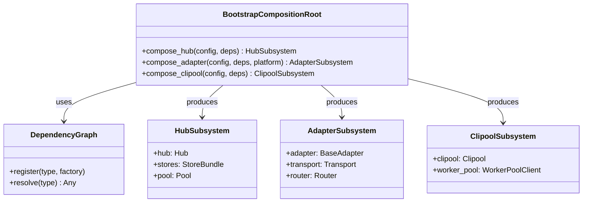

## Context

Promoted from: [Frame #1283](../frames/1283-feat-refactor-phase-6-bootstrap-wiring-simplification-via-di-frame.mdx)

After Phases 1-5, the DI shape of the application is fully composition-based. The bootstrap layer still carries structural debt from the pre-DI era. This spec defines the mechanical cleanup to industrialize the DI pattern in bootstrap.

Parent: #1277 (Stage-axis refactor epic)

## Goal

Simplify `src/lyra/bootstrap/` by flattening the standalone-vs-wired-vs-factory split, leveraging DI containers, removing test-patch workarounds, and tightening loose ducktyping into explicit Protocols.

## Users

- **Primary:** Core maintainers adding or modifying process entry points (hub, adapters, clipool)
- **Secondary:** Test authors who currently rely on module-level patch fixtures

## Expected Behavior

### Bootstrap flattening

Today, bootstrap contains three implicit layers:
1. **Standalone functions** (`_bootstrap_hub_standalone`, `_bootstrap_adapter_standalone`, `_bootstrap_clipool_standalone`) — full self-contained setup
2. **Wired functions** — same logic but with externally injected dependencies
3. **Factory functions** — constructors that produce the wired variants

With DI now explicit, the standalone-vs-wired split is redundant. The expected behavior:
- Standalone functions become thin wrappers that call a shared composition root
- The composition root receives a dependency graph / container and returns the bootstrapped subsystem
- Factory functions merge into the composition root or are removed entirely

### Dependency annotation reduction

- `wiring-bootstrap-deps` annotations in `bootstrap/` (15 today) are reduced by leveraging DI containers
- Where dependencies are injected via constructor, the annotation is removed
- Remaining annotations (if any) are justified with inline comments

### Test fixture cleanup

- `module-level-patch-fixtures` workarounds are removed
- Test fakes are consolidated in `tests/factories/` with explicit import-linter rule
- Tests use DI injection instead of monkey-patching

### Protocol tightening

- `protocol-private-ducktyping` (0 in bootstrap/; 4 repo-wide in `core/cli/` and `core/hub/` tracked separately) are converted to explicit `typing.Protocol` definitions where applicable
- Protocols are placed adjacent to their consumers or in a shared `protocols.py` module
- No private ducktyping remains in bootstrap/

## Data Model & Consumers

### Consumer summary

| Consumer | Fields consumed | When | Status |
|----------|----------------|------|--------|
| `lyra hub` CLI | `compose_hub` | startup | this issue |
| `lyra adapter telegram` CLI | `compose_adapter(platform='telegram')` | startup | this issue |
| `lyra adapter discord` CLI | `compose_adapter(platform='discord')` | startup | this issue |
| `lyra adapter clipool` CLI | `compose_clipool` | startup | this issue |
| `lyra start` unified | all composers | startup | this issue |
| Future harness (#future) | `DependencyGraph` | test | future |

## Breadboard

| ID | Affordance | Handler | Data |
|----|-----------|---------|------|
| N1 | `lyra hub` | `compose_hub → run` | `config.toml`, `auth.db`, DI graph |
| N2 | `lyra adapter <platform>` | `compose_adapter → run` | `config.toml`, `auth.db`, platform enum |
| N3 | `lyra adapter clipool` | `compose_clipool → run` | `config.toml`, DI graph |
| N4 | `lyra start` | `compose_all → run_parallel` | `config.toml`, `auth.db`, DI graph |
| S1 | `pytest` with fakes | `tests/factories/` | fake stores, fake transports, fake LLM |
| S2 | `import-linter` | `.importlinter` | rule: tests/factories must not import from production internals |

## Slices

| Slice | Description | Acceptance Criteria | Effort |
|-------|-------------|---------------------|--------|
| 1 | Flatten standalone-vs-wired split in bootstrap | Standalone functions call composition root; no duplicate setup logic | 2d |
| 2 | Reduce `wiring-bootstrap-deps` annotations in bootstrap/ | Count ≤ 5 (from 15 today); all remaining justified | 2d |
| 3 | Extract test fakes to `tests/fakes/` + import-linter rule | Fakes isolated; no module-level patches in tests | 2d |
| 4 | Tighten `protocol-private-ducktyping` into explicit Protocols | 0 in bootstrap/ (already clean); 4 repo-wide sites tracked separately | 0d |
| 5 | Verify all entry points still work | `lyra hub`, `lyra adapter telegram`, `lyra adapter discord`, `lyra adapter clipool`, `lyra start` all pass smoke test; rollback = revert to pre-refactor branch if any smoke test fails | 1d |

## Success Criteria

- [ ] `wiring-bootstrap-deps` count in `bootstrap/` ≤ 5 (from 15 today)
- [ ] All bootstrap files ≤ 300 lines each (matching quality gate)
- [ ] No `# noqa: C901, PLR0915` in `src/lyra/bootstrap/`
- [ ] Test fakes isolated in `tests/factories/` with import-linter rule
- [ ] No `protocol-private-ducktyping` in `bootstrap/` (already clean; 4 repo-wide sites tracked separately)
- [ ] All 5 production entry points pass smoke test after refactor
- [ ] Single PR (atomic refactor)

## Notes

- `protocol-private-ducktyping` (4 repo-wide sites in `core/cli/` and `core/hub/`) is tracked by #1079, not included in this bootstrap scope.
- `TurnStoreProtocol` (absorbed from #1079) remains tracked by #1079; this spec does not include it.
