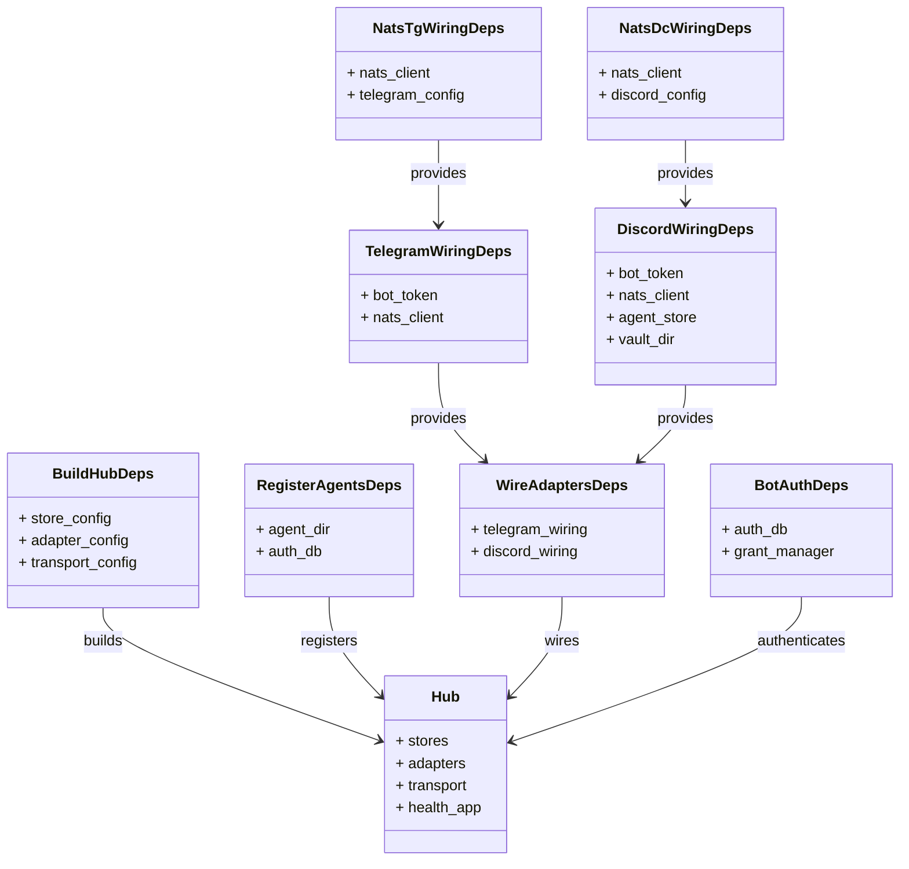
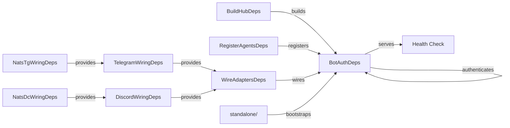

## Context

After Phases 1–5 of the stage-axis refactor, the DI shape of the application is fully composition-based (dataclass-based deps containers: `BuildHubDeps`, `RegisterAgentsDeps`, `WireAdaptersDeps`, `TelegramWiringDeps`, `DiscordWiringDeps`, `BotAuthDeps`). Phase 6 industrializes this by flattening the standalone-vs-wired-vs-factory split and reducing bootstrap wiring complexity.

Current bootstrap footprint: ~1,424 lines across 31 files in `src/lyra/bootstrap/`.

## Goal

Reduce bootstrap wiring complexity and file size by leveraging DI containers; eliminate manual bootstrap dependency wiring; isolate test fakes.

## Users

- **Primary:** Lyra developers adding new adapters/drivers/bots
- **Secondary:** Code reviewers auditing bootstrap for complexity

## Expected Behavior

When Alice adds a new Discord bot:
1. She registers the bot in `src/lyra/bootstrap/factory/config.py` using the existing `DiscordWiringDeps` dataclass
2. She runs `lyra adapter discord --bot-id foo`
3. The bootstrap layer wires NATS transport, auth, and store using the DI container — no manual `wiring-bootstrap-deps` annotations

## Data Model & Consumers

### Dependency Graph

### Consumer Map

### Consumer Summary

| Consumer | Fields Consumed | When | Status |
|----------|----------------|------|--------|
| `standalone/hub_standalone.py` | `BuildHubDeps`, `RegisterAgentsDeps` | startup | to migrate |
| `standalone/adapter_standalone.py` | `WireAdaptersDeps`, `TelegramWiringDeps`, `DiscordWiringDeps` | startup | to migrate |
| `factory/hub_builder.py` | `BuildHubDeps` | build | to migrate |
| `factory/wiring_helpers.py` | `WireAdaptersDeps`, `BotAuthDeps` | wire | to migrate |
| `infra/health.py` | `Hub` | health | already migrated |
| `tests/fakes/` | `FakeNatsClient`, `FakeStore` | test | new |

## Breadboard

| ID | Affordance | Handler | Data |
|----|-----------|---------|------|
| B1 | `lyra hub` CLI | `standalone/hub_standalone.py` | `BuildHubDeps` + `RegisterAgentsDeps` |
| B2 | `lyra adapter telegram` CLI | `standalone/adapter_standalone.py` | `TelegramWiringDeps` |
| B3 | `lyra adapter discord` CLI | `standalone/adapter_standalone.py` | `DiscordWiringDeps` |
| B4 | `lyra adapter clipool` CLI | `standalone/clipool_standalone.py` | `WireAdaptersDeps` |
| B5 | `lyra start` unified | `lifecycle/bootstrap_lifecycle.py` | all deps |
| B6 | Health endpoint | `infra/health.py` | `Hub` |

## Slices

| Slice | Affordances | Goal | Deliverable |
|-------|------------|------|-------------|
| S1 | B1, B2, B3, B4, B5 | Flatten standalone entry points + move wiring helpers | `standalone/` ≤ 4 files, each ≤ 200 lines; `factory/wiring_helpers.py` ≤ 250 lines; `wiring-bootstrap-deps` ≤ 30 |
| S2 | — | Isolate test fakes | `tests/fakes/` exists with `FakeNatsClient` + `FakeStore` + import-linter rule |

## Success Criteria

- [ ] `src/lyra/bootstrap/standalone/` ≤ 4 files, each ≤ 200 lines
- [ ] `src/lyra/bootstrap/factory/wiring_helpers.py` ≤ 250 lines
- [ ] `wiring-bootstrap-deps` occurrences ≤ 30 (from 54)
- [ ] `tests/fakes/` exists with at least 2 fakes + import-linter rule
- [ ] All existing tests pass (no regressions)
- [ ] New test fakes are importable from `tests.fakes.*`
- [ ] Zero new `# noqa: C901, PLR0915` introduced in `bootstrap/`

## Edge Cases

- **Existing adapters break**: each slice must keep all 4 entry points (`hub`, `telegram`, `discord`, `clipool`) working
- **Test fakes not isolated**: import-linter rule prevents accidental production imports from tests
- **Standalone file target missed**: if platform-specific logic cannot be extracted cleanly, relax target to ≤250 lines for `adapter_standalone.py` only

## Out of Scope

- `protocol-private-ducktyping` cleanup (belongs to core/adapters, not bootstrap)
- `module-level-patch-fixtures` cleanup (belongs to adapters/discord)
- `# noqa: C901, PLR0915` removal in non-bootstrap files
- New adapter/driver feature work
- Generic `AdapterConfig` unification (blocked by platform-specific field/return-type divergence)

## Ambiguities

None.
