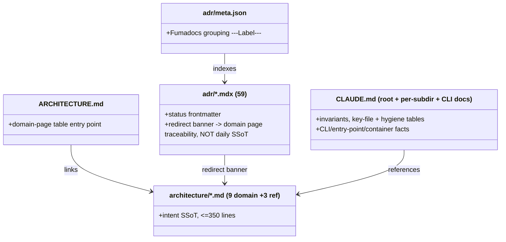
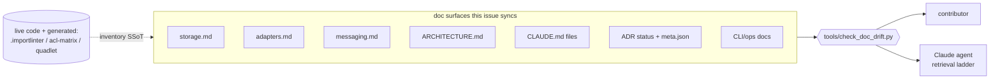

## Context

Source: [frame](../frames/1284-phase-7-adr-architecture-docs-cleanup-frame.mdx) (analysis skipped, F-lite).
Epic #1277 stage-axis refactor landed (Phases 1-6, #1278–#1283). The **ADR layer** kept pace
(ADR-073 axial decision + BlobStore/audio ADRs); the **narrative + inventory layer** (domain
pages, `ARCHITECTURE.md`, `CLAUDE.md`, `meta.json`, CLI docs) did not, plus late merges
(#1546 `BlobStorePort`, #1551/#1552 ingest, #1553 `PENDING_STORE_KEY` retirement, #1501 S7
`PlatformCallbacks` deletion, #1521/#1482 outbound-audio, #417 `auth.db`→`config.db` split)
post-date the docs.

A **7-agent code-verified drift audit** (BlobStore / inbound-outbound files / ADR archive /
CLAUDE.md+top-level / **CLI** / **adapter-structural** / **post-#1284 sibling-issue scan**)
enumerated every finding. This spec turns that matrix into binary, grep-verifiable fixes.

**New CI gate to satisfy:** `tools/check_doc_drift.py` (#1531/#1538) scans `src/lyra/adapters/CLAUDE.md`
(and others) — the PR must pass it.

## Goal

Sync `docs/architecture/*`, `docs/ARCHITECTURE.md`, `CLAUDE.md` files, `meta.json`, and CLI/ops
docs to the code as merged through #1553 — so no domain page, `accepted`/`amended` ADR, or
`CLAUDE.md` describes a deleted module, a pre-`BlobStorePort` shape, a pre-stage-extraction
adapter model, or a wrong CLI/DB/container fact.

## Users

- **Primary:** contributors (human + Claude agents) using `docs/architecture/` + `CLAUDE.md` as
  the architecture entry point (the `architecture-ssot-retrieval` intent SSoT).
- **Secondary:** future `/dev` work on storage / adapters / transport / CLI anchoring on narrative.

## Expected Behavior

A reader on any synced surface sees a description matching live code:
- `storage.md`: `BlobStorePort` driven-port + correct HTTP endpoints (`/healthz`, no dead `/exists`).
- `adapters.md` + `ARCHITECTURE.md`: the stage-axis adapter shape — `OutboundAdapterBase._make_emitter()`
  composing `lyra.outbound` stages (formatter/throttle/error_handler/emitter), and `lyra.inbound`
  `InboundPipeline` (parse→route→session→dispatch) — **not** `StreamingSession`/`PlatformCallbacks`.
- `messaging.md`: the 3-layer transport (`NatsTransport → WorkerPoolClient → DomainClient`).
- ADR archive: every ADR has `status:` frontmatter; ADR-052 reflects `_walk_registry` removal;
  ADR-083 `Accepted` + Update banner; `meta.json` indexes all 59 `.mdx`.
- Root `CLAUDE.md` + GETTING-STARTED: agents in `config.db`, `turn-writer` entry, 8 containers.

**Drift principle (throughout):** prefer **symbol references over line numbers** — stale line
refs are inventory that re-rots. Convert to symbol refs where cheap; do not chase every stale
number ("invariants, not inventory").

## Data Model & Consumers

| Consumer | Reads | When | Status |
|---|---|---|---|
| Contributor | domain pages, ARCHITECTURE.md, CLAUDE.md, GETTING-STARTED | onboarding, before /dev | this issue |
| Claude agent | same (intent SSoT, ladder step 4) | every task | this issue |
| `check_doc_drift.py` (CI) | scanned CLAUDE.md surfaces | every PR | gate |
| `meta.json` (Fumadocs) | ADR slugs | doc-site build | this issue |

## Breadboard

Affordances = doc surfaces touched; handler = edit; data = code SSoT verified against.

| ID | Surface | Edit | Verified against |
|----|---------|------|------------------|
| **A. BlobStore** ||||
| A1 | `storage.md` | `/health`→`/healthz`; delete `/blobs/{store_key}/exists` row; add ADR-082 to archive table; add `BlobStorePort`/`HttpBlobStoreAdapter`/`from_store_ref` paragraph | `blobstore/serve.py` (handler routes), `core/ports/blobstore.py`, ADR-082 |
| A2 | `CONFIGURATION.md` | "hub process" → "each adapter process (Telegram, Discord) + unified" for `init_blobstore()` | `standalone_telegram.py`, `standalone_discord.py`, `unified.py` |
| A3 | `adr/067` | remove `FsBlobStore.exists()` clause + `dedup: bool` from HTTP put() response | `blobstore/_handlers.py` (`handle_head`, `handle_put`) |
| A4 | `adr/082` | add note: `PENDING_STORE_KEY` retired #1553 → empty-key guard (`if not wire.store_key`) | `blobstore_adapter.py` (guard) |
| **B. Inbound/outbound files & audio** ||||
| B1 | `adr/083` | set frontmatter `status: accepted` + Update banner (S1–S2 landed #1551/#1552, S3–S7 retirement remain); strike "already done" STT consequence | `inbound/attachment_ingest.py`, `pipeline.py` (`_ingest_stage` conditional) |
| B2 | `adr/077` | `MaxAge 5m`→`24h`; KV TTL→`900s`; consumer `audio-delivery-v1`→`outbound-audio-{platform}-{bot_id}` | `outbound_audio/stream_setup.py` (`MAX_AGE_SECONDS`,`KV_TTL_SECONDS`), `audio_consumer_bootstrap.py` (`durable`) |
| B3 | `outbound/CLAUDE.md` + `nats/CLAUDE.md` | same MaxAge/consumer-name fixes; T7/T14 → "provisioned, see ADR-079" | same as B2 |
| B4 | `inbound/CLAUDE.md` | add `attachment_ingest(opt)` stage to pipeline diagram + subsection | `inbound/pipeline.py` (`_ingest_stage` conditional) |
| B5 | `messaging.md` | add `lyra.outbound.audio.<platform>.<bot_id>` subject row + audio-delivery plane row | ADR-077/079, `stream_setup.py` |
| B6 | `adapters.md` | rewrite ADR-013 temp-file section (immediate read+unlink, `PendingAttachment` closure, no `STTService`); reply_message_id "status unclear"→implemented; convert stale line refs to symbol refs | `telegram_inbound.py`, `*_outbound.py` |
| **C. ADR archive** ||||
| C1 | `adr/073,080,081,082` | add `status: accepted` frontmatter key (matching body). NOTE: ADR-083 status handled in **B1** (set `accepted`, not body's `Proposed`) | ADR bodies |
| C2 | `adr/052` | `accepted`→`amended`; note `_walk_registry` **absorbed into `WorkerPoolClient` (#1278)** (method `request_with_routing`, not `request`) | `transport/worker_pool_client.py` |
| C3 | `adr/meta.json` | add entries: **072**→LLM/Streaming, **075**+**078**→Storage, **083**→Adapters (or new `---Inbound---`) | adr dir listing |
| **D. CLAUDE.md hygiene + deleted-module refs** ||||
| D1 | root `CLAUDE.md` | add hygiene rows: `src/lyra/agent_cmd/bots/CLAUDE.md`, `packages/roxabi-blobs/CLAUDE.md` | concrete paths (both exist) |
| D2 | `ARCHITECTURE.md` | replace deleted refs **(full row incl. description)**: `_shared_streaming_emitter.py`→`lyra.outbound.emitter.OutboundEmitter`; `nats_driver.py`/`cli_nats.py`→`LlmClient`+`WorkerPoolClient`; `clipool_standalone.py`→`worker_standalone.py` | `src/lyra/` tree |
| **E. Stage-axis structural narrative** ||||
| E1 | `ARCHITECTURE.md` §Adapter Streaming Pattern | rewrite: `OutboundAdapterBase._make_emitter()` composes `OutboundFormatter`+`ThrottleCapability`+`OutboundErrorHandler`; drop `StreamingSession`/`PlatformCallbacks` callback model | `adapters/shared/_base_outbound.py`, `lyra/outbound/` |
| E2 | `ARCHITECTURE.md` §Module Layout | add `lyra/outbound/` + `lyra/inbound/` rows; add `telegram_formatter.py`/`discord_formatter.py`; note `*_outbound.py` now thin | `src/lyra/outbound/`, `src/lyra/inbound/`, adapter dirs |
| E3 | `ARCHITECTURE.md` §Inbound Message Pipeline | clarify two pipelines: adapter-side `lyra.inbound.InboundPipeline` (pre-NATS) vs hub-side middleware chain (post-NATS) | `inbound/pipeline.py`, `core/hub/middleware/` |
| E4 | `adapters.md` | add "Outbound stage composition" + "Inbound stage pipeline" sections (ref ADR-073, #1279/#1280); update Scope paragraph; remove any stale `PlatformCallbacks`/`_make_streaming_callbacks` (deleted #1501) | `lyra/outbound/`, `lyra/inbound/`, `adapters/CLAUDE.md` |
| E5 | `messaging.md` | add "Transport layer" section: 3-layer `NatsTransport → WorkerPoolClient → DomainClient`, `HttpTransport` (P4 skeleton), `Result[T]`/`SanitizedError` contract (**issue deliverable #2**) | `src/lyra/transport/`, `transport/CLAUDE.md` |
| **F. CLI / ops doc sync** ||||
| F1 | root `CLAUDE.md` | `A := ~/.lyra/auth.db` → `config.db` for agent/bot config (auth.db = grants only, #417) | `cli_agent.py` (`_get_db_path`), `bootstrap_stores.py` |
| F2 | `agent_cmd/CLAUDE.md` | AgentStore `auth.db`→`config.db` (2 sites: subdirs table + invariants) | `agent_store_factory.py` |
| F3 | root `CLAUDE.md` | Production entry-points table: add `turn-writer` → `_bootstrap_turn_writer_standalone()`; "Six containers"→"Eight" (+`lyra-blobstore`,`lyra-turn-writer`) | `cli.py`, `deploy/quadlet/*.container` |
| F4 | `GETTING-STARTED.md` | "five units"→eight; add `lyra-blobstore`,`lyra-turn-writer` | `deploy/quadlet/` |
| F5 | `bot-management.md` | `lyra bot list` → `lyra agent telegram list` / `lyra agent discord list` | `agent_cmd/bots/`, platform CLIs |
| F6 | `ops/nkey-rotation.md` | `lyra ops verify` "planned/TODO" → implemented | `cli_ops.py` (`verify`) |

## Slices

Each slice = a coherent surface, independently shippable + grep-verifiable. Order independent;
recommended order front-loads high-value/low-risk.

| # | Slice | Affordances | Demo / verify |
|---|-------|-------------|---------------|
| S1 | BlobStore sync | A1–A4 | no `/health\b` in storage.md; `/exists` row gone; ADR-082 in table |
| S2 | Inbound/outbound file & audio | B1–B6 | no `5m`/`audio-delivery-v1` in adr/077; `lyra.outbound.audio` in messaging.md; ingest stage in inbound/CLAUDE.md |
| S3 | ADR archive hygiene | C1–C3 | all 59 `.mdx` have `status:`; ADR-052 `amended`; meta.json indexes all 59 |
| S4 | CLAUDE.md hygiene + deleted refs | D1–D2 | deleted symbols absent from ARCHITECTURE.md; both CLAUDE.md rows present |
| S5 | Stage-axis structural narrative | E1–E5 | ARCHITECTURE.md/adapters.md describe `_make_emitter`+stages; messaging.md has `WorkerPoolClient`+`NatsTransport`; no `PlatformCallbacks` |
| S6 | CLI / ops doc sync | F1–F6 | root CLAUDE.md: `config.db`, `turn-writer`, "Eight containers"; no `lyra bot list` |

## Success Criteria

- [ ] `grep -rn '_shared_streaming_emitter\|nats_driver\.py\|cli_nats\.py\|clipool_standalone\|PlatformCallbacks' docs/ARCHITECTURE.md docs/architecture/adapters.md` returns **0** (D2/E1/E4)
- [ ] No `status: accepted`/`amended` ADR references a deleted module: `grep -rln 'nats_driver\|cli_nats\|clipool_standalone\|_shared_streaming_emitter\|_worker_client_base' docs/architecture/adr/*.mdx` yields only `status: superseded` files (issue SC1)
- [ ] Every `docs/architecture/adr/*.mdx` has a `status:` frontmatter key (`grep -L '^status:' adr/*.mdx` empty) (C1/B1)
- [ ] ADR-052 frontmatter `status: amended`; body notes `_walk_registry` absorbed into `WorkerPoolClient` #1278 (C2)
- [ ] ADR-083 frontmatter `status: accepted` + Update banner listing landed (#1551/#1552) and remaining retirement sub-tasks (B1)
- [ ] Every `adr/*.mdx` filename slug appears in `meta.json` `pages` (no missing 072/075/078/083) — verified by set-difference, **not** raw count (C3)
- [ ] `storage.md`: no `/health` (only `/healthz`); no `/blobs/{store_key}/exists` row; ADR-082 in archive table; `BlobStorePort` paragraph present (A1)
- [ ] `messaging.md` contains `WorkerPoolClient`, `NatsTransport`, and a `lyra.outbound.audio.` subject entry (E5/B5) — **issue deliverable #2**
- [ ] `adapters.md` describes `OutboundAdapterBase._make_emitter` + `lyra.inbound.InboundPipeline`; no `PlatformCallbacks`/`_make_streaming_callbacks` (E4)
- [ ] `adr/077` + `outbound/CLAUDE.md` + `nats/CLAUDE.md`: no `5m` MaxAge, no `audio-delivery-v1` (B2/B3)
- [ ] `inbound/CLAUDE.md` pipeline shows the attachment-ingest stage (B4)
- [ ] root `CLAUDE.md`: agents/bots in `config.db` (not `auth.db`); `turn-writer` entry-point row; "Eight containers" incl. `lyra-blobstore`+`lyra-turn-writer`; hygiene rows for `agent_cmd/bots` + `roxabi-blobs` (D1/F1/F3)
- [ ] `GETTING-STARTED.md` lists eight units; `bot-management.md` has no `lyra bot list`; `nkey-rotation.md` `lyra ops verify` not "planned" (F4/F5/F6)
- [ ] `uv run python tools/check_doc_drift.py` passes (new CI gate) and `uv run pre-commit run --all-files` passes (docs-only; no code gate regresses)

## Out of Scope

- Recreating ADR-073 / BlobStore ADRs (already exist).
- Domain-page consolidation (9 domain + 3 reference pages = compliant; no merge needed).
- Code changes; cross-repo (voiceCLI/imageCLI) doc sync.
- Already-done surfaces (do NOT redo): `bot-management.md` (#1419), `adapters/CLAUDE.md` +
  `outbound/CLAUDE.md` S7a (#1508), ADR-082 already in meta.json (#1540).
- **Full ADR supersession pass:** beyond ADR-052, no `accepted` ADR with per-client-wiring
  content references deleted code (per-client/port ADRs describe still-live transport
  contracts). Marking additional ADRs `superseded` is out of scope pending a separate audit.
- Exhaustive stale-line-number chasing in ADR bodies (fix only where a claim is *false*).
