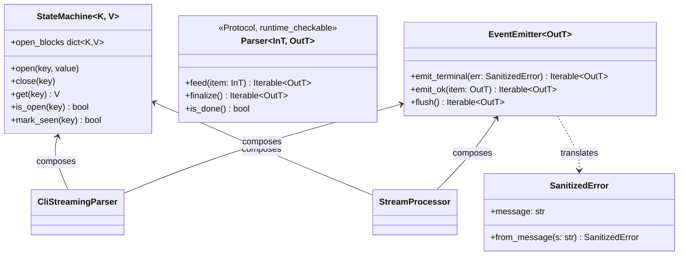
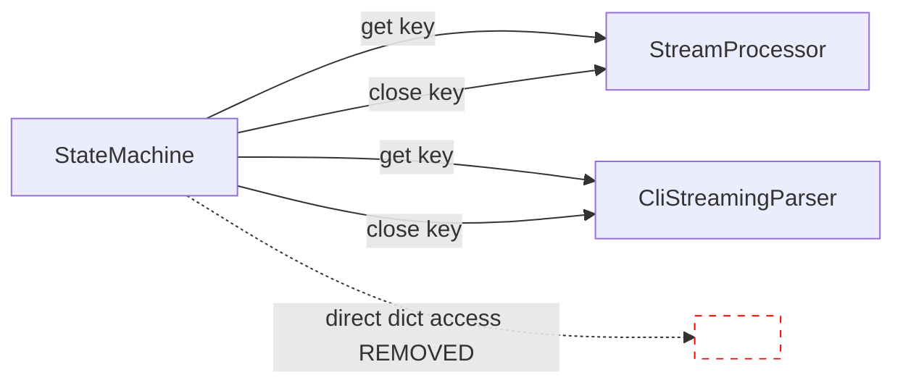

## Context

Promoted from `artifacts/frames/1321-phase-5-iter-2-followups-frame.mdx`. PR #1317 (Phase 5 streaming primitives, closes #1282) merged with `Approve with comments`; iter-2 `/code-review` surfaced 14 sub-blocking advisory findings. All findings are intra-subsystem cleanup along the stage axis ratified in ADR-073 — no decomposition-axis impact. The 4 design items (#6, #8, #9, #10) reviewed by `dev-core:architect` produced 2 overrides on the initial proposal; final decisions are locked in `## Locked Decisions` below.

## Goal

Land all 14 follow-ups so that the streaming subsystem matches what `/code-review` iter-2 flagged: no stale issue refs in exemptions, no direct dict access bypassing `StateMachine` accessors, no untested truncation/exception/shallow-copy paths, no docstring/import drift, and 4 explicitly-resolved design decisions.

## Users

- **Primary:** developers maintaining `src/lyra/streaming/`, `src/lyra/transport/`, `src/lyra/core/processors/`, `src/lyra/core/cli/`.
- **Secondary:** future contributors adding new stream sources (NATS-stream, SSE) who rely on the `Parser` Protocol contract and `StateMachine` API being honest.

## Expected Behavior

After landing:
- `grep -n "#1102" tools/file_exemptions.txt` returns no matches (stale ref to closed issue removed).
- `grep -rn "open_blocks\[" src/lyra/core/processors/stream_processor.py src/lyra/core/cli/cli_streaming_parser.py` returns no direct subscript access — all reads go through `StateMachine.get(key)` and all closes through `StateMachine.close(key)`.
- `uv run pytest tests/transport/test_result_types.py::TestSanitizedErrorFromMessage` passes 4 cases (empty-fallback, ctrl-char strip, 200-char truncate, happy path).
- `uv run pytest tests/core/test_cli_streaming_parse.py -k mutation_isolation` passes (F7 shallow-copy contract is falsifiable).
- `uv run pytest tests/streaming/test_event_emitter.py` no longer imports `SanitizedError` from private `lyra.transport._result`; uses the public `lyra.transport` re-export.
- `_close_open_blocks` on truncation/exception paths yields orphan `ToolCallEndRenderEvent`s for any open tool block (symmetry with the `_handle_result` path).
- `Parser` Protocol in `src/lyra/streaming/parser.py` carries an explanatory comment that variance is enforced by static analysis (mypy/pyright), not by `isinstance` — the variance declarations are kept.
- `transport/CLAUDE.md` mentions `SanitizedError.from_message` as a Phase 1 addendum landed in Phase 5 (#1282).
- `StreamProcessor.process()` docstring states that the local `EventEmitter` uses only `emit_terminal`; `flush`/`emit_ok` are intentionally unused.

## Locked Decisions

Captured after architect review (see `## Context`):

| # | Item | Decision | Rationale |
|---|------|----------|-----------|
| #6 | `SanitizedError.from_message` scope | **Apply + document** | Architecturally correct security boundary; just needs a Phase 1 addendum note in `src/lyra/transport/CLAUDE.md`. |
| #8 | `Parser` Protocol variance | **Keep variance + document** (override of original "revert to invariant") | Variance IS enforced by mypy/pyright at static-analysis time; `@runtime_checkable` is shape-only by design (per streaming/CLAUDE.md §Protocol is structural). Reverting would lose a real static guarantee. |
| #9 | `_close_open_blocks` truncation symmetry | **Apply, gated on #3 landing first** | Adding `yield from self._synth_orphan_tool_ends()` is correct only after the sanctioned `StateMachine.close(key)` replaces the direct `open_blocks.clear()` in `_synth_orphan_tool_ends` — otherwise the API-bypass propagates into more callsites. Implementation must sequence #3 → #9. |
| #10 | `EventEmitter` unused surface | **Document, no extraction** (refined: docstring-only) | The inline comment at `stream_processor.py:236` already exists; only the `process()` docstring needs to surface the intent. F-lite scope rejects `TerminalTranslator` helper extraction. |

## Data Model & Consumers

This is a cleanup PR with no new types or consumers. The existing data shape is preserved.

**API hygiene contract (this issue):** all reads of `StateMachine.open_blocks` go through `get(key)` (new accessor); all closes go through `close(key)`. Direct subscript and `.clear()` calls are removed from `_synth_orphan_tool_ends` and `_handle_content_block_delta`.

## Breadboard

| ID | Affordance | Handler / Target | Data flow |
|----|------------|------------------|-----------|
| **C1** | `tools/file_exemptions.txt` lines 10 + 13 | text edit | drop "(cleanup in Slice 5 / #1102)" clause (closed issue) |
| **C2** | `src/lyra/transport/CLAUDE.md` | doc edit | add `## from_message addendum (Phase 5 #1282)` paragraph |
| **C3** | `src/lyra/core/cli/cli_streaming_parser.py:107` docstring | doc edit | qualify "finalize/is_done" claim per streaming/CLAUDE.md §Protocol is structural |
| **C4** | `src/lyra/core/cli/cli_streaming_parser.py:376` + `core/processors/stream_processor.py:447` | doc edit | document `_handle_result` name collision (intentional, different signatures) in respective docstrings |
| **C5** | `tests/streaming/test_event_emitter.py:13` | code edit | import `SanitizedError` from `lyra.transport` (public) instead of `lyra.transport._result` |
| **C6** | `tests/streaming/test_event_emitter.py:189` | code edit | strengthen `test_terminal_before_flush_breaks_ordering` assertion to guard against deleting `emit_ok`'s `_pending.append` |
| **A1** | `src/lyra/streaming/state_machine.py` | code addition | add `StateMachine.get(key) -> V \| None` accessor |
| **A2** | `src/lyra/core/processors/stream_processor.py:538` (`_synth_orphan_tool_ends`) | code edit | replace `self._sm_tool.open_blocks.clear()` with `for tid in sorted(...): yield ToolCallEndRenderEvent(tid); self._sm_tool.close(tid)` |
| **A3** | `src/lyra/core/cli/cli_streaming_parser.py:328` (`_handle_content_block_delta`) | code edit | replace `self._sm_tool_blocks.open_blocks[idx]` with `self._sm_tool_blocks.get(idx)` |
| **A4** | `src/lyra/core/processors/stream_processor.py:499` (`_close_open_blocks`) | code edit | add `yield from self._synth_orphan_tool_ends()` after `_close_open_blocks` truncation path; **must land after A2** |
| **V1** | `src/lyra/streaming/parser.py:15` | doc edit | add 1-line comment on `InT`/`OutT`: "variance enforced by static analysis (mypy/pyright); `@runtime_checkable` is shape-only" |
| **T1** | `tests/transport/test_result_types.py` (new) | new test class | `TestSanitizedErrorFromMessage` × 4 cases |
| **T2** | `tests/core/test_cli_streaming_parse.py` | new test | mutation-then-reread test for `_open_tool_blocks` shallow-copy isolation (F7 contract) |
| **T3** | `tests/core/test_stream_processor.py` or matching | new test | `test_text_end_on_truncated_stream` in `TestTextTriplet` (mirror of existing reasoning test) |
| **T4** | `tests/core/test_stream_processor.py` | new test | `_close_open_blocks` truncation/exception paths now emit orphan `ToolCallEndRenderEvent` (regression guard for A4) |
| **D1** | `src/lyra/core/processors/stream_processor.py` `process()` docstring | doc edit | note that local `EventEmitter` uses only `emit_terminal`; `flush`/`emit_ok` intentionally unused |

## Slices

| Slice | Title | Items | Files | Risk |
|-------|-------|-------|-------|------|
| **S1** | Stale-doc + import + docstring batch | C1, C2, C3, C4, C5, C6 | `tools/file_exemptions.txt`, `transport/CLAUDE.md`, `cli_streaming_parser.py` (docstrings), `test_event_emitter.py` | Trivial — text + import edits. Pre-commit catches lint. |
| **S2** | StateMachine API hygiene | A1, A2, A3 | `streaming/state_machine.py`, `stream_processor.py`, `cli_streaming_parser.py` | Low. New accessor is additive; callsite swaps preserve semantics. **Pre-condition for S3.** |
| **S3** | Truncation/exception symmetry + variance doc + dead-surface doc | A4, V1, D1 | `stream_processor.py`, `parser.py` | Low (A4 depends on A2). |
| **S4** | Test coverage batch | T1, T2, T3, T4 | new + edits under `tests/` | Low. Pure additions. T4 verifies S3.A4. |

Each slice is independently demo-able under `uv run pytest`. S2 must land before S3 because A4 depends on A2's behavior change.

## Success Criteria

- [ ] `grep -n "#1102" tools/file_exemptions.txt` returns 0 matches.
- [ ] `src/lyra/transport/CLAUDE.md` contains a paragraph documenting `SanitizedError.from_message` as a Phase 5 addendum.
- [ ] `src/lyra/streaming/state_machine.py` exports `get(key) -> V | None`.
- [ ] `grep -rn "open_blocks\[" src/lyra/core/processors/stream_processor.py src/lyra/core/cli/cli_streaming_parser.py` returns 0 matches outside of test files.
- [ ] `grep -rn "\.open_blocks\.clear()" src/lyra/` returns 0 matches outside of `state_machine.py` itself.
- [ ] `src/lyra/streaming/parser.py` carries an inline comment explaining the variance-vs-runtime-check split.
- [ ] `tests/streaming/test_event_emitter.py` imports `SanitizedError` from `lyra.transport`, not `lyra.transport._result`.
- [ ] `tests/streaming/test_event_emitter.py::test_terminal_before_flush_breaks_ordering` asserts more than `result[0]` (guard against deleting `emit_ok`'s `_pending.append`).
- [ ] `tests/transport/test_result_types.py::TestSanitizedErrorFromMessage` exists with ≥4 cases and passes.
- [ ] `tests/core/test_cli_streaming_parse.py` contains a mutation-then-reread test for the F7 shallow-copy contract and passes.
- [ ] `tests/core/test_stream_processor.py` contains `test_text_end_on_truncated_stream` (mirror of existing reasoning test) and passes.
- [ ] `tests/core/test_stream_processor.py` contains a regression test asserting orphan `ToolCallEndRenderEvent` is yielded on truncation AND exception paths and passes.
- [ ] `StreamProcessor.process()` docstring documents the intentional `flush`/`emit_ok` non-use.
- [ ] `_handle_result` name-collision is documented in both `cli_streaming_parser.py` and `stream_processor.py` docstrings.
- [ ] `cli_streaming_parser.py:107` docstring's `finalize`/`is_done` claim is qualified per the streaming Protocol-is-structural rule.
- [ ] `uv run pytest`, `uv run ruff check`, `uv run pyright`, `tools/check_file_length.sh`, and `import-linter` all green.

## Out of Scope

- Refactor of `EventEmitter` itself to narrow the `flush`/`emit_ok` surface — out of F-lite scope; the inline doc is the agreed mitigation.
- Adding `feed`/`finalize`/`is_done` aliases to `CliStreamingParser`/`StreamProcessor` to satisfy `isinstance(x, Parser)` at runtime — tracked under the streaming CLAUDE.md follow-up; will land when a new stream source needs it.
- Extracting a `TerminalTranslator` helper from `StreamProcessor.process()` — bigger refactor; deferred.
- Verified-false iter-2 claims: `mark_seen` inversion and `_close_open_blocks` pre-existing tool-synthesis behavior (the latter is overlapped with #9 and resolved by A4).
- F8 transport→nats layering — tracked separately in #1319.
