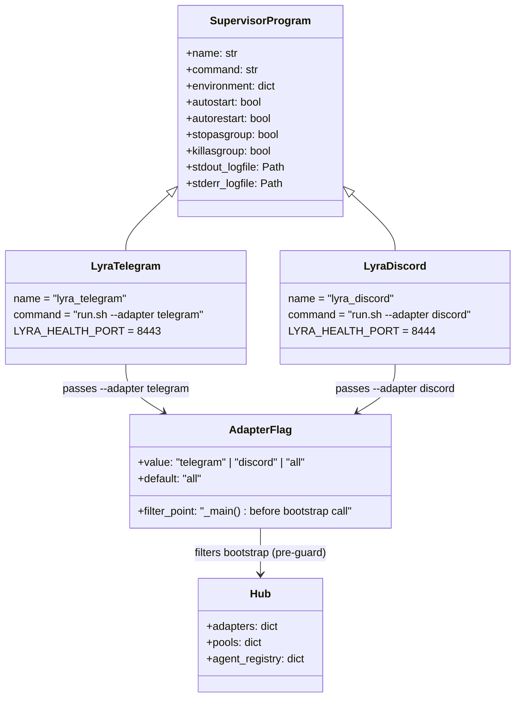
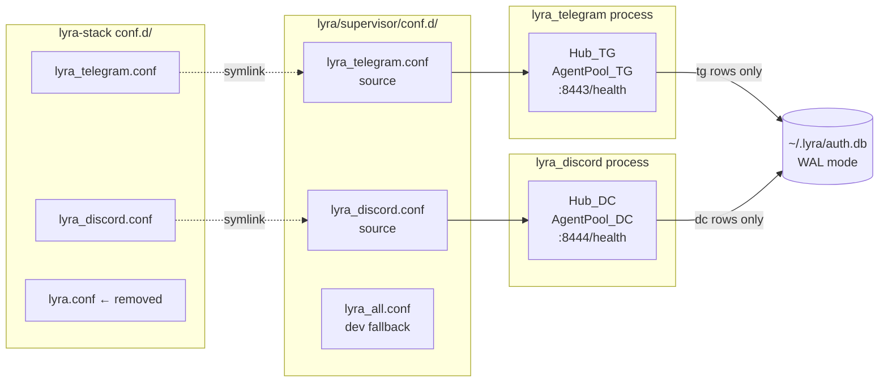

## Context

- **Analysis:** `artifacts/analyses/133-split-lyra-adapters-analysis.mdx`
- **Frame:** `artifacts/frames/133-split-lyra-adapters-frame.mdx`
- **Shape selected:** Shape 1 — `--adapter` flag on `__main__.py` (hub-per-adapter, no IPC)
- **Appetite:** 1-week cycle
- **Related ADR:** `docs/architecture/adr/021-hub-per-adapter.mdx` (created in S4)

## Goal

Split `python -m lyra` into independently-restartable `lyra_telegram` and `lyra_discord`
supervisor processes, each embedding its own Hub + agent pool, so that restarting one adapter
does not interrupt the other.

## Users

- **Mickael (operator):** restarts individual adapters on config change, library update, or
  transient failure without interrupting unrelated conversations.
- **Lyra users:** reduced downtime scope — only the affected channel goes offline briefly;
  other channels remain live.

## Expected Behavior

### Operator workflow — daily operations

The operator runs `make telegram reload` from `~/projects/lyra` or `~/projects/lyra-stack`.
Supervisord restarts the `lyra_telegram` process only. The `lyra_discord` process continues
serving Discord users unaffected. Telegram users experience a brief outage (~5 s restart),
then service resumes normally.

`make telegram logs` tails `supervisor/logs/lyra_telegram.log`. `make telegram status` shows
the process uptime. All targets mirror the existing `make lyra [cmd]` pattern.

### Startup — `--adapter` flag behavior

```
python -m lyra                     # starts both adapters (default: all)
python -m lyra --adapter telegram  # starts Hub + TelegramAdapters + AgentPool(tg only)
python -m lyra --adapter discord   # starts Hub + DiscordAdapters + AgentPool(dc only)
python -m lyra --adapter all       # explicit: same as no flag
```

**Filter placement:** filtering occurs in `_main()` before calling `_bootstrap_multibot()` /
`_bootstrap_legacy()`, so that the empty-adapter guard (`if not tg_bot_auths and not dc_bot_auths`
at line 462 of `__main__.py`) is evaluated against the post-filter state, not the pre-filter
state. Filtering inside the bootstrap function after the guard would cause the process to
false-exit with "no adapters configured" on every single-adapter invocation.

**`_bootstrap_legacy` path:** filtering must skip `AuthMiddleware.from_config()` for the
excluded platform (lines 720–726), not just `load_*_config()`. Constructing an unused
`AuthMiddleware` may `sys.exit()` if the excluded platform's env vars are absent.

Each process initializes its own Hub, AuthStore, PairingManager, and agent pool. SQLite
`~/.lyra/auth.db` is shared in WAL mode; write paths are adapter-isolated (Telegram process
only writes Telegram auth rows, Discord process writes Discord rows) — no contention.

Each process binds its own health port — set via supervisor conf `environment=` line (not
only in `.env`, since `.env` is sourced after supervisord evaluates `startsecs`):
- `lyra_telegram` → `LYRA_HEALTH_PORT=8443`
- `lyra_discord` → `LYRA_HEALTH_PORT=8444`

### Supervisor conf — reference block

Both new confs derive from the existing `lyra.conf` pattern exactly. The `command=` must use
the full supervisord variable path and append the `--adapter` flag:

```ini
[program:lyra_telegram]
command=%(ENV_HOME)s/projects/lyra/supervisor/scripts/run.sh --adapter telegram
directory=%(ENV_HOME)s/projects/lyra
environment=HOME="%(ENV_HOME)s",PATH="%(ENV_HOME)s/.local/bin:%(ENV_HOME)s/projects/lyra/.venv/bin:%(ENV_PATH)s",LYRA_HEALTH_PORT="8443"
autostart=true
autorestart=true
startsecs=5
startretries=3
stopwaitsecs=10
stopasgroup=true
killasgroup=true
stdout_logfile=%(ENV_HOME)s/projects/lyra/supervisor/logs/lyra_telegram.log
stdout_logfile_maxbytes=10MB
stdout_logfile_backups=3
stderr_logfile=%(ENV_HOME)s/projects/lyra/supervisor/logs/lyra_telegram_error.log
stderr_logfile_maxbytes=5MB
stderr_logfile_backups=3
```

`lyra_discord.conf` is identical with `lyra_telegram` → `lyra_discord` and port `8444`.

The `environment=` line **appends** `LYRA_HEALTH_PORT` to the existing `HOME`/`PATH` values.
Dropping `HOME` or `PATH` from this line will break Python startup silently.

### `run.sh` arg forwarding

Change the final exec line from:
```bash
exec "$HOME/projects/lyra/.venv/bin/python" -m lyra
```
to:
```bash
exec "$HOME/projects/lyra/.venv/bin/python" -m lyra "$@"
```

This change and the `--adapter` flag in the `command=` line of each new conf are one atomic
step — one without the other silently runs `--adapter all` in production.

### `lyra.conf` retirement

`supervisor/conf.d/lyra.conf` in the source repo is **renamed** to `lyra_all.conf` (kept as
a dev-mode convenience, not registered in production). The `lyra-stack/conf.d/lyra.conf`
symlink is removed by `make register`.

### `make register` target update

```makefile
register:
    # ... existing lyra-stack existence check ...
    @mkdir -p "$(LYRA_STACK_DIR)/conf.d"
    @ln -sf "$(abspath supervisor/conf.d/lyra_telegram.conf)" "$(LYRA_STACK_DIR)/conf.d/lyra_telegram.conf"
    @ln -sf "$(abspath supervisor/conf.d/lyra_discord.conf)"  "$(LYRA_STACK_DIR)/conf.d/lyra_discord.conf"
    @if [ -L "$(LYRA_STACK_DIR)/conf.d/lyra.conf" ]; then rm "$(LYRA_STACK_DIR)/conf.d/lyra.conf"; fi
    @mkdir -p supervisor/logs
    # ... existing supervisorctl reread/update ...
```

The stale-symlink removal uses `-L` (symlink test) not `-f` (file test) to avoid silently
deleting a real file in case of misconfiguration. Running `make register` twice is safe
(`ln -sf` is idempotent; the `[ -L ]` removal is a no-op on the second run).

### `make remote` target

`make remote <cmd>` SSHes to Machine 1 and runs `make lyra <cmd>`. After this split, the
`lyra` supervisor program no longer exists on Machine 1. Generalizing `make remote` to
support `make remote telegram reload` is **out of scope** for this issue. For production
operations post-migration, operators SSH directly and use `make telegram reload` on Machine 1.

### Fresh machine registration

`make register` creates symlinks for both `lyra_telegram.conf` and `lyra_discord.conf` in
`lyra-stack/conf.d/`, and removes the stale `lyra.conf` symlink if it is a symlink. A new
machine clone running `make register` correctly registers both processes.

### Production voice daemons (parallel slice — S5)

VoiceCLI is cloned at `~/projects/voiceCLI` on Machine 1. Its `make register` creates
symlinks for `voicecli_tts.conf` and `voicecli_stt.conf` in `lyra-stack/conf.d/`. Before
starting, the provision script checks that Machine 1's `.env` file (searched by `run_tts.sh`
/ `run_stt.sh`) does not contain `WSL_INTEROP`, `WSL_DISTRO_NAME`, or `WSLENV` as literal
key names. These vars are shell-session vars on WSL2 and would not normally appear in `.env`,
but a copy-paste from a dev machine could introduce them.

---

## Data Model & Consumers





| Consumer | Resource consumed | When | Status |
|----------|-----------------|------|--------|
| `lyra_telegram` process | `lyra_telegram.conf`, `:8443/health` | startup / monitoring | this issue |
| `lyra_discord` process | `lyra_discord.conf`, `:8444/health` | startup / monitoring | this issue |
| `make telegram/discord [cmd]` | supervisorctl via lyra + lyra-stack | operator | this issue |
| `make register` | both new .conf symlinks, stale removal | machine setup | this issue |
| ADR-021 consumers | hub-per-adapter trade-off documentation | future decisions | this issue |
| Future cross-platform feature | shared backing store or IPC | future | out of scope (Option B) |

---

## Breadboard

### Affordances

| ID | Affordance | Handler | Data in | Data out |
|----|-----------|---------|---------|---------|
| U1 | `python -m lyra --adapter telegram` | `_main()` → argparse → filter in `_main()` → `_bootstrap_multibot(tg_only)` | `--adapter telegram` | Hub + TG adapters started; DC adapters not started |
| U2 | `python -m lyra --adapter discord` | `_main()` → argparse → filter → `_bootstrap_multibot(dc_only)` | `--adapter discord` | Hub + DC adapters started; TG adapters not started |
| U3 | `python -m lyra` (no flag) | `_main()` → argparse (default=all) | none | all adapters started (compat) |
| U4 | `make telegram reload` (lyra dir) | lyra Makefile `telegram` target → supervisorctl | none | lyra_telegram restarted; lyra_discord untouched |
| U5 | `make discord reload` (lyra dir) | lyra Makefile `discord` target → supervisorctl | none | lyra_discord restarted; lyra_telegram untouched |
| U6 | `make telegram logs` | lyra Makefile → supervisorctl tail | none | lyra_telegram stdout streamed |
| U7 | `make discord status` | lyra Makefile → supervisorctl status | none | lyra_discord status shown |
| U8 | `make telegram reload` (lyra-stack dir) | lyra-stack Makefile filter (telegram added) → supervisorctl | none | same as U4 |
| U9 | `make discord reload` (lyra-stack dir) | lyra-stack Makefile filter (discord added) → supervisorctl | none | same as U5 |
| U10 | `make register` | lyra Makefile → `ln -sf` × 2 + conditional `rm` | none | both confs symlinked; stale lyra.conf symlink removed |
| N1 | `GET :8443/health` | lyra_telegram FastAPI health app | Bearer token (optional) | `{"ok": true, ...}` HTTP 200 |
| N2 | `GET :8444/health` | lyra_discord FastAPI health app | Bearer token (optional) | `{"ok": true, ...}` HTTP 200 |

### Wiring

```
U4 make telegram reload
  → supervisorctl restart lyra_telegram
    → lyra_telegram.conf:
        command=%(ENV_HOME)s/.../run.sh --adapter telegram
        environment=...LYRA_HEALTH_PORT="8443"
      → run.sh: exec python -m lyra --adapter telegram     ← $@ forwarding
        → _main(): argparse → adapter_filter="telegram"
          → dc_bot_auths filtered to [] before _bootstrap_multibot() call
            → guard check: tg_bot_auths non-empty → proceeds
              → Hub + TelegramAdapter(s) + AgentPool started
              → LYRA_HEALTH_PORT=8443 → FastAPI binds :8443 (N1)

U5 make discord reload  [symmetric: tg_bot_auths=[], dc_bot_auths kept, port 8444]

U10 make register
  → ln -sf lyra_telegram.conf → lyra-stack/conf.d/lyra_telegram.conf
  → ln -sf lyra_discord.conf  → lyra-stack/conf.d/lyra_discord.conf
  → [ -L lyra-stack/conf.d/lyra.conf ] && rm lyra-stack/conf.d/lyra.conf
  → supervisorctl reread && supervisorctl update
```

---

## Slices

| # | Slice | Affordances | Independently demo-able |
|---|-------|-------------|------------------------|
| S1 | `--adapter` flag in `__main__.py` (multibot + legacy paths) | U1, U2, U3 | Yes — `python -m lyra --adapter telegram` locally; verify Discord adapter absent from logs |
| S2 | `run.sh` forwarding + new supervisor confs + `register` update | U4–U7, U10, N1, N2 | Yes — `make telegram reload` and `make discord reload` work independently |
| S3 | Makefile targets in lyra + lyra-stack (filter + targets + `.PHONY`) | U4–U9 | Yes — `make telegram reload` from lyra-stack dir works |
| S4 | ADR-021 — hub-per-adapter model + cross-platform trade-off | — | Yes — document exists at named path |
| S5 | Production voiceCLI provisioning on Machine 1 (parallel) | — | Yes — `supervisorctl status` on Machine 1 shows voicecli_tts + voicecli_stt |

---

## Success Criteria

### Adapter flag — `__main__.py` (S1)
- [ ] `python -m lyra --adapter telegram` starts only Telegram adapters; no Discord adapter, dispatcher, or task is started (verified via startup log: no "Registered Discord bot" line)
- [ ] `python -m lyra --adapter discord` starts only Discord adapters; no Telegram adapter is started (verified via startup log: no "Registered Telegram bot" line)
- [ ] `python -m lyra` (no flag) starts all adapters identically to the current behavior
- [ ] `python -m lyra --adapter all` is equivalent to no flag
- [ ] Unknown `--adapter` value exits immediately with a clear argparse error message
- [ ] `_bootstrap_legacy` path: `--adapter telegram` skips both `AuthMiddleware.from_config()` and `load_discord_config()` for Discord (verified: no Discord token read in logs; no sys.exit if Discord env vars are absent)
- [ ] Filtering occurs in `_main()` before `_bootstrap_multibot()` / `_bootstrap_legacy()` is called, so the existing empty-adapter guard is evaluated against the post-filter state

### Supervisor programs — confs + `run.sh` (S2)
- [ ] `lyra_telegram` and `lyra_discord` appear as distinct programs in `supervisorctl status`
- [ ] `make telegram reload` restarts `lyra_telegram` only; `lyra_discord` status does not change
- [ ] `make discord reload` restarts `lyra_discord` only; `lyra_telegram` status does not change
- [ ] `make telegram logs` tails `lyra_telegram` stdout without error
- [ ] `make discord status` reports `lyra_discord` status without error
- [ ] `GET :8443/health` returns HTTP 200 with JSON body containing `"ok": true`
- [ ] `GET :8444/health` returns HTTP 200 with JSON body containing `"ok": true`
- [ ] `run.sh --adapter telegram` passed to supervisor results in only Telegram adapters running (verified by absence of Discord log lines at startup — confirms `$@` forwarding is active)

### Registration (S2)
- [ ] `make register` on a fresh machine creates symlinks for both `lyra_telegram.conf` and `lyra_discord.conf` in `lyra-stack/conf.d/`
- [ ] `make register` removes the stale `lyra.conf` symlink from `lyra-stack/conf.d/` only if it is a symlink (not a regular file)
- [ ] `make register` is idempotent — running it twice produces no errors and no duplicate symlinks

### Makefile global management (S3)
- [ ] `make telegram reload` from `~/projects/lyra-stack/` restarts `lyra_telegram`
- [ ] `make discord reload` from `~/projects/lyra-stack/` restarts `lyra_discord`
- [ ] `telegram` and `discord` are declared in `.PHONY` in lyra's Makefile
- [ ] `telegram` and `discord` are added to the lyra-stack Makefile service filter so `SVC_CMD` is correctly populated for both

### ADR (S4)
- [ ] ADR document exists at `docs/architecture/adr/021-hub-per-adapter.mdx`
- [ ] ADR documents the hub-per-adapter consequence: cross-platform in-process state sharing is permanently eliminated; future cross-platform features require a shared backing store or IPC (Option B)

### Independence guarantee
- [ ] Killing the `lyra_telegram` process (`kill -9`) does not cause the `lyra_discord` process to exit or change state (verified: `GET :8444/health` still returns 200 after the kill)
- [ ] Supervisord `autorestart=true` brings `lyra_telegram` back up independently; `GET :8443/health` returns 200 within 15 s of a simulated crash

### Production voice daemons (S5 — parallel)
- [ ] `voicecli_tts` and `voicecli_stt` appear in `supervisorctl status` on Machine 1
- [ ] `make tts reload` and `make stt reload` work from Machine 1's lyra-stack dir
- [ ] Machine 1's `.env` file (sourced by voiceCLI run scripts) contains none of: `WSL_INTEROP`, `WSL_DISTRO_NAME`, `WSLENV` as literal key names
