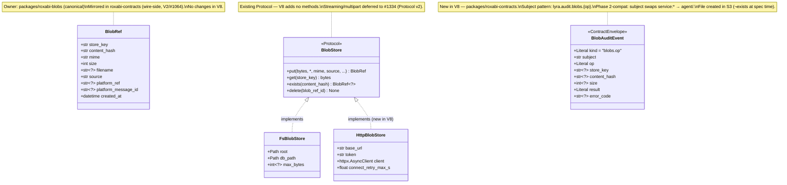
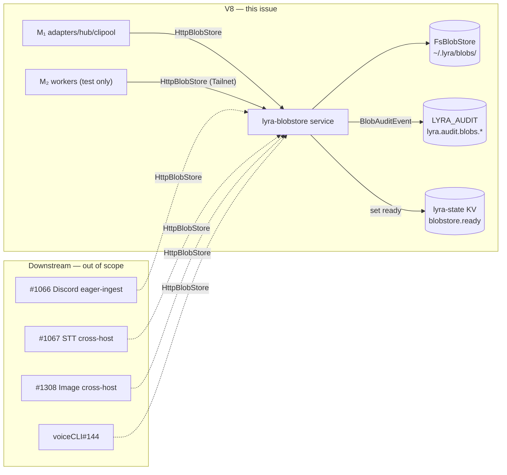

## Context

Promoted from `artifacts/analyses/1330-v8-http-fronted-blobstore-analysis.mdx` (Shape A — subcommand inside `ghcr.io/roxabi/lyra:staging-svc` image; three-strikes defers dedicated image until Protocol v2 + ≥3 cross-repo consumers).

Predecessors: `artifacts/frames/1330-v8-http-fronted-blobstore-frame.mdx` (approved 2026-05-25).
Architectural pre-decisions (load-bearing — do not re-litigate in this spec):
- ADR-067 §HTTP service deployment — port 8449, content dir `~/.lyra/blobs/`, HTTP API mapping to Protocol methods.
- ADR-067 §Wiring per process — only the `lyra-blobstore` process uses `FsBlobStore` directly; all other consumers (incl. M₁ adapters) use `HttpBlobStore`.
- ADR-067 §Auth plane Phase 1 — shared bearer token; Phase 2 (per-identity tokens, `blob_grants`) is roadmap, not in scope.
- ADR-067 §HTTP API — `store_key` is the opaque wire identifier across all routes (¬`blob_ref_id`, ¬`content_hash` exposed to callers).
- ADR-068 — ecosystem service plane (BlobAuditEvent on β-stream `LYRA_AUDIT`; α/β rule for write-vs-stream patterns).
- ADR-054 — Podman secrets via `type=mount`, rotation requires container restart.

### Module-placement rationale (Framing B — peer-of-adapters)

`axial-adr-review` (against ADR-073 stage-of-pipeline primary axis) flagged `src/lyra/blobstore/` placement as a 80%-confidence `target-axis-trap`, recommending move to `src/lyra/infrastructure/blobstore/`. **Decision: keep peer-of-adapters.** Rationale:

- `lyra-blobstore` is a **bootable process surface** (typer subcommand → uvicorn → FastAPI), structurally identical to `lyra.adapters.{telegram,discord,clipool}` — all four are Quadlet-deployed processes with their own lifecycles. `lyra.infrastructure.*` is where store-impl *code called by other code* lives (ADR-048: protocols → core, impls → infrastructure). The HTTP service IS a process, not a store impl consumed by other Lyra code in-process.
- ADR-073 axis-trap detection (sibling logic in adapters/telegram + adapters/discord) does not apply: there is exactly one HTTP service today.
- Three-strikes safeguard: if a 2nd or 3rd HTTP service lands later, the wrong-axis drift will surface and the refactor will be one-shot (move all three under a `lyra.services.*` or `lyra.infrastructure.services.*` parent then).
- Acknowledged residual axial finding: documented here so the next reviewer sees the explicit choice.

## Goal

Make `~/.lyra/blobs/` on M₁ reachable to any Protocol consumer (same-host or cross-host via Tailnet) through a single Quadlet-deployed FastAPI service that drop-in replaces `FsBlobStore` with `HttpBlobStore` at the consumer's bootstrap site.

## Users

- **Primary:** Lyra processes constructing a `BlobStore` Protocol instance — `lyra-hub`, `lyra-telegram`, `lyra-discord`, `lyra-clipool` on M₁, plus future cross-host workers (#1067 STT, #1308 Image, #1066 Discord eager-ingest) on M₂.
- **Secondary:** Ops (Mickael) — operates the Quadlet unit, rotates the bearer token, runs the backup drill, monitors `disk_used_pct` for the MinIO migration trigger (>70%).
- **Tertiary:** Roxabi sibling repos consuming `roxabi-blobs` (voiceCLI#144) — gain HTTP transport without code change.

## Expected Behavior

### Boot (M₁, by systemd `--user`)

1. `lyra-nats.service` is up.
2. `systemctl --user start lyra-blobstore.service` (or autoupdate-driven restart).
3. Container starts; `lyra blobstore serve` executes.
4. Process: load env (`blobstore.env`) → read bearer token once from `/run/secrets/lyra_blobstore_token` into memory → connect to NATS (`nats://lyra-nats:4222`) → `BlobAuditSink.provision(nc)` → publish `blobstore.ready=true` to `lyra-state` KV → FastAPI uvicorn starts on `:8449` → `/healthz` returns ok.
5. If NATS is unreachable at step 4: audit sink enters degraded mode (logs to `lyra.security`), `blobstore.ready` is not published — service still accepts HTTP traffic. Re-provision attempts are deferred to next process restart (no in-process reconnect loop — keeps the failure mode loud).

### Put (same-host caller — e.g. `lyra-telegram`)

1. Adapter constructs `HttpBlobStore(base_url="http://lyra-blobstore:8449", token=<from secret>)` once at bootstrap.
2. Adapter calls `await store.put(bytes, mime=..., source=..., ...)`.
3. Client sends `PUT /blobs` with `Authorization: Bearer <tok>` + `Content-Type: <mime>` + custom headers for `source`, `platform_ref`, `platform_message_id`, `filename`.
4. Server auth middleware validates → constant-time match → 200 path.
5. Handler reads body, calls `FsBlobStore.put(...)`, gets `BlobRef`.
6. Audit sink emits `BlobAuditEvent{kind:"blobs.op", op:"put", subject:"service:lyra-blobstore", store_key, content_hash, size, result:"ok"}` to `lyra.audit.blobs.put`.
7. Response: `200 OK` with JSON `BlobRef` body.

### Get (cross-host caller — M₂ worker)

1. Worker constructs `HttpBlobStore(base_url="http://roxabituwer.goose-logarithm.ts.net:8449", token=<from M₂ env>)`.
2. Worker calls `await store.get(store_key)`.
3. Client sends `GET /blobs/<url-encoded store_key>` over Tailnet.
4. Auth middleware validates → 200 path → handler calls `FsBlobStore.get()` → streams the response body.
5. Audit emit on `lyra.audit.blobs.get`.

### Failure modes

- Bearer mismatch: 401, audit `subject:"anonymous", result:"unauthorized"`.
- `BlobNotFoundError` (GET/HEAD/DELETE): 404, audit `result:"not_found"`.
- `BlobWriteError` (PUT/DELETE): 500, audit `result:"error", error_code:"blob-write"`. Static error message — no SQLite schema leak.
- `BlobConsistencyError`: 500, audit `result:"error", error_code:"blob-consistency"`.
- Path traversal on GET (`store_key` resolves outside root): 404 (per `FsBlobStore._safe_resolve_in_root`) — no oracle leak. Audit `result:"not_found"`.
- Body exceeds `max_bytes` (env-configurable per-service ceiling; defaults to `None` = unlimited): `FsBlobStore.put()` raises `BlobWriteError` → 500 with `error_code:"blob-write"`, audit `result:"error"`. **Decision deferred to S2 implementation:** whether to add a pre-read 413 enforcement at FastAPI layer (avoids loading the body into memory before rejection) or rely on `FsBlobStore` post-read rejection. The chosen approach must be documented in `src/lyra/blobstore/CLAUDE.md`.

### Rotation (ops, once per N months)

5-step runbook (analysis §Auth Phase 1 design). Container restart is the rotation point; same-host clients pick up the new token on their next process restart (operator coordinates).

### Backup (ops, daily cron)

3-step ordered procedure (analysis §Backup atomicity). Restore handles concurrent-`put()` orphan shards by discarding sha256 files with no matching `blob_refs` row — content-addressed orphans are always safe to drop.

## Data Model & Consumers

### Type relationships

### Consumer map

### Consumer summary

| Consumer | Fields read | When | Status |
|----------|-------------|------|--------|
| M₁ adapters / hub / clipool | `BlobRef.{store_key, content_hash, size}` | Eager-ingest writes + downstream reads | **This issue** — bootstrap rewires to `HttpBlobStore`. Includes voiceCLI workers co-located on M₁: ADR-068 §co-located-writer exception does NOT apply to workers — they use `HttpBlobStore` regardless of host colocation (by conscious design, per #1067 body). |
| M₂ workers (test fixture) | All `BlobRef` fields | Cross-host integration test | **This issue** — integration test only |
| #1066 Discord eager-ingest | `BlobRef.{store_key, content_hash}` | Adapter write path | Future — wires `HttpBlobStore` post-V8 |
| #1067 STT cross-host | `BlobRef.{store_key, size, mime}` | Worker read path | Future |
| #1308 Image cross-host | `BlobRef.{store_key, size, mime}` | Worker read path | Future |
| voiceCLI #144 | All `BlobRef` fields | Worker read/write | Future |
| Ops backup script | FS layout + `index.sqlite` | Daily cron | **This issue** — runbook only, no code |
| Prometheus scraper | `/metrics` endpoint | 30s poll | **This issue** — endpoint emits gauges |

## Breadboard

### Network affordances (HTTP API)

| ID | Route | Method | Auth | Handler invokes | Audit subject | Status code |
|----|-------|--------|------|------------------|---------------|-------------|
| N1 | `/blobs` | `PUT` | bearer | `FsBlobStore.put(...)` | `lyra.audit.blobs.put` | 200 / 401 / 500 |
| N2 | `/blobs/{store_key}` | `GET` | bearer | `FsBlobStore.get(...)` | `lyra.audit.blobs.get` | 200 / 401 / 404 / 500 |
| N3 | `/blobs/{store_key}` | `HEAD` | bearer | server resolves `content_hash` via SQLite `SELECT content_hash FROM blobs WHERE store_path = ?` then calls `FsBlobStore.exists(content_hash)` — `content_hash` is NOT parsed from the opaque `store_key` string | `lyra.audit.blobs.exists` | 200 / 401 / 404 |
| N4 | `/blobs/{store_key}` | `DELETE` | bearer | server resolves `blob_ref_id` from `store_key` via SQLite lookup (latest `blob_refs` row matching the underlying content_hash) before invoking `FsBlobStore.delete(blob_ref_id)`. Protocol signature uses `blob_ref_id`; HTTP wire identifier is `store_key`. | `lyra.audit.blobs.delete` | 204 / 401 / 404 / 500 |
| N5 | `/healthz` | `GET` | none | inline (no FsBlobStore call beyond disk-stat) | none | 200 |
| N6 | `/metrics` | `GET` | none | Prometheus scrape (`disk_used_pct`, `blob_count`, request counters) | none | 200 |

Custom request headers on `N1` (PUT): `X-Blob-Source`, `X-Blob-Platform-Ref`, `X-Blob-Platform-Message-Id`, `X-Blob-Filename`. `Content-Type` carries `mime`.

### Client affordances

| ID | Symbol | Module | Implements |
|----|--------|--------|------------|
| C1 | `HttpBlobStore(base_url, token, *, connect_retry_max_s=10.0)` | `packages/roxabi-blobs/src/roxabi_blobs/http_store.py` | `BlobStore` Protocol; zero `lyra.*` imports. `connect_retry_max_s` = total exponential-backoff budget for the initial connect (first retry after 0.5 s, cap 5 s per attempt, retries until budget exhausted then surface `httpx.ConnectError`). Per-request timeout = `httpx` default (`5 s` connect / `5 s` read). Implementer MUST document the chosen retry policy in `packages/roxabi-blobs/CLAUDE.md`. |

### CLI affordance

| ID | Command | Wires |
|----|---------|-------|
| U1 | `lyra blobstore serve` | builds FastAPI app → mounts middlewares (auth, audit) → uvicorn on `:8449` |

### Service-internal affordances

| ID | Component | Path | Notes |
|----|-----------|------|-------|
| S1 | `BearerAuthMiddleware` | `src/lyra/blobstore/auth.py` | reads secret once at startup; `hmac.compare_digest` |
| S2 | `BlobAuditSink` | `src/lyra/blobstore/audit_sink.py` | parallel narrow sink (not `JetStreamAuditSink`); same degradation semantics |
| S3 | readiness announcer | `src/lyra/blobstore/serve.py` (inline) | publishes `blobstore.ready=true` to `lyra-state` KV after NATS connect |
| S4 | bootstrap order | `src/lyra/blobstore/serve.py` | NATS connect → sink provision → KV announce → uvicorn start (failure of NATS connect = degraded mode, NOT a startup abort) |

### Deployment affordances

| ID | File | Notes |
|----|------|-------|
| D1 | `deploy/quadlet/lyra-blobstore.container` | Image `ghcr.io/roxabi/lyra:staging-svc`; full hardening template per analysis §Quadlet template clone |
| D2 | `deploy/quadlet/blobstore.env.example` | env-file template + comments |
| D3 | `deploy/quadlet.toml` | manifest entry under host role `lyra-hub` (M₁) |
| D4 | Podman secret `lyra_blobstore_token` | `type=mount`, source `~/.lyra/blobstore.tok`, target `/run/secrets/lyra_blobstore_token`, mode `0400`, uid/gid `1500` |
| D5 | `.importlinter` | adds `lyra.blobstore` as peer of `lyra.adapters` |

### Contract affordances

| ID | Symbol | Module | Notes |
|----|--------|--------|-------|
| K1 | `BlobAuditEvent` | `packages/roxabi-contracts/src/roxabi_contracts/audit/blobs.py` | parallel to `SecurityEvent`, NOT extending |

## Slices

Five vertical increments. Each is independently demo-able and lands on a green CI; slices can ship in separate PRs if needed, but the natural cadence is 1 PR per slice over 3-5 days.

| # | Slice | Affordances landed | Demo (acceptance signal) | Approx LOC |
|---|-------|--------------------|--------------------------|-----------|
| **S1** | Service skeleton boot | U1, S1, S3, N5, N6 | `curl -H "Authorization: Bearer X" http://localhost:8449/healthz` returns `{"status":"ok",...}`; `/metrics` returns Prometheus body; auth failure returns 401 | ~300 |
| **S2** | HTTP API + client + layer guard | N1, N2, N3, N4, C1, D5, parametrized Protocol-equivalence tests | `pytest -k protocol_parametrized` passes against both `FsBlobStore` and `HttpBlobStore` via ASGI in-process transport; `uv run lint-imports` is green with `lyra.blobstore` in the layer stack | ~400 |
| **S3** | Audit + readiness wiring | K1, S2, NATS connect at startup | `nats sub 'lyra.audit.blobs.>'` shows events on every PUT/GET/HEAD/DELETE; `nats kv get lyra-state blobstore.ready` returns `true` | ~150 |
| **S4** | Quadlet unit + secret + Tailnet | D1, D2, D3, D4, integration test + M₂ smoke | `systemctl --user start lyra-blobstore.service` boots clean; `tests/blobstore/test_cross_host.py` (integration marker) passes when run on M₁; manual PUT+GET smoke from M₂ dev session against `http://roxabituwer.goose-logarithm.ts.net:8449` succeeds | ~100 (mostly config) |
| **S5** | Docs + runbooks | ADR-067 frontmatter, `docs/QUADLET-DEPLOYMENT.md` (rotation + backup + secret-layout table), `docs/CONFIGURATION.md`, `docs/architecture/storage.md`, `src/lyra/blobstore/CLAUDE.md`, root `CLAUDE.md` hygiene table | manual backup drill exercised once; `grep` shows every new file is registered in the hygiene table | ~0 code, ~200 lines docs |

### Slice ordering rationale

S1 → S2 → S3: code-only, can run on a laptop in unit tests, no infra. S4 = first deploy. S5 = docs + drill, can run in parallel with S4 if operator splits. Slices are independently demoable but must merge in order (later slices depend on earlier symbols).

### Dependency wire (which slice each affordance lands in)

| Affordance | Slice |
|------------|-------|
| U1, S1, S3 | S1 |
| N5, N6 | S1 |
| N1, N2, N3, N4 | S2 |
| C1 | S2 |
| K1, S2 (BlobAuditSink) | S3 |
| S4 (bootstrap order) | S3 |
| D5 (`.importlinter`) | S2 — lands the moment `lyra.blobstore` first compiles, so the import-layer gate guards S2/S3 CI runs too |
| D1, D2, D3, D4 | S4 |
| Docs + ADR-067 + CLAUDE.md edits | S5 |

Every affordance from the Breadboard appears in exactly one slice — verified by the dependency-wire table.

## Success Criteria

Each item is binary (pass/fail at code-review or runtime).

### Code

- [ ] `src/lyra/blobstore/` exists with `__init__.py`, `cli.py`, `serve.py`, `auth.py`, `audit_sink.py`, `CLAUDE.md`.
- [ ] `lyra blobstore serve` is a registered typer subcommand (`lyra --help` lists it).
- [ ] FastAPI app exposes exactly the 6 endpoints in §Breadboard (N1–N6), no extras in V8.
- [ ] Bearer middleware uses `hmac.compare_digest` (verified via grep / unit test) — no `==` comparison.
- [ ] Bearer token is read once at startup from `/run/secrets/lyra_blobstore_token`; no re-read on each request. Verified by unit test: after boot, overwrite the secret file with a new token value; assert (a) request with the OLD token → 200, (b) request with the NEW token (i.e. what is currently on disk) → 401. Two-direction assertion is required — the OLD-token-passes branch alone proves nothing about re-read semantics.
- [ ] `HttpBlobStore` lives in `packages/roxabi-blobs/src/roxabi_blobs/http_store.py` and contains zero `lyra.*` imports (verified by grep + import-linter).
- [ ] `HttpBlobStore` implements every `BlobStore` Protocol method (`put`, `get`, `exists`, `delete`); `BlobStore.__subclasshook__` (`runtime_checkable`) accepts an `HttpBlobStore` instance.
- [ ] `BlobAuditEvent` lives in `packages/roxabi-contracts/src/roxabi_contracts/audit/blobs.py` and subclasses `ContractEnvelope`.
- [ ] `BlobAuditSink` publishes to `lyra.audit.blobs.{op}` subjects (verified by unit test against a fake NATS client); falls back to `lyra.security` logger when NATS is `None` or `_degraded=True`.

### Tests

- [ ] `packages/roxabi-blobs/tests/test_protocol_parametrized.py` is parametrized over `(FsBlobStore, HttpBlobStore)` and the same body passes against both backends.
- [ ] `tests/blobstore/test_serve.py` covers: 200 on valid bearer, 401 on missing/wrong bearer (with `result:"unauthorized"` audit emit), 404 on `BlobNotFoundError`, 500 on `BlobWriteError`, path-traversal returns 404 (¬oracle), oversized-blob → 413 or 500 (per S2 decision documented in CLAUDE.md).
- [ ] `tests/blobstore/test_http_store.py` uses `ASGITransport(app=...)` in-process — no real network.
- [ ] `tests/blobstore/conftest.py` defines `on_m1() -> bool` that checks `socket.gethostname() == "roxabituwer"` OR `os.environ.get("LYRA_HOST") == "m1"` (env-var override for test rigs).
- [ ] `tests/blobstore/test_cross_host.py` is marked `@pytest.mark.integration` AND `@pytest.mark.skipif(not on_m1(), reason="cross-host path requires Tailnet on M₁")`.
- [ ] `pyproject.toml [tool.pytest.ini_options].markers` registers `integration: cross-host integration tests requiring M₁ Tailnet`.
- [ ] `uv run pytest tests/blobstore/ packages/roxabi-blobs/tests/` is green on CI; integration tests are silently skipped when not on M₁ (skipif gate fires before the test body runs).
- [ ] `uv run ruff check .` is green.
- [ ] `uv run pyright` is green.

### Deployment

- [ ] `deploy/quadlet/lyra-blobstore.container` matches the §Quadlet template clone table in the analysis (Image `:staging-svc`, `HealthCmd`, `CPUQuota=100%`, `After=lyra-nats.service`, full hardening, `Label=io.containers.autoupdate=registry`).
- [ ] `PublishPort` binds to the Tailscale IPv4 (resolved at provision time); `0.0.0.0:8449` fallback is documented as accepted residual risk in `deploy/CLAUDE.md`.
- [ ] `deploy/quadlet.toml` includes a `lyra-blobstore` entry under host role `lyra-hub` (M₁).
- [ ] `deploy/CLAUDE.md` unit-naming table includes a `lyra-blobstore` row.
- [ ] Podman secret `lyra_blobstore_token` is provisioned with `type=mount`, mode `0400`, uid/gid `1500`.

### Operations

- [ ] `docs/QUADLET-DEPLOYMENT.md` secret-layout table lists `lyra_blobstore_token` (source file + mount target).
- [ ] `docs/QUADLET-DEPLOYMENT.md` rotation runbook has the 5 steps from the analysis (write source → secret create → restart → verify → rollback).
- [ ] `docs/QUADLET-DEPLOYMENT.md` backup runbook has the 3-step ordered procedure + restore invariant (discard orphan shards).
- [ ] A manual backup drill is exercised once before V8 closes; `artifacts/ops/blobstore-backup-drill-YYYY-MM-DD.txt` is committed to the repo containing: (a) the `sha256sum` walk of the live blob root, (b) the `sha256sum` walk of the restored scratch dir, (c) `diff` of the two walks shows zero lines (identical layout). Falsifiable at review time.
- [ ] `docs/CONFIGURATION.md` env-files table includes `blobstore.env`.
- [ ] `docs/architecture/storage.md` documents the HTTP service section + cross-host access pattern + restore invariant.
- [ ] `docs/architecture/adr/067-blobstore-abstraction-flat-fs-content-addressed.mdx` is amended in S5 to (a) add a `HEAD /blobs/<store_key>` row to the §HTTP API Protocol-mapping table, (b) add a "V8 shipped 2026-MM-DD" note in §Consequences pointing to this spec. Status remains `accepted`.

### Observability

- [ ] `GET /healthz` returns `{status, disk_used_pct, blob_count}` JSON.
- [ ] `GET /metrics` returns Prometheus exposition format including a `disk_used_pct` gauge.
- [ ] `nats sub 'lyra.audit.blobs.>'` shows a `BlobAuditEvent` JSON for every successful PUT/GET/HEAD/DELETE during a smoke test.
- [ ] `nats kv get lyra-state blobstore.ready` returns `true` after the service starts (when NATS is reachable).

### Wire safety

- [ ] `.importlinter` contains `lyra.blobstore` in the layer stack (peer of `lyra.adapters`); `uv run lint-imports` is green.
- [ ] Root `CLAUDE.md` hygiene table has a `src/lyra/blobstore/CLAUDE.md` row.
- [ ] `packages/roxabi-blobs/src/roxabi_blobs/__init__.py` exports `HttpBlobStore` alongside `FsBlobStore`.

## Out of Scope (do not implement in V8)

- Multi-host blob replication.
- MinIO swap-in.
- Per-identity tokens / `blob_grants` scoping (Phase 2, no issue filed).
- Streaming + multipart upload endpoints (Protocol v2, #1334). Specifically: `BlobStore.put_multipart()` is gated on #1334 — required by #1066 and #1308 for payloads >10 MB but explicitly outside V8.
- Dedicated `ghcr.io/roxabi/blobstore` image (post-#1334 + ≥3 cross-repo consumers).
- Rewiring downstream issue consumers (#1066, #1067, #1308) — V8 ships the surface; consumers land in their own issues.
- Move of `src/lyra/blobstore/` under `infrastructure/` — kept peer-of-adapters per Framing B (see §Context). Refactor triggers if a 2nd HTTP service process lands; three-strikes will surface drift.
- Grafana dashboard / alerting rules for `disk_used_pct` — V8 emits the metric; ops watches it ad-hoc via `nats sub` + Prometheus, same as other Quadlet services.

## Ambiguity Budget

Zero `[NEEDS CLARIFICATION]` items. All Phase 1 decisions are pre-resolved by the analysis and ADRs.
