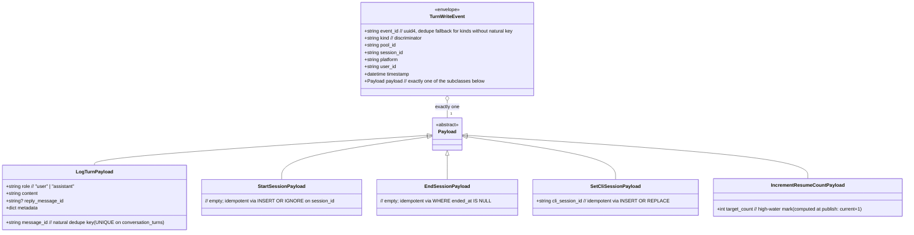
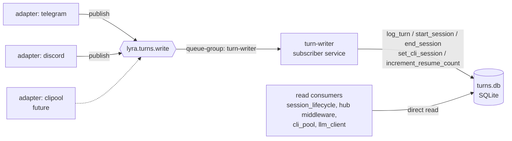

## Context

Promoted from `artifacts/frames/1331-turnstore-alpha-refactor-frame.mdx` (frame approved 2026-05-25).

TurnStore is the L1 raw-turn store (SQLite, `~/.lyra/turns.db`). The **read** side is fine (direct SQLite); the **write** side is invoked synchronously from `pool_observer.log_turn_async()`, `pool_observer.end_session_async()`, `pool.py` (start_session), `session_builder.py` (start_session), `cli_pool_session.py` (set_cli_session), and `middleware_pool.py` (increment_resume_count callback). Each sits behind an adapter wire (`telegram`, `discord`, future `cli pool`). The same applies to the L1 `pool_sessions` table — its 3 write methods (`start_session`, `end_session`, `increment_resume_count`) sit in the `TurnStoreSessionMixin` and share the same call-sites; they are in-scope for this refactor (per frame `## Constraints`).

ADR-068 §Application Map flags this as the canonical α-pattern deviation. ADR-073 (axial: stage-of-pipeline) flags the duplication along the non-primary axis. The third adapter (CLI pool) is queued — we land the refactor before the three-strikes threshold.

**Governance prerequisite (Slice 0):** `src/lyra/infrastructure/CLAUDE.md` mandates an ADR for any new subdirectory under `infrastructure/`. Slice 0 adds **ADR-074 — TurnWriter subscriber-writer sublayer** before any code lands under `infrastructure/turn_writer/`. Without this, the spec violates the governance rule.

> **Issue-body correction:** the acceptance criterion `0 occurrence \`turn_store.add(\`` refers to a method that doesn't exist on `TurnStore`. The actual write methods are `log_turn`, `start_session`, `end_session`, `set_cli_session`, `increment_resume_count`. The criterion in `## Success Criteria` is rewritten accordingly. Issue body is patched in parallel with spec approval so the GitHub issue does not carry a stale criterion.

## Goal

Move every TurnStore mutation off the direct call path and behind a NATS publish → single subscriber-writer service, so any new adapter (or storage concern) consumes the same write contract without re-implementing it.

## Users

- **Primary:** adapter authors (`telegram`, `discord`, `clipool`) — write path becomes a NATS publish, uniform with the rest of the stage-axis architecture.
- **Secondary:** Hub operators — gain a NATS persistence buffer for crash recovery; subscriber must expose health + lag metrics so observability isn't lost.

## Expected Behavior

1. An adapter receives an inbound message; the inbound pipeline reaches `pool_observer.log_turn_async()` (and `end_session_async()`, etc.).
2. Instead of `await self._turn_store.log_turn(...)`, the observer publishes a `TurnWriteEvent` to `lyra.turns.write` via the existing `roxabi-nats` transport (ADR-045 SDK).
3. The publisher **awaits the JetStream `PubAck`** before returning — guarantees the event is persisted to the stream. The adapter `ack`s the inbound message only after `PubAck`. End-to-end delivery is at-least-once via JetStream.
4. A single subscriber-writer service (the `turn-writer`) consumes `lyra.turns.write` and writes to SQLite via the (now private) `TurnStore` write methods. The subscriber runs as a JetStream **durable consumer** named `turn-writer-v1` with **queue group** `turn-writer` and `AckExplicit` policy. The stream `LYRA_TURNS` (subject filter `lyra.turns.>`) uses **WorkQueue retention** + `MaxAge=24h` (events deleted after ack; 24h replay window for debugging).
5. **Dedupe strategy** (per event `kind`):
   - `log_turn`: dedupe by `(platform, message_id)` — UNIQUE constraint `idx_turns_dedupe` on `conversation_turns(platform, message_id) WHERE message_id IS NOT NULL`; `INSERT OR IGNORE` on collision.
   - `start_session`, `end_session`, `set_cli_session`: idempotent by construction — same `session_id` with same payload is a no-op (start: `INSERT OR IGNORE`; end: `UPDATE … WHERE ended_at IS NULL`; set_cli: `INSERT OR REPLACE`).
   - `increment_resume_count`: every event carries a synthetic `event_id` (uuid4) generated at publish time + a `target_count` (current+1) computed at publish time. Writer uses `UPDATE pool_sessions SET resume_count=max(resume_count, ?target_count) WHERE session_id=?` — a high-water mark; redelivery is naturally idempotent. A persisted `processed_events(event_id)` table also catches duplicates.
6. On subscriber crash, JetStream redelivers unacked messages (`AckWait=60s` — exceeds Quadlet `RestartSec=10` with margin); the above dedupe strategies guarantee idempotence.
7. **Read-after-write semantics:** publishers await `PubAck` only, not subscriber persistence. The two read-after-write call paths are:
   - `set_cli_session` → `get_cli_session` (in `cli_pool.py:307-309`): the read is gated by a subsequent inbound message arriving on the pool, which provides a natural delay window (typically seconds; bounded by NATS RTT + writer SQLite write, typically <20ms). Acceptable.
   - `increment_resume_count` callback (`middleware_pool.py:119`) → no immediate read; the counter is read by `list_sessions` for diagnostics only. Acceptable.
   Spec asserts: no read-after-write call path requires synchronous visibility within the same coroutine; all readers either tolerate stale-by-RTT (cli_session) or read for telemetry only (resume_count).
8. The **read** API of `TurnStore` is unchanged — `get_turns`, `get_last_session`, `get_session_pool_id`, `get_cli_session`, `get_cli_session_by_pool`, `list_sessions` continue to hit SQLite directly.
9. Deployment shape (Quadlet dedicated container vs in-process consumer in hub) is decided in `/plan`. Both honor the same contract, but they differ on three ops surfaces — restart semantics (Quadlet: `Restart=on-failure RestartSec=10` independent of hub; in-process: dies with hub), secret access (Quadlet: dedicated `lyra-nats-turn-writer` nkey seed + `deploy/quadlet.toml` entry + `install.sh` provisioning; in-process: shares hub seed), log routing (Quadlet: own `journalctl -u lyra-turn-writer.service`; in-process: in hub stream). The plan must select with these in mind. SQLite file (`~/.lyra/turns.db`) is mounted by **exactly one writer process** — Quadlet route requires hub to drop its bind-mount of `turns.db` (read mounts to readers only).

## Data Model & Consumers

### Data structure



> Note: exactly one `Payload` subclass per event; the `kind` field is the discriminator that selects which subclass `payload` deserializes to.

`TurnWriteEvent` lives in `packages/roxabi-contracts/src/roxabi_contracts/turns/` per ADR-049. Subject: `lyra.turns.write`.

### Consumer map



### Consumer summary

| Consumer | Fields consumed | When | Status |
|---|---|---|---|
| `turn-writer` subscriber | `kind`, `pool_id`, `session_id`, `platform`, `user_id`, `message_id`, `payload`, `timestamp` | per published event | this issue |
| `session_lifecycle` (read) | `pool_id`, `user_id` → rows from `conversation_turns` | session resume | unchanged (direct read) |
| `hub middleware path_validation` (read) | `session_id` → `pool_id` lookup | inbound routing | unchanged (direct read) |
| `cli_pool` (read) | `session_id` → `cli_session_id` | CLI session restore | unchanged (direct read) |
| `llm_client` (read) | `session_id` → `cli_session_id` | LLM context build | unchanged (direct read) |
| `clipool` adapter (write) | will publish via same subject | next issue (post-#1331) | future (dashed) |

## Breadboard

### Affordances

| ID | Element | Layer | Handler |
|---|---|---|---|
| A0 | **ADR-074** — TurnWriter subscriber-writer sublayer, authorising `infrastructure/turn_writer/` | docs | `docs/architecture/adr/074-turn-writer-subscriber.mdx` |
| N1 | Subject `lyra.turns.write` | NATS / contracts | `roxabi_contracts.turns.SUBJECTS.turn_write` |
| N2 | JetStream **stream** `LYRA_TURNS` — subject `lyra.turns.>`, retention `WorkQueue`, `MaxAge=24h`, `MaxBytes=256MiB` | NATS / writer | created at writer bootstrap (`nats stream add` or programmatic) |
| N3 | JetStream **durable consumer** `turn-writer-v1` — queue group `turn-writer`, `AckExplicit`, `AckWait=60s`, `MaxDeliver=5` | NATS / writer | created at writer bootstrap |
| S1 | `TurnWriteEvent` + `*Payload` Pydantic models + discriminator | contracts pkg | `packages/roxabi-contracts/src/roxabi_contracts/turns/models.py` |
| S2 | `TurnPublisher` — wrapper over `roxabi-nats` publish; awaits `PubAck` before returning | transport | `src/lyra/transport/turn_publisher.py` |
| S3 | `TurnWriter` — subscriber consuming events + calling `TurnStore` private mutators | new service | `src/lyra/infrastructure/turn_writer/writer.py` |
| S4 | Dedupe DDL — UNIQUE `idx_turns_dedupe` on `conversation_turns(platform, message_id) WHERE message_id IS NOT NULL` + new `processed_events(event_id PRIMARY KEY, processed_at)` table | writer | DDL migration in `turn_store.py` (additive, idempotent) |
| S5 | `pool_observer.log_turn_async / end_session_async / start_session` rewritten to publish | core/pool | `src/lyra/core/pool/pool_observer.py`, `pool.py`, `pool_processor_streaming.py`, `pool_processor_exec.py` |
| S6 | `session_builder.start_session`, `cli_pool_session.set_cli_session`, `middleware_pool.increment_resume_count` rewritten to publish; `middleware_pool` callback wires the publish-based coroutine and is awaited at the call-site | inbound + cli + middleware | `inbound/session_builder.py`, `core/cli/cli_pool_session.py`, `core/hub/middleware/middleware_pool.py` |
| S7 | `TurnStore` write methods renamed private (`_log_turn`, `_start_session`, …); enforcement is the grep criterion (criterion 1 in `## Success Criteria`) — Python's single-underscore is convention, not access control; **bundled into S3** to avoid a broken-tests window with S5/S6 | infrastructure | `src/lyra/infrastructure/stores/turn_store.py`, `turn_store_session.py`; test updates in `tests/core/test_middleware.py`, any other test mocking the public names |
| S8 | Writer bootstrap entry — in-process variant (default per `/plan`) at `src/lyra/bootstrap/turn_writer_inproc.py` OR standalone variant at `src/lyra/bootstrap/standalone/turn_writer_standalone.py` | bootstrap | per `/plan` decision |
| S9 | **Writer observability** — `/health` endpoint (subscriber liveness) + `turn_writer_lag_seconds` gauge (oldest unacked age) exported via existing OTel scaffolding | observability | `src/lyra/infrastructure/turn_writer/health.py` |

### Wiring

```
A0 (ADR-074) authorises infrastructure/turn_writer/ — prerequisite to S3/S7

adapter → pool_observer (S5) / session_builder / cli_pool_session / middleware_pool (S6)
   └─ TurnPublisher.publish (S2) → N1 → JetStream stream LYRA_TURNS (N2)
        ↑ awaits PubAck                       └─ durable consumer turn-writer-v1 (N3)
                                                     └─ TurnWriter (S3)
                                                           ├─ dedupe via S4
                                                           │    ├─ log_turn → INSERT OR IGNORE on (platform, message_id)
                                                           │    ├─ start/end_session → naturally idempotent
                                                           │    ├─ set_cli_session → INSERT OR REPLACE
                                                           │    └─ increment_resume_count → high-water mark + processed_events
                                                           └─ TurnStore._log_turn / _start_session / … (S7)
                                                                  └─ SQLite turns.db (single writer process)

writer exposes /health + turn_writer_lag_seconds (S9)
```

## Slices

| # | Slice | Affordances | Demo |
|---|---|---|---|
| 0 | **Governance** — write ADR-074 authorising `infrastructure/turn_writer/` sublayer; merge before any code below | A0 | `ls docs/architecture/adr/074-turn-writer-subscriber.mdx` + `status: accepted` |
| 1 | **Contracts + publisher** — `TurnWriteEvent` discriminated union, `lyra.turns.write` subject literal, `TurnPublisher` awaiting `PubAck`; no consumer yet | N1, S1, S2 | unit test: publish each `kind`, assert NATS receives it, assert `PubAck` returned before publisher returns |
| 2 | **Writer service + private rename atomically** — DDL migration (S4), `TurnWriter` (S3) consuming the subject, `TurnStore` write methods renamed private (S7), tests updated in the same commit | N2, N3, S3, S4, S7 | integration test: stream/consumer created; publish 5 `log_turn` events (1 dup msg_id) → DB has 4 rows; publish `increment_resume_count` twice with same `target_count=3` → counter ends at 3, not 4; existing unit tests still green |
| 3 | **Rewire call-sites** — `pool_observer`, `pool`, `pool_processor_*`, `session_builder`, `cli_pool_session`, `middleware_pool` publish instead of direct call; `_on_resume_fn` wires the publish coroutine and the call-site `await`s it | S5, S6 | `grep -rE "(_turn_store\|turn_store)\.(log_turn\|start_session\|end_session\|set_cli_session\|increment_resume_count)" src/lyra/` returns matches only inside `src/lyra/infrastructure/turn_writer/` |
| 4 | **Bootstrap + deployment shape** (Quadlet vs in-process — decided in `/plan`) — writer starts with the hub or as a Quadlet sibling; SQLite mount sole-writer invariant honored; secret + log + restart concerns wired per choice | S8 | `lyra start` (or `systemctl --user start lyra-turn-writer`) → writer healthy; end-to-end test green; only one process holds a write file-descriptor on `turns.db` (verified via `lsof`) |
| 5 | **Observability** — `/health` + `turn_writer_lag_seconds` exposed | S9 | curl health returns 200; lag gauge exported and visible (or scraped via existing OTel pipeline) |

## Success Criteria

- [ ] ADR-074 merged (`docs/architecture/adr/074-turn-writer-subscriber.mdx` with `status: accepted`) before Slice 2 lands.
- [ ] Grep enforces privatization (rewrites issue-body criterion using actual method names):
      `grep -rE "(_turn_store\|turn_store)\.(log_turn\|start_session\|end_session\|set_cli_session\|increment_resume_count)" src/lyra/ --include='*.py'`
      returns matches only inside `src/lyra/infrastructure/turn_writer/`.
- [ ] Subject `lyra.turns.write` is declared as a canonical literal in `packages/roxabi-contracts/src/roxabi_contracts/turns/subjects.py`; `SUBJECTS.turn_write == "lyra.turns.write"` test asserts it (mirrors voice/llm/gh tests).
- [ ] Cross-adapter test: telegram + discord both publish 3 `log_turn` events each → writer persists all 6 ordered per `pool_id` → `get_turns(pool_id)` returns them in publication order.
- [ ] Idempotence — `log_turn`: publish same `(platform, message_id)` twice → 1 row.
- [ ] Idempotence — `increment_resume_count`: publish twice with same `event_id` AND publish twice with same `target_count` but different `event_id` → counter ends at `target_count`, not 2× incremented (high-water mark + `processed_events` both verified).
- [ ] Idempotence — `start_session` / `end_session` / `set_cli_session`: replay each twice → row state matches single-delivery outcome.
- [ ] Crash-recovery test: kill writer mid-batch (5 unacked messages) → restart writer (within `AckWait=60s`) → all 5 messages persisted (no loss, no duplicates).
- [ ] Per-pool ordering test: 10 events for `pool_A` interleaved with 10 events for `pool_B` → both pools preserve publication order.
- [ ] `_on_resume_fn` callback wiring: trigger a session resume via inbound message → assert `TurnWriteEvent{kind:'increment_resume_count'}` arrives on `lyra.turns.write` → assert `pool_sessions.resume_count` reflects the new value after writer ack.
- [ ] `TurnStore` read API call-sites unchanged — verified via:
      `git diff staging..HEAD -- $(grep -rlE "\.(get_turns\|get_last_session\|get_session_pool_id\|get_cli_session\|get_cli_session_by_pool\|list_sessions)\(" src/lyra/ --include='*.py')`
      shows no read-callsite mutation.
- [ ] SQLite sole-writer invariant: `lsof ~/.lyra/turns.db | grep -c '[wu]'` returns exactly 1 in the chosen deployment shape.
- [ ] Writer observability: `curl http://localhost:<writer_port>/health` returns 200; `turn_writer_lag_seconds` gauge exported (visible in logs or scraped by existing OTel pipeline).

## Open Items

None blocking. Deployment shape (Quadlet vs in-process) is a `/plan` decision; spec lists the operational constraints (restart, secret, log, sole-writer) so `/plan` can pick with full info.
