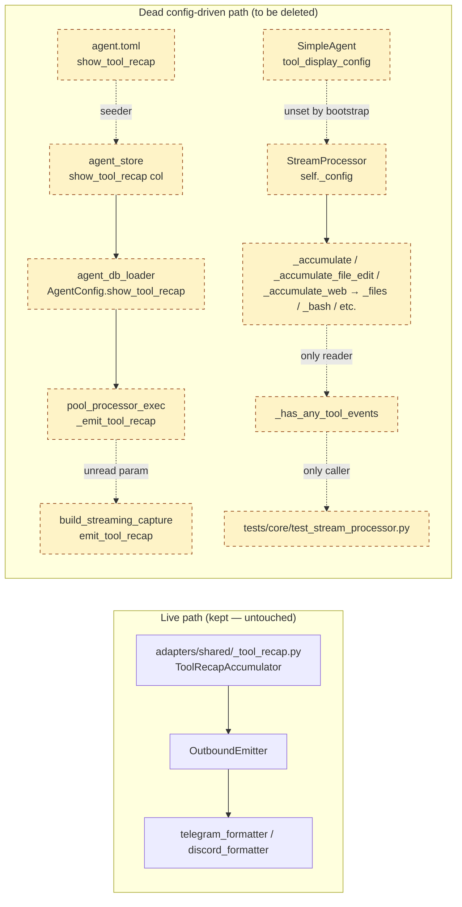
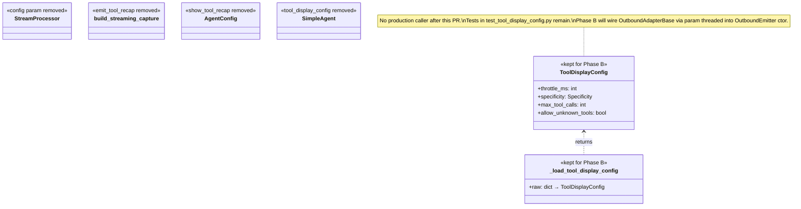

## Context

- **Frame:** [`artifacts/frames/1335-delete-dead-tool-display-code-frame.mdx`](../frames/1335-delete-dead-tool-display-code-frame.mdx)
- **GitHub issue:** #1335
- **Trigger:** 2026-05-24 multi-agent audit (`dev-core:axial-adr-review` + `dev-core:architect`) identified parallel-path-drift in lyra's tool-display path. Both reviewers independently recommended deletion.
- **Spec-time expert review:** architect, doc-writer, product-lead, axial-adr-review — 4 verdicts (1 GOOD, 2 NEEDS IMPROVEMENT, 1 NO DRIFT). All actionable findings incorporated below.
- **Parent epic:** #1277 (stage-axis refactor) · **Related (closed):** #1282 (Phase 5 — stream processors stage extraction)

## Goal

Delete the four dead surfaces of the tool-display config concern (StreamProcessor accumulator, `emit_tool_recap` plumbing, `show_tool_recap` DB column, `tool_display_config` SimpleAgent threading) — pure deletion, no behavior change, no wiring — leaving `ToolDisplayConfig` model + `_load_tool_display_config` function intact for Phase B re-wiring.

## Users

- **Primary:** Lyra contributors editing `core/processors/`, `core/pool/`, `core/agent/`, `agents/simple_agent.py`, `infrastructure/stores/agent_store.py`.
- **Secondary:** Whoever lands Phase B (`ToolDisplayConfig` wiring into `ToolRecapAccumulator`) — clean base = single-purpose PR.
- **Operator with custom agent TOML:** anyone with `show_tool_recap = true|false` in `~/.lyra/agents/*.toml` — key silently becomes a no-op after this PR (parser drops it). Documented in release notes as deprecated; no replacement until Phase B.
- **End users (Telegram/Discord recipients):** zero observable change. Live tool-recap card renders identically.

## Expected Behavior

**Before:** `StreamProcessor` requires a `config: ToolDisplayConfig` constructor param (non-optional), threads it into private state, calls `_accumulate*` methods that mutate `_files` / `_bash` / `_web_fetches` / `_agent_calls` / `_silent_reads` / `_silent_greps` / `_silent_globs` fields. These fields are read **only** by `_has_any_tool_events()`, which itself is called **only** by `tests/core/test_stream_processor.py`. `SimpleAgent` accepts an Optional `tool_display_config: ToolDisplayConfig | None = None` and passes it through (constructing a default when absent — verified at implementation time). Independently, `build_streaming_capture()` declares an `emit_tool_recap: bool` parameter that is never referenced in its body; `pool_processor_exec.py` computes the value from a `show_tool_recap` DB column (declared in `agent_schema.py`, seeded in `agent_seeder.py`, stored in `agent_store.py`, loaded in `agent_db_loader.py`, materialized in both `agent_models.AgentConfig` AND `core/agent/agent_config.py`) and passes it to the unread param. The live recap card uses an entirely separate accumulator in `adapters/shared/_tool_recap.py` that never reads `ToolDisplayConfig`.

**After:** All four surfaces are deleted. `StreamProcessor` no longer takes a config. `build_streaming_capture()` signature has no `emit_tool_recap`. The `show_tool_recap` column is dropped via SQLite `ALTER TABLE ... DROP COLUMN` (production SQLite is 3.45.1, well above the 3.35.0 cutoff). `SimpleAgent` no longer accepts `tool_display_config`. Streaming, recap card, pool exec, and agent persistence all continue to work — verified by quality gates + a manual Telegram/Discord smoke test that the recap card renders identically.

## Data Model & Consumers

### Before — dead surface map



### After — kept surface



### Consumer summary

| Symbol | Status after PR | Consumers after | Phase B plan |
|---|---|---|---|
| `ToolDisplayConfig` | Kept | `_load_tool_display_config` + tests | Wire into `ToolRecapAccumulator` via param threaded through `OutboundAdapterBase.send_streaming` → `OutboundEmitter` ctor (axial-axis correct; `send_streaming` itself is non-overridable per `outbound/CLAUDE.md`) |
| `_load_tool_display_config` | Kept | Tests only | Phase B adds bootstrap caller |
| `StreamProcessor._accumulate*` | Deleted | — | — |
| `_has_any_tool_events` | Deleted | — | — |
| `emit_tool_recap` (param) | Deleted | — | — |
| `show_tool_recap` (DB col) | Dropped via `ALTER TABLE` | — | — |
| `SimpleAgent.tool_display_config` | Deleted | — | — |

## Breadboard

Deletion-only spec — "affordances" map to dead surfaces; "handler" = edit operation; "wires-to" = files touched.

| ID | Dead surface | Handler (edit) | Files touched |
|---|---|---|---|
| D1 | `StreamProcessor._accumulate*` + accumulator fields (`_files`, `_bash`, `_web_fetches`, `_agent_calls`, `_silent_reads`, `_silent_greps`, `_silent_globs`) + `_has_any_tool_events` + `config` constructor param | Remove methods, fields, constructor param, `ToolDisplayConfig` import; drop `self._accumulate(event)` call | `src/lyra/core/processors/stream_processor.py` |
| D2 | `emit_tool_recap` param in `build_streaming_capture()` | Remove param from signature | `src/lyra/core/pool/pool_processor_streaming.py` |
| D3 | `_emit_tool_recap` computation + pass-through | Remove `_cfg.show_tool_recap` derivation + arg | `src/lyra/core/pool/pool_processor_exec.py` |
| D4 | `SimpleAgent.tool_display_config` constructor + storage + pass-through | Remove param/field/import; drop `config=` arg in `StreamProcessor(...)` call | `src/lyra/agents/simple_agent.py` |
| D5 | `AgentConfig.show_tool_recap` field | Remove field declaration + references | `src/lyra/core/agent/agent_models.py` |
| D6 | `show_tool_recap` SQLite column + INSERT/UPSERT placeholders | Remove column from CREATE TABLE; drop ALTER TABLE additive migration; add migration to drop column (see Migration Strategy); update `_AGENT_COLUMNS` literal, `_N_AGENT_COLS` count, and the "25 columns" comment (line 87 — becomes 24); remove `show_tool_recap` from INSERT + UPSERT clauses | `src/lyra/core/agent/agent_schema.py` |
| D7 | `show_tool_recap` builder param | Remove param + pass-through | `src/lyra/core/agent/agent_builder.py` |
| D8 | `show_tool_recap` seeder parsing | Remove TOML parse + pass-through; ensure the parser silently ignores the key in legacy TOMLs (¬raise) so existing user files still load | `src/lyra/core/agent/agent_seeder.py` |
| D9 | `show_tool_recap` db_loader mapping | Remove `show_tool_recap=row.show_tool_recap,` line | `src/lyra/core/agent/agent_db_loader.py` |
| D10 | `show_tool_recap` agent_store INSERT/load | Remove INSERT placeholder + load mapping | `src/lyra/infrastructure/stores/agent_store.py` |
| D11 | `show_tool_recap: bool = True` field in `core/agent/agent_config.py:214` (separate class from `agent_models.AgentConfig`) | Remove field declaration + any references in this module | `src/lyra/core/agent/agent_config.py` |
| T1 | Test references to deleted symbols | (a) Drop `test_agent_calls_accumulation` and `test_agent_calls_skipped_when_show_agent_false` **in full** — both test exclusively the dead `_accumulate` / `_agent_calls` / `_has_any_tool_events` surface. (b) In `test_silent_read_grep_glob`, drop the assertions on `_silent_reads`, `_silent_greps`, `_silent_globs`, `_files`, `_bash`, `_web_fetches`, `_agent_calls`; keep the ToolCallStart/End lifecycle assertions. (c) In `test_web_fetch_visible` / `test_web_search_visible` / `test_web_fetch_hidden_when_show_false` / similar, drop assertions on `_web_fetches`; keep emission-side assertions. (d) Drop any `StreamProcessor(config=...)` kwarg in test fixtures. (e) Drop `SimpleAgent(tool_display_config=...)` kwargs. (f) Drop `ToolDisplayConfig(throttle_ms=0)` construction + arg in `capture_v1_text_baseline.py`. (g) Remove the `show_tool_recap INTEGER NOT NULL DEFAULT 1` line from the `_DDL_LEGACY` fixture in `test_agent_store_migration.py` (replace with a fresh ALTER scenario that exercises the new drop migration). (h) Remove the `1,  # show_tool_recap` positional tuple entry in `test_agent_models.py`. (i) Final sweep: `grep -rn "processor\._\(silent\|files\|bash\|web_fetches\|agent_calls\)" tests/` returns 0 hits. | `tests/core/test_stream_processor.py`, `tests/core/test_agent_models.py`, `tests/infrastructure/test_agent_store_migration.py`, `tools/capture_v1_text_baseline.py`, any other test fixtures `grep -rn 'show_tool_recap\|_has_any_tool_events\|tool_display_config' tests/ tools/` finds |

**Kept (do NOT delete):** `src/lyra/core/messaging/tool_display_config.py`, `src/lyra/bootstrap/factory/config.py:_load_tool_display_config`, `tests/test_tool_display_config.py` (extended 2026-05-25 with kwarg-typo guard — these tests must continue to pass unchanged).

## Slices

Internally ordered, all land in one PR (deletion is atomic for migration safety). Slice ordering verified independent by architect review — Slices 1 and 2 do not share state.

| # | Slice | Verification |
|---|---|---|
| 1 | **Detach SimpleAgent + StreamProcessor**: remove `config` from StreamProcessor; remove `tool_display_config` from SimpleAgent; drop accumulator methods/fields/`_has_any_tool_events`; update test fixtures + `capture_v1_text_baseline.py` per T1(a)(b)(c)(d)(e)(f) | `uv run pytest tests/core/test_stream_processor.py tests/agents/` green; `grep -rn "_has_any_tool_events\|_accumulate" src/` returns 0 hits |
| 2 | **Cut emit_tool_recap plumbing**: remove param from `build_streaming_capture()` + remove `_emit_tool_recap` derivation in pool exec | `uv run pytest tests/core/pool/` green; `grep -rn "emit_tool_recap" src/` returns 0 hits |
| 3 | **Drop show_tool_recap column + agent surface**: D5–D11 (agent_models / agent_schema incl. drop-column migration / agent_builder / agent_seeder / agent_db_loader / agent_store / agent_config); update `_DDL_LEGACY` fixture per T1(g); remove positional tuple entry per T1(h); update agent TOML fixtures if any reference the field | `uv run pytest tests/core/agent/ tests/infrastructure/` green; fresh `AgentStore('/tmp/spec_test.db').connect()` succeeds; migration applied against a populated DB drops column (see Migration Verification below); `grep -rn "show_tool_recap" src/ tests/` returns 0 hits |

After all three slices: full `uv run pytest` + `uv run pyright` + `uv run ruff check .` + `uv run lint-imports` pass; manual smoke test of tool-recap rendering in Telegram + Discord.

## Migration Strategy

**Production SQLite version: 3.45.1 (verified 2026-05-25 on the dev host, matching M₁ Ubuntu Server).** SQLite ≥ 3.35.0 supports `ALTER TABLE ... DROP COLUMN` natively. Default path:

```sql
ALTER TABLE agents DROP COLUMN show_tool_recap;
```

**Idempotency guard (REQUIRED):** before running the ALTER, query `PRAGMA table_info(agents)` and skip if `show_tool_recap` is already absent. Pattern symmetric to the existing `_MIGRATE_AGENTS` ADD COLUMN code (which catches `OperationalError` on duplicate ADD). Without this guard, re-running migration on an already-migrated DB will raise.

**Fallback (documented but not used in this PR):** for any environment where SQLite < 3.35.0, perform a table-rebuild:

1. `PRAGMA foreign_keys = OFF;`
2. Begin transaction.
3. `CREATE TABLE agents_new (...)` — same schema minus `show_tool_recap`.
4. `INSERT INTO agents_new SELECT <all columns except show_tool_recap> FROM agents;`
5. `DROP TABLE agents;`
6. `ALTER TABLE agents_new RENAME TO agents;`
6b. `PRAGMA integrity_check;` — verify table structure before commit (abort transaction if not `ok`).
7. Recreate any indexes/triggers on `agents`.
8. Commit.
9. `PRAGMA foreign_keys = ON;`

The fallback is not exercised by tests in this PR (M₁ + dev hosts are 3.45.1; no consumer is on < 3.35). If a future deployment needs it, restore the version check + branching at that time.

## Migration Verification

Concrete commands the implementer / fixer must run:

```bash
# 1. Fresh DB — schema must omit the column
python3 -c "
import asyncio
from lyra.infrastructure.stores.agent_store import AgentStore
async def main():
    s = AgentStore('/tmp/spec_test_fresh.db')
    await s.connect()
    import sqlite3
    cur = sqlite3.connect('/tmp/spec_test_fresh.db').execute('PRAGMA table_info(agents)')
    cols = [r[1] for r in cur.fetchall()]
    assert 'show_tool_recap' not in cols, f'show_tool_recap still present: {cols}'
    print('PASS: fresh schema clean')
asyncio.run(main())
"

# 2. Populated DB — column dropped, rows preserved
# Run tests/infrastructure/test_agent_store_migration.py with the new fixture
uv run pytest tests/infrastructure/test_agent_store_migration.py -v

# 3. Idempotency — second connect on already-migrated DB does not raise
python3 -c "
import asyncio
from lyra.infrastructure.stores.agent_store import AgentStore
async def main():
    s = AgentStore('/tmp/spec_test_fresh.db')
    await s.connect()  # already migrated — must be a no-op
    print('PASS: idempotent')
asyncio.run(main())
"
```

## Success Criteria

- [ ] `grep -rn "_accumulate\|_has_any_tool_events" src/lyra/core/processors/` returns 0 hits.
- [ ] `grep -rn "emit_tool_recap" src/lyra/core/pool/` returns 0 hits.
- [ ] `grep -rn "show_tool_recap" src/ tests/` returns 0 hits.
- [ ] `grep -rn "tool_display_config" src/lyra/agents/ src/lyra/core/processors/` returns 0 hits.
- [ ] `src/lyra/core/messaging/tool_display_config.py` still exports `ToolDisplayConfig` (regression guard).
- [ ] `src/lyra/bootstrap/factory/config.py` still defines `_load_tool_display_config` (Phase B handoff guard).
- [ ] `tests/test_tool_display_config.py` still passes unchanged (kept-model regression guard).
- [ ] `uv run pytest` passes (full suite).
- [ ] `uv run pyright` passes with zero new errors.
- [ ] `uv run ruff check .` passes.
- [ ] `uv run lint-imports` (importlinter) passes.
- [ ] **Migration happy path:** SQLite migration successfully drops `show_tool_recap` column on a populated test DB (column gone, all other rows preserved). Verified via `tests/infrastructure/test_agent_store_migration.py` (updated fixture).
- [ ] **Migration idempotency:** running the migration a second time against a DB where the column is already absent completes without error. Covered by the `PRAGMA table_info` guard + a dedicated idempotency test in `test_agent_store_migration.py`.
- [ ] **CHANGELOG entry:** notes that `show_tool_recap` is removed from agent TOML schema (deprecated, no replacement until Phase B). Operators who set the key in `~/.lyra/agents/*.toml` will see it silently ignored.
- [ ] **Manual smoke test (binary, protocoled):** on the staging bot, trigger ≥1 tool call via Telegram and ≥1 via Discord; tool-recap card appears in both channels with identical fields (tool name, status line, timing) as on `git rev-parse HEAD~1`. PR author posts side-by-side screenshots to the PR description as evidence.

## Pre-merge Checklist (¬AC; merge-time deliverables)

- [ ] Phase B follow-up issue filed referencing this PR (out-of-scope handoff for `ToolDisplayConfig` wiring). Filing is a merge-time admin act, not a code-correctness gate.

## Edge Cases & Open Questions

- **Existing populated `~/.lyra/auth.db` instances** — migration must run idempotently on upgrade; the `PRAGMA table_info` guard above handles this.
- **Agent TOML fixtures referencing `show_tool_recap`** — at spec time, no bundled `src/lyra/agents/*.toml` files reference the key (verified during implementation with `grep -rn 'show_tool_recap' src/lyra/agents/`). User TOMLs in `~/.lyra/agents/` are out of scope but CHANGELOG entry documents the deprecation. The `agent_seeder.py` parser must silently ignore the legacy key (NOT raise on unknown field) so existing user TOMLs continue to load.
- **`tests/test_tool_display_config.py`** was extended 2026-05-25 (`686de6caec`, `20a93d18b`) with a kwarg-typo guard. These tests are kept; deletion PR must not touch them.
- **Phase B injection-point precision (out-of-scope for this PR, flag for Phase B spec):** `OutboundAdapterBase.send_streaming` is concrete and non-overridable per `src/lyra/outbound/CLAUDE.md`. Phase B injection must thread `ToolDisplayConfig` as a param into the `OutboundEmitter` constructor (path A — stage-axis correct), NOT add per-platform override of `send_streaming` or `_make_emitter` (path B — target-axis-trap per axial review). Document this constraint in the Phase B issue body so the Phase B spec author starts from path A.
- **Phase B delay risk:** if Phase B is delayed > 6 months or closed `not_planned`, `ToolDisplayConfig` and `_load_tool_display_config` become candidates for deletion in a follow-up sweep (no behavioral impact in the interim — just dead model code). Acceptable risk for a P2 refactor; no hard gate required before merging this PR. Falsifiability anchor: see frame's "Failure in 6 months" criterion.

## Unresolved

None.
