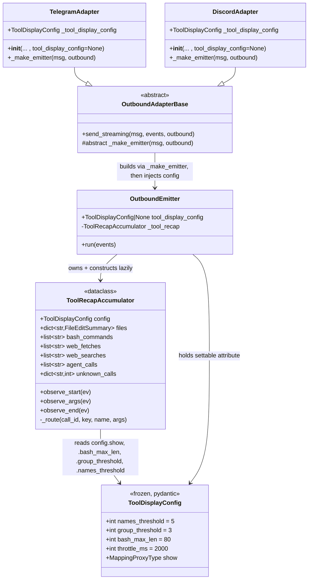
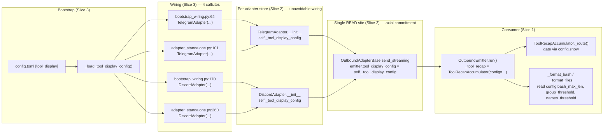

## Context

Promoted from `artifacts/analyses/1336-wire-tool-display-config-phase-b-analysis.mdx`. Phase B follow-up to #1335 (closed 2026-05-25). All 7 Open Questions from the analysis are resolved below:

| # | Question | Resolution |
|---|----------|------------|
| Q1 | Emitter config-acceptance shape | **Settable attribute** on `OutboundEmitter` — set by `OutboundAdapterBase.send_streaming` after `_make_emitter` returns. Keeps `_make_emitter` abstract signature unchanged. |
| Q2 | Where `_load_tool_display_config` is called | In `src/lyra/bootstrap/factory/config.py` (collocated with other `_load_*_config` callers — `_load_pairing_config`, `_load_cli_pool_config`, etc.). The loaded `ToolDisplayConfig` is then handed to `bootstrap_wiring.py` + `adapter_standalone.py` for adapter construction. |
| Q3 | `_shared_streaming_state.py` rename | **Rename to `_streaming_state.py`** (drop `_shared_` prefix) — file is now private to `outbound/` package; no longer "shared." |
| Q4 | Test placement | **New file `tests/outbound/test_tool_recap.py`** aligning with new module location. Existing `tests/adapters/test_streaming_session_tool_recap.py` keeps testing the emitter-level integration (recap event handling), gets its imports updated. |
| Q5 | `_make_emitter` signature stability | **Unchanged.** Settable-attribute path preserves the abstract signature; concrete `TelegramAdapter._make_emitter` / `DiscordAdapter._make_emitter` need no edits. |
| Q6 | `ToolRecapAccumulator(config=…)` instantiation point | **Lazy in `OutboundEmitter.run()`** — accumulator is constructed at the start of `run()` using `self.tool_display_config or ToolDisplayConfig()`. Construction is deferred so the attribute set by `send_streaming` is honored regardless of arrival order. |
| Q7 | #1396 collision check | **No collision.** #1396 closed; its PR #1408 merged 2026-05-26 (before this worktree was branched). |

## Goal

Wire `ToolDisplayConfig` from `config.toml [tool_display]` into the live tool-recap rendering on Telegram + Discord, with the loader called from production code, the circular-import workaround dissolved structurally, and the threading site axially compliant (one READ site at `OutboundAdapterBase`, not per-platform `_make_emitter`).

## Users

- **Primary:** Lyra operators editing `~/.lyra/config.toml [tool_display]` to tune their recap card (truncate bash, hide web_fetch noise, raise file-name-listing threshold).
- **Secondary:**
  - Future adapter authors (Slack, Matrix, CLI extension) — inherit config wiring via the `OutboundAdapterBase.send_streaming` injection path; never reimplement.
  - Maintainers grepping `lyra.outbound.emitter` for "where does the config flow" — the answer is one site, top-of-file imports throughout, no `# Deferred imports` block.

## Expected Behavior

**Walkthrough — operator sets `bash_max_len = 200` and `show.web_fetch = false`:**

1. Operator edits `~/.lyra/config.toml`:
   ```toml
   [tool_display]
   bash_max_len = 200
   show.web_fetch = false
   ```
2. `lyra start` (or `lyra adapter telegram` / `lyra adapter discord` standalone) loads the TOML.
3. `src/lyra/bootstrap/factory/config.py` calls `_load_tool_display_config(raw)` → `ToolDisplayConfig(bash_max_len=200, show={web_fetch: false, ...defaults})`.
4. The config object is passed to `TelegramAdapter(...)` and `DiscordAdapter(...)` constructors via `tool_display_config=` kwarg (4 call sites total — 2 in `bootstrap_wiring.py`, 2 in `adapter_standalone.py`).
5. Each adapter `__init__` stores `self._tool_display_config = tool_display_config`.
6. When a turn produces tool calls, the hub streams render events to the adapter's `send_streaming`.
7. `OutboundAdapterBase.send_streaming` (concrete, non-overridable) calls `self._make_emitter(...)` to build the `OutboundEmitter`, then **assigns `emitter.tool_display_config = getattr(self, "_tool_display_config", None) or ToolDisplayConfig()`** — this is the single READ site.
8. `OutboundEmitter.run()` constructs the accumulator lazily: `self._tool_recap = ToolRecapAccumulator(config=self.tool_display_config)`.
9. `ToolRecapAccumulator._route()` consults `config.show.get(key, False)` before bucketing — `web_fetch` calls are dropped silently.
10. `_format_bash()` reads `config.bash_max_len` (200) instead of `_BASH_DISPLAY_MAX` (constant deleted).
11. Recap card renders without `web_fetch` lines and truncates bash at 200 chars on **both** Telegram and Discord.

**Walkthrough — operator omits `[tool_display]`:**

Section absent → `_load_tool_display_config` returns `ToolDisplayConfig()` defaults (`bash_max_len=80`, `names_threshold=5`, default `show` map). Adapters receive that. Behavior is byte-identical to today (defaults match the live constants after the parity fix in Slice 1).

**Edge case — `lyra adapter telegram` subprocess mode:** `adapter_standalone.py` path must also pass `tool_display_config=`; otherwise the subprocess receives `None`, the `getattr` default fires (`ToolDisplayConfig()`), and the operator's `bash_max_len=200` setting is silently ignored. Slice 3 plumbs both wired AND standalone paths to prevent this asymmetry.

## Data Model & Consumers

### Data structure



### Consumer map — config flow



### Consumer summary

| Consumer | Fields consumed | When | Status |
|----------|-----------------|------|--------|
| `ToolRecapAccumulator._route()` | `config.show` (read-only `MappingProxyType`) | per tool call (gate on bucketing) | this issue |
| `ToolRecapAccumulator._format_bash` | `config.bash_max_len`, `config.group_threshold` | per recap render | this issue |
| `ToolRecapAccumulator._format_files` | `config.group_threshold`, `config.names_threshold` | per recap render | this issue |
| `OutboundEmitter.run()` | reads attribute, instantiates accumulator | per turn | this issue |
| `OutboundAdapterBase.send_streaming` | reads `self._tool_display_config`, assigns to emitter | per turn | this issue |
| **(future)** read/grep/glob specificity | `config.show.read`, `.grep`, `.glob` | per tool call | **out of scope** — fields accessible but defaults `False` |
| **(future)** `throttle_ms` to throttle stage | `config.throttle_ms` | per intermediate emit | **out of scope** — field present but unconsumed (already today) |
| **(future, follow-up issue)** split `group_threshold` | `config.bash_group_threshold`, `config.files_group_threshold` | per recap render | **out of scope** — separate P3 follow-up filed during this spec phase |

## Breadboard

### Affordances → consumers

| ID | Affordance | Consumer | Data |
|----|-----------|----------|------|
| C1 | `config.toml [tool_display]` section | `_load_tool_display_config` | TOML dict |
| C2 | `_load_tool_display_config(raw)` | called by bootstrap factory config | returns `ToolDisplayConfig` |
| C3 | `tool_display_config=` kwarg on `TelegramAdapter.__init__` | stores `self._tool_display_config` | `ToolDisplayConfig \| None` (defaults to `None`) — *constructor kwarg is config-thread, not stage-logic; ADR-073 wiring exception* |
| C4 | `tool_display_config=` kwarg on `DiscordAdapter.__init__` | stores `self._tool_display_config` | `ToolDisplayConfig \| None` (defaults to `None`) — *same as C3* |
| C5 | `OutboundEmitter.tool_display_config` attribute (settable, single-WRITE-only) | read by `OutboundEmitter.run` to construct accumulator | `ToolDisplayConfig \| None` (defaults to `None`); stage-contract docstring forbids assignment from `_make_emitter` overrides |
| C6 | `OutboundAdapterBase.send_streaming` injection line | sets `emitter.tool_display_config` from `self._tool_display_config` | **single WRITE site (axial commitment)**, no signature change to `_make_emitter` |
| C7 | `ToolRecapAccumulator(config=…)` constructor | lazily instantiated in `OutboundEmitter.run()` | accepts `ToolDisplayConfig`, defaults to `ToolDisplayConfig()` if absent |
| C8 | `ToolRecapAccumulator._route` show-gate | reads `config.show.get(key, False)` | drops un-shown calls before bucketing |
| C9 | `_format_bash` threshold reads | reads `config.bash_max_len`, `config.group_threshold` | replaces hardcoded `_BASH_DISPLAY_MAX`, `_BASH_GROUP_THRESHOLD` |
| C10 | `_format_files` threshold reads | reads `config.group_threshold`, `config.names_threshold` | replaces hardcoded `_FILES_GROUP_THRESHOLD`, `_NAMES_THRESHOLD` |

### Wiring (concrete code shape)

```python
# src/lyra/adapters/shared/_base_outbound.py (after change)
async def send_streaming(self, original_msg, events, outbound=None):
    emitter = self._make_emitter(original_msg, outbound)
    # C6: single READ site — axial commitment
    emitter.tool_display_config = (
        getattr(self, "_tool_display_config", None) or ToolDisplayConfig()
    )
    await emitter.run(events)
```

```python
# src/lyra/outbound/emitter.py (after change)
class OutboundEmitter:
    # C5: settable attribute
    #
    # Stage contract (ADR-073):
    #   This attribute is set EXCLUSIVELY by OutboundAdapterBase.send_streaming
    #   after _make_emitter returns, and read by run() to construct the
    #   ToolRecapAccumulator. Concrete _make_emitter overrides MUST NOT assign
    #   this attribute — that would re-introduce per-platform wiring and
    #   re-create the target-axis-trap Phase B was designed to remove.
    tool_display_config: ToolDisplayConfig | None = None

    async def run(self, events):
        # C7: lazy instantiation honors whatever send_streaming set
        config = self.tool_display_config or ToolDisplayConfig()
        self._tool_recap = ToolRecapAccumulator(config=config)
        # ... existing run loop
        # Note: removed `self._recap_accum = ToolRecapAccumulator()` from
        # __init__ — Slice 1 drops the eager construction; this is the
        # sole instantiation site post-refactor.
```

```python
# src/lyra/outbound/_tool_recap.py (moved from adapters/shared/, modified)
@dataclass
class ToolRecapAccumulator:
    config: ToolDisplayConfig = field(default_factory=ToolDisplayConfig)
    # ... existing fields

    def _route(self, tool_call_id, key, tool_name, args):
        if not self.config.show.get(key, False):  # C8: gate
            return
        # ... existing routing (silent-counter branches now also gated)
```

## Slices

| # | Slice | Files | Tests | Demoable as |
|---|-------|-------|-------|-------------|
| 1 | **Foundation move + config-aware accumulator** | move `_tool_recap.py` → `outbound/`; move + rename `_shared_streaming_state.py` → `outbound/_streaming_state.py`; remove deferred-import block in `emitter.py` (3 lines → top of file); **remove eager `self._recap_accum = ToolRecapAccumulator()` from `OutboundEmitter.__init__` (~line 167)** — accumulator construction moves to Slice 2's lazy `run()` path; update `ToolDisplayConfig` defaults to live values (`bash_max_len: 60→80`, `names_threshold: 3→5`); add `config: ToolDisplayConfig` field to `ToolRecapAccumulator`; replace hardcoded constants with config reads in `_format_bash`/`_format_files`/etc.; `_route()` gates via `config.show`; add docstring to `ToolDisplayConfig.throttle_ms` noting "future consumption must wire through `lyra.outbound.throttle.ThrottleCapability` stage primitive (¬per-adapter), per ADR-073"; sweep import paths in 4–6 test files + `outbound/error_handler.py` docstring | new `tests/outbound/test_tool_recap.py` (~12 tests: defaults parity, threshold-driven, show-gated routing); update `tests/test_tool_display_config.py` default assertions; update import paths in `tests/adapters/test_streaming_session_tool_recap.py` | `pytest tests/outbound/test_tool_recap.py` green; `pyright` green; deferred-import block absent; `OutboundEmitter.__init__` no longer constructs `_recap_accum` |
| 2 | **Threading — emitter + base + concrete adapters** | add `tool_display_config: ToolDisplayConfig \| None = None` attribute to `OutboundEmitter` **with a stage-contract docstring** stating "Set exclusively by `OutboundAdapterBase.send_streaming` after `_make_emitter` returns. Do NOT assign from concrete `_make_emitter` overrides (per ADR-073 — single WRITE site)"; instantiate `ToolRecapAccumulator(config=…)` lazily in `OutboundEmitter.run()`; `OutboundAdapterBase.send_streaming` assigns `emitter.tool_display_config` post-`_make_emitter`; `TelegramAdapter.__init__` accepts + stores `tool_display_config` kwarg; `DiscordAdapter.__init__` same; `_make_emitter` signatures unchanged | end-to-end test: instantiate `TelegramAdapter(tool_display_config=ToolDisplayConfig(bash_max_len=200))`, drive a fake event stream with a bash call, assert recap line truncates at 200; same for Discord; absent-config test: `TelegramAdapter()` → recap behaves with current defaults | unit test stream produces config-honoring output for both Telegram + Discord |
| 3 | **Bootstrap wiring + docs + follow-up** | `bootstrap/factory/config.py` adds `tool_display_config = _load_tool_display_config(raw)` to the load sequence (alongside `_load_pairing_config`, etc.); thread `tool_display_config` to `bootstrap_wiring.py` (L64 + L170) + `adapter_standalone.py` (L101 + L260) — both wired and standalone paths; update `outbound/CLAUDE.md` §State + recap helpers (remove "live in `lyra.adapters.shared/`"; document config-driven thresholds); update `adapters/CLAUDE.md` references; file P3 follow-up issue: "split `group_threshold` into `bash_group_threshold` + `files_group_threshold`" | integration test: feed `raw_config = {"tool_display": {"bash_max_len": 200, "show": {"web_fetch": False}}}`, verify both `TelegramAdapter` and `DiscordAdapter` (constructed via wired path + via standalone path) receive a `ToolDisplayConfig` with the expected values | `lyra start` + `lyra adapter telegram` subprocess mode both honor `bash_max_len=200`; CLAUDE.md sections match code; follow-up issue exists |

## Success Criteria

- [ ] Setting `bash_max_len = 200` in `config.toml [tool_display]` truncates bash recap lines at 200 chars on **both** Telegram and Discord (end-to-end test asserts truncation length).
- [ ] Setting any `show.<key> = false` (for any key in `ToolDisplayConfig._DEFAULT_SHOW`) suppresses the corresponding lines in the recap card on both Telegram + Discord; default-shown keys (`edit`, `write`, `bash`, `web_fetch`, `web_search`, `agent`) and default-hidden keys (`read`, `grep`, `glob`) all respect their config override.
- [ ] `src/lyra/outbound/emitter.py` has no `# Deferred imports` block; all 3 previously deferred imports (`_streaming_state`, `_tool_recap`, `throttle.STREAMING_EDIT_INTERVAL`) are at the top of the file, no `# noqa: E402` markers remain.
- [ ] `OutboundAdapterBase.send_streaming` is the single WRITE site that injects `ToolDisplayConfig` into the emitter. Verified by TWO complementary greps:
  - (a) `grep -rn "emitter.tool_display_config" src/` returns the write in `_base_outbound.py:send_streaming` — single production-code hit (test files excluded by `src/` scope).
  - (b) `grep -rnE "\.tool_display_config\s*=" src/` returns exactly ONE production-code hit (the `send_streaming` assignment). No second write site exists in any `_make_emitter` override or elsewhere in `src/`.
  - Plus a stage-contract comment in `OutboundEmitter` documenting that `tool_display_config` is set exclusively by `OutboundAdapterBase.send_streaming`; concrete `_make_emitter` overrides must not assign it.
  - `_make_emitter` abstract signature is unchanged from current state; neither `telegram.py:269` nor `discord/adapter.py:251` gain a `tool_display_config` parameter.
- [ ] When `[tool_display]` is absent from `config.toml`, recap output is byte-identical to current production output. Verified at TWO levels:
  - **Unit level:** behavioral-parity test against `ToolRecapAccumulator(config=ToolDisplayConfig())` — snapshot recap lines against post-Slice-1 defaults (`bash_max_len=80`, `names_threshold=5`).
  - **Integration level:** feed a realistic `raw_config = {}` (no `[tool_display]` section) through the FULL loaded-config path (`_load_tool_display_config(raw)` → `bootstrap_wiring`/`adapter_standalone` → `TelegramAdapter`/`DiscordAdapter` constructor → `send_streaming` → `ToolRecapAccumulator`) and assert rendered recap matches the unit-level snapshot byte-for-byte. This catches the `adapter_standalone.py` silent-ignore failure mode that a direct-construction test alone would miss.
- [ ] All **4 bootstrap callsites** pass `tool_display_config=` to adapter constructors: `bootstrap_wiring.py` L64 + L170, `adapter_standalone.py` L101 + L260. Verified by integration test exercising both wired (`lyra start`) and standalone (`lyra adapter telegram` / `lyra adapter discord` subprocess) paths.
- [ ] `ToolDisplayConfig` defaults updated to match live constants: `bash_max_len = 80` (was 60), `names_threshold = 5` (was 3); `group_threshold = 3` unchanged. Verified by `tests/test_tool_display_config.py` assertions on default construction.
- [ ] All quality gates pass on the worktree branch: `uv run pyright` (no new errors), `uv run pytest` (all tests green), `uv run ruff check .` (clean), `uv run lint-imports` (importlinter clean).

## Out of Scope

(Mirrored from frame + analysis — no expansion.)

- read/grep/glob specificity in recap (path/pattern display)
- Agent sub-tool nesting
- Unknown-tool args display
- ADR for stage-axis pivot (deferred to #1284 P7)
- #1348 work (input/args propagation — already merged, orthogonal)

## Follow-up filed during spec (P3)

- **Split `group_threshold` into `bash_group_threshold` + `files_group_threshold`** in `ToolDisplayConfig`. Per axial review, the current single-field mapping bakes in a coincidence (`_BASH_GROUP_THRESHOLD == _FILES_GROUP_THRESHOLD == 3` today) and creates a latent target-axis-trap. File now (cheaper before schema is shipped to users) rather than reactively.

## Watchpoints (rebase risk)

- `feat/1449-extract-dispatch-outbound-smells` — active branch in outbound area; may touch `src/lyra/core/hub/outbound/_dispatch.py` (not directly Phase B target, but adjacent). Confirm no collision at end of Slice 2.
- `feat/1451-test-quality-backfill-bootstrap-wiring-tests` — active branch touching `bootstrap/wiring`. Slice 3 also touches `bootstrap_wiring.py`; coordinate ordering — let whichever lands first dictate rebase; the changes are non-conflicting (different lines) but reviewer fatigue argues for sequencing.
