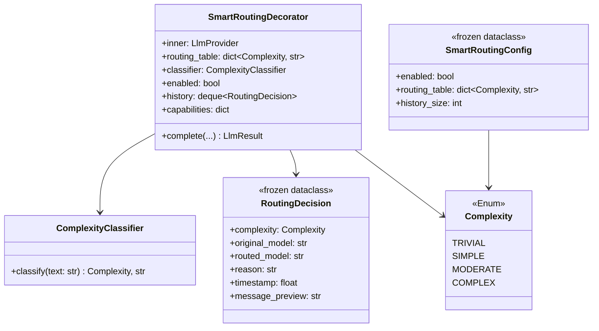

## Context

Promoted from [frame](../frames/134-llm-smart-routing-frame.mdx). All blocking dependencies resolved (#76 LlmProvider, #104 circuit breaker). The decorator chain pattern (`CircuitBreaker → Retry → Driver`) is proven and ready for extension.

## Goal

Route each user message to the cheapest/fastest model that can handle its complexity, using a zero-cost heuristic classifier and TOML-configured routing table — disabled by default.

## Users

- **Primary:** Lyra end-user (Mickael) — faster responses for trivial/simple queries, lower API cost
- **Secondary:** Agent system — structured extension point for future SLM/local model routing

## Expected Behavior

1. User sends a message (e.g., "hello" or "explain the decorator pattern in detail")
2. If smart routing is **disabled** (default), the message flows through unchanged — existing behavior preserved
3. If smart routing is **enabled**:
   a. The `ComplexityClassifier` scores the message text using heuristics (token count, question type, keyword signals)
   b. It returns a `Complexity` level: `TRIVIAL`, `SIMPLE`, `MODERATE`, or `COMPLEX`
   c. The `SmartRoutingDecorator` looks up the target model from the routing table for that level
   d. It replaces `model_cfg.model` with the target model and forwards to the inner provider
   e. The routing decision (complexity + chosen model + reasoning) is logged and stored in a ring buffer
4. Admin sends `/routing` → sees last N routing decisions with complexity, model, and message preview
5. If the classifier raises an exception, the decorator falls back to the original model (no disruption)

## Data Model & Consumers



```mermaid
flowchart LR
    subgraph "This issue"
        SRD[SmartRoutingDecorator] -->|reads| RT[routing_table]
        SRD -->|calls| CC[ComplexityClassifier]
        SRD -->|stores| RD[RoutingDecision history]
        CMD[/routing command] -->|reads| RD
    end

    subgraph "Existing"
        CBD[CircuitBreakerDecorator] -->|wraps| SRD
        SRD -->|wraps| RetryD[RetryDecorator]
        RetryD -->|wraps| SDK[AnthropicSdkDriver]
    end

    subgraph "Future (dashed)"
        SLM[SLM classifier] -.->|replaces| CC
        LOCAL[Local model driver] -.->|new entry in| RT
    end
```

| Consumer | Fields | When | Status |
|----------|--------|------|--------|
| `SmartRoutingDecorator.complete()` | `Complexity`, routing_table | Every LLM call | This issue |
| `/routing` admin command | `RoutingDecision` history (deque) | On admin request | This issue |
| Future SLM classifier | `Complexity` enum | Classification | Future |
| Future cost tracker | `RoutingDecision.routed_model` | Post-call | Future |

## Out of Scope

- SLM-backed classifier (future — requires Machine 2 inference endpoint)
- Local model routing (future — depends on voiceCLI/inference infra)
- Dynamic routing based on load/latency
- Cost tracking/budgeting per complexity tier

## TOML Configuration Example

```toml
[agent.smart_routing]
enabled = false  # opt-in, disabled by default

[agent.smart_routing.models]
trivial  = "claude-haiku-4-5-20251001"
simple   = "claude-haiku-4-5-20251001"
moderate = "claude-sonnet-4-6"
complex  = "claude-sonnet-4-6"
```

## Breadboard

### Affordances

| ID | Element | Location |
|----|---------|----------|
| U1 | `/routing` command | Chat input (admin-only) |

### Handlers

| ID | Handler | Triggered by |
|----|---------|-------------|
| N1 | `ComplexityClassifier.classify(text)` | Every `SmartRoutingDecorator.complete()` call |
| N2 | `SmartRoutingDecorator.complete()` | LLM call from agent |
| N3 | `/routing` command handler | U1 |

### Data / Services

| ID | Store | Accessed by |
|----|-------|-------------|
| S1 | `SmartRoutingConfig` (from TOML) | N2 (enabled check + routing table) |
| S2 | `RoutingDecision` ring buffer (deque, in-memory) | N2 (write), N3 (read) |

### Wiring

```
U1 → N3 → S2 → formatted table response
Agent LLM call → N2 → [S1 enabled?] → N1 → [S1 routing_table] → inner.complete() → S2 (log decision)
```

## Slices

| # | Slice | Deliverable | Demo |
|---|-------|-------------|------|
| 1 | Classifier + decorator core | `ComplexityClassifier`, `SmartRoutingDecorator`, `SmartRoutingConfig` dataclass, TOML parsing, integration into provider stack in `__main__.py` | Enabled in config → "hello" routes to haiku, "explain X in detail" routes to sonnet |
| 2 | Admin command + observability | `/routing` command showing last N decisions | Admin sends `/routing` → sees table of recent routing decisions |

## Success Criteria

- [ ] `Complexity` enum with 4 levels: TRIVIAL, SIMPLE, MODERATE, COMPLEX
- [ ] `ComplexityClassifier.classify(text)` returns `(Complexity, reason_str)` using heuristics (token count, question markers, keyword signals)
- [ ] `SmartRoutingDecorator` wraps any `LlmProvider`, overrides `model_cfg.model` based on routing table
- [ ] When `enabled = false` (default), decorator passes through unchanged — zero overhead
- [ ] When classifier raises, falls back to original model and logs warning
- [ ] Routing table loaded from TOML `[agent.smart_routing.models]` section
- [ ] `RoutingDecision` dataclass stored in capped deque (default 50 entries)
- [ ] `/routing` admin command displays last N routing decisions capped by `history_size` (default 50) — shows complexity, model, message preview, timestamp
- [ ] Stack order: `CircuitBreaker → SmartRouting → Retry → Driver` (routing outside retry so retries use the routed model)
- [ ] `SmartRoutingDecorator` creates a copy of `model_cfg` with the routed model via `dataclasses.replace()` — never mutates the caller's instance
- [ ] `SmartRoutingDecorator.capabilities` forwarded from `inner.capabilities` at init (consistent with existing decorators)
- [ ] Unit tests: each complexity level routes to correct model; disabled passthrough; classifier failure fallback
