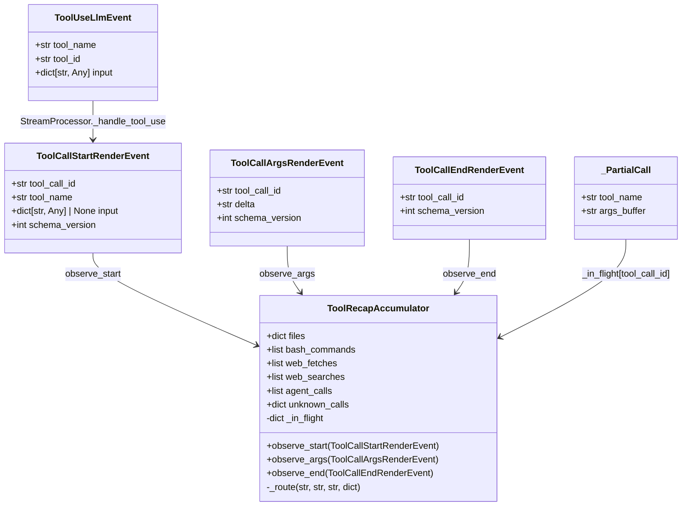
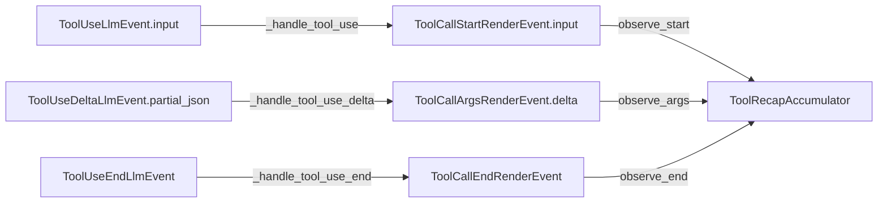

## Context

Issue #1348 — production smoke test 2026-05-25 showed tool-recap cards rendering as bare "🔧 Done ✅" with empty body. Root cause: boundary-contract drift between cli_pool NATS path (collapses tool input into single `tool_use` chunk) and v2 ToolCall* render protocol (expects streamed `InputJsonDelta` events). `StreamProcessor._handle_tool_use` ignores `ToolUseLlmEvent.input`, so `ToolRecapAccumulator` sees empty `args_buffer`.

## Goal

Tool recaps render complete argument lists for **both** clipool-originated (single-chunk) and SDK-streamed (delta) tool calls, with zero regression on the existing delta path.

## Users

- **Primary:** Telegram/Discord users receiving tool-recap cards after clipool-originated tool calls
- **Secondary:** Developers debugging tool-call flows (recap is the primary observable output)

## Expected Behavior

When a clipool worker emits a `ToolUseLlmEvent` with `input={...}` (full args dict), the recap card must show the tool's arguments (e.g. `💻 git log ...` for a `Bash` call, `✏️ /path/to/file` for an `Edit` call). When the SDK driver emits `ToolUseDeltaLlmEvent` fragments, the recap card must continue to accumulate them via `args_buffer` + `observe_end` as before.

**Critical nuance:** `ToolUseLlmEvent.input` defaults to `{}` on the SDK path (empty dict, not `None`). `_handle_tool_use` must map empty dict → `None` when constructing `ToolCallStartRenderEvent`; otherwise `observe_start` sees a "present" field and routes prematurely with empty args, breaking the delta path.

## Data Model & Consumers

### classDiagram

### Consumer map

### Consumer summary

| Consumer | Field consumed | When | Status |
|---|---|---|---|
| `StreamProcessor._handle_tool_use` | `ToolUseLlmEvent.input` | On `tool_use` chunk (clipool path) | this issue |
| `ToolRecapAccumulator.observe_start` | `ToolCallStartRenderEvent.input` | When `input` is present | this issue |
| `ToolRecapAccumulator.observe_args` | `ToolCallArgsRenderEvent.delta` | On each delta chunk (SDK path) | existing |
| `ToolRecapAccumulator.observe_end` | `ToolCallEndRenderEvent.tool_call_id` | On content_block_stop (SDK path) | existing |
| `NatsRenderEventCodec` | `ToolCallStartRenderEvent` (all fields) | Hub→Adapter wire serialization | this issue (round-trip) |
| `OutboundEmitter._on_toolcall_v2` | `ToolCallStartRenderEvent` (via `_tool_recap`) | Adapter-side recap render | existing |

## Out of Scope

- Changing `cli_pool` worker to emit delta events (rejected — fake streaming, major contract bump)
- Modifying `OutboundEmitter` render format or per-platform formatter behavior
- Backfilling historical recaps (only forward-looking fix)
- Per-platform args-streaming feature (Discord live arg-typing display, originally #1134)
- `ToolDisplayConfig` wiring → Phase B (#1336)

## Breadboard

| ID | Affordance | Handler | Data |
|---|---|---|---|
| N1 | `ToolUseLlmEvent` arrives with `input` populated | `StreamProcessor._handle_tool_use` | forwards `input` to `ToolCallStartRenderEvent.input` |
| N2 | `ToolCallStartRenderEvent` with `input` present | `ToolRecapAccumulator.observe_start` | calls `_route` immediately; **skips adding to `_in_flight`** so `observe_end` naturally no-ops (`partial is None`) |
| N3 | `ToolCallStartRenderEvent` with `input` absent (or `None`) | `ToolRecapAccumulator.observe_start` | registers `_PartialCall` in `_in_flight` as before |
| N4 | `ToolUseDeltaLlmEvent` arrives | `StreamProcessor._handle_tool_use_delta` | emits `ToolCallArgsRenderEvent` (unchanged) |
| N5 | `ToolUseEndLlmEvent` arrives | `StreamProcessor._handle_tool_use_end` | emits `ToolCallEndRenderEvent` (unchanged) |
| N6 | `ToolCallEndRenderEvent` arrives for pre-routed call | `ToolRecapAccumulator.observe_end` | no-op (`partial is None`) — `observe_start` did not register in `_in_flight` |
| N6b | `ToolCallArgsRenderEvent` arrives for pre-routed call | `ToolRecapAccumulator.observe_args` | no-op (`partial is None`) — same mechanism as N6 |
| N7 | `ToolCallEndRenderEvent` arrives for buffered call | `ToolRecapAccumulator.observe_end` | parses `args_buffer` + `_route` as before |
| N8 | `NatsRenderEventCodec.encode/decode` | generic `_make_std_encode` / `_make_std_decode` | round-trips new optional field with no codec code change |

## Slices

| # | Slice | Files | Acceptance Criteria |
|---|---|---|---|
| 1 | **Additive field + forwarding** | `render_events.py`, `events.py`, `stream_processor.py` | `ToolCallStartRenderEvent` has optional `input`; `_handle_tool_use` forwards `ToolUseLlmEvent.input`; `ToolUseLlmEvent` docstring updated |
| 2 | **Accumulator routing** | `_tool_recap.py` | `observe_start` routes immediately when `input` present; `observe_end` no-ops for pre-routed calls; existing delta path unchanged |
| 3 | **Test + codec verification** | `test_stream_processor.py`, `test_tool_recap.py`, `test_render_event_codec.py` or new file | Clipool-style input test; pre-routed `observe_start` test; codec round-trip with `input` field; all quality gates pass |

## Success Criteria

- [ ] `ToolCallStartRenderEvent.input` optional dataclass field added (default `None`, additive)
- [ ] `SCHEMA_VERSION_TOOL_CALL_START_RENDER_EVENT` stays `1` — no schema version bump (additive optional field, old adapters ignore unknown keys)
- [ ] `StreamProcessor._handle_tool_use` forwards `ToolUseLlmEvent.input` to `ToolCallStartRenderEvent.input`, mapping empty dict `{}` → `None` to avoid breaking SDK delta path
- [ ] `ToolRecapAccumulator.observe_start` routes immediately when `event.input` is present and **skips adding to `_in_flight`**
- [ ] `ToolRecapAccumulator.observe_end` is a no-op for calls already routed by `observe_start` (natural via `partial is None`)
- [ ] Existing streamed-delta path still works (synthetic `ToolUseDelta` events still populate args via `args_buffer`)
- [ ] `NatsRenderEventCodec` round-trip preserves `ToolCallStartRenderEvent.input` with no codec code change
- [ ] End-to-end: `format_recap_lines` for a clipool-style `Bash` call with `input={"command": "git log"}` produces a line containing `💻 git log`
- [ ] All quality gates pass: ruff, pyright, pytest, importlinter
- [ ] CHANGELOG entry under `[Unreleased]` — Fixed
