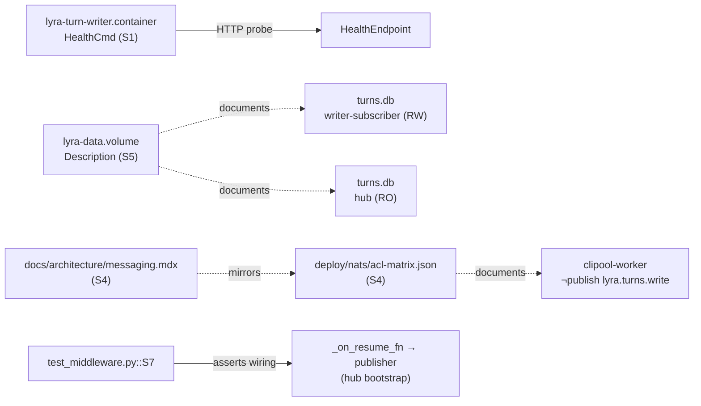

## Context

Promoted from `artifacts/frames/1349-turnwriter-cleanups-frame.mdx`. Bundles 6 deferred review suggestions from PR #1347 (TurnStore α-refactor, closed #1331). Three are operational risks (S1 HealthCmd, S2 error handling, S3 private-API coupling); three are doc/test debt (S4 ACL doc, S5 volume desc, S7 test assertion).

**Drift reconciliation** (surfaced by `/recheck` + expert review):

| Issue body claim | Current truth | Action |
|---|---|---|
| S1: `HealthCmd=pgrep -f "lyra turn-writer"` | `HealthCmd=grep -q turn-writer /proc/1/cmdline` (#1370, 0ad98131) | Replace from current shape, not from pgrep |
| S1: `curl -fsS http://...` for HTTP probe | `curl` is **not in `base-svc` image** (Image=`ghcr.io/roxabi/lyra:staging-svc` → `base-svc`, which installs only `ca-certificates`). `python3` is present (image is `python:3.12-slim`-derived). | Use Python urllib probe: `HealthCmd=python3 -c "import urllib.request,sys; sys.exit(0 if urllib.request.urlopen('http://127.0.0.1:8083/health',timeout=3).status==200 else 1)"` (no `"` after Quadlet-lint — argv-quoted form actually contains `"`; see S1 implementation note below for the lint-safe form) |
| S4 target: `acl-matrix.json` + `docs/architecture/messaging.mdx` | actual: `deploy/nats/acl-matrix.json` + `docs/architecture/messaging.md` (not `.mdx`) | Path-corrected targets |
| S4 framing: "writes flow through hub publisher" | actual publish set for `lyra.turns.write`: `hub`, `telegram-adapter`, `discord-adapter` (all 3 acquired the grant via #1331 T27). `clipool-worker` excluded by design. | S4 must document the **actual** 3-publisher set and the `clipool-worker` exclusion rationale (downstream command worker, not a user-message source — upstream adapter already records the turn). |
| S7 target: `tests/integration/test_on_resume_callback.py` | actual: `tests/core/test_middleware.py:209` | Edit in `tests/core/test_middleware.py` |

## Goal

Ship a single PR closing #1349 that applies all 6 items: turn-writer health check returns application liveness over HTTP (S1), consume loop logs non-Timeout NATS errors before re-raising (S2), JetStream setup uses only public `nats-py` API (S3), `clipool-worker` exclusion from `lyra.turns.write` is documented in both ACL matrix and architecture doc (S4), `lyra-data.volume` description names the writer-subscriber as `turns.db` writer (S5), and the wiring test for `_on_resume_fn` asserts the callable actually invokes the publisher (S7).

## Users

- **Primary:** TurnWriter subsystem owner (any contributor touching `src/lyra/infrastructure/turn_writer/`).
- **Secondary:**
  - Ops / on-call — gains real health signal (S1) and visible NATS-disconnect logs (S2).
  - Future `nats-py` upgrader — no breakage from `_jsm` private-API access (S3).
  - Doc readers (`docs/architecture/messaging.mdx`, ACL matrix) — gain clipool exclusion rationale (S4).
  - CI regression coverage of #1331 wiring — gains strong assertion on `_on_resume_fn` (S7).

## Expected Behavior

Walkthrough per item:

- **S1 — HTTP health.** `systemctl --user status lyra-turn-writer` reports `Active: active (running)` and the unit health probe (Python `urllib.request` against `http://127.0.0.1:8083/health`) returns success only when the FastAPI/uvicorn health endpoint (already shipped per `src/lyra/infrastructure/turn_writer/health.py`, bound to `:8083` by `_bootstrap_turn_writer_standalone`) is reachable AND returns HTTP 200. A crashed-but-process-alive scenario (consume loop deadlocked, uvicorn down) flips `--health` to red, where the current `grep /proc/1/cmdline` would stay green. `HealthOnFailure=kill` is explicitly added (not currently present in the unit) so a failed probe forces process exit, which combines with the existing `Restart=on-failure RestartSec=10` to recycle the unit.
- **S2 — Logged disconnect.** A NATS broker restart during operation triggers `nats.errors.ConnectionClosedError` inside `_consume_loop`. The catch is added to the **outer** `try/except` wrapping `await self._sub.fetch(...)` at `writer.py:113-121` (alongside the existing `TimeoutError` and `CancelledError` clauses), **not** to the inner per-message `try/except` at `writer.py:128-140`. The writer logs `warning("TurnWriter: NATS connection lost, will exit and let Quadlet restart: %s", err)` then re-raises, causing Quadlet's `Restart=on-failure RestartSec=10` to recycle the unit. Operators see the cause in `journalctl --user -u lyra-turn-writer` instead of a silent loop exit.
- **S3 — Public-API only.** `grep -rn "_jsm\|jsm\." src/lyra/infrastructure/turn_writer/` returns no matches. `stream_setup.py` calls only documented `JetStreamContext` methods (e.g. `js.stream_info`, `js.add_stream`, `js.consumer_info`, `js.add_consumer`). A `pip install nats-py==<future>` that hides `_jsm` does not break boot.
- **S4 — Documented exclusion.** `deploy/nats/acl-matrix.json`'s `clipool-worker` entry gets a `notes` field (existing convention — every other active identity already has one; `clipool-worker` is the only active entry currently missing it) stating it is **intentionally excluded** from publishing on `lyra.turns.write`. Rationale: clipool is a downstream command worker (executes `lyra.clipool.cmd` dispatches), not a user-message source — the upstream adapter has already recorded the turn before dispatch reaches clipool. Active publishers are `hub`, `telegram-adapter`, `discord-adapter` (all per #1331 T27). `docs/architecture/messaging.md` (note: `.md`, not `.mdx`) gets a `> Note:` paragraph **directly beneath the Persistence-plane row at line 110** (`| Persistence | lyra.turns.> | ... | hub | turn-writer | ...`) updating the publisher cell to enumerate `hub, telegram-adapter, discord-adapter` AND adding the clipool exclusion rationale. Same scope as the ACL note — no other doc surfaces edited.
- **S5 — Accurate volume description.** `deploy/quadlet/lyra-data.volume` `[Unit] Description=` text names the writer-subscriber (e.g. `turn-writer`) as the sole writer for `turns.db`; the hub is described as `ro` consumer for that file. Other files in the volume (`auth.db`, `config.db`, `keyring.key`, `message_index.db`) retain their hub-writer wording.
- **S7 — Strict assertion.** `tests/core/test_middleware.py::test_on_resume_fn_wired_when_turn_publisher_present` (line 209) **removes** the weak `assert ctx.pool._on_resume_fn is not None` check and **adds** `await ctx.pool._on_resume_fn("<session-id>")` followed by `publisher.publish_increment_resume_count.assert_awaited_once_with(<expected kwargs>)`. Stubbing the closure or removing the publisher wire from hub bootstrap makes the test fail loudly.

## Data Model & Consumers

The bundle is a cross-cut — 4 surfaces (Quadlet, Python code, ACL doc, test) wired by the single `TurnWriter` subsystem. No new data types; only one error class is referenced by name.

```mermaid
classDiagram
  class TurnWriter {
    +async run()
    +async _consume_loop()
  }
  class StreamSetup {
    +ensure_stream(js)
    +ensure_consumer(js)
  }
  class HealthEndpoint {
    +GET /health -> 200
  }
  class JetStreamContext {
    <<nats-py public>>
    +stream_info()
    +add_stream()
    +consumer_info()
    +add_consumer()
  }
  class NATSErrors {
    <<nats-py>>
    TimeoutError
    ConnectionClosedError
  }

  TurnWriter --> HealthEndpoint : exposes :8083/health
  TurnWriter --> StreamSetup : calls at boot
  StreamSetup ..> JetStreamContext : MUST use only public API (S3)
  TurnWriter ..> NATSErrors : _consume_loop catches both (S2)
```



**Consumer summary:**

| Consumer | Reads / depends on | When | Status |
|---|---|---|---|
| systemd `lyra-turn-writer` unit | `HealthCmd` exit code | per `HealthCheckInterval` | this issue (S1) |
| Operator (`journalctl`) | `log.warning(...)` on `ConnectionClosedError` | on NATS disconnect | this issue (S2) |
| `nats-py` future versions | public `JetStreamContext` API | every boot of writer | this issue (S3) |
| ACL operator (reading matrix) | comment/notes on `clipool-worker` | on incident triage | this issue (S4) |
| `docs/architecture/messaging.mdx` reader | clipool row | on design review | this issue (S4) |
| Volume description reader | `[Unit] Description=` text | on deploy / onboarding | this issue (S5) |
| CI (`pytest tests/core/test_middleware.py`) | strict S7 assertion | every PR | this issue (S7) |
| Hub bootstrap (`W4` fix from #1347) | `_turn_publisher` attribute | runtime | already shipped (#1347) |

## Breadboard

Each item maps to a single target file + handler edit:

| ID | File | Current state | Target state | Owner-domain |
|---|---|---|---|---|
| S1 | `deploy/quadlet/lyra-turn-writer.container:37` + new `HealthOnFailure=` line | `HealthCmd=grep -q turn-writer /proc/1/cmdline` ; no `HealthOnFailure=` | Replace `HealthCmd=` with a Python `urllib`-based probe against `http://127.0.0.1:8083/health` (form below). Add `HealthOnFailure=kill` to the `[Container]` section. The probe form must use single-quotes only (Quadlet-lint `quadlet-lint.yml` rejects double-quotes in `HealthCmd=`). Concrete form: `HealthCmd=python3 -c 'import urllib.request,sys; r=urllib.request.urlopen("http://127.0.0.1:8083/health",timeout=3); sys.exit(0 if r.status==200 else 1)'` — fixer must verify the quadlet-lint regex (the lint flags only **`"` characters**; the inner argv-form `"http://..."` lives inside single quotes and is the Python-source string delimiter, not the shell-argument delimiter — but the LINT IS NAIVE and scans `HealthCmd=` line for `"` directly, so the inner `"` will trip it). **Implementation alternative if lint trips:** rewrite Python source without `"` by using single-quote strings inside the outer single-quoted argument, e.g. `HealthCmd=python3 -c $'import urllib.request,sys\nr=urllib.request.urlopen(\\'http://127.0.0.1:8083/health\\',timeout=3)\nsys.exit(0 if r.status==200 else 1)'` — clunky but lint-clean. Cleanest path is to **also amend `.github/workflows/quadlet-lint.yml` to allow double-quotes inside `HealthCmd=` when the line uses `python3 -c '…'` form** (lint was added by #1370 to catch a specific generator bug; the curl-form constraint is the bug it caught, not a general ban). Fixer chooses one of the three paths in this order of preference: (a) lint amendment + plain-form HealthCmd ; (b) `$'…'` ANSI-C quoting form ; (c) refactor `_check_dq` regex narrowly. | devops |
| S2 | `src/lyra/infrastructure/turn_writer/writer.py:113-121` (**outer** try/except wrapping `await self._sub.fetch(...)`) | `except nats.errors.TimeoutError: continue` ; `except asyncio.CancelledError: return` | **Add** `except nats.errors.ConnectionClosedError as err: log.warning("TurnWriter: NATS connection lost, will exit and let Quadlet restart: %s", err); raise` in the **outer** try/except (NOT in the inner `for msg in msgs:` block at `writer.py:128-140`). Keep `TimeoutError` swallowing and `CancelledError` early-return unchanged. | backend |
| S3 | `src/lyra/infrastructure/turn_writer/stream_setup.py:104,108` (verified by `grep -n "_jsm" stream_setup.py` 2026-05-26) | `js._jsm.consumer_info(STREAM_NAME, CONSUMER_NAME)  # noqa: SLF001`, `js._jsm.add_consumer(STREAM_NAME, config=cfg)  # noqa: SLF001` | Replace with `js.consumer_info(STREAM_NAME, CONSUMER_NAME)`, `js.add_consumer(STREAM_NAME, config=cfg)`. Drop the `# noqa: SLF001` directives. Verify: `grep -rn "_jsm\\|jsm\\." src/lyra/infrastructure/turn_writer/` returns 0 hits post-edit. `NotFoundError` / `BadRequestError` raised by these methods on 404 / 400 NATS API responses remain unchanged — semantics are preserved (architect-verified against nats-py 2.14.0). | backend |
| S4a | `deploy/nats/acl-matrix.json` `clipool-worker` entry (lines 198-216 area) | no `notes` field on `clipool-worker` (every other active identity already has one — see `turn-writer`, `telegram-adapter`, `discord-adapter`, `hub` for pattern) | Add a `notes` field after `description`, prose: `"clipool-worker is intentionally excluded from publishing lyra.turns.write. Rationale: clipool is a downstream command worker (executes lyra.clipool.cmd dispatches), not a user-message source — the upstream adapter has already recorded the turn via lyra.turns.write before dispatch reaches clipool. Active publishers of lyra.turns.write: hub, telegram-adapter, discord-adapter (all per #1331 T27). See ADR-075."` | doc-writer |
| S4b | `docs/architecture/messaging.md:110` (Persistence-plane row) | row reads `\| Persistence \| lyra.turns.> \| JetStream durable (...) \| durable \| hub \| turn-writer \| ...` — publisher cell lists `hub` only | (1) Update the publisher cell from `hub` to `hub, telegram-adapter, discord-adapter`. (2) Insert a `> Note:` paragraph directly beneath the row noting clipool-worker is intentionally excluded per ADR-075, same rationale as S4a. | doc-writer |
| S5 | `deploy/quadlet/lyra-data.volume:2` | `Description=Lyra data bind-mount — Hub only (auth.db, config.db, keyring.key, message_index.db, turns.db)` | `Description=Lyra data bind-mount — Hub (RW: auth.db, config.db, keyring.key, message_index.db) + TurnWriter sole writer turns.db (ADR-075). Hub mounts turns.db ro.` (≈148 chars, comma-separated, no overload) | doc-writer |
| S7 | `tests/core/test_middleware.py:209-226` | `assert ctx.pool._on_resume_fn is not None` (and surrounding setup) | Remove the weak `is not None` assertion. Add: `await ctx.pool._on_resume_fn("test-session-id")` then `publisher.publish_increment_resume_count.assert_awaited_once_with(pool_id=..., session_id="test-session-id", platform=..., user_id=..., target_count=1, trace_id=...)` (kwargs match the existing `test_on_resume_fn_calls_publisher` signature at `test_middleware.py:118-126`). The closure now must actually wire to the publisher — not just be non-None. | tester |

Wiring: S1 wires Quadlet probe → existing `:8083/health` (already shipped per T30 in #1331; verify endpoint binds before merge). S2 wires error class → log → re-raise → Quadlet restart loop. S3 has no wiring change — pure API substitution. S4/S5 wire docs to current reality. S7 wires test assertion → publisher mock contract.

## Slices

Three independently demo-able vertical slices, each shippable as its own commit inside the PR:

| Slice | Items | Demo | Risk |
|---|---|---|---|
| **A — Ops robustness** | S1, S2, S3 | `systemctl --user restart lyra-turn-writer` → unit healthy via Python `urllib` probe; `nats-server` SIGSTOP → log shows `ConnectionClosed` warning before exit; `grep -rn "_jsm" src/lyra/infrastructure/turn_writer/` returns 0 hits; Quadlet lint workflow green (with lint regex amendment if needed) | Real prod path — Quadlet, error handling, NATS API surface, potential lint amendment |
| **B — Documentation** | S4, S5 | `jq '.identities."clipool-worker".notes' deploy/nats/acl-matrix.json` mentions `lyra.turns.write` exclusion; `grep -A2 "clipool" docs/architecture/messaging.mdx` shows exclusion row; `head -3 deploy/quadlet/lyra-data.volume` description names writer-subscriber | Doc only — zero runtime risk |
| **C — Test strictness** | S7 | Stub `hub._turn_publisher = None` → S7 test fails (regression catch); restore publisher → S7 passes; baseline `pytest tests/core/test_middleware.py -k test_on_resume` green | Pure test — zero runtime risk |

Slice order: A first (highest value, real coverage gap), B second (docs), C last (smallest, fastest to verify). All three land in the same PR — slicing is for review legibility and commit hygiene, not for separate ship.

## Success Criteria

- [ ] `deploy/quadlet/lyra-turn-writer.container` HealthCmd performs a `python3 -c` HTTP probe against `http://127.0.0.1:8083/health` and exits non-zero on non-200 / unreachable; the `grep /proc/1/cmdline` form is removed (S1).
- [ ] `deploy/quadlet/lyra-turn-writer.container` `[Container]` section contains `HealthOnFailure=kill` (explicit new directive — was not present pre-#1349) (S1).
- [ ] Quadlet lint (`.github/workflows/quadlet-lint.yml`) passes on the updated unit; if the existing lint regex rejects the new `HealthCmd=` line, the lint regex is amended (narrowest possible change) and the amendment is justified inline (S1).
- [ ] `src/lyra/infrastructure/turn_writer/writer.py:113-121` (outer `try/except` around `await self._sub.fetch(...)`) catches `nats.errors.ConnectionClosedError`, emits `log.warning("TurnWriter: NATS connection lost, will exit and let Quadlet restart: %s", err)`, then re-raises. The inner per-message `try/except` at `writer.py:128-140` is unchanged (S2).
- [ ] `grep -rn "_jsm" src/lyra/infrastructure/turn_writer/` returns zero matches; stream/consumer bootstrap calls only public `JetStreamContext` methods (`stream_info`, `add_stream`, `consumer_info`, `add_consumer`) (S3).
- [ ] `deploy/nats/acl-matrix.json` `clipool-worker` entry has a new `notes` field (existing convention — matches the shape used by every other active identity) explaining the intentional exclusion from `lyra.turns.write`, naming the active publishers (`hub, telegram-adapter, discord-adapter`), and referencing ADR-075 (S4a).
- [ ] `docs/architecture/messaging.md` (note `.md` extension) Persistence-plane row at line 110 has its publisher cell updated from `hub` to `hub, telegram-adapter, discord-adapter`, and a `> Note:` paragraph beneath it records the clipool-worker exclusion rationale (S4b).
- [ ] `deploy/quadlet/lyra-data.volume:2` `Description=` text reads `Lyra data bind-mount — Hub (RW: auth.db, config.db, keyring.key, message_index.db) + TurnWriter sole writer turns.db (ADR-075). Hub mounts turns.db ro.` (or a phrasing that disambiguates the `turns.db` writer from the hub while keeping all other files attributed to hub) (S5).
- [ ] `tests/core/test_middleware.py:209-226` no longer contains `assert ctx.pool._on_resume_fn is not None`; instead `await ctx.pool._on_resume_fn("<session-id>")` is invoked and `publisher.publish_increment_resume_count.assert_awaited_once_with(...)` asserts the wired kwargs (S7).
- [ ] All edited files pass project quality gates: `uv run ruff check .`, `uv run pyright`, `uv run pytest tests/core/test_middleware.py tests/integration/`, and Quadlet lint (`.github/workflows/quadlet-lint.yml`).
- [ ] PR body links #1349 (closes) and references #1347 as the parent review.

## Out of Scope (this PR) / Follow-ups

- **S6** — explicitly skipped in the original PR #1347 review; not in this bundle.
- **Cross-Quadlet HealthCmd unification beyond `lyra-turn-writer`** — #1370 already migrated other `lyra-*` units to `grep /proc/1/cmdline`. If S1 establishes the Python-`urllib` HTTP form as the new pattern (and lint allows it), unifying the other units is a separate cleanup tracked elsewhere.
- **ACL-matrix adapter-axis duplication of `lyra.turns.write` publish grants** — surfaced by axial review (axial ADR-073). The grant is currently replicated across 3 sibling entries (`hub`, `telegram-adapter`, `discord-adapter`); evaluating whether to consolidate into a shared role / group / centralised grant model is out of scope here. **Follow-up issue to file:** "Evaluate ACL-matrix consolidation for multi-publisher subjects (lyra.turns.write tri-replication)" — to be opened post-merge.
- **`base-svc` image gaining `curl`** — devops surfaced as alternative to the Python urllib approach. Out of scope (cross-repo `roxabi-ml-base` change); the Python form is self-contained here.
- **Tighter per-operation JetStream API scoping for `hub`, adapters** — existing follow-up already tracked in current `acl-matrix.json` `notes` ("Tighter per-operation scoping … tracked as a follow-up").
