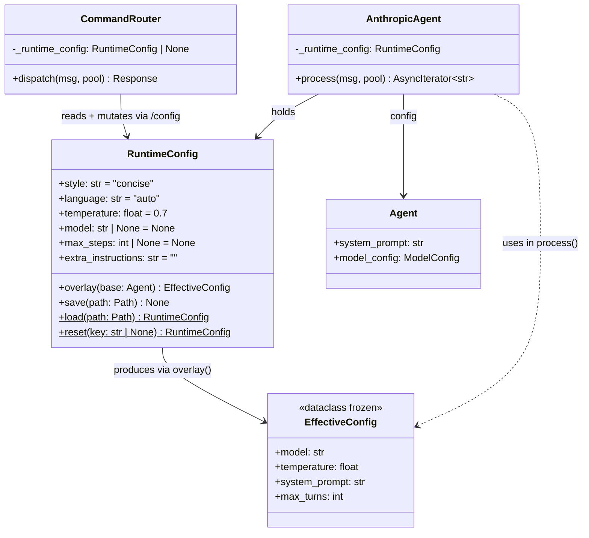

## Context

Promoted from approved frame `135-runtime-agent-config-frame.mdx`.
Phase 1b of the agent core (#73). Builds on persona system (#75) and
`AnthropicAgent` (#76, closed — implementation can start immediately).

## Goal

Add a `RuntimeConfig` layer that lets Mickael tune Lyra's behavior live
(`/config style=concise`) from Telegram or Discord without restarting the
process, with changes persisted across restarts.

## Users

- **Primary:** Mickael — types `/config key=value` mid-conversation to adjust
  style, temperature, or model without leaving the chat
- **Secondary:** Scripts/monitoring — reads effective config via `GET /config`

## Expected Behavior

### `/config` command (admin-only)

Command uses the `/` prefix consistent with `/circuit` and `/help`. (The issue
uses `!config` but `CommandRouter._COMMAND_RE` only matches `/`-prefixed
messages; `/config` is the correct form. The `!` notation in the issue is
informal, not prescriptive.)

```
/config                          → show current runtime config (formatted table)
/config style=concise            → set one param
/config temperature=0.3 model=haiku  → set multiple at once
/config reset                    → restore all to defaults (deletes lyra_runtime.toml)
/config reset temperature        → restore one param to default
```

**Show output** (`/config` with no args):
```
Runtime Config
─────────────────────────────────
  style              concise
  language           auto
  temperature        0.7
  model              (persona default)
  max_steps          (model default)
  extra_instructions (none)
─────────────────────────────────
Persisted: agents/lyra_runtime.toml
```

**Set output** (`/config style=detailed`):
```
Updated: style = detailed
Saved to agents/lyra_runtime.toml
```

**Reset output** (`/config reset`):
```
Runtime config reset to defaults.
```

**Error cases:**
- Unknown key → `Unknown param: foo. Valid: style, language, temperature, model, max_steps, extra_instructions`
- Invalid value → `Invalid value for temperature: must be float 0–1`
- Non-admin → `This command is admin-only.`

### Overlay behavior per parameter

| Parameter | Default | Effect on API call |
|-----------|---------|-------------------|
| `style` | `concise` | Appends style instruction to effective system prompt (see Style Mapping). `concise` = no injection (quiet default). |
| `language` | `auto` | Appends `"Reply in {language}."` to effective system prompt if not `auto` |
| `temperature` | `0.7` | Sets `temperature` kwarg in `messages.create()` — always passed explicitly, even at default |
| `model` | `None` (persona default) | Overrides `model` kwarg in `messages.create()` when set |
| `max_steps` | `None` (model default) | Overrides the `max_turns` loop limit in `process()` when set |
| `extra_instructions` | `""` | Appended to effective system prompt after style/language |

**Style Mapping** (injected at end of system prompt, before `extra_instructions`):

| Style | Injected text |
|-------|--------------|
| `concise` | *(no injection — quiet default)* |
| `detailed` | `"Provide thorough, detailed explanations. Elaborate on context and reasoning."` |
| `technical` | `"Use precise technical language. Prefer exact terms over approximations."` |
| `friendly` | `"Be warm and conversational. Use an approachable, casual tone."` |

These strings are tunable defaults — adjust wording freely without breaking tests
(tests assert the injected content matches whatever is defined, not a hardcoded string).

**Effective system prompt composition order:**
```
base_system_prompt          ← Agent.system_prompt (persona-composed at load time)
+ "\n\n" + style_instruction   ← only if style != "concise" (i.e., non-empty)
+ "\n\n" + f"Reply in {language}."   ← only if language != "auto"
+ "\n\n" + extra_instructions         ← only if extra_instructions != ""
```

`max_steps` (loop limit) and `max_tokens: 4096` (response token cap) are
independent. `max_steps` overrides `model_config.max_turns`; `max_tokens` is
always 4096 and is unaffected.

### `GET /config` endpoint

Returns effective config as JSON. No auth required (health app is local-only on 127.0.0.1).
If the registered agent is not an `AnthropicAgent` (e.g., `SimpleAgent`), return HTTP 404
with `{"detail": "runtime config not available for this agent backend"}`.

```json
{
  "style": "concise",
  "language": "auto",
  "temperature": 0.7,
  "model": null,
  "max_steps": null,
  "extra_instructions": "",
  "effective_model": "claude-haiku-4-5-20251001",
  "effective_max_steps": 10
}
```

`effective_model = runtime_config.model or agent.model_config.model`
`effective_max_steps = runtime_config.max_steps or agent.model_config.max_turns`

`persisted` field omitted — use `GET /config` to show state, not to signal file status.

### Persistence

- File: `src/lyra/agents/lyra_runtime.toml` (resolved via `_AGENTS_DIR`)
- TOML format — only non-default values written:
  ```toml
  style = "detailed"
  temperature = 0.3
  ```
- Loaded at `AnthropicAgent.__init__()` if present; silently skipped if absent
- If file is **corrupt/unreadable** at startup: log a warning, use defaults, do not crash
- If file is **corrupt/unreadable** on `/config reset key`: fail safe — use defaults, warn user
- `/config reset` → delete file; in-memory defaults take effect immediately
- `/config reset temperature` → reload instance with that field reset, re-save remaining non-defaults
- `.gitignore` entry: `src/lyra/agents/lyra_runtime.toml`
- `temperature` at default (0.7) is NOT written to TOML (only non-defaults), but IS always sent to the API

**Hot-reload contract:** `_maybe_reload()` reloads the agent TOML and rebuilds
`CommandRouter`, but MUST NOT touch `_runtime_config`. The runtime config lives
exclusively on `AnthropicAgent` as a separate attribute. Only `__init__` loads it
from disk; `_maybe_reload` passes the existing `self._runtime_config` into the
rebuilt router — it never recreates it from the TOML path.

**Concurrent mutation:** All mutations to `self._runtime_config` must replace
the attribute (assign a new `RuntimeConfig` instance). Field-level mutation on a
shared instance is forbidden. This is naturally enforced by `reset()` returning a
new instance and `save()` being called after reassignment.

## Data Model & Consumers



Notes:
- `load()` and `reset()` are classmethods (static factory methods)
- `overlay()` receives the full `Agent` (not just `system_prompt` string) to access
  both `system_prompt` and `model_config` fields
- `EffectiveConfig` is `@dataclass(frozen=True)` — immutable value object

```mermaid
flowchart TD
    TG[Telegram user] -->|/config command| CMD[/config handler in CommandRouter]
    DC[Discord user] -->|/config command| CMD
    CMD -->|mutate + save| RC[RuntimeConfig]
    RC -->|overlay| AGA[AnthropicAgent.process]
    RC -->|read fields| GET[GET /config endpoint]

    AGA -->|effective model / temp / system_prompt| API[Anthropic Messages API]
    GET -->|JSON| SCRIPTS[scripts / monitoring]

    style CMD stroke-width:2px
    style AGA stroke-width:2px
```

| Consumer | Fields consumed | When | Status |
|----------|----------------|------|--------|
| `AnthropicAgent.process()` | all fields via `overlay()` | Every API call | This issue |
| `/config` command handler | all fields (read + mutate) | On command dispatch | This issue |
| `GET /config` endpoint | all fields (read) | On HTTP request | This issue |
| Future: per-session config | TBD | Future | Out of scope |

## Breadboard

### Affordances

| ID | Element | Handler | Data in | Data out |
|----|---------|---------|---------|---------|
| U1 | `/config` (no args) | `_cmd_config_show` builtin | `_runtime_config` | formatted table string |
| U2 | `/config key=value [key=value…]` | `_cmd_config_set` builtin | `_runtime_config`, parsed pairs | success/error string + file save |
| U3 | `/config reset` | `_cmd_config_reset` builtin | `_runtime_config` | "reset" string + file delete |
| U4 | `/config reset key` | `_cmd_config_reset` builtin (key arg) | `_runtime_config`, key | success/error + file re-save |
| N1 | `GET /config` | FastAPI endpoint | `hub.agent_registry["lyra_default"]._runtime_config` | JSON dict |
| N2 | `AnthropicAgent.process()` | `_runtime_config.overlay(self.config)` | `self._runtime_config`, `self.config` | `EffectiveConfig` applied to kwargs |

### Wiring

**`CommandRouter` extension:**
Add `runtime_config: RuntimeConfig | None = None` to `CommandRouter.__init__`
(same pattern as `circuit_registry`). Add `/config` to `_DEFAULT_BUILTINS`.
The handler methods `_cmd_config_show`, `_cmd_config_set`, `_cmd_config_reset`
are private methods on `CommandRouter` (same pattern as `_circuit_status`).

**`AgentBase` router rebuild hook:**
Extract a protected `_build_router_kwargs(self) -> dict` method on `AgentBase`
that returns `{}`. `AnthropicAgent` overrides it:
```python
def _build_router_kwargs(self) -> dict:
    return {"runtime_config": self._runtime_config}
```
The two inline `CommandRouter(...)` constructions in `_maybe_reload()` (lines ~474
and ~503) are updated to unpack `**self._build_router_kwargs()`. `AgentBase.__init__`
also uses it. This keeps `AgentBase` clean and extension-safe.

**`GET /config` wiring:**
`create_health_app(hub)` gains the `/config` route. Accesses the agent via
`hub.agent_registry.get("lyra_default")` (the dict already exists on `Hub`; no
new accessor needed). Guard: if agent is absent or not `AnthropicAgent`, return 404.

```python
@app.get("/config")
async def config_endpoint() -> dict:
    agent = hub.agent_registry.get("lyra_default")
    if not isinstance(agent, AnthropicAgent):
        raise HTTPException(status_code=404, detail="runtime config not available")
    rc = agent._runtime_config
    return {
        "style": rc.style,
        ...
        "effective_model": rc.model or agent.config.model_config.model,
        "effective_max_steps": rc.max_steps or agent.config.model_config.max_turns,
    }
```

## Slices

| # | Slice | Files | Demo-able |
|---|-------|-------|-----------|
| S1 | `RuntimeConfig` dataclass: fields, `overlay()`, `save()`, `load()`, `reset()` + tests | `src/lyra/core/runtime_config.py`, `tests/test_runtime_config.py` | `pytest tests/test_runtime_config.py` |
| S2 | `AnthropicAgent` integration: holds `_runtime_config`, `_build_router_kwargs()` override, applies overlay in `process()` (model, temperature, system_prompt, max_turns) | `src/lyra/agents/anthropic_agent.py` | stream a message, observe model/temp override |
| S3 | `/config` command: add as builtin to `CommandRouter` (show/set/reset/reset-key, admin-only); add `runtime_config` param to `CommandRouter.__init__`; add `_build_router_kwargs()` hook to `AgentBase`; `.gitignore` entry | `src/lyra/core/command_router.py`, `src/lyra/core/agent.py`, `.gitignore` | `/config style=detailed` in Telegram |
| S4 | `GET /config` endpoint in `create_health_app` | `src/lyra/__main__.py` | `curl localhost:8443/config` |

S1 → S2 → S3 → S4 (linear). S4 depends on `_runtime_config` existing on the agent (S2)
and on the endpoint code pattern being validated.

## Success Criteria

- [ ] `RuntimeConfig` dataclass in `src/lyra/core/runtime_config.py` with 6 fields: `style`, `language`, `temperature`, `model`, `max_steps`, `extra_instructions`
- [ ] `RuntimeConfig.overlay(base: Agent) -> EffectiveConfig` produces correct model, temperature, system_prompt, max_turns for all 6 parameters; `concise` style produces no extra injection; non-concise styles append the mapped string
- [ ] `RuntimeConfig.save(path)` writes only non-default fields; `load(path)` round-trips correctly; silent on absent file; logs warning + returns defaults on corrupt file
- [ ] `RuntimeConfig.reset()` returns a new default instance; `reset(key)` returns a new instance with that field reset to default
- [ ] `EffectiveConfig` is `@dataclass(frozen=True)` with fields: `model: str`, `temperature: float`, `system_prompt: str`, `max_turns: int`
- [ ] `AnthropicAgent.__init__` loads `lyra_runtime.toml` from `_AGENTS_DIR` if present, else uses defaults; corrupt file → warning + defaults, no crash
- [ ] `AnthropicAgent.process()` calls `_runtime_config.overlay(self.config)` and passes effective model, temperature (always explicit), system_prompt, max_turns to every API call
- [ ] `AnthropicAgent` overrides `_build_router_kwargs()` to inject `runtime_config=self._runtime_config`
- [ ] Hot-reload (`_maybe_reload`) passes existing `self._runtime_config` into rebuilt router via `_build_router_kwargs()`; does NOT reload `_runtime_config` from disk
- [ ] All attribute mutations to `self._runtime_config` replace the attribute (new instance); no field-level mutation on a shared instance
- [ ] `/config` (no args) returns formatted table of current runtime config; admin-only
- [ ] `/config key=value` sets param(s), saves file, returns confirmation; rejects unknown keys and invalid values
- [ ] `/config reset` restores all defaults, deletes `lyra_runtime.toml`
- [ ] `/config reset key` restores one key to default, re-saves remaining non-defaults
- [ ] `/config` returns admin-only error for non-admin users
- [ ] `GET /config` returns JSON with all 6 fields + `effective_model` + `effective_max_steps` (resolved from `model_config` when `None`); returns 404 for non-`AnthropicAgent` backends
- [ ] `src/lyra/agents/lyra_runtime.toml` is gitignored
- [ ] Tests cover: overlay for all 6 params, `concise` no-injection, persistence roundtrip, corrupt-file graceful fallback, `reset()` / `reset(key)`, command parsing (show/set/reset/reset-key), admin check, `effective_model` resolution
