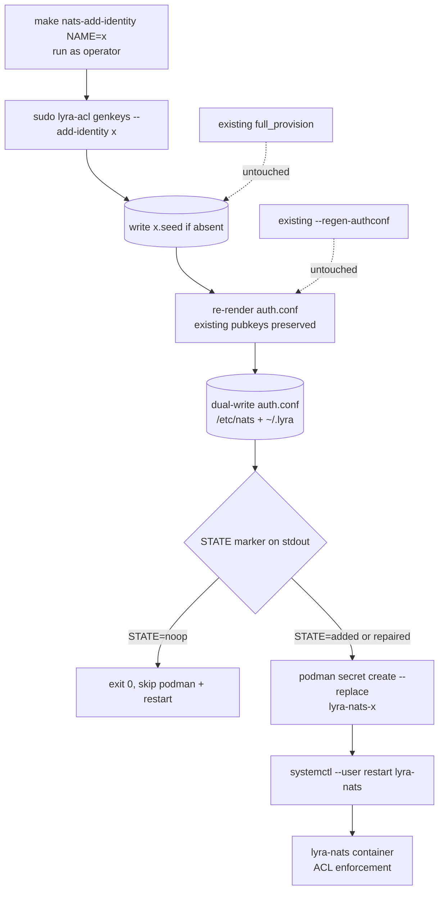

## Context

Promoted from `artifacts/frames/1361-prevent-key-rotation-cascade-frame.mdx`.

`lyra-acl genkeys` today has only two modes for change: `_mode_full_provision` (rotates every seed) and `--regen-authconf` (requires all seeds present, then rewrites auth.conf from existing pubkeys). Neither lets an operator add a single new identity without disturbing the existing ones. The 2026-05-25 turn-writer incident (postmortem `artifacts/postmortems/1331-turn-writer-prod-deploy.md`) demonstrated the cascade: adding `turn-writer` forced a full rotation that only recovered because Podman's secret store still held the prior seeds.

This spec covers the **Slice A** subset of #1361: items 1, 6, 9. Items 5 (CI integration test), 7 (`make quadlet-preflight`), and 8 (M₂ satellite secret refresh) are deferred to follow-up issues (see Out of Scope below).

## Goal

Add a single CLI verb + Makefile wrapper + runbook entry so adding a new NATS identity is a one-step operation that provably leaves all existing seeds untouched on disk.

## Users

- **Primary:** ops operator adding/refreshing a NATS identity on M₁ or M₂.
- **Secondary:** any process holding an active nkey (hub, adapters, turn-writer, monitor, image-worker, llm-operator) that would otherwise be invalidated by a cascade.

## Expected Behavior

**Adding a new identity** (typical flow, item 1 + 6):

1. Operator declares the new identity in `deploy/nats/acl-matrix.json` with `status: active`, `created_at`, `owner`, `description`, `publish`, `subscribe` (existing schema, no change).
2. Operator runs `make nats-add-identity NAME=turn-writer` as user `mickael` (not as root — same convention as existing `nats-regen-authconf` target).
3. The Makefile target chains, with `sudo` scoped only to the privileged call:
   - `sudo uv run --project <repo> lyra-acl genkeys --add-identity turn-writer` — generates `<seeds_dir>/turn-writer.seed` only, then re-renders `auth.conf` using existing pubkeys for every other active identity (read from existing seeds, never regenerated). Dual-writes to `/etc/nats/nkeys/auth.conf` (0640 root:nats) and `~/.lyra/nkeys/auth.conf` (0600 operator), same pattern as `_mode_full_provision` (`scripts/_modes.py:269`).
   - Exit-code branch: if lyra-acl exits 0 with the "already-provisioned full-consistency" message (see Idempotency below), the Makefile **skips** the next two steps and exits 0 — no podman mutation, no restart.
   - Otherwise: `podman secret create lyra-nats-turn-writer <seeds_dir>/turn-writer.seed` (run unprivileged as the operator — same as existing `quadlet-secrets-install`).
   - `systemctl --user restart lyra-nats.service` (run unprivileged; required because `lyra-nats.container` uses `type=mount` secret anchor — ACL changes need restart-not-HUP per `CLAUDE.md` + container deployment standards S7).
4. Operator verifies the new identity is reachable; existing identities continue uninterrupted (NATS server has new ACL on restart; in-flight reconnects are normal NATS behavior).

**Idempotency** (re-running with an existing identity, item 1 acceptance):

`--add-identity <name>` distinguishes two states by inspecting both the seed file and the current `auth.conf`:

| Pre-state | Action | Exit code | Message (stderr) |
|---|---|---|---|
| Seed present **and** identity block present in `auth.conf` (full-consistency) | No-op: leave disk untouched | 0 | `identity '<name>' already provisioned and present in auth.conf; no changes` |
| Seed present **but** identity block missing from `auth.conf` (post-crash inconsistency) | Re-render `auth.conf` only (reuse existing pubkey from seed); no new seed gen | 0 | `identity '<name>' seed exists but auth.conf missing block; re-rendered auth.conf` |
| Seed absent **and** identity active in matrix | Full add: gen seed + re-render auth.conf | 0 | (none — normal success path) |

The Makefile target gates `podman secret create` + `systemctl restart` on the first row only (true full-consistency no-op). For the inconsistency-repair row, the Makefile re-invokes `podman secret create --replace` and restart — the seed material is unchanged so the secret content is identical, but the restart is required to ensure the (just-fixed) auth.conf is loaded.

**Detecting the no-op state from the Makefile:** lyra-acl exits 0 in both no-op and inconsistency-repair cases. Disambiguation: lyra-acl prints a structured single-line marker on stdout (`STATE=noop`, `STATE=repaired`, `STATE=added`) that the Makefile reads via shell.

**Validation errors** (fail fast, no partial writes):

- Identity name not in `acl-matrix.json` → exits non-zero with `error: identity '<name>' not declared in acl-matrix.json — add it first`. No seed written.
- Identity present in matrix but `status != active` (e.g. `retired`) → exits non-zero with `error: identity '<name>' has status '<status>'; --add-identity only provisions active identities`. No seed written.
- Any other seed file missing on disk (matrix says active, file ¬present) → exits non-zero with `error: cannot render auth.conf — missing seed for active identity '<other>'; run --regen-authconf or full provision first`. No partial write to seed for the new identity (¬orphan).
- Not running as root → existing `_require_root()` pattern from `_modes.py:89`.

**Runbook discoverability** (item 9):

- `docs/ops/nats-identity-retirement.md` is renamed to `docs/ops/nats-identity-lifecycle.md` via `git mv`.
- The existing "Adding a new identity" section in that file (currently references `--regen-authconf` as step 2) is **rewritten** to use `make nats-add-identity NAME=<x>` as step 2 — the old verb is the very failure mode this slice prevents, so leaving stale instructions would re-introduce the bug.
- The rewritten "Adding" section moves to appear above "Retiring".
- A "Recovery — `podman secret create` fails after lyra-acl" subsection documents the safe retry path: re-run `make nats-add-identity NAME=<x>` — the idempotency-repair branch makes retry safe (no double-rotation).
- A "Refreshing a satellite secret on M₂" subsection captures the item-8 procedure as documentation only (no automation in this slice — see Out of Scope).
- All in-repo links to the old filename are updated; no redirect stub (keep the tree clean — `git log --follow` preserves history).

**M₁ ↔ M₂ propagation note** (operational reality):

Seed files under `~/.lyra/nkeys/` are propagated M₁ ↔ M₂ by Syncthing (`~/projects/CLAUDE.md`). After running `make nats-add-identity NAME=<x>` on M₁, the new seed file appears on M₂ automatically. However, the Podman secret on M₂ is **not** auto-created — that is precisely the item-8 follow-up. The runbook section "Refreshing a satellite secret on M₂" makes this explicit: operators must run `podman secret create lyra-nats-<x> ~/.lyra/nkeys/<x>.seed` + restart the relevant unit on M₂ when the satellite identity is next brought online.

## Data Model & Consumers

```mermaid
classDiagram
    class AclMatrix {
      +version: str
      +request_reply_flows: list
      +identities: dict~str, Identity~
    }
    class Identity {
      +status: "active"|"retired"
      +created_at: str
      +owner: str
      +description: str
      +allow_responses: bool
      +publish: list~str~
      +subscribe: list~str~
    }
    class SeedFile {
      <<filesystem>>
      ~/.lyra/nkeys/<name>.seed
      mode: 0600 (operator:operator)
    }
    class AuthConf {
      <<filesystem>>
      ~/.lyra/nkeys/auth.conf (user mirror, 0600)
      /etc/nats/nkeys/auth.conf (system, 0640 root:nats)
    }
    class PodmanSecret {
      <<podman>>
      lyra-nats-<name>
      mounted into lyra-nats.container
    }

    AclMatrix "1" --> "*" Identity
    Identity ..> SeedFile : "1 active identity → 1 seed file"
    Identity ..> AuthConf : "block in auth.conf"
    SeedFile ..> PodmanSecret : "copied into podman secret store"
    AuthConf ..> "lyra-nats container" : "mounted, ACL source"
```



**Consumer summary:**

| Consumer | Fields/files consumed | When | Status |
|---|---|---|---|
| `lyra-acl genkeys --add-identity` | reads `acl-matrix.json[identities]`, reads existing `*.seed` files | invocation | this issue |
| `lyra-acl genkeys --regen-authconf` | reads all `*.seed`, reads matrix | already exists | unchanged |
| `lyra-acl genkeys` (full provision) | reads matrix, writes all `*.seed` | already exists | unchanged |
| `make nats-add-identity` | invokes CLI + podman + systemctl | invocation | this issue |
| `lyra-nats` container | reads mounted `auth.conf` + podman secrets | on restart | unchanged consumer; new identity now reachable |
| `docs/ops/nats-identity-lifecycle.md` | human-readable | operator opens runbook | this issue (renamed + extended) |

## Breadboard

**CLI affordances:**

| ID | Affordance | Handler | Data touched |
|---|---|---|---|
| U1 | `lyra-acl genkeys --add-identity <name>` | new `_mode_add_identity(args)` in `scripts/_modes.py` | matrix (read), `<seeds_dir>/<name>.seed` (write, new), `auth.conf` (write, full re-render with existing+new pubkeys) |
| U2 | `make nats-add-identity NAME=<x>` | new target in `Makefile` | invokes U1 + `podman secret create` + `systemctl --user restart lyra-nats` |

**File touches:**

| ID | Path | Change |
|---|---|---|
| F1 | `scripts/_modes.py` | Add `_mode_add_identity(args)` — `_require_root()` + matrix-validate + 3-state inspection (no-op / repair / add) + single-seed gen + dual-write auth.conf (both `/etc/nats/nkeys/auth.conf` 0640 root:nats AND `~/.lyra/nkeys/auth.conf` 0600 operator — same pattern as `_mode_full_provision` lines 302-311) + print `STATE=noop|repaired|added` marker to stdout |
| F2 | `scripts/gen_nkeys.py` | Add `--add-identity NAME` argparse flag; dispatch to `_mode_add_identity` |
| F3 | top-level `Makefile` (alongside existing `nats-regen-authconf`, `nats-setup`, `quadlet-secrets-install` targets) | Add `nats-add-identity` target: invoke `sudo uv run lyra-acl genkeys --add-identity $(NAME)`, capture stdout, branch on `STATE=noop` (early exit), otherwise run `podman secret create --replace lyra-nats-$(NAME) ~/.lyra/nkeys/$(NAME).seed` + `systemctl --user restart lyra-nats`. Update `.PHONY` line. Target runs as operator (not root). |
| F4 | `docs/ops/nats-identity-lifecycle.md` | `git mv` from `nats-identity-retirement.md`; add "Adding an identity" section + "Refreshing a satellite secret on M₂" subsection |
| F5 | grep-update all in-repo links from `nats-identity-retirement.md` → `nats-identity-lifecycle.md` (check `CONTRIBUTING.md`, other ops docs, postmortems) |
| F6 | `tests/unit/test_modes_add_identity.py` (new) | unit coverage: success path, idempotency, validation errors, "other seeds untouched" byte-identity assertion |

**Wiring:**

- U1 → F1 → F2 (argparse → mode dispatch)
- U2 → invokes U1, then `podman secret create`, then `systemctl --user restart lyra-nats.service`
- F4 → references U2 in runbook prose

## Slices

| ID | Slice | Files | Demo |
|---|---|---|---|
| S1 | **`--add-identity` CLI verb + tests** | F1, F2, F6 | `uv run pytest tests/unit/test_modes_add_identity.py` green; manual: declare a test identity in matrix, run `sudo lyra-acl genkeys --add-identity test-id`, assert only new seed written + auth.conf updated |
| S2 | **Makefile wrapper** | F3 | `make nats-add-identity NAME=test-id` chains end-to-end on a dev box; second invocation = no-op |
| S3 | **Runbook rename + content** | F4, F5 | `git mv` clean; new "Adding an identity" section reads correctly; CI grep passes (no dead links) |

Slice ordering: S1 is independent. S2 depends on S1 (target invokes the verb). S3 is independent of S1/S2 (docs only) but should land in the same PR to keep #1361 closeable in one merge.

## Success Criteria

- [ ] `uv run lyra-acl genkeys --add-identity <new-name>` writes exactly one new seed file (`<seeds_dir>/<new-name>.seed`) — verified by SHA-256-comparing every other pre-existing `.seed` byte-for-byte before/after invocation (unit test asserts zero diff)
- [ ] `--add-identity <existing-name>` with auth.conf already containing the block: exits 0, prints `STATE=noop` on stdout, modifies zero files (verified via `os.stat().st_mtime` before/after on seed dir + auth.conf)
- [ ] `--add-identity <existing-name>` with seed present but auth.conf block missing (simulated post-crash state): exits 0, prints `STATE=repaired` on stdout, modifies only `auth.conf` (both copies), seed file untouched
- [ ] `--add-identity <name-not-in-matrix>` exits non-zero with message naming the matrix file; no seed file is created (verified via `os.path.exists`)
- [ ] `--add-identity <name>` where matrix says `status: retired` exits non-zero; no seed written
- [ ] `--add-identity <name>` where another active identity is missing its seed file exits non-zero before writing the new seed (no orphan seed left on disk)
- [ ] `auth.conf` after `--add-identity <new-name>` contains the new identity's pubkey block AND every previously present block — existing blocks are byte-identical when extracted by any auth.conf parser (observable property; assertion may use the project's parser for convenience, but the criterion is "blocks unchanged")
- [ ] `auth.conf` is dual-written: both `/etc/nats/nkeys/auth.conf` (0640 root:nats) and `~/.lyra/nkeys/auth.conf` (0600 operator) contain the new content (verified via test fixture that overrides paths)
- [ ] `make nats-add-identity NAME=<x>` (new identity) end-to-end on a dev box produces: new seed file, new podman secret `lyra-nats-<x>`, restarted `lyra-nats.service` (verified via `podman secret ls` + `systemctl --user is-active lyra-nats.service`)
- [ ] `make nats-add-identity NAME=<existing>` (full-consistency case) is a clean no-op chain: lyra-acl prints `STATE=noop`, Makefile skips `podman secret create` AND `systemctl restart` entirely (verified via instrumentation: count zero podman/systemctl invocations after the lyra-acl call)
- [ ] `make nats-add-identity` works when invoked as user `mickael` (not root) — `sudo` is scoped inside the target to the lyra-acl line only
- [ ] `docs/ops/nats-identity-lifecycle.md` exists; `docs/ops/nats-identity-retirement.md` does not exist; `git log --follow docs/ops/nats-identity-lifecycle.md` shows the rename
- [ ] `rg 'nats-identity-retirement' .` returns no matches in tracked files
- [ ] `docs/ops/nats-identity-lifecycle.md` has sections "Adding an identity" (with `make nats-add-identity` example, step 2 rewritten from `--regen-authconf` to the new verb), "Retiring an identity" (existing content preserved verbatim), "Recovery — podman secret create fails after lyra-acl", and "Refreshing a satellite secret on M₂"
- [ ] All existing `lyra-acl` modes (`full provision`, `--regen-authconf`, `--regenerate`, `--show`, `--fix-perms`, `--emit-merged-authconf`) continue to pass their existing tests with zero modification
- [ ] `scripts/check-acl-authconf-drift.sh` (existing pre-commit hook) continues to pass on a tree where `--add-identity` was used to add an identity

## Out of Scope

- **Item 5** — CI integration test booting a container with `ReadOnly=true` + real `auth.conf` + real NATS + pull-subscribe. Carve to new issue `chore(ci): #1361 follow-up — ReadOnly+JetStream+ACL integration test` linked back to #1361.
- **Item 7** — `make quadlet-preflight` for tagless images. Unrelated to key rotation; carve to new issue `chore(ops): #1361 follow-up — quadlet preflight check for tagless images` linked back to #1361.
- **Item 8** — The actual M₂ Podman secret refresh for `monitor`, `image-worker`, `llm-operator` is **deferred to a follow-up issue** (not silently dropped): file `chore(ops): #1361 follow-up — refresh M₂ satellite Podman secrets (monitor, image-worker, llm-operator)` to be executed when each service comes back online. This spec only documents the procedure in the runbook ("Refreshing a satellite secret on M₂" section); the runtime refresh itself is the follow-up's responsibility.
- Multi-identity batch (`--add-identity a,b,c`) — single name per invocation; batching can come later if a use case emerges.
- Changing the matrix schema, auth.conf renderer output format, or ACL semantics for the new identity (caller defines that in matrix).
- Auto-creating the matrix entry from CLI flags (`--add-identity x --publish ... --subscribe ...`); matrix edit remains a deliberate human step.
- HUP-based ACL reload (the `type=mount` secret design requires full restart per CLAUDE.md `deploy/quadlet/lyra-nats.container` note).

## Open Questions

[NEEDS CLARIFICATION] — none; all design points resolved in spec body.
