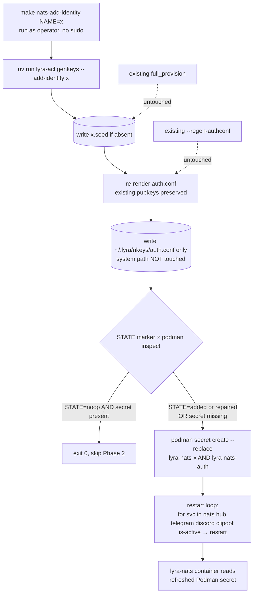

## Context

Promoted from `artifacts/frames/1361-prevent-key-rotation-cascade-frame.mdx`.

`lyra-acl genkeys` today has only two modes for change: `_mode_full_provision` (rotates every seed) and `--regen-authconf` (requires all seeds present, then rewrites auth.conf from existing pubkeys). Neither lets an operator add a single new identity without disturbing the existing ones. The 2026-05-25 turn-writer incident (postmortem `artifacts/postmortems/1331-turn-writer-prod-deploy.md`) demonstrated the cascade: adding `turn-writer` forced a full rotation that only recovered because Podman's secret store still held the prior seeds.

This spec covers the **Slice A** subset of #1361: items 1, 6, 9. Items 5 (CI integration test), 7 (`make quadlet-preflight`), and 8 (M₂ satellite secret refresh) are deferred to follow-up issues (see Out of Scope below).

## Goal

Add a single CLI verb + Makefile wrapper + runbook entry so adding a new NATS identity is a one-step operation that provably leaves all existing seeds untouched on disk.

## Users

- **Primary:** ops operator adding/refreshing a NATS identity on M₁ or M₂.
- **Secondary:** any process holding an active nkey (hub, adapters, turn-writer, monitor, image-worker, llm-operator) that would otherwise be invalidated by a cascade.

## Expected Behavior

**Adding a new identity** (typical flow, item 1 + 6):

The flow is **fully rootless** — same convention as the existing rootless targets (`nats-regen-authconf`, `quadlet-secrets-install`). No `sudo` anywhere in the chain. The new mode is parented on `_mode_regen_authconf` (`scripts/_modes.py:102`), not `_mode_full_provision`: it writes only to the user mirror `~/.lyra/nkeys/auth.conf` (0600 operator-owned). The host system path `/etc/nats/nkeys/auth.conf` is **not** touched — it is a legacy write from the pre-Podman-secret era and is not read by any consumer in production (the container reads `auth.conf` via the Podman secret `lyra-nats-auth`, which is sourced from the user mirror).

1. Operator declares the new identity in `deploy/nats/acl-matrix.json` with `status: active`, `created_at`, `owner`, `description`, `publish`, `subscribe` (existing schema, no change).
2. Operator runs `make nats-add-identity NAME=turn-writer` as themselves (no sudo).
3. The Makefile target chains:
   - `uv run --project <repo> lyra-acl genkeys --add-identity turn-writer` — generates `~/.lyra/nkeys/turn-writer.seed` only (if absent), then re-renders `~/.lyra/nkeys/auth.conf` using existing pubkeys for every other active identity (read from existing seeds, never regenerated). Emits `STATE=noop|repaired|added` on stdout.
   - Phase 2 (Podman + restart): runs unless **both** `STATE=noop` AND `podman secret inspect lyra-nats-<NAME>` succeeds locally. Otherwise:
     - `podman secret create --replace lyra-nats-<NAME> ~/.lyra/nkeys/<NAME>.seed`
     - `podman secret create --replace lyra-nats-auth ~/.lyra/nkeys/auth.conf` (refresh the server's ACL secret with the new auth.conf — same as existing `nats-regen-authconf` target line 320)
     - Restart loop: `for svc in lyra-nats lyra-hub lyra-telegram lyra-discord lyra-clipool; do systemctl --user is-active --quiet $svc && systemctl --user restart $svc; done` — restarts only services actually running on this host, in dependency order (`lyra-nats` first; adapters declare `After=lyra-nats.service`). On a host with no Lyra units (e.g. a future bare client host), the loop is a no-op.
4. Operator verifies the new identity is reachable; existing identities continue uninterrupted (NATS server has new ACL on restart; in-flight reconnects are normal NATS behavior).

**Multi-host (M₁, M₂, future Mₙ)** — same verb everywhere:

Seeds and `auth.conf` propagate across hosts via Syncthing on `~/.lyra/nkeys/`. The Podman secret store does **not** auto-propagate. The same `make nats-add-identity NAME=<x>` is run on every host that consumes that identity:

- **On the authoring host (today: M₁):** lyra-acl emits `STATE=added`; Phase 2 creates the seed + auth.conf secrets and restarts the local NATS server + adapters.
- **On a receiving host (today: M₂; future: M₃, Mₙ):** Syncthing has already delivered the seed and user-mirror `auth.conf` → lyra-acl emits `STATE=noop`. But `podman secret inspect lyra-nats-<x>` returns non-zero (secret missing locally) → Phase 2 still runs to create the local Podman secret + restart whatever local units consume it (via the `is-active`-gated loop).
- **On a non-consuming host:** lyra-acl `STATE=noop` AND `podman secret inspect lyra-nats-<x>` succeeds (or no Lyra units run there at all → loop is a no-op).

The Makefile gating means the verb is **idempotent on every host** and **safe to run anywhere** without operator knowledge of the topology. The lyra-acl tool owns filesystem state (`STATE=noop|repaired|added`); the Makefile owns local Podman store state (`podman secret inspect`). These two concerns are orthogonal — lyra-acl never shells out to Podman.

**Idempotency** (re-running with an existing identity, item 1 acceptance):

`--add-identity <name>` distinguishes three filesystem states (and prints a single-line `STATE=...` marker on stdout for the Makefile to gate on):

| Pre-state | Action | Exit code | stdout marker | Stderr message |
|---|---|---|---|---|
| Seed present **and** identity block present in `auth.conf` (full-consistency) | No-op: leave disk untouched | 0 | `STATE=noop` | `identity '<name>' already provisioned and present in auth.conf; no changes` |
| Seed present **but** identity block missing from `auth.conf` (post-crash inconsistency, or fresh receiving host where Syncthing delivered only the seed) | Re-render `auth.conf` only (reuse existing pubkey from seed); no new seed gen | 0 | `STATE=repaired` | `identity '<name>' seed exists but auth.conf missing block; re-rendered auth.conf` |
| Seed absent **and** identity active in matrix | Full add: gen seed + re-render auth.conf | 0 | `STATE=added` | (none — normal success path) |

**Makefile Phase-2 gate:** Phase 2 (Podman secret create + restart loop) runs **unless** `STATE=noop` AND `podman secret inspect lyra-nats-<NAME>` succeeds locally. This correctly handles all three flows:

- `STATE=added` or `STATE=repaired` → Phase 2 runs (the auth.conf changed, secret must refresh, NATS must reload).
- `STATE=noop` but Podman secret missing locally → Phase 2 runs (receiving host catching up after Syncthing delivered the filesystem state).
- `STATE=noop` and Podman secret present locally → Phase 2 skipped (true no-op).

**Validation errors** (fail fast, no partial writes):

- Identity name not in `acl-matrix.json` → exits non-zero with `error: identity '<name>' not declared in acl-matrix.json — add it first`. No seed written.
- Identity present in matrix but `status != active` (e.g. `retired`) → exits non-zero with `error: identity '<name>' has status '<status>'; --add-identity only provisions active identities`. No seed written.
- Any other seed file missing on disk (matrix says active, file ¬present) → exits non-zero with `error: cannot render auth.conf — missing seed for active identity '<other>'; run --regen-authconf or full provision first`. No partial write to seed for the new identity (¬orphan).
- The user mirror directory `~/.lyra/nkeys/` not writable by the operator → exits non-zero with the OS error. Same failure shape as existing `_mode_regen_authconf` — no `_require_root()` involvement.

**Runbook discoverability** (item 9):

- `docs/ops/nats-identity-retirement.md` is renamed to `docs/ops/nats-identity-lifecycle.md` via `git mv`.
- The existing "Adding a new identity" section in that file (currently references `--regen-authconf` as step 2) is **rewritten** to use `make nats-add-identity NAME=<x>` as step 2 — the old verb is the very failure mode this slice prevents, so leaving stale instructions would re-introduce the bug.
- The rewritten "Adding" section moves to appear above "Retiring".
- A "Multi-host: running on M₂ / Mₙ" subsection documents that the **same verb** is run on every consuming host (no separate procedure), explains the lyra-acl-STATE × local-Podman-secret gate so operators understand why it is safe, and notes that Syncthing handles seed/auth.conf propagation.
- A "Recovery — Phase 2 fails after lyra-acl succeeds" subsection documents the safe retry path: re-run `make nats-add-identity NAME=<x>` — idempotent on the filesystem side, `--replace` on the Podman side makes retry safe.
- All in-repo links to the old filename are updated; no redirect stub (keep the tree clean — `git log --follow` preserves history).

**M₁ ↔ M₂ ↔ Mₙ propagation note** (now first-class, no separate procedure required):

Syncthing propagates `~/.lyra/nkeys/` (seeds + user-mirror `auth.conf`) across hosts. The same `make nats-add-identity NAME=<x>` is the canonical verb on every consuming host: the Phase-2 gate (lyra-acl STATE × local Podman secret presence) makes it self-healing whether the host authored the identity or is catching up from Syncthing. Operators do not need to memorize a per-machine procedure; they run the same target everywhere the identity is consumed.

What is **not** automated in this slice: auto-discovery of which hosts consume which identities (`hosts.toml` extension). That is the new, reframed item-8 follow-up — see Out of Scope.

## Data Model & Consumers

```mermaid
classDiagram
    class AclMatrix {
      +version: str
      +request_reply_flows: list
      +identities: dict~str, Identity~
    }
    class Identity {
      +status: "active"|"retired"
      +created_at: str
      +owner: str
      +description: str
      +allow_responses: bool
      +publish: list~str~
      +subscribe: list~str~
    }
    class SeedFile {
      <<filesystem>>
      ~/.lyra/nkeys/<name>.seed
      mode: 0600 (operator:operator)
    }
    class AuthConf {
      <<filesystem>>
      ~/.lyra/nkeys/auth.conf (user mirror, 0600)
      /etc/nats/nkeys/auth.conf (system, 0640 root:nats)
    }
    class PodmanSecret {
      <<podman>>
      lyra-nats-<name>
      mounted into lyra-nats.container
    }

    AclMatrix "1" --> "*" Identity
    Identity ..> SeedFile : "1 active identity → 1 seed file"
    Identity ..> AuthConf : "block in auth.conf"
    SeedFile ..> PodmanSecret : "copied into podman secret store"
    AuthConf ..> "lyra-nats container" : "mounted, ACL source"
```



**Consumer summary:**

| Consumer | Fields/files consumed | When | Status |
|---|---|---|---|
| `lyra-acl genkeys --add-identity` | reads `acl-matrix.json[identities]`, reads existing `*.seed` files | invocation | this issue |
| `lyra-acl genkeys --regen-authconf` | reads all `*.seed`, reads matrix | already exists | unchanged |
| `lyra-acl genkeys` (full provision) | reads matrix, writes all `*.seed` | already exists | unchanged |
| `make nats-add-identity` | invokes CLI + podman + systemctl | invocation | this issue |
| `lyra-nats` container | reads mounted `auth.conf` + podman secrets | on restart | unchanged consumer; new identity now reachable |
| `docs/ops/nats-identity-lifecycle.md` | human-readable | operator opens runbook | this issue (renamed + extended) |

## Breadboard

**CLI affordances:**

| ID | Affordance | Handler | Data touched |
|---|---|---|---|
| U1 | `lyra-acl genkeys --add-identity <name>` | new `_mode_add_identity(args)` in `scripts/_modes.py` | matrix (read), `<seeds_dir>/<name>.seed` (write, new), `auth.conf` (write, full re-render with existing+new pubkeys) |
| U2 | `make nats-add-identity NAME=<x>` | new target in `Makefile` | invokes U1 + `podman secret create` + `systemctl --user restart lyra-nats` |

**File touches:**

| ID | Path | Change |
|---|---|---|
| F1 | `scripts/_modes.py` | Add `_mode_add_identity(args)` — **rootless** (no `_require_root()`); parent pattern = `_mode_regen_authconf` (lines 102-128). Matrix-validate + 3-state inspection (no-op / repair / add) + single-seed gen + render auth.conf + write **only** to `~/.lyra/nkeys/auth.conf` (0600 operator) via `atomic_write`. Does **not** touch `/etc/nats/nkeys/auth.conf` (dead path; not consumed by any production reader). Prints `STATE=noop|repaired|added` marker to stdout. |
| F2 | `scripts/gen_nkeys.py` | Add `--add-identity NAME` argparse flag; dispatch to `_mode_add_identity` |
| F3 | top-level `Makefile` (alongside existing `nats-regen-authconf`, `nats-setup`, `quadlet-secrets-install` targets) | Add `nats-add-identity` target: invoke `uv run lyra-acl genkeys --add-identity $(NAME)` (no sudo), capture STATE from stdout. Phase 2 gate: skip if `STATE=noop` AND `podman secret inspect lyra-nats-$(NAME)` succeeds; otherwise run `podman secret create --replace lyra-nats-$(NAME) ~/.lyra/nkeys/$(NAME).seed` + `podman secret create --replace lyra-nats-auth ~/.lyra/nkeys/auth.conf` + restart loop `for svc in lyra-nats lyra-hub lyra-telegram lyra-discord lyra-clipool; do systemctl --user is-active --quiet $$svc && systemctl --user restart $$svc; done`. Update `.PHONY` line. Target runs as operator (no root anywhere). |
| F4 | `docs/ops/nats-identity-lifecycle.md` | `git mv` from `nats-identity-retirement.md`; add "Adding an identity" section + "Refreshing a satellite secret on M₂" subsection |
| F5 | grep-update all in-repo links from `nats-identity-retirement.md` → `nats-identity-lifecycle.md` (check `CONTRIBUTING.md`, other ops docs, postmortems) |
| F6 | `tests/unit/test_modes_add_identity.py` (new) | unit coverage: success path, idempotency, validation errors, "other seeds untouched" byte-identity assertion |

**Wiring:**

- U1 → F1 → F2 (argparse → mode dispatch)
- U2 → invokes U1, then `podman secret create`, then `systemctl --user restart lyra-nats.service`
- F4 → references U2 in runbook prose

## Slices

| ID | Slice | Files | Demo |
|---|---|---|---|
| S1 | **`--add-identity` CLI verb + tests** | F1, F2, F6 | `uv run pytest tests/unit/test_modes_add_identity.py` green; manual: declare a test identity in matrix, run `sudo lyra-acl genkeys --add-identity test-id`, assert only new seed written + auth.conf updated |
| S2 | **Makefile wrapper** | F3 | `make nats-add-identity NAME=test-id` chains end-to-end on a dev box; second invocation = no-op |
| S3 | **Runbook rename + content** | F4, F5 | `git mv` clean; new "Adding an identity" section reads correctly; CI grep passes (no dead links) |

Slice ordering: S1 is independent. S2 depends on S1 (target invokes the verb). S3 is independent of S1/S2 (docs only) but should land in the same PR to keep #1361 closeable in one merge.

## Success Criteria

- [ ] `uv run lyra-acl genkeys --add-identity <new-name>` writes exactly one new seed file (`<seeds_dir>/<new-name>.seed`) — verified by SHA-256-comparing every other pre-existing `.seed` byte-for-byte before/after invocation (unit test asserts zero diff)
- [ ] `--add-identity <existing-name>` with auth.conf already containing the block: exits 0, prints `STATE=noop` on stdout, modifies zero files (verified via `os.stat().st_mtime` before/after on seed dir + auth.conf)
- [ ] `--add-identity <existing-name>` with seed present but auth.conf block missing (simulated post-crash state): exits 0, prints `STATE=repaired` on stdout, modifies only `auth.conf` (both copies), seed file untouched
- [ ] `--add-identity <name-not-in-matrix>` exits non-zero with message naming the matrix file; no seed file is created (verified via `os.path.exists`)
- [ ] `--add-identity <name>` where matrix says `status: retired` exits non-zero; no seed written
- [ ] `--add-identity <name>` where another active identity is missing its seed file exits non-zero before writing the new seed (no orphan seed left on disk)
- [ ] `auth.conf` after `--add-identity <new-name>` contains the new identity's pubkey block AND every previously present block — existing blocks are byte-identical when extracted by any auth.conf parser (observable property; assertion may use the project's parser for convenience, but the criterion is "blocks unchanged")
- [ ] `--add-identity <name>` writes only to `~/.lyra/nkeys/auth.conf` (0600 operator-owned); `/etc/nats/nkeys/auth.conf` mtime is unchanged before/after the invocation (verified via `os.stat`)
- [ ] `lyra-acl genkeys --add-identity <name>` runs successfully as a non-root user (no `_require_root()` exit); unit test asserts this by invoking the mode without elevating
- [ ] `make nats-add-identity NAME=<x>` (new identity, authoring host) end-to-end on a dev box produces: new seed file, new podman secret `lyra-nats-<x>`, refreshed `lyra-nats-auth` secret, restarted `lyra-nats.service` (verified via `podman secret ls` + `systemctl --user is-active lyra-nats.service`)
- [ ] `make nats-add-identity NAME=<existing>` (full-consistency case, secret already present locally) is a clean no-op chain: lyra-acl prints `STATE=noop`, Makefile sees `podman secret inspect` success, skips `podman secret create` AND `systemctl restart` entirely (verified via instrumentation: zero podman/systemctl mutating invocations after the lyra-acl call)
- [ ] `make nats-add-identity NAME=<x>` (receiving-host simulation: seed present, auth.conf has block, but Podman secret missing) creates the Podman secret + runs the restart loop — STATE=noop alone does NOT cause Phase 2 to skip when the Podman secret is absent
- [ ] `make nats-add-identity` succeeds when invoked by the operator without `sudo`; no `sudo` token appears in the Makefile target body
- [ ] Restart loop is `is-active`-gated: on a host where only `lyra-nats` is running (no adapters), `systemctl restart` is invoked exactly once for `lyra-nats`; verified via shell trace
- [ ] `docs/ops/nats-identity-lifecycle.md` exists; `docs/ops/nats-identity-retirement.md` does not exist; `git log --follow docs/ops/nats-identity-lifecycle.md` shows the rename
- [ ] `rg 'nats-identity-retirement' .` returns no matches in tracked files
- [ ] `docs/ops/nats-identity-lifecycle.md` has sections "Adding an identity" (with `make nats-add-identity` example, step 2 rewritten from `--regen-authconf` to the new verb), "Retiring an identity" (existing content preserved verbatim), "Recovery — podman secret create fails after lyra-acl", and "Refreshing a satellite secret on M₂"
- [ ] All existing `lyra-acl` modes (`full provision`, `--regen-authconf`, `--regenerate`, `--show`, `--fix-perms`, `--emit-merged-authconf`) continue to pass their existing tests with zero modification
- [ ] `scripts/check-acl-authconf-drift.sh` (existing pre-commit hook) continues to pass on a tree where `--add-identity` was used to add an identity

## Out of Scope

- **Item 5** — CI integration test booting a container with `ReadOnly=true` + real `auth.conf` + real NATS + pull-subscribe. Carve to new issue `chore(ci): #1361 follow-up — ReadOnly+JetStream+ACL integration test` linked back to #1361.
- **Item 7** — `make quadlet-preflight` for tagless images. Unrelated to key rotation; carve to new issue `chore(ops): #1361 follow-up — quadlet preflight check for tagless images` linked back to #1361.
- **Item 8 (reframed)** — Auto-discovery of which identities each host consumes via `hosts.toml` extension. The original item-8 framing ("manually refresh M₂ Podman secrets per identity") is now subsumed by this slice: the same `make nats-add-identity NAME=<x>` is the canonical verb on every host (lyra-acl STATE × local `podman secret inspect` makes it self-healing). What this slice does **not** do is automate the per-host decision of *which identities to add* — that requires extending `~/projects/hosts.toml` with a per-role identity-consumption map (e.g. `lyra-hub` consumes `{hub, telegram-adapter, ..., turn-writer}`; `image-worker` consumes `{image-worker}`) and a wrapper target that iterates. Carve to new issue: `chore(ops): #1361 follow-up — hosts.toml schema extension for per-host NATS identity auto-discovery + fleet-refresh target`.
- Multi-identity batch (`--add-identity a,b,c`) — single name per invocation; batching can come later if a use case emerges.
- Changing the matrix schema, auth.conf renderer output format, or ACL semantics for the new identity (caller defines that in matrix).
- Auto-creating the matrix entry from CLI flags (`--add-identity x --publish ... --subscribe ...`); matrix edit remains a deliberate human step.
- HUP-based ACL reload (the `type=mount` secret design requires full restart per CLAUDE.md `deploy/quadlet/lyra-nats.container` note).

## Open Questions

[NEEDS CLARIFICATION] — none; all design points resolved in spec body.
