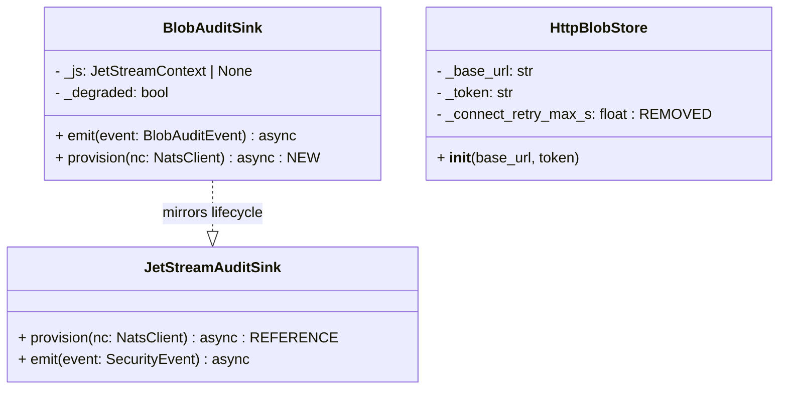
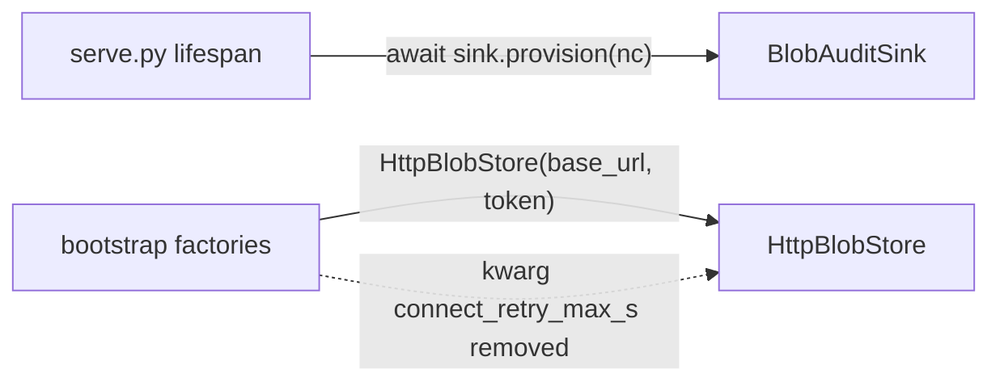

## Context

PR #1358 (closes #1330 — V8 HTTP-fronted BlobStore) shipped to production. The `/code-review` Phase 3 multi-domain pass surfaced 12 non-blocking items. They were parked in the PR comment to keep the merge focused; this spec drains all 12 before they rot.

Source: `artifacts/frames/1362-v8-1-hardening-cleanup-frame.mdx` (F-lite, premise gate green).

## Goal

Drain the PR #1358 parking-lot: apply 12 hardening + cleanup items across `src/lyra/blobstore/`, `packages/roxabi-blobs/`, `deploy/quadlet/lyra-blobstore.container` in a single PR, no regression in the 460-test blobstore suite.

## Users

- **Primary:** Lyra ops (M₁ `lyra-blobstore` deployment) — H1 directly reduces exposure surface (no silent `0.0.0.0` bind when `${TAILSCALE_IPV4}` is empty).
- **Secondary:** future blobstore callers — M1/M2 remove API drift; L-items reduce cognitive load when reading the code.

## Expected Behavior

After this PR lands:

1. **Quadlet unit fails to start (process exits 1) when `${TAILSCALE_IPV4}` is empty.** The unit never enters `running` state; no traffic is served. Note: the published-port spec is constructed by Podman before `ExecStartPre=` fires, so this is "container can never serve traffic" semantics, not "bind decision averted" — the operationally relevant outcome is identical (port is unreachable when process is dead).
2. **`BlobAuditSink` lifecycle matches `JetStreamAuditSink`** — `BlobAuditSink.provision(nc)` exists (body needs only `nc.jetstream()` + `_degraded=True` on error; LYRA_AUDIT stream is shared with `JetStreamAuditSink` and managed there). `serve.py._provision_nats()` is rewritten: the current `sink._js = js` private-field mutation (SLF001-suppressed) is replaced by `await sink.provision(nc)`. Sink owns its own NATS attach.
3. **`HttpBlobStore.__init__` signature is honest** — `connect_retry_max_s` parameter and `self._connect_retry_max_s` field removed. Both the class docstring AND `packages/roxabi-blobs/CLAUDE.md` (separate Retry-policy paragraph) drop all mention of the dead knob.
4. **HEAD handler does exactly 1 DB lookup**, down from 3 today. The third lookup (via `store.exists(content_hash)`) is removed by constructing the sentinel `BlobRef` directly from the already-retrieved `content_hash`.
5. **`audit_sink` is assigned exactly once** in `serve.py` lifespan.
6. **DELETE 204↔404 TOCTOU window** has an explicit one-line comment in `_handlers.py` referencing RFC 9110 §9.3.5.
7. **`fs_store._conn()`** has a comment naming WAL read-isolation as the justification for skipping the write-lock.
8. **`HttpBlobStore.exists`** has its `datetime` import hoisted to module scope (no per-call import on hot path).
9. **`.importlinter`** carries a one-line comment above `shared-modules-upper-boundary` explaining `lyra.blobstore` is a peer-layer service (per ADR-073 / peer-of-adapters placement in CLAUDE.md), not a shared floating module — therefore intentionally absent from the contract. No additions to the contract `source_modules` list.
10. **`HttpBlobStore._start_asgi_lifespan`** has a docstring explaining the in-process ASGI lifespan seam (test-only path).
11. **`src/lyra/blobstore/CLAUDE.md`** documents why HEAD has dual DB lookup: `store_path` fallback serves `store_key` callers; `content_hash` fallback serves `HttpBlobStore.exists` callers. Cites the existing `roxabi-blobs CLAUDE.md §HttpBlobStore.exists` reference (already in `_handlers.py:181-182`).
12. **`artifacts/analyses/1330-v8-http-fronted-blobstore-analysis.mdx`** Volume-paths table row is replaced with exactly: `| _(superseded — see docs/QUADLET-DEPLOYMENT.md)_ |`. Historical-only artifact; runbook is authoritative.

## Data Model & Consumers

Two API surface changes; no schema/contract changes.

| Consumer | Touchpoint | Field/Method | When | Status |
|---|---|---|---|---|
| `serve.py._provision_nats()` | `await sink.provision(nc)` (replaces `sink._js = js` poke) | new call, removes SLF001 violation | bootstrap | this issue |
| Caller code (none today) | `HttpBlobStore(connect_retry_max_s=…)` | removed kwarg | — | this issue (no caller passes it; safe removal) |
| `packages/roxabi-blobs/CLAUDE.md` Retry-policy paragraph | text mentioning `connect_retry_max_s` | purged in parallel | — | this issue |

## Breadboard

Each item maps to file → symbol/anchor → change class. Change class drives slice grouping.

| ID | File | Symbol / Anchor | Class |
|---|---|---|---|
| H1 | `deploy/quadlet/lyra-blobstore.container` | `[Service]` section, add `ExecStartPre=` | runtime-behavior |
| M1 | `src/lyra/blobstore/audit_sink.py` + `src/lyra/blobstore/serve.py` | add `BlobAuditSink.provision()`; rewrite `_provision_nats()` to call it (remove `sink._js = js` SLF001 poke) | API-surface + lifecycle |
| M2 | `packages/roxabi-blobs/src/roxabi_blobs/http_store.py` + `packages/roxabi-blobs/CLAUDE.md` | `HttpBlobStore.__init__` signature + class docstring + CLAUDE.md Retry-policy paragraph | API-surface |
| L1 | `src/lyra/blobstore/_handlers.py` | HEAD handler (verify the redundant intermediate query) | code-correctness |
| L2 | `src/lyra/blobstore/serve.py` | `lifespan()` body, `audit_sink` double-assignment | code-correctness |
| L3 | `src/lyra/blobstore/_handlers.py` | DELETE handler (comment) | docs/comments |
| L4 | `packages/roxabi-blobs/src/roxabi_blobs/fs_store.py` | `_conn()` (comment) | docs/comments |
| L5 | `packages/roxabi-blobs/src/roxabi_blobs/http_store.py` | `HttpBlobStore.exists` (import hoist) | code-correctness |
| L6 | `.importlinter` | `shared-modules-upper-boundary` contract | contracts |
| L7 | `packages/roxabi-blobs/src/roxabi_blobs/http_store.py` | `_start_asgi_lifespan` docstring | docs/comments |
| L8 | `src/lyra/blobstore/CLAUDE.md` | HEAD content_hash/store_key dual-lookup paragraph | docs/comments |
| L9 | `artifacts/analyses/1330-v8-http-fronted-blobstore-analysis.mdx` | Volume-paths table | docs/comments |

## Slices

3 vertical slices, each independently demoable; all 3 land in one PR (parking-lot drain).

| # | Name | Items | Demo signal |
|---|---|---|---|
| S1 | Hardening + API honesty | H1, M1, M2 | (a) `journalctl` shows unit refuses to start with empty `TAILSCALE_IPV4`; (b) `serve.py` lifespan calls `sink.provision(nc)`; (c) `HttpBlobStore.__init__` no longer accepts `connect_retry_max_s` |
| S2 | Code-correctness cleanup | L1, L2, L5 | (a) HEAD handler has one DB lookup (single SQL log line); (b) `serve.py` lifespan has single `audit_sink = …`; (c) `from datetime import …` at module top of `http_store.py` |
| S3 | Docs + contract sweep | L3, L4, L6, L7, L8, L9 | grep for the new comments/docstrings present; `lint-imports` exit 0 with documented contract decision; analysis table reconciled |

## Success Criteria

Each bullet bundles all sub-checks for one logical change-class. All sub-checks within a bullet must pass for the bullet to pass.

- [ ] **H1 — Tailscale fail-closed guard**: `grep -n '^ExecStartPre=' deploy/quadlet/lyra-blobstore.container` returns a line containing `TAILSCALE_IPV4`. PLUS either (a) a Python snapshot test reading the file and asserting the line is present (CI-viable, preferred), OR (b) a `systemd-run --user --pty` smoke in M₁ dev env confirming exit non-zero when `TAILSCALE_IPV4=""`.
- [ ] **M1 — BlobAuditSink lifecycle**: (1) `grep -n 'async def provision' src/lyra/blobstore/audit_sink.py` returns a `(self, nc: NatsClient) -> None` signature whose body invokes `nc.jetstream()` and sets `self._degraded=True` + logs warning on `nats.errors.Error` (mirrors `JetStreamAuditSink`, minus the stream-config block — LYRA_AUDIT is shared). (2) `grep -n 'sink._js' src/lyra/blobstore/serve.py` returns 0 hits. (3) `grep -n 'sink.provision' src/lyra/blobstore/serve.py` returns ≥1 hit inside `_provision_nats()`. (4) The `SLF001` noqa on the deleted line is also removed.
- [ ] **M2 — `connect_retry_max_s` removal**: (1) `grep -rn 'connect_retry_max_s' packages/roxabi-blobs/` returns 0 hits across `*.py` AND `CLAUDE.md`. (2) Class docstring + CLAUDE.md Retry-policy paragraph rewritten or deleted with no dead-knob reference.
- [ ] **L1 / L2 / L5 — code correctness**: (1) HEAD handler executes exactly 1 DB lookup per request (verified by SQL-trace assertion in `tests/blobstore/test_serve_api.py::test_head_*` — single `SELECT` per HEAD path; sentinel `BlobRef` constructed inline from the retrieved `content_hash`, no `store.exists()` call). (2) `grep -n 'audit_sink\s*=' src/lyra/blobstore/serve.py` returns exactly 1 assignment line inside lifespan body. (3) `grep -nE '^from datetime' packages/roxabi-blobs/src/roxabi_blobs/http_store.py` returns a module-level import; `grep -n 'from datetime' packages/roxabi-blobs/src/roxabi_blobs/http_store.py | wc -l` = 1.
- [ ] **L3 / L4 / L7 — code comments + docstring**: (1) `grep -nA1 'RFC 9110' src/lyra/blobstore/_handlers.py` returns a line inside the DELETE handler block. (2) `grep -nB2 -A5 'def _conn' packages/roxabi-blobs/src/roxabi_blobs/fs_store.py` shows a comment within 5 lines containing the word `WAL`. (3) `HttpBlobStore._start_asgi_lifespan.__doc__` is non-empty AND contains the phrase `test seam`.
- [ ] **L6 — importlinter contract**: `.importlinter` has a one-line comment immediately above the `[importlinter:contract:shared-modules-upper-boundary]` header explaining `lyra.blobstore` is a peer-layer service (cites ADR-073 OR the peer-of-adapters CLAUDE.md placement). No additions to the contract's `source_modules` list.
- [ ] **L8 / L9 — docs reconciliation**: (1) `src/lyra/blobstore/CLAUDE.md` HEAD section contains a paragraph including both `content_hash` AND `store_key`, citing the `roxabi-blobs CLAUDE.md §HttpBlobStore.exists` reference. (2) `artifacts/analyses/1330-v8-http-fronted-blobstore-analysis.mdx` Volume-paths table row (or the table itself) is replaced with exactly: `| _(superseded — see docs/QUADLET-DEPLOYMENT.md)_ |`.
- [ ] **All gates green**: `uv run pyright` (0 errors), `uv run ruff check .` (0 issues), `uv run lint-imports` (all contracts kept), `uv run pytest tests/blobstore/ packages/roxabi-blobs/tests/` (suite passes, no new failures).

## Out of Scope

- 413 pre-read oversized-blob gate (deferred per blobstore CLAUDE.md V8 contract)
- Protocol v2 streaming get / multipart (#1334)
- Dedicated `ghcr.io/roxabi/blobstore` image (ADR-073)
- Any refactor of the `BlobStore` Protocol surface
