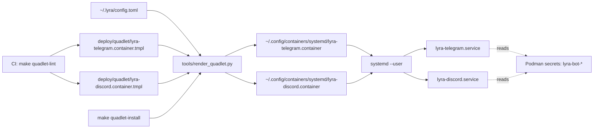

## Context

- **Frame:** `artifacts/frames/1369-quadlet-bot-secret-render-frame.mdx`
- **Sibling cascade fix:** #1361 / PR #1363 (NATS-seed cascade `genkeys --add-identity`)
- **Postmortem:** `artifacts/postmortems/1331-turn-writer-prod-deploy.md`
- **Live incident:** M₁ adapters crash-looped 2026-05-26 00:00 → 00:21 with `MissingCredentialsError`; hotfix re-spliced fragments into `~/.config/containers/systemd/lyra-{telegram,discord}.container`. Hotfix is volatile — next `git pull` wipes it again.

## Goal

`make quadlet-install` renders `~/.config/containers/systemd/lyra-{telegram,discord}.container` deterministically from a tracked template + `~/.lyra/config.toml` enumeration, eliminating the manual-splice cascade class for per-bot `Secret=` directives.

## Users

- **Mickael** — sole operator deploying to M₁. Runs `make deploy` / `make full-deploy` for routine pushes; pays diagnosis + recovery cost on splice-wipe.
- **Telegram/Discord end users** of `lyra` and `aryl` bots — pay the downtime cost (≥6 h in the 2026-05-26 incident).

## Expected Behavior

### Happy path (operator routine deploy)

1. Operator runs `make deploy` from `~/projects/lyra` on M₁.
2. `make deploy` → `git pull --ff-only origin staging` updates the repo tree. The tracked `deploy/quadlet/lyra-telegram.container.tmpl` and `lyra-discord.container.tmpl` arrive unchanged (no operator splice exists to be wiped).
3. `make deploy` → `make quadlet-install` → invokes the render step:
   - Read `~/.lyra/config.toml`
   - Enumerate `[[auth.telegram_bots]]` and `[[auth.discord_bots]]`, then **sort each list by `bot_id`** for deterministic output (Syncthing-safe — see Edge: TOML conflict merge)
   - For each bot, emit `Secret=lyra-bot-<platform>-<bot_id>,type=mount,target=bot_token-<bot_id>,mode=0400,uid=1500,gid=1500`
   - Substitute the rendered fragment into the `.tmpl` at the `{{bot_secrets}}` marker
   - Write atomically: `NamedTemporaryFile(dir=<dest_dir>, delete=False)` in the **same directory** as the destination (`~/.config/containers/systemd/`), then `os.replace(tmp, dest)`. Same-FS rename guarantees atomicity regardless of `/tmp` mount type.
4. `systemctl --user daemon-reload` regenerates transient `.service` units from the new Quadlet.
5. `systemctl --user restart lyra-telegram lyra-discord` is invoked — **required** because `daemon-reload` does NOT propagate `Secret=` mount changes to already-running containers (Quadlet generator semantics: new mounts apply on next container start only). After restart, adapters see `/run/secrets/bot_token-<bot_id>` and ¬crash-loop.

### Onboarding a new bot

1. Operator: `lyra bot secret install telegram newbot` — creates Podman secret `lyra-bot-telegram-newbot`.
2. Operator: edit `~/.lyra/config.toml` to add `[[auth.telegram_bots]] bot_id = "newbot" …`.
3. Operator: `make quadlet-install` — render picks up the new `[[auth.telegram_bots]]` entry; live Quadlet now has 3 `Secret=` lines.
4. Operator: `systemctl --user restart lyra-telegram` — new bot polls.

No tracked file edited at any step.

### Failure modes (defensive behavior)

- `~/.lyra/config.toml` missing → render exits non-zero with `error: config not found at <path> — set LYRA_CONFIG or create ~/.lyra/config.toml`.
- `[[auth.<platform>_bots]]` empty / absent → render emits no `Secret=lyra-bot-<platform>-*` lines (replace marker with empty string). `make quadlet-install` succeeds. Resulting Quadlet has the platform's NATS seed Secret but no bot tokens — adapter will fail on next start with the existing `MissingCredentialsError`. That's the expected signal for a host with no bots configured for this platform.
- `bot_id` in config but matching Podman secret absent → render still emits the `Secret=` line (the render is a pure config→template transform). systemd `daemon-reload` will fail at adapter restart with `secret … not found`. Operator must run `lyra bot secret install` for the missing bot. (Render is decoupled from the secret store — we do not validate secret existence here.)
- `{{bot_secrets}}` marker missing from `.tmpl` → render exits non-zero with `error: marker {{bot_secrets}} not found in <path>` — guards against accidental template corruption.

## Data Model & Consumers

### Data structure

```mermaid
classDiagram
    class ConfigToml {
        +list~TelegramBot~ auth_telegram_bots
        +list~DiscordBot~ auth_discord_bots
    }
    class TelegramBot {
        +str bot_id
    }
    class DiscordBot {
        +str bot_id
    }
    class QuadletTemplate {
        +Path path  (.container.tmpl)
        +str marker  {{bot_secrets}}
    }
    class RenderedQuadlet {
        +Path path  (~/.config/containers/systemd/lyra-X.container)
        +list~SecretDirective~ per_bot_secrets
    }
    class SecretDirective {
        +str source  (lyra-bot-X-Y)
        +str target  (bot_token-Y)
        +str mode    (0400)
        +str uid     (1500)
        +str gid     (1500)
    }
    ConfigToml --> TelegramBot : enumerates
    ConfigToml --> DiscordBot : enumerates
    QuadletTemplate ..> ConfigToml : reads at render
    RenderedQuadlet ..> QuadletTemplate : derives from
    RenderedQuadlet --> SecretDirective : N per bot
```

All fields are read-only at render time. `RenderedQuadlet` is a build artifact (not tracked in git).

### Consumer map



Solid = this issue's scope. Dashed = existing consumer relationships (unchanged).

### Consumer summary

| Consumer | Reads | When | Scope |
|---|---|---|---|
| `tools/render_quadlet.py` | `config.toml.auth.{telegram,discord}_bots[*].bot_id` + `*.container.tmpl` | every `make quadlet-install` | **this issue** |
| `systemd --user` | rendered `.container` files | daemon-reload + start | unchanged |
| `lyra-{telegram,discord}` containers | `/run/secrets/bot_token-<bot_id>` | adapter bootstrap (existing `credentials.load_bot_token`) | unchanged |
| `make quadlet-lint` (CI guard) | `deploy/quadlet/*.container` (must be 0 matches for `Secret=lyra-bot-`) | every CI run on `deploy/quadlet/` change | **this issue** |

## Breadboard

### Affordances

| ID | Type | Affordance | Wires to |
|---|---|---|---|
| N1 | script | `tools/render_quadlet.py` — pure transform `config.toml + .tmpl → .container` | invoked by N4 |
| N2 | template | `deploy/quadlet/lyra-telegram.container.tmpl` — strip BEGIN/END block, replace with `{{bot_secrets}}` marker | consumed by N1 |
| N3 | template | `deploy/quadlet/lyra-discord.container.tmpl` — same | consumed by N1 |
| N4 | make target | `quadlet-install` — runs render step before `install -C …` copies | invokes N1 then `systemctl daemon-reload` |
| N5 | make target | `quadlet-bot-secrets-render` — **deleted** (folded into N4) | — |
| N6 | CI lint | `tools/check_quadlet_template_purity.sh` — fails if (a) `Secret=lyra-bot-` matches anywhere in `deploy/quadlet/*.container.tmpl`, (b) `^# --- BEGIN .* ---` block markers appear in any tracked `deploy/quadlet/*.container.tmpl` (catches the generalized "manual splice" pattern, not just the lyra-bot variant), (c) `tools/render_quadlet.py` is missing (guards against accidental deletion of the render script itself) | invoked from CI workflow + `make quadlet-lint` target |
| N6b | CI workflow | `.github/workflows/quadlet-lint.yml` — existing inline-comment check globs `*.container`, `*.volume`, `*.network` and must be extended to include `*.container.tmpl` (so dryrun + template-purity script both cover the renamed files) | invoked on PRs touching `deploy/quadlet/**` |
| N7 | doc | `docs/QUADLET-DEPLOYMENT.md` — remove "manually paste fragment" section; document render flow + bot-onboarding steps | — |
| N8 | fragment cleanup | `deploy/quadlet/.bot-secrets.{telegram,discord}.fragment` — deleted (output of removed N5) | — |
| S1 | secret | `lyra-bot-<platform>-<bot_id>` Podman secret naming — **unchanged**, render preserves contract | consumed by adapter `credentials.load_bot_token` (unchanged) |

### Wiring

```
make deploy
  └── git pull --ff-only origin staging         (no operator splice exists to wipe)
  └── make quadlet-install
        ├── tools/render_quadlet.py             (N1)
        │     ├── reads ~/.lyra/config.toml (sort bots by bot_id)
        │     ├── reads deploy/quadlet/lyra-telegram.container.tmpl  (N2)
        │     ├── reads deploy/quadlet/lyra-discord.container.tmpl   (N3)
        │     └── writes (atomic, same-dir tempfile + os.replace)
        │           → ~/.config/containers/systemd/lyra-{telegram,discord}.container
        ├── systemctl --user daemon-reload      (regenerate transient .service from new Quadlet)
        └── systemctl --user restart lyra-telegram lyra-discord
              (REQUIRED — daemon-reload does NOT propagate Secret= mount changes
               to already-running containers; Quadlet generator semantics)
```

## Slices

| Slice | Files | Independently demo-able? | Acceptance |
|---|---|---|---|
| **S1 — Render at install** | `tools/render_quadlet.py` (new), `deploy/quadlet/lyra-telegram.container` → `.tmpl` (rename + add marker), `deploy/quadlet/lyra-discord.container` → `.tmpl` (rename + add marker), `Makefile` (modify `quadlet-install` target to invoke render + `systemctl restart`, delete `quadlet-bot-secrets-render` target), `tests/scripts/test_render_quadlet.py` (new), delete `deploy/quadlet/.bot-secrets.*.fragment` | **Yes** — run `make quadlet-install` locally pointing `LYRA_CONFIG=…` to a test config.toml, verify output `.container` has expected `Secret=` lines | A1, A2, A3, A4, A6, A8, A9 |
| **S2 — CI guard + doc** | `tools/check_quadlet_template_purity.sh` (new), `.github/workflows/quadlet-lint.yml` (extend glob to include `*.container.tmpl` + add purity script step), `Makefile` (add `quadlet-lint` target), `docs/QUADLET-DEPLOYMENT.md` (revise "Bot credentials" section + add multi-host note) | **Yes** — `make quadlet-lint` passes on the renamed `.tmpl` files; running it against a deliberately corrupted `.tmpl` (with `Secret=lyra-bot-` or `# --- BEGIN bot secrets ---`) fails CI; deleting `tools/render_quadlet.py` also fails CI | A5, A7 |

Order: S1 → S2. **S1 and S2 MUST ship in the same PR** — a gap branch (S1 merged, S2 pending) leaves `*.container.tmpl` files outside the existing `quadlet-lint.yml` glob with zero CI coverage. The CI workflow extension (N6b) is the coupling guarantee.

## Success Criteria

- [ ] **A1** — `make quadlet-install` on M₁ produces `~/.config/containers/systemd/lyra-{telegram,discord}.container` containing `Secret=lyra-bot-telegram-lyra,…,target=bot_token-lyra,…` and the same for `aryl` and for `discord` — exactly matching `~/projects/lyra/deploy/quadlet/.bot-secrets.{telegram,discord}.fragment` content (pre-deletion).
- [ ] **A2** — `git pull origin staging` followed by `make quadlet-install` is idempotent: running the sequence twice produces byte-identical `~/.config/containers/systemd/lyra-{telegram,discord}.container` files (verified via `sha256sum`).
- [ ] **A3** — Adding a 3rd bot via `lyra bot secret install telegram smoketest` + new `[[auth.telegram_bots]] bot_id = "smoketest"` entry in `config.toml` + `make quadlet-install` results in the rendered Quadlet containing 3 `Secret=lyra-bot-telegram-*` lines, without editing any file under `deploy/quadlet/`.
- [ ] **A4** — `make quadlet-bot-secrets-render` Make target no longer exists; `make help` does not list it; `deploy/quadlet/.bot-secrets.*.fragment` files are gone.
- [ ] **A5** — `tools/check_quadlet_template_purity.sh` enforces three rules and is wired into BOTH `make quadlet-lint` and `.github/workflows/quadlet-lint.yml`:
  - (i) `grep -rE "Secret=lyra-bot-" deploy/quadlet/*.container.tmpl` returns 0 matches (the rendered-output pattern stays out of tracked templates)
  - (ii) `grep -rE "^# --- BEGIN .* ---" deploy/quadlet/*.container.tmpl` returns 0 matches (the generalized "manual splice" pattern, defending against re-introduction in a *different* directive — e.g. `Secret=lyra-nats-extra`)
  - (iii) `test -f tools/render_quadlet.py` succeeds (render script presence guarded)
- [ ] **A6** — `tools/render_quadlet.py` has unit-test coverage for: (a) happy path with 2 bots (output byte-stable across runs, sorted by `bot_id`), (b) empty bot list (marker replaced with empty string, exit 0), (c) missing `{{bot_secrets}}` marker → non-zero exit, (d) missing `config.toml` → non-zero exit, (e) **TOML syntax error in `config.toml`** → non-zero exit with parser error on stdout (failure propagates through Makefile `set -e`).
- [ ] **A7** — `docs/QUADLET-DEPLOYMENT.md` "Bot credentials" section contains exactly these subsections (verifiable by header check):
  - (a) **No manual splicing** — explicit statement that fragment-paste workflow is gone; tracked templates are pure
  - (b) **Bot onboarding** — exact sequence `lyra bot secret install <platform> <bot_id>` → edit `~/.lyra/config.toml` `[[auth.<platform>_bots]]` → `make quadlet-install` → `systemctl --user restart lyra-<platform>`
  - (c) **CI guard** — references `tools/check_quadlet_template_purity.sh` + `make quadlet-lint`
  - (d) **Multi-host caveat** — note that Syncthing-synced `config.toml` enumerates all bots on all hosts; each host must have the matching Podman secrets installed before enabling the adapter unit (or the adapter will fail at restart with `secret not found`)
- [ ] **A8 (user-observable)** — Post-merge: the next 3 consecutive `make deploy` runs on M₁ complete without lyra-telegram or lyra-discord entering crash-loop. Verified by `journalctl --user -u lyra-telegram --since '<merge_date>' | grep -c MissingCredentialsError` returning `0`, and same for discord. Maps directly to Frame failure (a).
- [ ] **A9 (migration safety)** — Pre-deploy on M₁, operator runs `sha256sum ~/.config/containers/systemd/lyra-{telegram,discord}.container > /tmp/pre.sha`. After first `make quadlet-install` post-merge, runs `sha256sum ~/.config/containers/systemd/lyra-{telegram,discord}.container > /tmp/post.sha` and `diff /tmp/pre.sha /tmp/post.sha`. Hashes must differ (rendered output ≠ pre-merge hotfix splice byte-for-byte is expected — formatting differences) but `diff <(sort -u ~/.config/containers/systemd/lyra-telegram.container | grep "^Secret=lyra-bot-") <(sort -u <pre-hotfix-fragment>)` must be empty (semantically equivalent Secret directives).

## Edge Cases

| Edge | Handling |
|---|---|
| Empty `[[auth.telegram_bots]]` on a host (e.g. M₂ runs only discord) | Render emits 0 `Secret=lyra-bot-telegram-*` lines; Quadlet has no bot tokens; adapter would crash on start. Acceptable signal for misconfig — same UX as today. |
| `config.toml` has bot_id but Podman secret absent | Render is decoupled from secret store; emits the `Secret=` line; `systemctl restart` fails with `secret not found`. Operator runs `lyra bot secret install`. Documented in QUADLET-DEPLOYMENT.md. |
| Operator manually edits the rendered `.container` (in `~/.config/containers/systemd/`) | Next `make quadlet-install` overwrites. Acceptable — the rendered file is a build artifact. |
| Future webhook secret variant per bot | Render schema (constraint only — **no implementation in this PR**): the render layout is forward-compatible with a future `webhook = true` field on `[[auth.<platform>_bots]]` entries. No `webhook = true` code path ships in this issue; A6 does NOT require test coverage for it. The constraint is structural ("must not require rework when added later"), not behavioral. |
| Multi-host with shared `config.toml` (e.g. via Syncthing) | Each host reads the SAME config but renders its OWN `~/.config/containers/systemd/`. If a bot's secrets aren't on a given host, the rendered Quadlet still emits the `Secret=` line, and `systemctl restart` fails with `secret not found`. Documented in A7(d). Host-presence selection is via systemd unit enablement, not config. |
| Migration: M₁ already has a manually-spliced `.container` from the hotfix | First `make quadlet-install` post-merge overwrites with rendered output. Procedure documented in A9 (sha256sum pre/post + semantic equivalence diff on `Secret=lyra-bot-` lines). |
| `config.toml` contains a TOML syntax error | `tools/render_quadlet.py` exits non-zero with the `tomllib.TOMLDecodeError` message on stderr. `make quadlet-install` propagates the failure (Makefile uses `set -e`); operator sees the error and fixes the config. Tested in A6(e). |
| Concurrent `make quadlet-install` from two sessions on the same host | Each render writes to a separate `NamedTemporaryFile(dir=<dest_dir>, ...)` in the destination directory, then `os.replace()`. Both renames are atomic per-file; the LAST writer wins. Race window: ms-scale. Both writers see identical input (`config.toml` + `.tmpl`) so the winning file is correct regardless. Acceptable — no advisory lock required. |

## Smart Splitting Decision

|AC| = 9 triggers Gate 2.5 (threshold > 8). **Do not split.** Rationale:

- All 9 ACs serve one coherent fix (eliminate the splice-wipe cascade); A1-A4 + A6 + A8 + A9 belong to S1, A5 + A7 to S2.
- Architect review (F4) and devops review (O4) both concluded S1 and S2 **must ship in the same PR** — a gap branch leaves `*.container.tmpl` files outside the existing `quadlet-lint.yml` glob with zero CI coverage. Splitting into 2 sub-issues introduces exactly the failure mode the spec is designed to prevent.
- The 2-slice structure already captures the natural split. Slices are demo-able independently; they ship together for safety.
