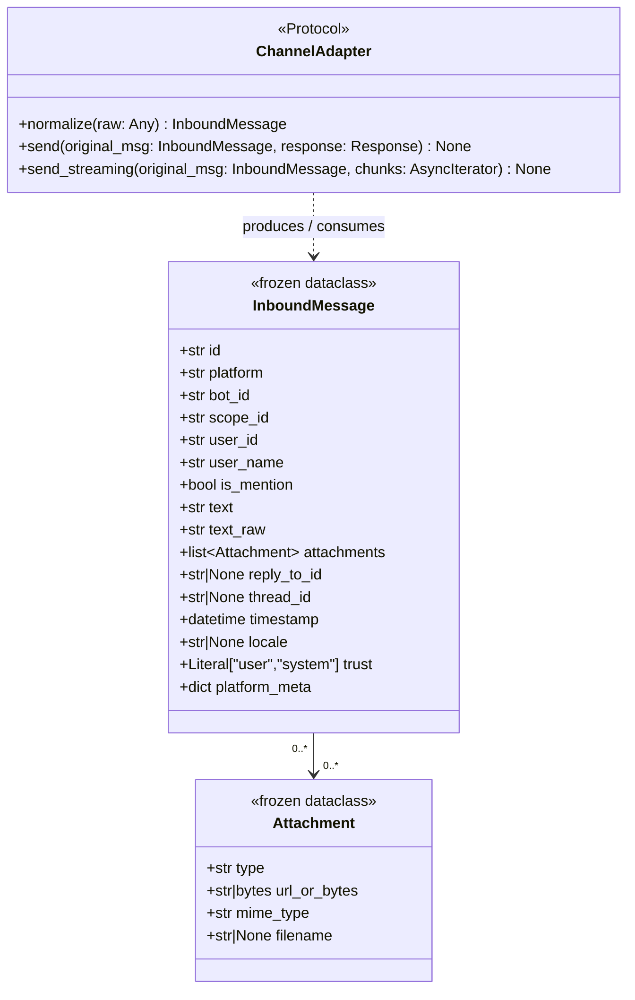
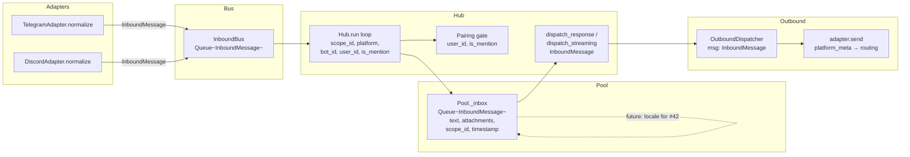

## Context

Part of **Phase 1b — Agent core** (#73). Companion to OutboundMessage normalization (sibling issue).

Today's `Message` dataclass is the inbound envelope, but it exposes platform-specific context (`TelegramContext`, `DiscordContext`) directly to the hub and agents. The issue proposes replacing it with a new `InboundMessage` frozen dataclass where platform-specific data is abstracted into `platform_meta`. Both adapters already implement `_normalize() → Message`; this spec formalizes that contract into the `ChannelAdapter` Protocol and migrates the return type to `InboundMessage`.

## Goal

Define `InboundMessage` as the single typed envelope all adapters must produce, so the hub and agents never read platform-specific fields above the adapter layer.

## Users

- **Primary:** Hub run loop and agents — currently receive `Message` with typed platform contexts; will receive `InboundMessage` with flattened, platform-agnostic fields.
- **Secondary:** Future adapter authors — `ChannelAdapter.normalize()` gives them a clear contract.

## Out of Scope

- OutboundMessage normalization (sibling issue — the `Response` type and `send()` implementation remain largely unchanged in this issue beyond the `original_msg` type signature update).
- Voice/web gateway adapters (unblocked by this, not in scope).
- Language detection (#42) — `locale` field is a passthrough hint only; detection logic ships separately.
- Raw message persistence or structured logging of `platform_meta` fields.
- STT pipeline changes.

## Expected Behavior

1. An incoming Telegram or Discord message arrives at the adapter.
2. The adapter calls its `normalize()` method → produces an `InboundMessage` (frozen).
3. The `InboundMessage` is pushed onto `InboundBus` (typed `Queue[InboundMessage]`).
4. Hub's `run()` loop receives `InboundMessage` — reads `scope_id`, `platform`, `user_id` directly (no `extract_scope_id()` call, no `isinstance(ctx, TelegramContext/DiscordContext)` checks).
5. The agent/pool processes the message, reads `text`, `attachments`, `scope_id` — no platform-specific code.
6. When dispatching a response, the chain `Hub.dispatch_response → OutboundDispatcher.enqueue → adapter.send(original_msg: InboundMessage, ...)` uses `platform_meta` for platform-specific routing (chat_id, channel_id, etc.).

**Bot filtering:** `normalize()` is never called for bot-authored messages — both adapters already discard them before normalization (Telegram: `is_bot` guard in `_on_message`; Discord: `message.author.bot` guard in `on_message`). Therefore `is_from_bot` is not a field on `InboundMessage`. The invariant is enforced at the adapter gate, not in the data model.

**Discord auto-thread:** The Discord adapter currently mutates `hub_msg.platform_context` AFTER normalization to update routing when a thread is created. With a frozen `InboundMessage`, this mutation is not allowed. The adapter must finalize the thread scope (create thread, determine final channel_id/scope_id) **before** calling `normalize()`. The raw `discord.Message` and the resulting thread object are both available at that point.

**Discord `message_id` invariant:** After thread creation, `platform_meta["message_id"]` must be set to `raw_message.id` (the original channel message that triggered the mention), **not** the thread ID. `DiscordAdapter.send()` reads `platform_meta["message_id"]` to call `messageable.fetch_message()` for reply routing. Setting it to the thread ID would silently fail to find the original message and break mention-reply routing.

## Data Model & Consumers

**Consumer summary:**

| Consumer | Fields consumed | When | Status |
|---|---|---|---|
| `Hub.run()` | `scope_id`, `platform`, `bot_id`, `user_id`, `is_mention` | Every message | This issue |
| `_is_group_message()` | `platform`, `platform_meta["is_group"]` / `platform_meta["guild_id"]` | Pairing gate | This issue |
| Pairing gate | `user_id`, `is_mention` | Every message (if pairing enabled) | This issue |
| `Pool._inbox` / agents | `text`, `attachments`, `scope_id`, `timestamp`, `id` | Processing | This issue |
| `OutboundDispatcher` / `adapter.send()` | `platform`, `bot_id`, `platform_meta` | Response routing | This issue |
| Language detection (#42) | `locale` | Future | Future (field passthrough only) |

**`platform_meta` required keys per platform:**

| Platform | Key | Type | Used by |
|---|---|---|---|
| `telegram` | `chat_id` | `int` | `send()`, backpressure ack |
| `telegram` | `topic_id` | `int \| None` | `send()` (topic routing) |
| `telegram` | `message_id` | `int \| None` | error logging |
| `telegram` | `is_group` | `bool` | `_is_group_message()` |
| `discord` | `guild_id` | `int \| None` | `_is_group_message()` |
| `discord` | `channel_id` | `int` | `send()` channel fetch |
| `discord` | `message_id` | `int` | `send()` mention-reply (must be original message id) |
| `discord` | `thread_id` | `int \| None` | scope derivation (already in `scope_id`) |
| `discord` | `channel_type` | `str` | auto-thread guard (read before normalize) |

## Breadboard

| ID | Element | Handler | Data |
|---|---|---|---|
| **N1** | `InboundMessage` dataclass | `core/message.py` | Frozen; fields: `id`, `platform`, `bot_id`, `scope_id`, `user_id`, `user_name`, `is_mention`, `text`, `text_raw`, `attachments`, `reply_to_id`, `thread_id`, `timestamp`, `locale`, `trust`, `platform_meta` |
| **N2** | `Attachment` dataclass | `core/message.py` | Frozen; fields: `type`, `url_or_bytes`, `mime_type`, `filename` |
| **N3** | `ChannelAdapter.normalize()` | `core/hub.py` Protocol | `(raw: Any) → InboundMessage` added to Protocol |
| **N4** | `ChannelAdapter.send/send_streaming()` updated | `core/hub.py` Protocol | Signature: `(original_msg: InboundMessage, ...)` |
| **N5** | `TelegramAdapter.normalize()` | `adapters/telegram.py` | Replaces `_normalize()`; text + audio paths; populates `platform_meta` per table above; `scope_id` computed inline |
| **N6** | `DiscordAdapter.normalize()` | `adapters/discord.py` | Replaces `_normalize()`; auto-thread pre-creation happens before `normalize()`; populates `platform_meta` per table above; `platform_meta["message_id"]` = `raw_message.id` (original, not thread) |
| **N7** | `InboundBus` typed update | `core/inbound_bus.py` | `Queue[Message]` → `Queue[InboundMessage]`; `put()`, `get()`, feeder signatures updated |
| **N8** | Hub run loop + `_is_group_message()` | `core/hub.py` | Replace `msg.extract_scope_id()` with `msg.scope_id`; remove `isinstance(ctx, TelegramContext/DiscordContext)` checks; `_is_group_message()` rewritten to use `msg.platform` + `msg.platform_meta`; `dispatch_response/dispatch_streaming` signatures updated to `InboundMessage` |
| **N9** | Discord auto-thread pre-creation | `adapters/discord.py` | Auto-thread creation moves to `on_message()` before `normalize()` — operates on raw `discord.Message`; thread scope wired into `normalize()` call |
| **N10** | `OutboundDispatcher` typed update | `core/outbound_dispatcher.py` | `Queue[Message]` → `Queue[InboundMessage]`; `enqueue(msg: InboundMessage)`, `enqueue_streaming(msg: InboundMessage)`, worker loop `msg` variable typed |
| **N11** | `Pool` typed update | `core/pool.py` | `Pool._inbox: Queue[InboundMessage]`; `Pool.submit(msg: InboundMessage)`; `Pool.history: list[InboundMessage]`; `_process_one(msg: InboundMessage)`; `_safe_dispatch(msg: InboundMessage)` |

## Slices

| # | Slice | Files | Demo |
|---|---|---|---|
| S1 | `InboundMessage` + `Attachment` dataclasses; `ChannelAdapter` Protocol update (N1–N4) | `core/message.py`, `core/hub.py` | `InboundMessage(platform="telegram", ..., text="hello", attachments=[])` instantiates frozen; Protocol checks pass statically |
| S2 | Telegram adapter produces `InboundMessage`; InboundBus + Hub run loop + OutboundDispatcher + Pool updated; Telegram roundtrip tests (N5, N7, N8, N10, N11) | `adapters/telegram.py`, `core/inbound_bus.py`, `core/hub.py`, `core/outbound_dispatcher.py`, `core/pool.py`, `tests/` | Telegram webhook → `InboundMessage` on bus; hub processes without `extract_scope_id()`; tests assert `scope_id`, `platform`, `text`, `platform_meta["chat_id"]` for text + audio fixtures |
| S3 | Discord adapter produces `InboundMessage`; auto-thread pre-creation; Discord roundtrip tests (N6, N9) | `adapters/discord.py`, `tests/` | Discord @mention → thread created before normalize → `InboundMessage` with `scope_id="thread:{id}"`, `platform_meta["message_id"]` = original message id; tests assert field values for mention + non-mention fixtures |

## Success Criteria

- [ ] `InboundMessage` frozen dataclass defined in `core/message.py` with fields: `id`, `platform`, `bot_id`, `scope_id`, `user_id`, `user_name`, `is_mention`, `text`, `text_raw`, `attachments`, `reply_to_id`, `thread_id`, `timestamp`, `locale`, `trust`, `platform_meta`
- [ ] `Attachment` frozen dataclass defined in `core/message.py` with fields: `type`, `url_or_bytes`, `mime_type`, `filename`
- [ ] `ChannelAdapter` Protocol in `core/hub.py` includes `normalize(raw: Any) -> InboundMessage`; `send()` and `send_streaming()` signatures updated to `original_msg: InboundMessage`
- [ ] `TelegramAdapter.normalize()` produces `InboundMessage` for text and audio messages; `platform_meta` carries all keys from the required-keys table above
- [ ] `DiscordAdapter.normalize()` produces `InboundMessage`; auto-thread creation happens before `normalize()` on raw `discord.Message`; `platform_meta["message_id"]` is the original channel message id
- [ ] `InboundBus`, `OutboundDispatcher`, and `Pool` updated to `InboundMessage` throughout; hub run loop reads `msg.scope_id` directly; no `isinstance(ctx, TelegramContext/DiscordContext)` checks remain in `hub.py`; `_is_group_message()` rewritten using `msg.platform` + `msg.platform_meta`
- [ ] All tests pass (`uv run pytest`); Telegram roundtrip tests assert `scope_id`, `platform`, `text`, and `platform_meta["chat_id"]` from fixture inputs; Discord roundtrip tests assert `scope_id`, `platform_meta["message_id"]` (original id), and `platform_meta["channel_type"]` for mention and non-mention fixtures
