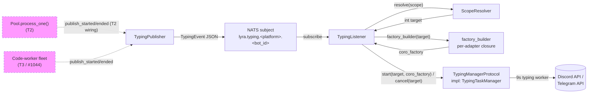

## Context

Source: `artifacts/frames/1376-typing-plane-t1-frame.mdx` (approved 2026-05-26).
Parent: epic #1375 (panel-validated 2026-05-26).

T1 introduces the **machinery** for a 3rd NATS plane `lyra.typing.<platform>.<bot_id>` (NATS Core, ephemeral). T2 (separate issue) migrates the 8+ imperative `_start_typing` / `_cancel_typing` call sites and closes #1374 (typing orphan bug class). T5 (separate issue) writes the axial-companion ADR.

**This spec covers T1 only.**

Twin reference: `src/lyra/transport/turn_publisher.py` (JetStream + PubAck for persistence). `TypingPublisher` mirrors the structural pattern but on **NATS Core** (ephemeral) with **ref-counted state** (skip duplicate emits for nested scopes).

## Goal

Land production-deployable foundational primitives (`WorkScope`, `TypingPublisher`, `TypingListener`, `ScopeResolver`, `TypingManagerProtocol`, NATS ACL plane, env flag) such that T2 can wire them into `Pool.process_one()` and per-platform adapters in a single migration PR without further machinery work and without breaking the stage-axis layer contract.

## Users

- **Primary:** developers of T2 (`src/lyra/core/pool/`, `src/lyra/adapters/{discord,telegram}/`) — they consume the publisher/listener primitives. They must be able to wire publisher into pool and listener into adapter bootstrap with zero ambiguity on API shape, error semantics, or feature-flag behavior.
- **Secondary:**
  - Operators (M₁ `lyra-hub` role) — must restart NATS + hub + adapters after `auth.conf` regen.
  - Future emitter owners (T3 / #1044 workers, TTS, vision) — wire into the plane in ≤50 LOC per emitter.

## Expected Behavior

**Publisher path (hub-side):**

1. Hub computes a `WorkScope(platform, bot_id, scope_id, trace_id)` from inbound message context at the start of `Pool.process_one()` (in T2; T1 only ships the primitive).
2. Hub calls `await typing_publisher.publish_started(scope)`. Internal ref-count `dict[(platform, bot_id, scope_id), int]` increments from 0→1 — emits `TypingEvent(kind="started", scope, ts)` to `lyra.typing.<platform>.<bot_id>`. If ref-count was already ≥1 (sub-scope or duplicate emit), no NATS publish.
3. Hub completes work. Calls `await typing_publisher.publish_ended(scope)`. Ref-count decrements; emits `TypingEvent(kind="ended", scope, ts)` only on 1→0.
4. If `LYRA_TYPING_ENABLED=false` (default): publisher returns immediately, zero NATS calls, ref-count is bypassed entirely.
5. If NATS `publish()` raises: publisher logs (level `warning`) and swallows. Turn execution continues. Ref-count state is NOT rolled back on publish failure — best-effort.

**Listener path (adapter-side):**

1. Adapter bootstrap registers a `TypingListener(nc, subject, resolver, factory_builder, manager)` where:
   - `resolver: ScopeResolver` is platform-specific (module-level function in `adapter.py`, ≤10 LOC)
   - `factory_builder: Callable[[int], Callable[[], Coroutine[Any, Any, None]]]` is per-adapter (closure over adapter's existing typing-worker), creates the `coro_factory` required by `TypingTaskManager.start()`
   - `manager: TypingManagerProtocol` — structural Protocol satisfied by existing `TypingTaskManager` (adapter passes `self._typing`)
2. Listener subscribes to NATS Core subject on startup.
3. On message: decode → `TypingEvent` → `target = resolver.resolve(event.scope)` → `int`.
4. On `kind="started"`: `manager.start(target, factory_builder(target))` — TypingTaskManager creates the 9s-refresh worker task using the per-platform factory.
5. On `kind="ended"`: `manager.cancel(target)` — idempotent no-op if not started (matches existing `TypingTaskManager.cancel` semantics).
6. Subscription handler wraps body in `try/except`; on exception during resolution or dispatch, logs and calls `manager.cancel(target)` in `finally` if `target` was resolved (defensive — prevents subscription death from leaving orphan tasks).

**Operational restart sequence (S3 deploy slice):**

ACL changes go through type=mount secret. Recommended sequence on M₁:

```bash
# 0. Pre-regen: pull staging fresh + verify fragment files intact (#1361/#1369 class)
git -C ~/projects/lyra pull --ff-only
test -s deploy/nats/auth.conf  # tracked file must exist
ls deploy/nats/fragments/      # fragment splices intact, if any

# 1. Regenerate auth.conf + refresh lyra-nats-auth secret + restart NATS
make nats-regen-authconf

# 2. Re-auth hub + adapters with new permissions
systemctl --user restart lyra-hub
systemctl --user restart lyra-telegram lyra-discord

# 3. Verify (post-restart, on first traffic):
bash tools/check-nats-acls.sh   # journal-based permission-violation scan, run after ≥5 min of traffic
```

No HUP supported — `auth.conf` is mounted, not file-watched.

## Data Model & Consumers

### Data structure

```mermaid
classDiagram
    class WorkScope {
        +platform: str
        +bot_id: str
        +scope_id: int
        +trace_id: str
    }
    note for WorkScope "Pool-internal @dataclass\nsrc/lyra/transport/work_scope.py\nNOT in roxabi-contracts (T1/T2)\nPromotion deferred to T3 / #1044"

    class TypingEvent {
        +kind: Literal[started, ended]
        +scope: WorkScope
        +ts: float
    }
    note for TypingEvent "Wire payload (Pydantic JSON)\nlyra.typing.<platform>.<bot_id>\nNATS Core (ephemeral, fire-and-forget)\nNo schema_version field in T1"

    class ScopeResolver {
        <<Protocol>>
        +resolve(scope: WorkScope) int
    }
    note for ScopeResolver "Module-level function in adapter.py (≤10 LOC)\nDiscord: returns scope.scope_id (which IS parent channel.id by T2 construction)\nTelegram: returns scope.scope_id (chat_id)\nKeeps stage-axis pure — no closure over adapter instance"

    class TypingManagerProtocol {
        <<Protocol>>
        +start(target: int, coro_factory: Callable) None
        +cancel(target: int) None
    }
    note for TypingManagerProtocol "Structural Protocol — src/lyra/typing/types.py\nExisting TypingTaskManager satisfies\nPrevents lyra.typing → lyra.adapters import"

    class TypingPublisher {
        -_refcount: dict[tuple[str,str,int], int]
        -_nc: NATS
        -_enabled: bool
        +publish_started(scope: WorkScope) None
        +publish_ended(scope: WorkScope) None
    }
    note for TypingPublisher "Hub-side · src/lyra/transport/typing_publisher.py\nNATS Core publish (no PubAck)\nRef-counted, swallow on error\nNO async with scope() CM in T1 — T3 ergonomic addition"

    class TypingListener {
        -_nc: NATS
        -_subject: str
        -_resolver: ScopeResolver
        -_factory_builder: Callable[[int], Callable]
        -_manager: TypingManagerProtocol
        +start() None
        +stop() None
    }
    note for TypingListener "Adapter-side stage-axis (src/lyra/typing/listener.py)\nMirror of src/lyra/inbound/\nDispatches to manager via factory_builder"

    TypingPublisher ..> WorkScope : reads
    TypingPublisher ..> TypingEvent : emits
    TypingListener ..> TypingEvent : consumes
    TypingListener ..> ScopeResolver : resolves via
    TypingListener ..> TypingManagerProtocol : dispatches to
```



### Consumer map



### Consumer summary

| Consumer | Fields consumed | When | Status |
|---|---|---|---|
| `TypingPublisher` | `WorkScope.{platform, bot_id, scope_id, trace_id}` | on `publish_started/ended` call (T2 wiring) | future (T2) — interface ready in T1 |
| NATS subject | full `TypingEvent` JSON | publish/subscribe | this issue (T1) |
| `TypingListener` | `TypingEvent.{kind, scope}` | on subscription message | this issue (T1) |
| `ScopeResolver` | `WorkScope` → `int` | per-event | this issue (T1) — Protocol + 2 module-level impls in adapter.py |
| `factory_builder` | resolved `int` → `coro_factory` | per `started` event | this issue (T1) — per-adapter closure |
| `TypingManagerProtocol` | `target: int`, `coro_factory: Callable` | `start()` / `cancel()` | structural — existing `TypingTaskManager` satisfies (T1 adds Protocol only) |
| `code-worker` (T3) | publishes `WorkScope` via wire | future emitter | future (T3 / #1044) — ACL placeholder DEFERRED to T3 (see Open Q below) |

## Breadboard

### Affordances — Publisher

| ID | Affordance | Handler | Data |
|---|---|---|---|
| P1 | `publish_started(scope: WorkScope)` | `TypingPublisher` | reads `WorkScope`; mutates `_refcount[key]`; emits `TypingEvent(kind="started")` on 0→1 |
| P2 | `publish_ended(scope: WorkScope)` | `TypingPublisher` | reads `WorkScope`; mutates `_refcount[key]`; emits `TypingEvent(kind="ended")` on 1→0 |

Ref-count key = `(scope.platform, scope.bot_id, scope.scope_id)`. `trace_id` excluded from key (different turns of same scope must not double-count) but preserved on the emitted event payload for observability.

### Affordances — Listener

| ID | Affordance | Handler | Data |
|---|---|---|---|
| L1 | Subscribe on `start()` | `_nc.subscribe(subject, cb=_on_msg)` | reads `lyra.typing.<platform>.<bot_id>` |
| L2 | Decode + resolve | `_on_msg(msg)`: `event = TypingEvent.model_validate_json(msg.data)`; `target = resolver.resolve(event.scope)` | parses payload, computes typing target |
| L3 | Dispatch by kind | `started` → `manager.start(target, factory_builder(target))`; `ended` → `manager.cancel(target)` | factory_builder closes over per-adapter typing-worker |
| L4 | Defensive cleanup | `try/except` in `_on_msg`; on exception, `manager.cancel(target)` in `finally` if `target` resolved, else log-and-continue | subscription survives dispatch failures |
| L5 | Unsubscribe on `stop()` | shutdown hook | clean shutdown |

### Wiring

| ID | What | Where | Constraint |
|---|---|---|---|
| W1 | Bootstrap registers `TypingPublisher` in hub | hub-standalone bootstrap | one instance per hub process; reads `LYRA_TYPING_ENABLED` env at construction |
| W2 | Bootstrap registers `TypingListener` per adapter | adapter-standalone bootstrap | passes module-level resolver + closure-based factory_builder + existing `self._typing` manager |
| W3 | importlinter contract | `.importlinter` | `lyra.typing` layer slotted between `streaming` and `core` (additive, see below) |
| W4 | NATS ACL | `artifacts/specs/706-per-role-nkeys-acls-spec.mdx` + `deploy/nats/auth.conf` regen | hub publish `lyra.typing.>`; telegram-adapter subscribe `lyra.typing.telegram.>`; discord-adapter subscribe `lyra.typing.discord.>`; **code-worker placeholder DEFERRED to T3** (see Open Q 3) |

importlinter layer change (additive — slotted between `lyra.streaming` and `lyra.core`):

```
lyra.bootstrap
lyra.adapters | lyra.blobstore
lyra.outbound
lyra.infrastructure
lyra.llm | lyra.nats
lyra.core
lyra.typing       ← NEW
lyra.streaming
lyra.transport
```

`lyra.typing` may import: stdlib, `lyra.streaming`, `lyra.transport`. Forbidden: `lyra.adapters`, `lyra.infrastructure`, `lyra.outbound`, `lyra.bootstrap`. `lyra.core` → `lyra.typing` is downward and permitted (Pool will import `TypingPublisher` in T2). `lyra.adapters` → `lyra.typing` is downward and permitted (adapter bootstrap imports `TypingListener`).

### Configuration

| ID | What | Default | Propagation |
|---|---|---|---|
| C1 | `LYRA_TYPING_ENABLED` env var | `false` | (a) `deploy/quadlet/hub.env.example` — add `LYRA_TYPING_ENABLED=false` stub; (b) telegram + discord adapter Quadlet templates — add `Environment=LYRA_TYPING_ENABLED=false`; gates BOTH publisher emission AND listener dispatch |
| C2 | `nats_auth_conf` secret (type=mount) | regenerated via `make nats-regen-authconf` | additive over #1379's same-day regen — see pre-regen verification in Expected Behavior § Operational restart sequence |
| C3 | NATS subject pattern | `lyra.typing.<platform>.<bot_id>` | `<platform> ∈ {discord, telegram}`, `<bot_id>` = adapter bot id; used by both publisher (publish subject) and listener (subscribe subject) — see S2 demo |

### Wire format

`TypingEvent` serialized as Pydantic `model_dump_json()` → UTF-8 bytes, published via `nc.publish(subject, payload)`. No JetStream PubAck — fire-and-forget per NATS Core semantics. **No `schema_version` field in T1.** T3 promotion to `roxabi-contracts` will add it. Until T3 promotion, `TypingEvent` MUST NOT add required fields (Pydantic default behavior: ignore unknown fields on decode; missing required fields raise — so adding a required field is a breaking change for any deployed adapter still running an older listener).

## Slices

Vertical increments, demo-able with declared dependencies. F-lite — 3 slices.

| # | Name | Files | Demo | Depends on |
|---|---|---|---|---|
| S1 | Contracts + Publisher | `src/lyra/transport/work_scope.py`, `src/lyra/transport/typing_publisher.py`, `tests/transport/test_typing_publisher.py` | unit tests: ref-count (2× started → 1 msg; 2× ended → 1 msg), swallow on error, flag-off → 0 calls | — |
| S2 | Listener + stage-axis module + per-platform resolvers | `src/lyra/typing/{__init__.py, types.py, listener.py}` (includes `ScopeResolver`, `TypingManagerProtocol`, `TypingEvent` if not in transport), `src/lyra/adapters/discord/adapter.py` (module-level `_discord_scope_resolver` fn + factory_builder closure), `src/lyra/adapters/telegram/telegram.py` (same shape), `.importlinter`, `tests/typing/test_typing_listener.py`, `tests/typing/test_resolvers.py` | in-process NATS integration test: publisher → NATS → listener → mock `TypingManagerProtocol` invocation with resolved target + correct coro_factory | S1 |
| S3 | Bootstrap wiring + ACL + deploy ready | hub-bootstrap + adapter-bootstrap modules, `artifacts/specs/706-per-role-nkeys-acls-spec.mdx`, `deploy/nats/auth.conf` (regenerated via `make nats-regen-authconf` after `git pull --ff-only`), `deploy/quadlet/hub.env.example` + adapter Quadlet templates (add `LYRA_TYPING_ENABLED=false`), PR description with restart sequence | (a) regen succeeds; (b) `grep -F "lyra.typing." deploy/nats/auth.conf` shows new permission rows for hub/telegram-adapter/discord-adapter; (c) container restart + flag=false → zero `lyra.typing.*` NATS traffic visible via `nats sub "lyra.typing.>"` (smoke test) | S1, S2 |

Slice ordering rationale: S1 testable in isolation (no NATS network, mock connection). S2 brings NATS into the test path (in-process NATS, `nats-py` test harness) — listener is exercisable once publisher exists. S3 is operational glue + ACL — last because it touches secrets and requires the M₁ restart sequence.

## Success Criteria

- [ ] **AC1 (plane reachable):** integration test with in-process NATS publishes to `lyra.typing.discord.<bot_id>` and `lyra.typing.telegram.<bot_id>`; listener receives, decodes, resolves via module-level resolver, and calls `manager.start(target, factory_builder(target))` on `started` and `manager.cancel(target)` on `ended` against a mock `TypingManagerProtocol`. Assert the `coro_factory` passed to `start()` is the one produced by `factory_builder(target)` (not None, callable, returns coroutine).
- [ ] **AC2 (ref-count correctness):** `publish_started(scope)` called 2× → exactly 1 NATS publish observed; first `publish_ended(scope)` → 0 publish; second `publish_ended(scope)` → 1 publish (LIFO-independent).
- [ ] **AC3 (idempotence on unknown scope):** `publish_ended(scope)` for a never-`started` scope → no exception raised, no NATS publish, `log.debug` only.
- [ ] **AC4 (feature flag off):** With `LYRA_TYPING_ENABLED=false` (default), `TypingPublisher.publish_started/ended` short-circuit before any ref-count mutation; zero `nc.publish` calls observed; `TypingListener` does not dispatch to manager even if events arrive on the subject (listener also gates on env).
- [ ] **AC5 (publish error swallow):** With a publish-raising NATS stub, `publish_started/ended` returns without raising; warning logged; ref-count state remains incremented (no rollback) per best-effort semantics.
- [ ] **AC6 (ACL regen):** After `git pull --ff-only` (catches any fragment-splice drift from #1379-class cascades) and `make nats-regen-authconf`, `deploy/nats/auth.conf` contains: hub-role `publish.allow` entry for `lyra.typing.>`; telegram-adapter `subscribe.allow` entry for `lyra.typing.telegram.>`; discord-adapter `subscribe.allow` entry for `lyra.typing.discord.>`. Verified by `grep -F "lyra.typing." deploy/nats/auth.conf | wc -l ≥ 3`. `artifacts/specs/706-per-role-nkeys-acls-spec.mdx` updated to reflect the same rows.
- [ ] **AC7 (importlinter green):** `uv run lint-imports` passes; `lyra.typing` layer correctly placed between `streaming` and `core`; `lyra.typing.*` modules only import from stdlib + `lyra.streaming` + `lyra.transport` (verified by `grep -r "^from lyra\." src/lyra/typing/` showing only `lyra.streaming` / `lyra.transport` entries).
- [ ] **AC8 (per-platform resolvers — testable):** `_discord_scope_resolver(scope: WorkScope) -> int` and `_telegram_scope_resolver(scope: WorkScope) -> int` are **module-level functions** in their respective adapter modules (NOT closures over adapter instances). Discord resolver unit test asserts `resolve(scope)` returns `scope.scope_id` (the parent channel.id which T2 constructs at inbound capture — T1 does not need a thread mock, only verifies the identity-with-validation shape and that the function lives at module scope and is importable without instantiating the adapter). Telegram resolver same shape.

## Post-Merge Operator Actions (T2 Prerequisites)

These are NOT acceptance criteria for the T1 PR (T1 ships with `LYRA_TYPING_ENABLED=false` in prod), but they ARE prerequisites that T2's `/plan` must verify before starting:

- **Staging soak:** `LYRA_TYPING_ENABLED=true` runs in dev/staging for ≥24h consecutive with at least one inbound message per adapter, verifying real NATS connectivity (auth, routing, subscription on production-shape NATS). Operator records the soak window in T2's frame as a prerequisite. Surfaced here so T2's interview pulls it forward — T1 merging does not gate on this.

## Edge Cases

- **Adapter restart mid-turn:** publisher emits `started` → adapter restarts → listener missed event → `ended` arrives → resolver dispatches `manager.cancel(target)` on never-started target → AC3 covers (idempotent no-op via existing `TypingTaskManager.cancel`).
- **NATS reconnect during subscription:** `nats-py` auto-resubscribes on reconnect; documented in `TypingListener.start()` docstring. No additional logic in T1.
- **Concurrent `publish_started` for same scope from 2 coroutines:** ref-count dict mutation is on the asyncio event loop (single-threaded) — sequential, no race. Documented in `TypingPublisher` docstring (no `asyncio.Lock` needed in T1).
- **`scope.scope_id == 0` or negative:** treated as valid — int type, no validation gate. Resolver may reject (Discord channel ids are positive; Telegram chat_ids can be negative for groups). Out of scope for T1; deferred to T2 wiring discipline.
- **Listener exception during dispatch (resolver / factory_builder / manager raises):** `try/except` in `_on_msg` body. If `target` was resolved before the failure, `manager.cancel(target)` runs in `finally`. Subscription survives.
- **Hub restart between `started` and `ended`:** in-process ref-count dict is wiped on process restart — bounded to process lifetime. After restart, future `publish_ended` for previously-`started` scopes will fire a `0→1` underflow (decrementing absent key); the publisher MUST tolerate this as `log.debug` no-op (treat missing key as ref-count 0 already). T1 explicitly accepts this trade-off — no ref-count persistence across hub restarts.

## Open Questions

(All resolvable in implementation — none block /plan.)

1. **`TypingPublisher.__init__(nc, *, enabled=None)` arg shape:** accept `nc: NATS` directly (matches `TurnPublisher(js: JetStreamContext)` constructor pattern); `enabled` defaults to `os.getenv("LYRA_TYPING_ENABLED", "false").lower() == "true"`. Bootstrap owns instantiation.
2. **`TypingEvent.ts` type:** `float` (unix seconds, `time.time()` source) — lighter wire payload, no timezone semantics needed for ephemeral events.
3. **`code-worker` ACL placeholder:** **DEFERRED to T3 / #1044.** The epic #1375 anticipated adding `code-worker publish.allow += lyra.typing.>` in T1 to "avoid future regen cycle." However, `code-worker` nkey does not yet exist in `auth.conf` (11 identities, none named `code-worker`). Adding a placeholder ACL row without an nkey is meaningless; adding the nkey now via `make nats-add-identity NAME=code-worker` would create dormant credentials. T3 ships both the nkey and the row in the same change. T1's surface = hub publish + 2 adapter subscribes only.
4. **`TypingPublisher.scope(work_scope)` async context manager:** **NOT IN T1.** T2 calls `publish_started` / `publish_ended` directly (or wraps in its own ad-hoc CM at the pool layer). Adding `scope()` as a publisher-side CM is a T3 ergonomic addition once the API has been exercised by ≥2 emitters (hub pool + 1 worker). Deferring avoids locking the wrong ergonomics shape based on a single consumer.

## Reviewer Notes (R2)

R2 incorporates findings from 5-agent review on R1:
- **architect**: defect on `TypingTaskManager.start(chat_id, coro_factory)` → resolved by adding `factory_builder` listener param + `TypingManagerProtocol` structural Protocol.
- **doc-writer**: resolved (dashed Pool→Pub arrow, AC8 setup clause, ref-count restart edge case).
- **product-lead**: resolved (Open Q 4 pins CM deferral, S3 demo includes pre-regen pull step, AC9 staging soak added).
- **devops**: resolved (real `make nats-regen-authconf` target, `LYRA_TYPING_ENABLED` propagation paths in C1, code-worker placeholder deferred per Open Q 3, fragment-splice pre-regen verification in Expected Behavior).
- **axial-adr-review**: resolved (`TypingManagerProtocol` in `src/lyra/typing/types.py` blocks the forbidden `lyra.typing → lyra.adapters` import).

Pre-check expected pass on R2: 9 AC binary; all P*/L*/W*/C* IDs covered in slices (P1/P2→S1; L1-L5→S2; W1/W2/W4→S3, W3→S2; C1/C2/C3→S3 + S1/S2 implicit); ambiguity budget = 0 χ (4 Open Q resolved inline); slice coverage complete; 6 edge cases handled.
