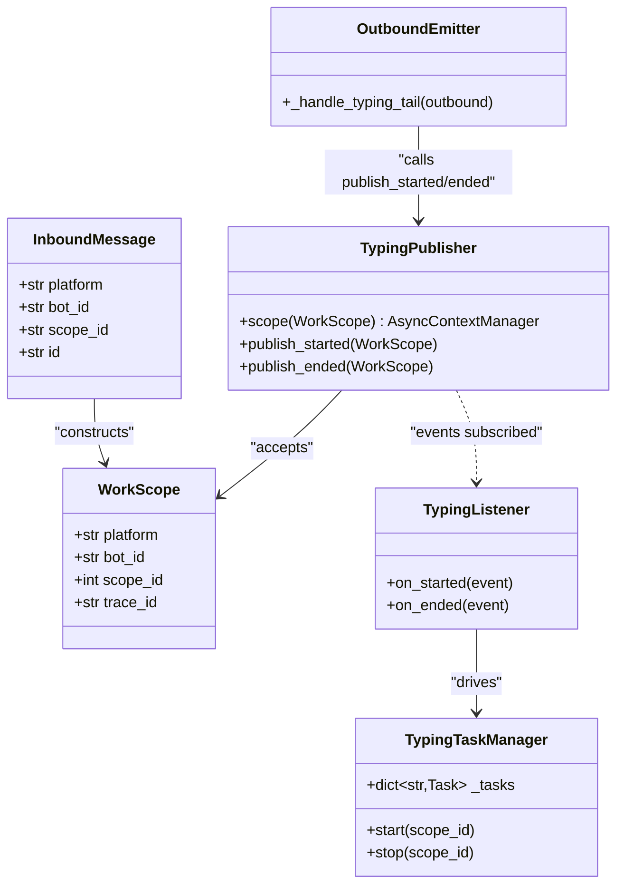
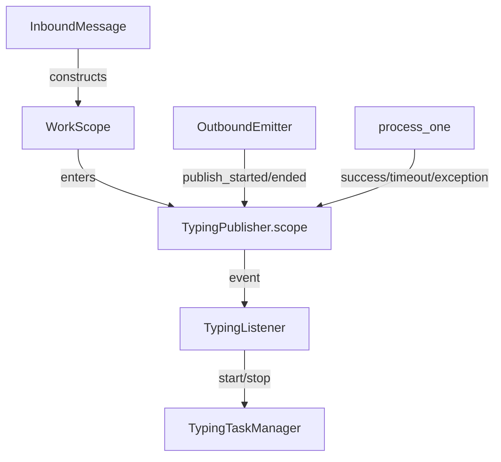

## Context

This spec promotes the approved frame for #1377. T1 core (#1376) established the pub/sub typing contract: `TypingListener` subscribes to `typing.started` / `typing.ended` and drives `TypingTaskManager`. T2 integrates that contract into the pool (hub) and adds a parallel pub/sub path alongside the existing adapter call sites. The goal is to eliminate orphan typing tasks by making the pool the single source of truth for typing lifecycle.

## Goal

Add a publish/subscribe typing path to the pool and `OutboundEmitter`, while keeping adapter call sites in place as conditional shims. After soak, a follow-up PR removes the legacy path and the feature flag.

## Users

- **Primary:** Discord and Telegram bot users who see typing indicators during agent turns
- **Secondary:** Ops engineers who monitor for orphan typing warnings in `lyra-discord` journalctl

## Expected Behavior

1. When a message arrives at the pool, the hub constructs a `WorkScope` and enters `typing_publisher.scope()` before calling `process_one()`. The typing indicator starts automatically.
2. When `process_one()` exits (success, timeout, exception, cancellation), the context manager exits and publishes `typing.ended`. The typing indicator stops.
3. Adapter methods (`_start_typing`, `_cancel_typing`) are changed to conditional shims:
   - With `LYRA_TYPING_ENABLED=true`: delegate to `typing_publisher`
   - With `LYRA_TYPING_ENABLED=false`: call the existing `ThrottleCapability` path
4. `OutboundEmitter._handle_typing_tail` calls `typing_publisher.publish_started/ended` based on `outbound.intermediate`.
5. With `LYRA_TYPING_ENABLED=true` (default), only the pub/sub path fires. With `LYRA_TYPING_ENABLED=false`, only the legacy adapter path fires. Never both.

## Data Model & Consumers

### Class Diagram



### Consumer Map



### Consumer Summary

| Consumer | Fields consumed | When | Status |
|---|---|---|---|
| TypingPublisher | `platform`, `bot_id`, `scope_id`, `trace_id` | Turn start | this issue |
| TypingListener | `scope_id` | On started/ended event | existing (T1) |
| TypingTaskManager | `scope_id` | On started/ended event | existing (T1) |
| OutboundEmitter | `outbound.intermediate` | Outbound send | this issue |

## Breadboard

| ID | Affordance | Handler | Data |
|---|---|---|---|
| U1 | Pool processes inbound message | `pool_processor_exec.process_one()` wrapped in `typing_publisher.scope(work_scope)` | `InboundMessage` → `WorkScope` |
| U2 | Discord inbound receives message | `adapter._start_typing(send_to_id)` → conditional shim | `send_to_id` |
| U3 | Discord inbound drop callback | `on_drop=lambda: adapter._cancel_typing(send_to_id)` → conditional shim | `send_to_id` |
| U4 | Discord outbound end-of-send | `adapter._start_typing(send_to_id)` / `adapter._cancel_typing(send_to_id)` → conditional shim | `send_to_id` |
| U5 | Discord outbound typing tail | `OutboundEmitter._handle_typing_tail` calls `typing_publisher.publish_started/ended` | `outbound.intermediate` |
| U6 | Discord audio inbound | `adapter._start_typing(message.channel.id)` / `on_drop=...` → conditional shim | `message.channel.id` |
| U7 | Discord adapter render | `adapter._cancel_typing_for(inbound)` → conditional shim | `InboundMessage` |
| U8 | Telegram inbound receive | `adapter._start_typing(chat_id)` → conditional shim | `chat_id` |
| U9 | Telegram inbound drop callback | `on_drop=lambda: adapter._cancel_typing(chat_id)` → conditional shim | `chat_id` |
| U10 | Telegram outbound send | `adapter._start_typing(chat_id)` / `adapter._cancel_typing(chat_id)` → conditional shim | `chat_id` |
| N1 | Feature flag toggle | `LYRA_TYPING_ENABLED` env var controls pub/sub vs legacy path | `os.environ` |

## Slices

| # | Slice | Demo | Affordances |
|---|---|---|---|
| S1 | Pool wrap + OutboundEmitter refactor | `lyra hub` starts, processes a message, typing indicator auto-starts/ends | U1, U5 |
| S2 | Discord conditional shims | Discord adapter typing calls delegate to pub/sub when flag=true | U2, U3, U4, U6, U7 |
| S3 | Telegram conditional shims | Telegram adapter typing calls delegate to pub/sub when flag=true | U8, U9, U10 |
| S4 | Feature flag + CI | `LYRA_TYPING_ENABLED=true` passes integration tests; `false` passes regression | N1 |

## Success Criteria

- [ ] **SC1** — `src/lyra/core/pool/pool_processor_exec.py` wraps `process_one()` in `async with typing_publisher.scope(work_scope):`
- [ ] **SC2** — `WorkScope` constructed from `InboundMessage` at pool entry: `scope_id` parsed from `str` to `int`, `trace_id` derived from `TraceContext.get_trace_id()`
- [ ] **SC3** — `typing_publisher.scope()` auto-publishes `started` on entry and `ended` on exit (including `asyncio.CancelledError`, `asyncio.TimeoutError`, generic exception)
- [ ] **SC4** — `discord_inbound.py` line 318 `_start_typing` and line 345 `_cancel_typing` in `on_drop` replaced with conditional shim
- [ ] **SC5** — `discord_outbound.py` lines 167, 169 `_start_typing` / `_cancel_typing` replaced with conditional shim
- [ ] **SC6** — `discord_audio.py` lines 275, 285 `_start_typing` / `_cancel_typing` replaced with conditional shim
- [ ] **SC7** — `discord/adapter.py` lines 273, 280, 287, 294 `_cancel_typing_for` replaced with conditional shim
- [ ] **SC8** — `telegram_inbound.py` lines 97, 134, 146, 269, 299 `_start_typing` / `_cancel_typing` replaced with conditional shim
- [ ] **SC9** — `telegram_outbound.py` lines 166, 168 `_start_typing` / `_cancel_typing` replaced with conditional shim
- [ ] **SC10** — `OutboundEmitter._handle_typing_tail` calls `typing_publisher.publish_started/ended` based on `outbound.intermediate`
- [ ] **SC11** — `LYRA_TYPING_ENABLED` env var controls path (default `true` — pub/sub active; `false` — legacy path)
- [ ] **SC12** — CI integration tests pass with `LYRA_TYPING_ENABLED=true` and `false`
- [ ] **SC13** — AC1–AC7 from issue #1377 verified (no orphan tasks, no double typing, exception safety)

## Implementation Notes

### Pool wiring

`typing_publisher` is stored on `Hub` (`Hub._typing_publisher`). The idiomatic way to expose it to `Pool` is to add it directly as a `Pool` attribute (same pattern as `pairing_manager`), not via `PoolObserver`. `PoolManager.get_or_create_pool()` wires it:

```python
new_pool.typing_publisher = self._hub._typing_publisher
```

`pool_processor_exec.py` accesses it via `pool.typing_publisher`.

### OutboundAdapterBase MRO safety

Add a post-construction setter `configure_typing_publisher()` on `OutboundAdapterBase` (mirroring `configure_tool_display`). Inject into `OutboundEmitter` in `send_streaming`:

```python
emitter.typing_publisher = getattr(self, "_typing_publisher", None)
```

### WorkScope construction

`InboundMessage.scope_id` is `str` (e.g., `"channel:123"`, `"thread:123"`). Convert to `int`:

```python
scope_id = int(msg.scope_id.split(":")[-1])
```

`trace_id` is not on `InboundMessage`. Use `TraceContext.get_trace_id()` (set by `TraceMiddleware` before pool runs). Fallback to `uuid4().hex` if unavailable.

### typing_publisher.scope()

`TypingPublisher` currently has `publish_started` and `publish_ended` but no `scope()` context manager. Add:

```python
@asynccontextmanager
async def scope(self, work_scope: WorkScope):
    await self.publish_started(work_scope)
    try:
        yield
    finally:
        await self.publish_ended(work_scope)
```

### _handle_typing_tail

Refactor `_placeholder_lifecycle.py` `_handle_typing_tail` to call `typing_publisher.publish_started/ended` directly. When `LYRA_TYPING_ENABLED=false`, the publisher is a no-op; the legacy `ThrottleCapability` path in adapter shims handles typing.

## [NEEDS CLARIFICATION]

None — all prior questions resolved.
