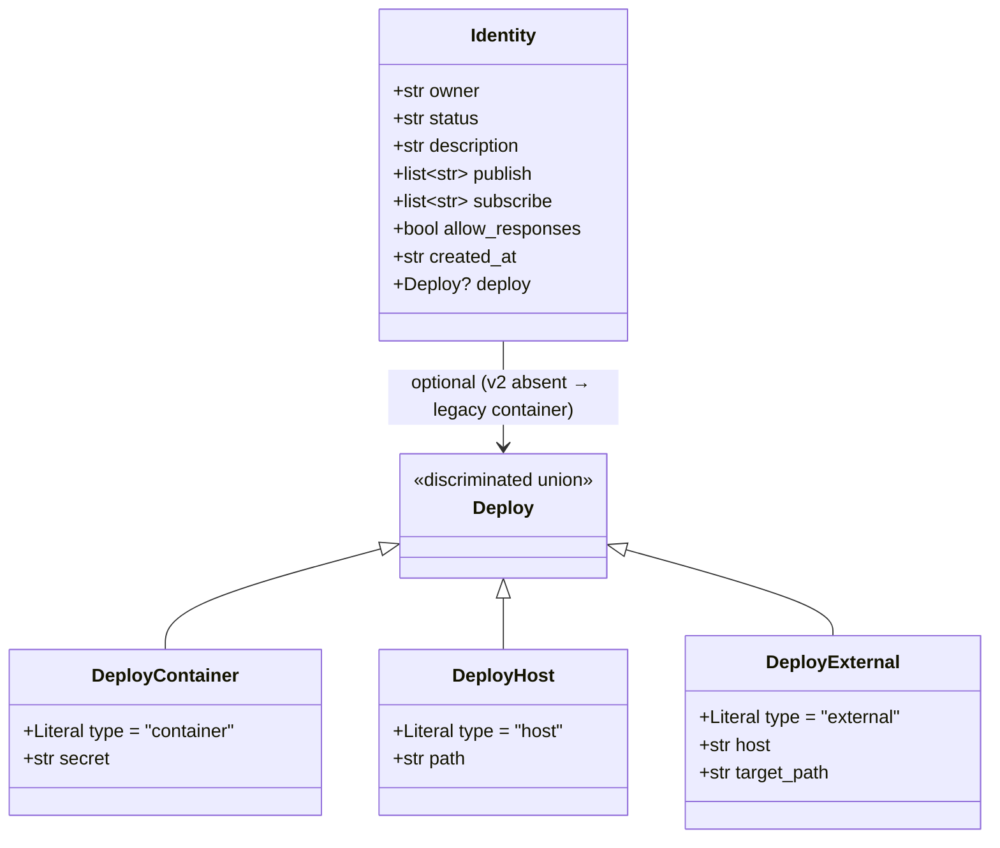
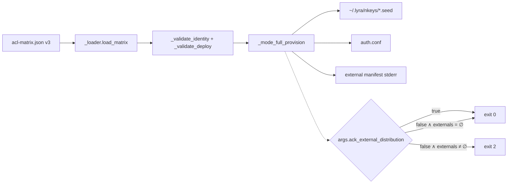

## Context

Promoted from `artifacts/frames/1379-gen-nkeys-fail-loud-external-seeds-frame.mdx`.

Incident 2026-05-25/26 : `lyra-acl genkeys --regenerate` a régénéré le seed `voice-client` sur M₁ sans propagation à M₂ → ~14h d'auth-fail silencieux côté NATS, voicecli `dictate nats` bloqué. Hotfix manuel par scp.

Root cause : le schéma `deploy/nats/acl-matrix.json` n'exprime pas la topologie de déploiement par identité. `scripts/_modes.py::_mode_full_provision` itère uniformément, écrit chaque seed dans `seeds_dir`, et ne sait pas qu'un sous-ensemble doit voyager hors-machine pour être utilisable.

## Goal

Toute exécution de `lyra-acl genkeys --regenerate` se termine soit en succès complet, soit en exit non-zéro avec un manifest scp copiable — jamais en succès silencieux qui laisse un client externe verrouillé.

## Users

- **Primary** : opérateur (Mickael) qui exécute `lyra-acl genkeys --regenerate` sur M₁ après modification d'ACL ou rotation
- **Secondary** :
  - `voice-client` (M₂, voicecli dictate)
  - Futurs `image-client`, `llm-client`
  - Call-sites éventuels (CI, scripts) qui invoquent genkeys non-interactivement

## Expected Behavior

### Cas 1 — Matrice sans externals

`lyra-acl genkeys --regenerate --yes` se comporte comme aujourd'hui : génère seeds, écrit auth.conf, exit 0.

### Cas 2 — Matrice avec externals, sans flag d'ack

**Important** : seeds et auth.conf sont écrits AVANT l'exit-2. NATS sera reconfiguré immédiatement ; les clients externes restent verrouillés jusqu'au fan-out. L'exit-2 est un sentinel "regen done, manual action required", pas un rollback.

```
$ sudo lyra-acl genkeys --regenerate --yes
[generates seeds in ~/.lyra/nkeys/]
[writes /etc/nats/nkeys/auth.conf]
⚠ External seeds require manual fan-out (seeds + auth.conf already committed):
  scp /home/mickael/.lyra/nkeys/voice-client.seed mickael@roxabitower:~/.voicecli/nkeys/voice-client.seed

NATS has been reconfigured with the new keys. External clients will remain
locked out until each seed is copied. Re-run with --ack-external-distribution
once fan-out is complete to suppress this exit-2 sentinel.
$ echo $?
2
```

### Cas 3 — Matrice avec externals + flag d'ack

```
$ sudo lyra-acl genkeys --regenerate --yes --ack-external-distribution
[generates seeds]
[writes auth.conf]
ℹ External seeds (fan-out required by operator):
  scp /home/mickael/.lyra/nkeys/voice-client.seed mickael@roxabitower:~/.voicecli/nkeys/voice-client.seed
$ echo $?
0
```

Manifest stderr toujours affiché en cas 3 — pas masqué — pour permettre copier-coller même quand l'opérateur a "promis" mais doit encore exécuter.

### Cas 4 — Matrice malformée

Identité avec `deploy.type=external` mais `target_path` manquant → `load_matrix` exit 1 avec message clair : `error: acl-matrix.json: identity 'X': deploy.external missing required field 'target_path'`.

## Data Model & Consumers

### Schéma `deploy/nats/acl-matrix.json` — v3



### Champs

| Variant | Required fields | Sémantique |
|---|---|---|
| `container` | `type`, `secret` | Seed consommé via Podman secret nommé `secret` sur la même machine (M₁). Comportement actuel. |
| `host` | `type`, `path` | Seed lu directement par un process host (non-conteneurisé) à `path`. Réservé pour usages futurs hors-Podman sur M₁. |
| `external` | `type`, `host`, `target_path` | Seed doit voyager vers un host distant. `host` = ssh-target (FQDN, tailnet short, ou alias `~/.ssh/config`). `target_path` = chemin absolu ou `~`-expanded sur le host distant. |

### Consumer map



### Consumer summary

| Consumer | Fields consumed | When | Status |
|---|---|---|---|
| `_loader._validate_identity` | `deploy.type`, variant fields | Load-time | this issue |
| `_modes._mode_full_provision` | `deploy.type` (filtre externals) | Post-seed gen | this issue |
| `_modes._mode_full_provision` | `deploy.host`, `deploy.target_path` | Manifest assembly | this issue |
| `tools/check-acl-authconf-drift.sh` | (none — ignore `deploy`) | CI | this issue (verify tolerated) |
| `scripts/check_acl_matrix_retired` | (none — ignore `deploy`) | CI | this issue (verify tolerated) |
| Future CI ratchet | `deploy` (mandatory check for v3 active) | Post-migration | future |

## Breadboard

### Affordances

| ID | Type | Surface | Handler | Data |
|---|---|---|---|---|
| U1 | CLI flag | `lyra-acl genkeys --regenerate --ack-external-distribution` | `_cmd_genkeys → _mode_regenerate → _mode_full_provision` | `args.ack_external_distribution` (bool) |
| N1 | Stderr block | "⚠ External seeds require manual fan-out:" | `_emit_external_manifest()` | externals list |
| N2 | Exit code 2 | sentinel for "regen done, manual action required" | `_mode_full_provision` | — |
| S1 | Schema field | `identity.deploy: Deploy` | `_validate_identity → _validate_deploy` | `Deploy` TypedDict variants |
| S2 | Schema version | `"version": "3"` | `_loader._VALID_VERSIONS` | str |

### Wiring

```
User runs: sudo lyra-acl genkeys --regenerate --yes [--ack-external-distribution]
  ↓
_cmd_genkeys → _mode_regenerate (backup + wipe) → _mode_full_provision
  ↓
load_matrix → _validate_identity(name, data) → _validate_deploy(name, data["deploy"])  [if present]
  ↓
provider.gen_seed() ∀ active → atomic_write(seeds_dir/name.seed)
  ↓
render_auth_conf → atomic_write(auth.conf)
  ↓
externals := [(name, deploy) for name, identity in active if deploy.type == "external"]
  ↓
return externals     # ← _mode_full_provision returns the list, does NOT sys.exit
  ↓
_cmd_genkeys / _mode_regenerate caller:
  if externals ≠ ∅:
      _emit_external_manifest(externals, seeds_dir)   # always print to stderr
      if not args.ack_external_distribution:
          sys.exit(2)                                  # ← raised at caller, after try/except guard
```

**Rationale** : `_mode_regenerate` wrappe `_mode_full_provision` dans `try/except BaseException` pour restaurer le backup en cas d'échec. Un `sys.exit(2)` (raise `SystemExit`, sous-classe de `BaseException`) à l'intérieur de `_mode_full_provision` déclencherait à tort le rollback alors que la régénération a réussi. Solution : `_mode_full_provision` retourne la liste d'externals, l'exit-2 est appelé par le caller après la sortie normale du try/except.

### Helper signatures

```python
def _emit_external_manifest(
    externals: list[tuple[str, DeployExternal]],
    seeds_dir: Path,
) -> None:
    """Print scp commands to stderr — one per external identity."""

def _operator_user() -> str:
    """Return the operator login name for scp commands.
    Reads SUDO_USER first (preserves the invoking user under sudo),
    falls back to getpass.getuser() — never returns 'root'.
    """
```

## Slices

### Slice 1 — Schema + validation (¬behavior change)  [implements S1, S2-partial]

Étendre `_acl_models.py` :
- Ajouter `DeployContainer`, `DeployHost`, `DeployExternal` TypedDict variants (avec `type` discriminant `Literal[...]`)
- Ajouter `Deploy = DeployContainer | DeployHost | DeployExternal` type alias
- Étendre `Identity` TypedDict avec `deploy: NotRequired[Deploy]`

Étendre `scripts/_loader.py` :
- Ajouter `_validate_deploy(name: str, data: dict) -> Deploy` qui dispatche sur `type` et vérifie les champs requis par variant
- Appel depuis `_validate_identity` si `"deploy" in data`
- v2 reste loadable avec ou sans `deploy` (champ optionnel pendant transition)

Backfill `acl-matrix.json` (matrix reste à `version: "2"` à cette slice) — voir Décision D5 pour la classification par identité.

**Aucun changement de comportement** dans `_mode_full_provision` à cette slice.

**Demo** : `uv run pytest tests/scripts/test_loader.py -k deploy` — tests couvrent (a) matrice v2 sans deploy charge OK, (b) matrice v2 avec deploy chargeable charge OK, (c) external sans `target_path` → `_die`, (d) container sans `secret` → `_die`.

### Slice 2 — Fail-loud logic + CLI flag  [implements U1, N1, N2]

Modifier `scripts/_modes.py::_mode_full_provision` :
- Retourner `list[tuple[str, DeployExternal]]` (la liste des externals collectés après génération) au lieu de `None`
- ¬sys.exit à l'intérieur — laisser le caller décider

Ajouter helpers privés à `scripts/_modes.py` : `_emit_external_manifest`, `_operator_user` (voir signatures § Wiring).

Modifier `scripts/_modes.py::_mode_regenerate` (et le `_cmd_genkeys` fallback default-mode) :
- Après retour normal de `_mode_full_provision`, si externals ≠ ∅ : appeler `_emit_external_manifest(externals, seeds_dir)` puis `sys.exit(2)` si `not args.ack_external_distribution`

Ajouter flag CLI dans `scripts/gen_nkeys.py::_build_parser` (sur le sous-parser `genkeys`) :
```python
gk.add_argument(
    "--ack-external-distribution",
    action="store_true",
    help="Acknowledge external seeds will be manually fan-outed post-regen. "
         "Without this flag, genkeys exits 2 when external identities are present.",
)
```

**Demo** : `sudo AUTH_DIR=/tmp/test-auth lyra-acl genkeys --regenerate --yes` sur matrice de test contenant voice-client → exit 2 + manifest sur stderr. Ajouter `--ack-external-distribution` → exit 0 + manifest toujours visible (warning).

### Slice 3 — Migration v2 → v3 + docs  [implements S2-completion]

Bumper `version` à `"3"` dans `acl-matrix.json`. Étendre `_VALID_VERSIONS = {"1", "2", "3"}`. En v3, `_validate_identity` exige que toute identité `status=active` ait un `deploy` (¬optionnel) — ajouter cette assertion conditionnelle sur la version.

Documenter dans `docs/ops/nats-authconf-update.md` : nouvelle section "**External seed distribution**" insérée APRÈS § "Step 5 — Verify" et AVANT § "Rollback". Contient :
- Liste des identités externes actuelles
- Commande scp template (avec `<user>@<host>:<target_path>`)
- Quand l'exécuter (après chaque `--regenerate`, avant `--ack-external-distribution`)
- Conséquence en cas d'oubli (référence au post-mortem 2026-05-25/26)

Auditer call-sites de `genkeys --regenerate` — résultat préliminaire (revue devops) : zéro call-site dans le repo utilise `--regenerate` ; uniquement `--regen-authconf`, `--fix-perms`, `--template-only`. L'exit-2 est donc safe. Documenter l'audit comme un commit message ou comment dans la PR.

**Demo** : matrice v3 committée passe `bun lyra-acl check retired` + `check flows` + `load_matrix` sans erreur. `docs/ops/nats-authconf-update.md` contient la nouvelle section. `lyra-acl genkeys --regenerate --yes` exit 2 sur matrice v3 sans flag d'ack. Avec flag → exit 0.

## Success Criteria

- [ ] `deploy/nats/acl-matrix.json` contient le champ `deploy` sur toutes les identités `status=active` (classification par variante définie en décision D5)
- [ ] `voice-client.deploy == {type: "external", host: "roxabitower", target_path: "~/.voicecli/nkeys/voice-client.seed"}`
- [ ] `scripts/_acl_models.py` exporte `DeployContainer`, `DeployHost`, `DeployExternal` TypedDict variants + `Deploy` union ; `Identity` gagne `deploy: NotRequired[Deploy]`
- [ ] `scripts/_loader._validate_identity` appelle `_validate_deploy` si `deploy` présent ; `_validate_deploy` dispatche sur `type` et fail-die avec message identifiant le champ manquant
- [ ] En v3, `_validate_identity` exige `deploy` pour toute identité `status=active` (assertion conditionnelle sur version)
- [ ] `scripts/gen_nkeys.py` accepte le flag `--ack-external-distribution` sur le sous-parser `genkeys`
- [ ] `scripts/_modes.py::_mode_full_provision` retourne `list[tuple[str, DeployExternal]]` (¬sys.exit en interne)
- [ ] Caller (`_mode_regenerate` ∨ `_cmd_genkeys`) appelle `_emit_external_manifest` puis `sys.exit(2)` si externals ≠ ∅ ∧ ¬ack
- [ ] `lyra-acl genkeys --regenerate --yes` sur matrice avec externals retourne exit code 2 + manifest sur stderr
- [ ] `lyra-acl genkeys --regenerate --yes --ack-external-distribution` retourne exit code 0 + manifest toujours visible sur stderr (warning)
- [ ] Manifest contient `scp <seed_src> <user>@<host>:<target_path>` par identité externe, où `<user>` = `os.environ.get("SUDO_USER") or getpass.getuser()` (¬hardcodé `mickael`)
- [ ] `tests/scripts/test_genkeys_modes.py` couvre les 4 cas du § Expected Behavior
- [ ] `tests/scripts/test_loader.py` couvre : (a) v2 sans deploy charge OK, (b) v2 avec deploy charge OK, (c) v3 sans deploy sur identité active → `_die`, (d) external sans `target_path` → `_die`, (e) container sans `secret` → `_die`
- [ ] **`_mode_regenerate` rollback ¬déclenché sur exit 2** : test simule externals présents + ¬ack ; vérifie que les nouveaux seeds restent en place (pas restaurés depuis le backup)
- [ ] `docs/ops/nats-authconf-update.md` contient nouvelle section "External seed distribution" insérée entre Step 5 et Rollback
- [ ] `version` bumpée à `"3"` dans `acl-matrix.json` ; `_VALID_VERSIONS` inclut `"3"`
- [ ] Audit call-sites documenté dans le commit message de Slice 3 (résultat préliminaire devops : zéro call-site `--regenerate`)

## Decisions to Confirm

**D1 — Validation pattern.** Issue body proposait `pydantic` discriminated union. Le codebase utilise `TypedDict` + validation manuelle (`_loader.py::_validate_identity`). Recommandation : rester consistant — TypedDict variants + `_validate_deploy()` manuel.
→ **Rationale** : F-lite scope ; cohérence vs. nouvelle dépendance pattern ; pydantic est déjà installé mais introduire son discriminator UNIQUEMENT pour `deploy` créerait un îlot orthogonal au reste du module.
→ Override possible : passer en pydantic si on prévoit de migrer `_acl_models.py` entier dans une F-full ultérieure.

**D2 — `host` field semantics.** `deploy.external.host` est une **chaîne ssh-target** (FQDN, tailnet short comme `roxabitower`, ou alias `~/.ssh/config`) — PAS un lookup dans `hosts.toml::roles[]`.

→ **Note** : le frame § Constraints mentionnait `hosts.toml` comme une option, cette décision la supersede. Le `host` field est une chaîne libre destinée à scp ; aucune indirection.

→ **Rationale** : `hosts.toml` mappe roles → host ; `voice-client` n'est pas un rôle prod (c'est un CLI desktop). Lookup indirect ajouterait dépendance + coût ; chaîne directe = copiable telle quelle dans le manifest scp.

→ **Naming consideration** : envisager `ssh_target` au lieu de `host` pour être self-documenting et éviter une lecture future "ah, c'est un hosts.toml lookup". L'implémenteur peut trancher au moment de la PR.

→ Trade-off : si M₂ déménage, il faut éditer `acl-matrix.json` (acceptable — basse fréquence).

**D3 — Migration strategy.** v2 → v3 par bump direct dans la PR de cette issue. v2 reste loadable (champ `deploy` optionnel pour v2) ; v3 le rend obligatoire pour `status=active`. Validation tighter en v3.
→ **Rationale** : matrice est un seul fichier, single-tenant ; pas besoin de fenêtre de transition longue.

**D4 — Test file target.** Étendre `tests/scripts/test_genkeys_modes.py` + `tests/scripts/test_loader.py` plutôt que créer `test_gen_nkeys.py` (qui n'existe pas et duplique le naming).
→ **Rationale** : convention existante = `test_genkeys_modes.py` couvre les modes de `gen_nkeys.py` ; `test_loader.py` couvre la validation.

**D5 — Per-identity backfill classification.** Le décompte initial du frame ("10 container, 1 external, 1 reserved") était basé sur l'intuition issue body. Audit devops révèle une classification plus nuancée à confirmer **à l'implémentation** (vérification par identité contre quadlets + repos consommateurs) :

| Identity | Variante probable | Source à vérifier |
|---|---|---|
| `hub`, `telegram-adapter`, `discord-adapter`, `clipool-worker`, `turn-writer` | `container` (lyra-nats-*) | `deploy/quadlet/lyra-*.container` (5 confirmés) |
| `voice-stt`, `voice-tts` | `host` (M₁ fan-out vers ~/.voicecli/nkeys/) | repo voiceCLI quadlets (voicecli-{stt,tts}) |
| `llm-worker`, `llm-operator` | `external` (M₂, ~/.llmcli/nkeys/) | repo llmCLI quadlet `llmcli-nats-worker` |
| `image-worker` | `external` (M₂, ~/.imagecli/nkeys/) — mais dormant | repo imageCLI (`.disabled`) |
| `monitor` | TBD à confirmer | grep usage |
| `voice-client` | `external` (M₂, ~/.voicecli/nkeys/) | confirmé via incident |

L'implémenteur DOIT, avant Slice 1 backfill, parcourir les quadlets de chaque repo consommateur pour confirmer la variante. Si une identité ne peut pas être classifiée, lever une question au reviewer plutôt que de deviner.

→ **Rationale** : la classification précise est mécanique (lecture des quadlets, secrets, paths) ; faire l'audit avant la PR évite un revert. Documenter le mapping final dans le commit message Slice 1.

→ **Trade-off** : si une identité (e.g. `monitor`) est ambiguë, on peut lui donner `status=retired` ou `deploy` absent en v3 (validation skip), à condition de documenter la raison.

## Out of Scope

- **SSH fan-out actif** (Option 2) — reportée à ≥3 externals
- **Smoke-test post-régen** (Option 3) — ne détecte pas ce type d'incident
- **Migration de `_acl_models.py` complète vers pydantic** — F-full ultérieure si besoin
- **Détection automatique de stale-seed côté NATS server** — nécessite instrumentation server-side

## Open Questions

Aucune `[NEEDS CLARIFICATION]` après résolution des 4 décisions ci-dessus.
