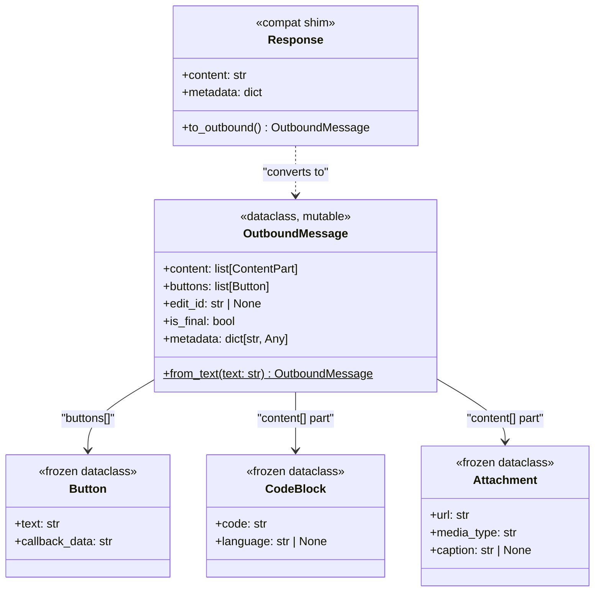
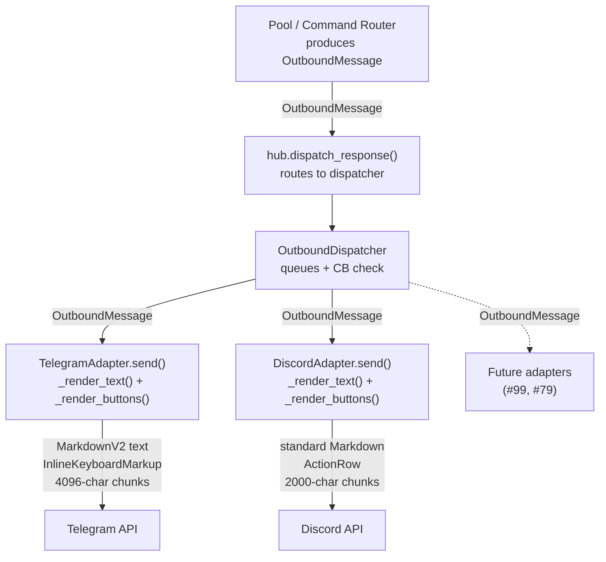

## Out of Scope

- InboundMessage normalization (#137) — separate sibling issue.
- Voice TTS integration (#79) — `OutboundMessage` unblocks it; not implemented here.
- Hub command sessions (#99) — unblocked; not implemented here.
- New channel adapters beyond Telegram and Discord.
- Rich embed / media construction (only text + buttons in scope).
- Streaming path unification through `OutboundMessage` — deferred; `dispatch_streaming(AsyncIterator[str])` unchanged.

## Context

Promoted from `artifacts/frames/138-outbound-message-envelope-frame.mdx` (approved 2026-03-12).
Sibling to #137 (InboundMessage normalization). Shares `core/message.py`.

Current state: `Response(content: str)` is the sole outbound type. Telegram MarkdownV2
escaping, Discord 2000-char chunking, streaming edit-in-place, and button construction all
live directly in adapter methods with no typed contract from the hub.

## Goal

Introduce `OutboundMessage` — a single typed envelope produced by the hub/agents — so that
all channel-specific formatting, chunking, escaping, and button construction moves entirely
into adapter `render()` methods. The hub becomes platform-unaware; adapters own translation.

## Users

- **Hub / Pool** — produces `OutboundMessage` instead of bare `Response(content=str)`.
- **TelegramAdapter** — implements internal `_render_*()` helpers against a stable contract.
- **DiscordAdapter** — same.
- **Future adapters** — get a one-time stable contract to implement.
- **#99 (hub command sessions)** — unblocked: buttons travel via `OutboundMessage.buttons`.
- **#79 (voice TTS)** — unblocked: voice notes travel via `OutboundMessage` content parts.

## Expected Behavior

1. Pool (or command router) creates `OutboundMessage.from_text(text)` and calls
   `hub.dispatch_response(original_msg, outbound)`.
2. `dispatch_response` enqueues the `OutboundMessage` on the `OutboundDispatcher`.
3. The `OutboundDispatcher` worker calls `adapter.send(original_msg, outbound)`.
4. `TelegramAdapter.send()` calls internal `_render_text()` (MarkdownV2 escape, 4096-char
   chunking) and `_render_buttons()` (`list[Button]` → `InlineKeyboardMarkup`). Sends one
   message per chunk; buttons attach to the last chunk only.
5. `DiscordAdapter.send()` calls internal `_render_text()` (standard Markdown, 2000-char
   chunking) and `_render_buttons()` (`list[Button]` → `ActionRow`). Same chunk+button rule.
6. **Streaming path unchanged at the hub level.** `dispatch_streaming(msg, AsyncIterator[str])`
   signature is preserved. Adapters continue to accumulate chunks internally. `edit_id` and
   `is_final` fields are defined on `OutboundMessage` for future streaming unification but
   are not wired through the streaming path in this issue. The fallback path in
   `dispatch_streaming()` (line ~308 of `hub.py`) that calls `adapter.send(msg, Response(content=text))`
   is updated to `adapter.send(msg, OutboundMessage.from_text(text))` in Slice 2.
7. `Response` is kept as a backward-compat shim: existing call sites producing
   `Response(content=text)` remain valid. `dispatch_response()` accepts `Response | OutboundMessage`
   and calls `.to_outbound()` internally — zero changes required at call sites in `pool.py`
   or command router. All new internal code uses `OutboundMessage` directly.
8. **`reply_message_id` mutation preserved.** Both adapters continue to write
   `outbound.metadata["reply_message_id"] = sent.message_id` after a successful send.
   This field is consumed by session persistence (#67) and reply-to-resume (#83).
9. **`CodeBlock` and `Attachment` content parts** are rendered as stringified fallbacks in
   this slice: `CodeBlock` → fenced code block string; `Attachment` → `[media_type: url]`
   caption string. Full platform-native rendering (e.g. Telegram media messages) is deferred.

## Data Model & Consumers

`ContentPart = str | CodeBlock | Attachment`

**Consumer summary:**

| Consumer | Fields consumed | When | Status |
|----------|----------------|------|--------|
| TelegramAdapter | `content` (str parts), `buttons`, `metadata` | Every send | This issue |
| DiscordAdapter | `content` (str parts), `buttons`, `metadata` | Every send | This issue |
| OutboundDispatcher | passes through opaquely | Enqueue/dequeue | This issue |
| Hub command router | via `Response.to_outbound()` shim | Command replies | This issue |
| #99 (command sessions) | `buttons` → session state | Button press | Future |
| #79 (voice TTS) | `Attachment` content part | Audio replies | Future |

## Breadboard

### Core types — `core/message.py`

| ID | Element | Handler | Data |
|----|---------|---------|------|
| N1 | `OutboundMessage` dataclass (mutable — not frozen; `edit_id` reserved for future streaming wiring) | Defined in `core/message.py` | `content: list[ContentPart]`, `buttons: list[Button]`, `edit_id: str\|None`, `is_final: bool = True`, `metadata: dict` |
| N2 | `Button` frozen dataclass | Defined in `core/message.py` | `text: str`, `callback_data: str` |
| N3 | `CodeBlock` frozen dataclass | Defined in `core/message.py` | `code: str`, `language: str\|None = None` |
| N4 | `Attachment` frozen dataclass | Defined in `core/message.py` | `url: str`, `media_type: str`, `caption: str\|None = None` |
| N5 | `OutboundMessage.from_text()` | Class method | `text: str` → `OutboundMessage(content=[text])` |
| N6 | `Response.to_outbound()` | Instance method | `Response(content=s)` → `OutboundMessage.from_text(s)` |

### Hub + dispatcher wiring — `core/hub.py`, `core/outbound_dispatcher.py`, `core/pool.py`

| ID | Element | Handler | Data |
|----|---------|---------|------|
| U1 | `ChannelAdapter.send()` Protocol | Updated signature | `(original_msg: Message, outbound: OutboundMessage) → None` |
| U2 | `hub.dispatch_response()` | Updated method | Accepts `Response \| OutboundMessage`; calls `.to_outbound()` internally; zero call-site changes required in `pool.py` or command router |
| U3 | `OutboundDispatcher.enqueue()` | Updated method | Accepts `OutboundMessage` payload; type annotation updated |
| U4 | `hub.dispatch_streaming()` fallback | Updated call site | `OutboundMessage.from_text(text)` instead of `Response(content=text)` at the `send()` fallback path inside `dispatch_streaming()` |
| U5 | `Pool` and command router call sites | No change required | All `Response(content=...)` call sites unchanged — `dispatch_response()` union type absorbs them via `.to_outbound()` |

### Telegram adapter — `adapters/telegram.py`

| ID | Element | Handler | Data |
|----|---------|---------|------|
| S1 | `TelegramAdapter.send()` | Updated signature | Accepts `OutboundMessage`; delegates to render helpers |
| S2 | `TelegramAdapter._render_text()` | New private method | MarkdownV2 escape, 4096-char chunk split → `list[str]` |
| S3 | `TelegramAdapter._render_buttons()` | New private method | `list[Button]` → `InlineKeyboardMarkup \| None` |
| S4 | Multi-chunk send loop | Inside `send()` | Sends each text chunk separately; attaches keyboard to last chunk |

### Discord adapter — `adapters/discord.py`

| ID | Element | Handler | Data |
|----|---------|---------|------|
| S5 | `DiscordAdapter.send()` | Updated signature | Accepts `OutboundMessage`; delegates to render helpers |
| S6 | `DiscordAdapter._render_text()` | New private method | 2000-char chunk split → `list[str]` (standard Markdown, no escape needed) |
| S7 | `DiscordAdapter._render_buttons()` | New private method | `list[Button]` → `discord.ui.View` with `ActionRow \| None` |
| S8 | Multi-chunk send loop | Inside `send()` | Sends each text chunk; attaches view to last chunk |

## Slices

| # | Slice | Files | Demo |
|---|-------|-------|------|
| 1 | **Core types** — Add `OutboundMessage`, `Button`, `CodeBlock`, `Attachment`, `ContentPart`, `OutboundMessage.from_text()`, `Response.to_outbound()` to `core/message.py` | `core/message.py` | `OutboundMessage.from_text("hello")` returns correct shape; `Response("hi").to_outbound()` round-trips |
| 2 | **Hub + dispatcher** — Update `ChannelAdapter` Protocol, `hub.dispatch_response()`, `OutboundDispatcher.enqueue()`, `Pool._process_loop()` dispatch calls | `core/hub.py`, `core/outbound_dispatcher.py`, `core/pool.py` | Hub dispatches `OutboundMessage` to mock adapter end-to-end without error |
| 3 | **Telegram render** — Update `TelegramAdapter.send()`, add `_render_text()` (MarkdownV2 + 4096 chunking), `_render_buttons()` | `adapters/telegram.py` | MarkdownV2 escape test passes; 5000-char text sends as two messages; button → InlineKeyboardMarkup |
| 4 | **Discord render** — Update `DiscordAdapter.send()`, add `_render_text()` (2000 chunking), `_render_buttons()` | `adapters/discord.py` | 2500-char text sends as two messages; button → ActionRow |

## Success Criteria

- [ ] `OutboundMessage`, `Button`, `CodeBlock`, `Attachment`, `ContentPart` are importable from `lyra.core.message`
- [ ] `OutboundMessage.from_text("hello world")` returns `OutboundMessage(content=["hello world"], buttons=[], edit_id=None, is_final=True)`
- [ ] `Response(content="x").to_outbound()` returns `OutboundMessage.from_text("x")`
- [ ] `hub.dispatch_response(msg, OutboundMessage.from_text("hi"))` reaches the adapter without raising
- [ ] `TelegramAdapter.send()` accepts `OutboundMessage` and calls `bot.send_message` with MarkdownV2-escaped text
- [ ] Text with MarkdownV2 special characters (`_*~>#+-=|{}.!`) is properly escaped before Telegram send
- [ ] Text ≥ 4097 chars causes Telegram adapter to call `bot.send_message` twice (one chunk per message)
- [ ] `OutboundMessage(content=["hi"], buttons=[Button("Yes","yes")])` causes Telegram send to include `InlineKeyboardMarkup`
- [ ] `DiscordAdapter.send()` accepts `OutboundMessage` and calls `channel.send` / `msg.reply`
- [ ] Text ≥ 2001 chars causes Discord adapter to call `channel.send` (or `msg.reply`) twice
- [ ] `OutboundMessage(content=["hi"], buttons=[Button("Yes","yes")])` causes Discord send to include a `discord.ui.View`
- [ ] When text is chunked and `buttons` is non-empty, Telegram adapter attaches `InlineKeyboardMarkup` to the **last** `bot.send_message` call only (not earlier chunks)
- [ ] When text is chunked and `buttons` is non-empty, Discord adapter attaches `discord.ui.View` to the **last** `channel.send` call only (not earlier chunks)
- [ ] Both adapters write `outbound.metadata["reply_message_id"] = sent.message_id` after a successful send
- [ ] `ChannelAdapter` Protocol updated: `send(original_msg: Message, outbound: OutboundMessage)` — `uv run pyright` reports no new errors
- [ ] `dispatch_streaming(msg, AsyncIterator[str])` signature is unchanged; its internal `send()` fallback uses `OutboundMessage.from_text(text)`
- [ ] All pre-existing tests pass without modification (compat shim absorbs backward-compat)
- [ ] `uv run pytest` green; `uv run pyright` green
