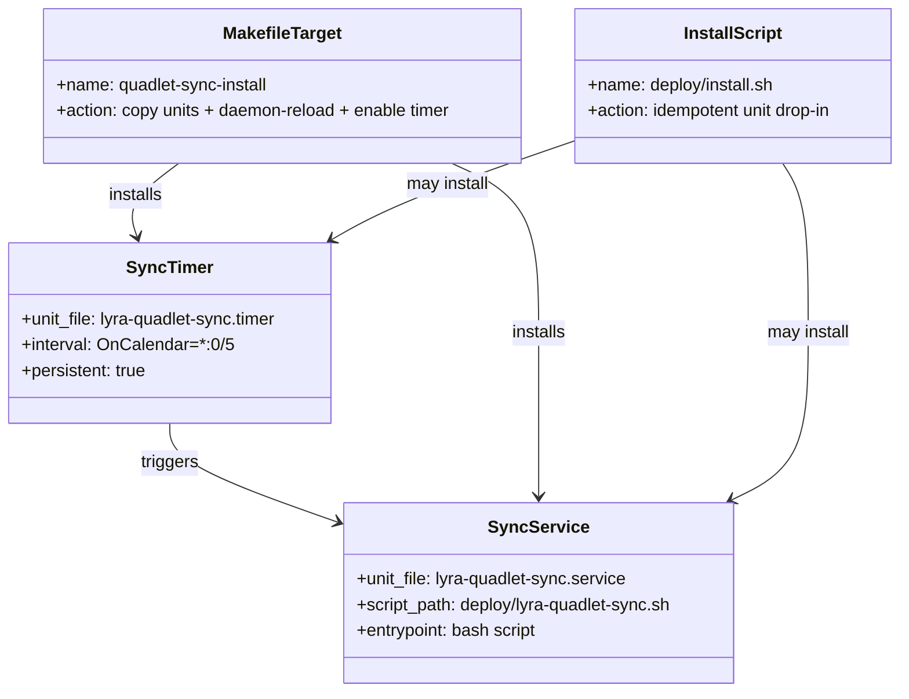

## Context

Promoted from [frame #1380](../frames/1380-auto-converge-quadlet-changes-frame.mdx).

M₁ (lyra-hub role) has two deploy control planes with asymmetric automation:
- **Image auto-update** (`podman-auto-update.timer`) — continuous, ≤30 min latency
- **Quadlet file install** (`make quadlet-install`) — manual, indefinite latency

This creates a windowed partial-deploy state. PR #1371 changed `HealthCmd` in `.container.tmpl` but M₁ ran the old config until manual install. Same drift class as #1361 and #1369.

## Goal

Close the manual-recall gap: tracked Quadlet file changes reach M₁ automatically within 5 minutes of merge, without CI→host coupling.

## Users

- **Primary:** Operator deploying to M₁ — no longer needs to remember `make quadlet-install` after merges touching Quadlet files.
- **Secondary:** Reviewer/observer verifying host→tracked state alignment — inspectable via `journalctl`.

## Expected Behavior

1. Every 5 minutes, `lyra-quadlet-sync.timer` triggers `lyra-quadlet-sync.service`.
2. The service fetches `origin/staging` and checks if HEAD matches.
3. If fast-forward available, it pulls.
4. Post-pull, it checks if the diff touches `deploy/quadlet/**`, `Makefile`, or `tools/render_quadlet.py`.
5. If relevant files changed, it runs `make quadlet-install`.
6. If no changes or no fast-forward needed, it exits 0 immediately.
7. All output and errors go to the systemd journal (`journalctl --user -u lyra-quadlet-sync`).
8. Manual `make quadlet-install` remains available as escape hatch.

## Data Model & Consumers

### Consumer Summary

| Consumer | Fields/Artifacts | When | Status |
|---|---|---|---|
| Operator (M₁) | `lyra-quadlet-sync.timer`, `lyra-quadlet-sync.service` | After merge touching Quadlet files | This issue |
| `deploy/install.sh` | `~/.config/systemd/user/` paths | First-time setup | This issue |
| `Makefile` | `quadlet-sync-install` target | Manual or scripted install | This issue |
| `docs/QUADLET-DEPLOYMENT.md` | Install + diagnostic docs | Reference | This issue |

## Breadboard

| ID | Affordance | Handler | Data |
|---|---|---|---|
| U1 | `lyra-quadlet-sync.timer` | systemd timer unit | Fires every 5 min, persists across boots |
| U2 | `lyra-quadlet-sync.service` | systemd service unit | One-shot: fetch → diff-guard → conditional install |
| S1 | `deploy/lyra-quadlet-sync.sh` | bash script | `set -euo pipefail` git-loop with diff guard |
| T1 | `make quadlet-sync-install` | Makefile target | Copies units to `~/.config/systemd/user/`, reloads, enables timer |
| T2 | `make quadlet-install` | Existing Makefile target | Escape hatch — preserved untouched |
| D1 | `docs/QUADLET-DEPLOYMENT.md` | Documentation | Explains timer vs manual path |

## Slices

| # | Slice | Files | Demo |
|---|---|---|---|
| 1 | Sync script + systemd units | `deploy/lyra-quadlet-sync.sh`, `deploy/quadlet/lyra-quadlet-sync.service`, `deploy/quadlet/lyra-quadlet-sync.timer` | Run script manually on M₁, verify no-op when HEAD up-to-date |
| 2 | Install target | `Makefile` (add `quadlet-sync-install`) | Run `make quadlet-sync-install` on M₁, verify timer enabled and firing |
| 3 | Documentation | `docs/QUADLET-DEPLOYMENT.md` | Read docs, verify timer path + manual escape hatch described |

## Success Criteria

- [ ] `lyra-quadlet-sync.timer` + `lyra-quadlet-sync.service` exist as tracked files in the repo under `deploy/quadlet/` (or adjacent path per existing convention).
- [ ] `deploy/lyra-quadlet-sync.sh` (or inline `ExecStart`) implements the git fetch → diff-guard → conditional `make quadlet-install` logic.
- [ ] Timer fires at 5-min interval (configurable via override drop-in).
- [ ] Service no-ops when `git rev-parse HEAD` equals `origin/staging` (exit 0, zero work).
- [ ] Service runs `make quadlet-install` only when post-pull diff touches `deploy/quadlet/**`, `Makefile`, or `tools/render_quadlet.py`.
- [ ] Failure of any sub-step surfaces in `journalctl --user -u lyra-quadlet-sync`.
- [ ] `make quadlet-sync-install` target exists in `Makefile` — idempotent, copies units to `~/.config/systemd/user/`, runs `daemon-reload`, enables timer.
- [ ] `docs/QUADLET-DEPLOYMENT.md` documents both the auto-timer path and the manual `make quadlet-install` escape hatch, with guidance on when to use each.
- [ ] `deploy/install.sh` (or Makefile target) installs the units on first run — idempotent.
