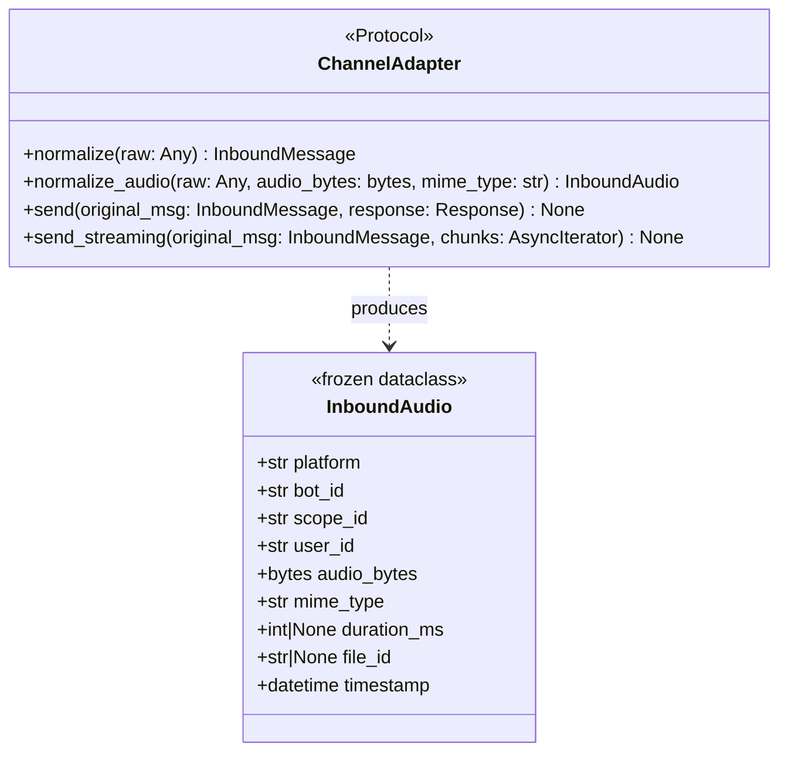
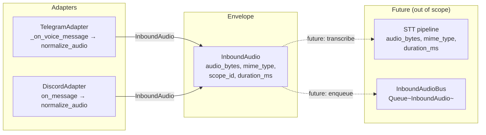

## Dependencies

- **#137 (InboundMessage) must be merged before S1 of this issue.** Both `#137` and `#140` update `ChannelAdapter` in `core/hub.py`. `#137` adds `normalize()` and renames `_normalize` across both adapters; `#140` adds `normalize_audio()` to the same Protocol. Working on a branch that predates the `#137` Protocol shape will produce a merge conflict. Start `#140` only after `#137` lands on `staging`.

## Context

Part of **Phase 1b — Agent core** (#73). Companion to `InboundMessage` normalization (#137), which establishes the pattern this issue follows for audio.

Currently, Telegram audio arrives via `_on_voice_message()` which downloads to a temp file and wraps it in `Message(type=AUDIO, content=AudioContent(url=str(tmp_path)))`. Discord has no audio handling at all. There is no typed, platform-agnostic envelope for audio — so any downstream consumer (STT pipeline) would read platform-specific `AudioContent` or raw file paths. This issue defines `InboundAudio`, a frozen dataclass, and adds `normalize_audio()` to both adapters as a parallel contract to `normalize()`.

**File location note:** The GitHub issue mentions `lyra/bus/messages.py`. The project does not have a `bus/` package — audio types live alongside `InboundMessage` in `core/message.py`.

## Goal

Define `InboundAudio` as the single typed envelope all adapters must produce for audio input, so the hub and STT pipeline never read platform-specific fields above the adapter layer.

## Users

- **Primary:** Future STT agents — will receive `InboundAudio` with `audio_bytes`, `mime_type`, `duration_ms` instead of a temp-file path wrapped in `AudioContent`.
- **Secondary:** Future adapter authors — `ChannelAdapter.normalize_audio()` gives them a clear contract.

## Out of Scope

- STT / transcription pipeline (this issue defines the envelope only; pipeline integration is downstream).
- Pushing `InboundAudio` onto the inbound bus (queue integration is a follow-on).
- Audio playback / outbound audio.
- Web gateway or other adapter audio support.
- Replacing the hub's existing `MessageType.AUDIO` / `AudioContent` code path — this issue adds a parallel `normalize_audio()` method; `_on_voice_message()` migration to `InboundAudio` is a follow-on.
- Persisting audio bytes or structured logging of audio metadata.

## Expected Behavior

1. Telegram receives a voice note or audio file update → `_on_voice_message()` downloads the file using `_download_audio()` (existing), reads bytes from the temp file, cleans up the temp file, then calls `normalize_audio(raw_msg, audio_bytes, mime_type)` → produces `InboundAudio`.
2. Discord receives an audio attachment on a message → `on_message()` detects `attachment.content_type.startswith("audio/")`, reads attachment bytes, then calls `normalize_audio(message, audio_bytes)` → produces `InboundAudio`.
3. `InboundAudio` carries: `platform`, `bot_id`, `scope_id`, `user_id`, `audio_bytes`, `mime_type`, `duration_ms`, `file_id`, `timestamp`.
4. Both adapters independently unit-tested; `InboundAudio` fields asserted from fixture inputs.

**`audio_bytes` design:** The adapter is responsible for downloading and reading audio into `bytes`. Temp file lifecycle: `_download_audio()` writes the file → bytes read → temp file deleted immediately (in a `try/finally` or equivalent) → bytes carried in `InboundAudio`. If `tmp_path.read_bytes()` raises, the temp file must still be deleted before propagating the error. The STT pipeline (out of scope here) will write bytes back to a temp file or use `BytesIO`.

**Memory bound:** `audio_bytes` is bounded by `LYRA_MAX_AUDIO_BYTES` (default 5 MB), enforced in `_download_audio()` before any bytes are read into memory. For a personal-scale agent this is acceptable. The frozen `InboundAudio` carrying bytes is self-contained and avoids file-system state in downstream consumers.

**`scope_id` derivation:** Same rules as `InboundMessage`:
- Telegram: `chat:{chat_id}` or `chat:{chat_id}:topic:{topic_id}`
- Discord: `thread:{thread_id}` or `channel:{channel_id}`

**`file_id`:** Platform-native file identifier for deduplication or re-download if needed. `None` for Discord (attachments have URLs, not file IDs).

**`duration_ms`:** Telegram provides `voice.duration` (seconds, int) → multiply × 1000. Discord attachments do not expose duration → `None`.

**`mime_type`:**
- Telegram voice: always `"audio/ogg"` (ogg/opus codec).
- Telegram audio files: `msg.audio.mime_type` if present, else `"audio/ogg"`.
- Discord: `attachment.content_type` (e.g. `"audio/ogg"`, `"audio/mp4"`).

## Data Model & Consumers

**Consumer summary:**

| Consumer | Fields consumed | When | Status |
|---|---|---|---|
| `TelegramAdapter.normalize_audio()` | `platform`, `bot_id`, `scope_id`, `user_id`, `audio_bytes`, `mime_type`, `duration_ms`, `file_id`, `timestamp` | Voice/audio update | This issue |
| `DiscordAdapter.normalize_audio()` | `platform`, `bot_id`, `scope_id`, `user_id`, `audio_bytes`, `mime_type`, `timestamp` | Audio attachment | This issue |
| STT pipeline | `audio_bytes`, `mime_type`, `duration_ms` | Transcription | Future |
| `InboundAudioBus` | all fields | Queue routing | Future |

## Breadboard

| ID | Element | Handler | Data |
|---|---|---|---|
| **N1** | `InboundAudio` frozen dataclass | `core/message.py` | Fields: `platform`, `bot_id`, `scope_id`, `user_id`, `audio_bytes`, `mime_type`, `duration_ms: int\|None`, `file_id: str\|None`, `timestamp`; `__post_init__` enforces `trust="user"` invariant implicitly (trust not exposed — audio is always user-origin) |
| **N2** | `ChannelAdapter.normalize_audio()` Protocol method | `core/hub.py` | Signature: `normalize_audio(self, raw: Any, audio_bytes: bytes, mime_type: str) -> InboundAudio` added to `ChannelAdapter` Protocol |
| **N3** | `TelegramAdapter.normalize_audio()` | `adapters/telegram.py` | Takes aiogram `msg`, `audio_bytes: bytes`, `mime_type: str`; derives `scope_id`, `user_id`, `duration_ms`, `file_id`, `timestamp`; returns frozen `InboundAudio` |
| **N4** | Telegram `_on_voice_message()` wired to `normalize_audio()` | `adapters/telegram.py` | After `_download_audio()`: read bytes from tmp_path in `try/finally` (delete tmp_path in `finally` regardless of error), call `normalize_audio(msg, audio_bytes, mime_type)` — result currently unused (bus enqueue is future) |
| **N5** | `DiscordAdapter.normalize_audio()` | `adapters/discord.py` | Takes discord `message`, `audio_bytes: bytes`, `mime_type: str`; derives `scope_id`, `user_id`, `timestamp`; `duration_ms=None`, `file_id=None`; returns frozen `InboundAudio` |
| **N6** | Discord `on_message()` audio detection | `adapters/discord.py` | Detect first audio attachment (`attachment.content_type.startswith("audio/")`); download bytes; call `normalize_audio()` — result currently unused (bus enqueue is future) |

## Slices

| # | Slice | Files | Demo |
|---|---|---|---|
| S1 | `InboundAudio` dataclass + `ChannelAdapter` Protocol update (N1, N2) | `core/message.py`, `core/hub.py` | `InboundAudio(platform="telegram", bot_id="main", scope_id="chat:1", user_id="tg:user:42", audio_bytes=b"...", mime_type="audio/ogg", duration_ms=3000, file_id="abc", timestamp=...)` instantiates frozen; Protocol static check passes |
| S2 | Telegram `normalize_audio()` + `_on_voice_message()` wiring + unit tests (N3, N4) | `adapters/telegram.py`, `tests/` | Voice fixture → `InboundAudio` with correct `scope_id`, `mime_type="audio/ogg"`, `duration_ms`, `file_id`; audio file fixture asserts `mime_type` from `msg.audio.mime_type` |
| S3 | Discord `normalize_audio()` + `on_message()` audio detection + unit tests (N5, N6) | `adapters/discord.py`, `tests/` | Discord audio attachment fixture → `InboundAudio` with correct `scope_id`, `mime_type` from `attachment.content_type`, `duration_ms=None`, `file_id=None` |

## Success Criteria

- [ ] `InboundAudio` frozen dataclass defined in `core/message.py` with fields: `platform`, `bot_id`, `scope_id`, `user_id`, `audio_bytes: bytes`, `mime_type: str`, `duration_ms: int | None`, `file_id: str | None`, `timestamp: datetime`
- [ ] `ChannelAdapter` Protocol in `core/hub.py` includes `normalize_audio(self, raw: Any, audio_bytes: bytes, mime_type: str) -> InboundAudio`
- [ ] `TelegramAdapter.normalize_audio()` produces `InboundAudio` for voice messages (`mime_type="audio/ogg"`, `duration_ms` from `voice.duration × 1000`, `file_id` set) and audio file messages (`mime_type` from `msg.audio.mime_type`)
- [ ] `TelegramAdapter._on_voice_message()` calls `normalize_audio()` after download; temp file deleted after reading bytes
- [ ] `DiscordAdapter.normalize_audio()` produces `InboundAudio` for audio attachments (`mime_type` from `attachment.content_type`, `duration_ms=None`, `file_id=None`)
- [ ] `DiscordAdapter.on_message()` detects audio attachments and calls `normalize_audio()`
- [ ] Unit tests for both adapters pass (`uv run pytest`); Telegram tests assert `scope_id`, `mime_type`, `duration_ms`, `file_id` for voice and audio-file fixtures; Discord tests assert `scope_id`, `mime_type`, `duration_ms=None` for audio attachment fixture
