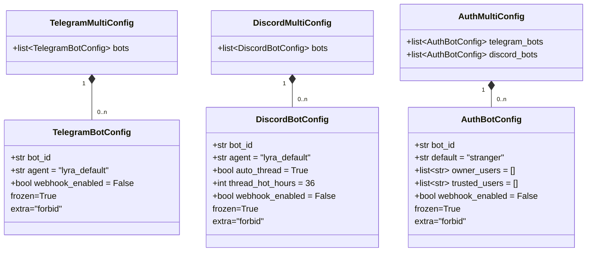
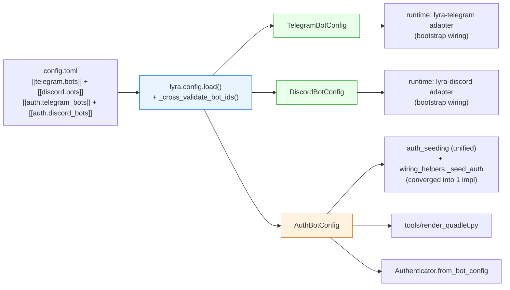

## Context

Promoted from `artifacts/frames/1412-share-pydantic-bot-config-frame.mdx` (approved 2026-05-26).

Origin: consensus panel 2026-05-26, finding **G18** on PR #1398 (`feat(deploy): wire webhook Secret= rendering`) — `ssot-violation`, vote 3-0 DEFER. Recheck drift signal corrected the initial premise: Pydantic models for runtime bot config *already exist* (`TelegramBotConfig`/`DiscordBotConfig` in `src/lyra/config.py:69,82`) — the actual problem is **the second section (`[[auth.*_bots]]`) lacking Pydantic + duplication of auth-seeding parsers**, not absence of Pydantic.

### Architectural decision — Option 2 (Share Pydantic, keep 2 sections)

A 3-expert panel (architect, devops, axial-adr-review) evaluated 4 design options. Consensus 2-1 for Option 2. Recorded outcomes:

- **Option 1 (collapse 2 sections into 1)** rejected: would mix stage-concern (adapter wiring) with cross-cutting concern (auth grants) in a single Pydantic. Violates ADR-073 §Decision (stage primitives compose, ¬swallow cross-cutting). Latent N×M at the model level — surfaces with Slack/CLI worker addition. Hidden scope: rewriting `Authenticator.from_bot_config`, `seed_auth_store`, and the reshape loops in 3 layers (config + bootstrap + core/auth) — solidly F-full, not F-lite.
- **Option 3 (tight render-only)** rejected: leaves the `[[auth.*_bots]]` raw-dict consumers (`auth_seeding.py:27-32`, `wiring_helpers._seed_auth:109-114`, `authenticator.py:255`) untouched. Three-strikes already reached on the auth-seeding side; deferring it locks in known debt.
- **Option 4 (re-frame, defer to #1049)** rejected: #1049 Phase 3 migrates bot **tokens** to Podman secrets, NOT the in-config **grants** (`owner_users`, `trusted_users`). The overlap premise was false; re-framing buys nothing.

### Direction chosen — Option 2

1. **Keep 2 TOML sections** per bot: `[[telegram.bots]]` (runtime-stage config) + `[[auth.telegram_bots]]` (auth grants + render-only flags). No `config.toml` breaking change.
2. **Promote both sides to Pydantic**: add `webhook_enabled: bool = False` to `TelegramBotConfig`/`DiscordBotConfig`; introduce new `AuthBotConfig` (`bot_id`, `default`, `owner_users`, `trusted_users`, `webhook_enabled`) consumed by all auth-side callers.
3. **Cross-validator at load** asserts every `bot_id` in `[[telegram.bots]]` has a matching `bot_id` in `[[auth.telegram_bots]]` (and reverse). Silent split-brain → fail-loud `ValueError` with explicit message.
4. **Unify the 2 duplicated parser sites** (`auth_seeding.seed_auth_store` + `wiring_helpers._seed_auth`) into a single canonical impl — closes a three-strikes already reached.

Architectural pre-decisions (load-bearing — do not re-litigate):

- Back-compat: `config.toml` shape stays additive only. `webhook_enabled` already lives in `[[auth.*_bots]]` post-#1398; the runtime mirror on `TelegramBotConfig`/`DiscordBotConfig` is optional. No operator migration required.
- Runtime behavior unchanged.
- In-tree only: models live in `src/lyra/config.py` (not `roxabi-contracts`).
- The existing `[auth.telegram]`/`[auth.discord]` **flat** legacy path (`config.py:188-216`, synthesises `bot_id="main"`) is **out of scope** — left as-is for backwards compat with single-bot deployments. A separate cleanup issue may retire it later.
- Pydantic construction uses `AuthBotConfig(**entry)` (not field-by-field pull) so `extra="forbid"` actually catches typos in the TOML.
- `tools/render_quadlet.py` is invoked through `uv run` (per `Makefile:162,167`), so importing `lyra.config` is runnable in the install context — no venv-bootstrap concern.

## Goal

Eliminate raw-dict consumption of `[[auth.<platform>_bots]]` by introducing a Pydantic `AuthBotConfig` model consumed by all current callers (auth_seeding, wiring_helpers, authenticator, render_quadlet). Resolve the G18 `webhook_enabled` typo trap by mirroring the field on both `TelegramBotConfig` and `AuthBotConfig` with cross-validation.

## Users

- **Primary**: developers adding a new auth or webhook field — one Pydantic model per concern, validated at load.
- **Primary**: ops editing `config.toml` — `bot_id` mismatch between sections now caught at hub boot with explicit message (was silent split-brain).
- **Secondary**: code reviewers — the G18 class becomes mechanically *catchable* by Pydantic (`extra="forbid"` rejects typos).
- **Tertiary**: future platform integrations (Slack, CLI workers) inherit the dual-Pydantic pattern with the axis boundary preserved (stage-concern vs auth-concern).

## Expected Behavior

### Before (today)

```toml
[[telegram.bots]]
bot_id = "lyra"
agent = "lyra_default"

[[auth.telegram_bots]]
bot_id = "lyra"
webhook_enabled = true
default = "trusted"
owner_users = ["12345678"]
trusted_users = []
```

- `[[telegram.bots]]` → `TelegramBotConfig` Pydantic.
- `[[auth.telegram_bots]]` → raw `dict[str, Any]` consumed by 3 sites: `auth_seeding.seed_auth_store`, `wiring_helpers._seed_auth`, `authenticator.from_bot_config`. Also raw-dict-consumed by `tools/render_quadlet.py` for `webhook_enabled`.
- Typo `webhook_enable` in either section → silently `False`.
- Typo `bot_id = "lyra2"` in `[[auth.telegram_bots]]` (while `[[telegram.bots]]` has `"lyra"`) → runtime starts OK, render misses the `Secret=` line, auth grants seeded for non-existent bot. Silent split-brain.

### After (this spec)

```toml
[[telegram.bots]]
bot_id = "lyra"
agent = "lyra_default"
# webhook_enabled = true  # optional mirror; authoritative source remains [[auth.telegram_bots]]

[[auth.telegram_bots]]
bot_id = "lyra"
webhook_enabled = true
default = "trusted"
owner_users = ["12345678"]
trusted_users = []
```

- Both sections parsed via Pydantic (`extra="forbid"`, frozen).
- `tools/render_quadlet.py` and bootstrap callers consume `AuthBotConfig` via `lyra.config.load_auth_bots()`.
- `auth_seeding.seed_auth_store` and `wiring_helpers._seed_auth` converge into a single canonical impl.
- `Authenticator.from_bot_config` accepts `AuthBotConfig` directly.
- **Cross-validator** at `lyra.config.load()`: for every `bot_id` in `[[telegram.bots]]` (and Discord), assert presence of matching `bot_id` in `[[auth.telegram_bots]]` (and Discord), and vice-versa. Mismatch → `ValueError` at hub boot with explicit message.
- **`webhook_enabled` placement rule** (documented in CONFIGURATION.md): authoritative source = `[[auth.*_bots]]` (matches existing render behavior). Optional runtime mirror is allowed for adapter code that may gate behavior on it later. If both are present and differ → cross-validator raises.

### Failure modes

| Scenario | Behavior |
|---|---|
| Typo `webhook_enable` in either section | `ValidationError` at `lyra.config.load()` — process exits with field name + bot_id |
| Missing `bot_id` in `[[telegram.bots]]` or `[[auth.*_bots]]` | `ValidationError` (Pydantic required field) |
| `bot_id` in `[[telegram.bots]]` but absent in `[[auth.telegram_bots]]` (or reverse) | `ValueError` at cross-validator with explicit "which side missing" message |
| Mismatched `webhook_enabled` across sections (if user sets in both) | `ValueError` from cross-validator |
| Extra field `foobar` in either section | `ValidationError` (`extra="forbid"`) |

### Back-compat

No `config.toml` breaking change. The new validators are strictly additive:
- Pydantic `extra="forbid"` will reject extra fields — if any operator has accumulated cruft, it surfaces as a load error; this is intentional (fail-loud over silent ignore).
- Cross-validator only fires on a mismatch that already exists today; correct configs are unaffected.

## Data Model & Consumers

### Data structure (Pydantic models)



### Consumer map



### Consumer summary table

| Consumer | Reads via | Fields read | Status |
|---|---|---|---|
| `lyra.bootstrap.standalone.adapter_standalone` (TG/DC) | `TelegramBotConfig` / `DiscordBotConfig` | `bot_id`, `agent` (+DC: `auto_thread`, `thread_hot_hours`) | Unchanged behaviorally |
| `auth_seeding.seed_auth_store` | `AuthBotConfig` (unified loader) | `bot_id`, `default`, `owner_users`, `trusted_users` | This spec — migrate from raw dict + unify with `_seed_auth` |
| `wiring_helpers._seed_auth` | `AuthBotConfig` (unified loader) | same as above | This spec — UNIFY (same impl as `seed_auth_store`) |
| `Authenticator.from_bot_config` | `AuthBotConfig` | `bot_id`, `default`, `owner_users`, `trusted_users` | This spec — migrate from raw dict |
| `tools/render_quadlet.py` (TG/DC) | `AuthBotConfig` via `lyra.config.load_auth_bots()` | `bot_id`, `webhook_enabled` | This spec — migrate from raw dict |

## Breadboard

### Affordances

| ID | Surface | Element | Handler | Data |
|---|---|---|---|---|
| A1 | Library | `lyra.config.load()` | parses all 4 sections via Pydantic | `(TelegramMultiConfig, DiscordMultiConfig, AuthMultiConfig)` |
| A2 | Library | `lyra.config.load_auth_bots(raw)` | sub-loader for `[[auth.*_bots]]` (importable from `tools/`) | `AuthMultiConfig` |
| A3 | Library | `_cross_validate_bot_ids(tg_multi, dc_multi, auth_multi)` | called by A1 post Pydantic parse | raises `ValueError` on mismatch |
| A4 | CLI | `lyra hub` (boot) | `_init_bot_auths_and_agents()` → `lyra.config.load()` | unified `AuthBotConfig` access through auth_seeding |
| A5 | CLI | `lyra adapter telegram` / `discord` (boot) | `_bootstrap_adapter_standalone()` → `lyra.config.load()` | runtime configs |
| A6 | Tool | `python tools/render_quadlet.py --platform <p>` | imports `load_auth_bots` from `lyra.config` | `list[AuthBotConfig]` |
| A7 | Lib | `Authenticator.from_bot_config(auth_bot)` | accepts `AuthBotConfig` | replaces `auth_block.get(bots_key, [])` |

### Wiring

```
config.toml
    │
    ▼
A1: lyra.config.load()
    │
    ├── Pydantic parse (extra="forbid") on 4 sections
    ├── A3: _cross_validate_bot_ids()
    │
    ├── TelegramMultiConfig ──► A5 (runtime telegram adapter)
    ├── DiscordMultiConfig  ──► A5 (runtime discord adapter)
    └── AuthMultiConfig     ──► A4 unified auth_seeding (single impl)
                             ──► A6 render_quadlet --platform <p>
                             ──► A7 Authenticator.from_bot_config
```

## Slices

| # | Slice | Affordances | Demo |
|---|---|---|---|
| **S1** | **Pydantic models + cross-validator** | A1, A2, A3, A5 | New `AuthBotConfig` in `src/lyra/config.py` (frozen, `extra="forbid"`, fields per data model). New `load_auth_bots(raw) -> AuthMultiConfig` helper. New `_cross_validate_bot_ids()` invoked from `lyra.config.load()`. `webhook_enabled: bool = False` added to `TelegramBotConfig`/`DiscordBotConfig` (also `extra="forbid"` enforcement). Pydantic construction uses `Model(**entry)` so typos are caught. Demo: `lyra adapter telegram` (A5) and `lyra hub` boot clean against existing `config.toml`; a fixture with `bot_id` mismatch raises `ValueError` at load; a fixture with `webhook_enable` (typo) raises `ValidationError`. |
| **S2** | **Bootstrap + auth-side migration** | A4, A7 | `auth_seeding.seed_auth_store`, `wiring_helpers._seed_auth`, and `Authenticator.from_bot_config` consume `AuthBotConfig` (via the loader from S1). The two `_seed_auth` impls converge into a single canonical function (one is deleted or becomes a thin re-export). Tests for these 3 modules migrate to `AuthBotConfig(...)` fixtures. Demo: `lyra hub` boots; auth grants seeded identically to today; `grep -rn 'auth_block.get("telegram_bots"\|auth_block.get("discord_bots"' src/lyra/` returns 0. |
| **S3** | **`render_quadlet.py` migration + docs** | A6 | Tool imports `from lyra.config import load_auth_bots`, replaces `auth.get("telegram_bots", [])` raw-dict loop with `list[AuthBotConfig]` attribute access. `tests/scripts/test_render_quadlet.py` fixtures migrate from `dict` to `AuthBotConfig(...)`. `docs/CONFIGURATION.md` gains a "Bot config sections" subsection (before/after structural diagram, axis-boundary rationale, cross-validator behavior + example error message). `docs/QUADLET-DEPLOYMENT.md` §Bot onboarding (lines 94-99) refreshed. `deploy/CLAUDE.md` updated. Demo: `python tools/render_quadlet.py --platform telegram --bots-toml fixture.toml` emits identical `Secret=` lines as today; grep on raw-dict patterns in `tools/` returns 0. |

**Slice independence**:
- S1 lands additive Pydantic + validator with **zero consumer change** (the new `AuthBotConfig` and `webhook_enabled` field exist but nothing reads them yet). Safe to merge alone.
- S2 and S3 both depend on S1 but are independent of each other (different consumers).
- S2 ⊥ S3: bootstrap migration and tool migration touch disjoint files.
- S3 includes docs (no separate doc slice — docs ride with the last consumer migration).

**Ordering constraint**: S1 ships first. S2 and S3 may ship in either order or in parallel.

## Success Criteria

- [ ] **Pydantic models updated**: `AuthBotConfig` defined in `src/lyra/config.py` (`bot_id`, `default`, `owner_users`, `trusted_users`, `webhook_enabled`, `frozen=True`, `extra="forbid"`); `webhook_enabled: bool = False` added to `TelegramBotConfig` and `DiscordBotConfig` (both also `extra="forbid"`).
- [ ] **Cross-validator behavior**: `tests/config/test_cross_validator.py::test_orphan_bot_id_raises` asserts that a `bot_id` present in `[[telegram.bots]]` but absent in `[[auth.telegram_bots]]` raises `ValueError` at `lyra.config.load()` with an explicit message naming the side that is missing.
- [ ] **Typo detection**: `tests/config/test_strict_validation.py::test_typo_field_raises` asserts that `webhook_enable = true` in either section raises `ValidationError` at load.
- [ ] **Raw-dict elimination** (mirrors frame's falsification check): `grep -rn 'auth_block.get("telegram_bots"\|auth_block.get("discord_bots"\|\.get("webhook_enabled"\|entry\["bot_id"\]' tools/ src/lyra/` returns 0 lines after S2+S3 land.
- [ ] **auth_seeding canonical**: `auth_seeding.seed_auth_store` and `wiring_helpers._seed_auth` are reduced to a single canonical impl (one re-exports the other, or one is deleted). `grep -rn 'def.*_seed_auth\|def seed_auth_store' src/lyra/` returns exactly one definition.
- [ ] **`docs/CONFIGURATION.md` contains** a "Bot config sections" subsection with: (a) before/after TOML block, (b) axis-boundary rationale (stage vs auth concern), (c) cross-validator behavior with example error message. Verification: `grep -A 20 "## Bot config sections" docs/CONFIGURATION.md` shows all 3 elements.
- [ ] **Importlinter contract preserved**: `uv run lint-imports` exits 0. Specific check: `lyra.config` does NOT import from `lyra.core.auth` (one-way dep enforced — `Authenticator.from_bot_config` imports `AuthBotConfig` from `lyra.config`, not the reverse).

## Open Questions

None — Option 2 chosen, back-compat preserved (additive only), `AuthBotConfig` placement in-tree confirmed, `[auth.telegram]` flat compat path explicitly out of scope.
