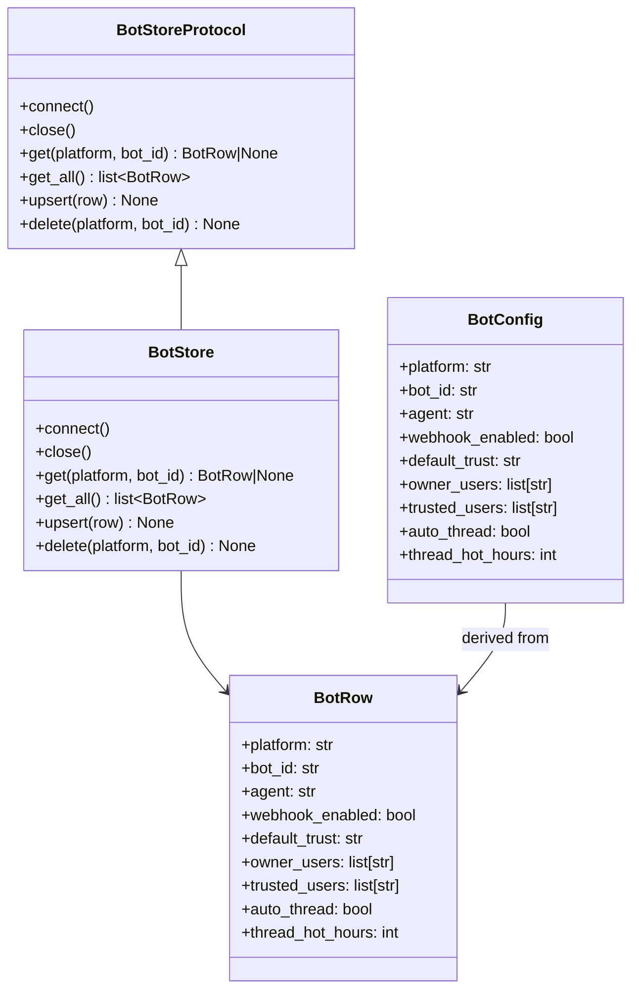

## Context

Promoted from [frame #1414](../frames/1414-bot-store-init-frame.mdx).

Bot configuration is currently scattered across `config.toml` and read at runtime by Hub and adapters. The AgentStore pattern (ADR-048) proved that a DB-first approach with Protocol/impl separation and a seed CLI works well for agents. Bots need the same foundation.

**Existing state:** `AgentStore` already delegates bot-agent mapping to `BotAgentMapStore` (`bot_agent_map` table: platform, bot_id, agent_name, settings_json). The new `BotStore` will coexist in S1 with a richer schema (`bots` table with typed fields) and will eventually subsume bot configuration in S3.

## Goal

Bot configuration is seeded from `config.toml` into a SQLite `bots` table via `lyra bot init`, readable by a typed `BotStoreProtocol` that mirrors the AgentStore pattern.

## Users

- **Primary:** Lyra operators who declare bots in `config.toml` and run `lyra bot init` on deploy
- **Secondary:** Hub code that will read bot config in S3 (Authenticator, auth_seeding, render_quadlet)
- **Tertiary:** Adapters that receive bot config via NATS publish-at-boot (never read `config.db`)

## Expected Behavior

1. Operator edits `config.toml` with `[[telegram.bots]]`, `[[discord.bots]]`, `[[auth.telegram_bots]]`, `[[auth.discord_bots]]` sections
2. Operator runs `lyra bot init`
3. Command reads TOML, merges per `(platform, bot_id)`, upserts into `bots` table
4. Re-run is idempotent: existing rows skipped by default; `--force` overwrites
5. Output: table recap (seeded, skipped, errors)
6. Adapters receive their config via NATS at boot; they never import `bot_store`

## Data Model & Consumers

### Data structure



### Canonical field defaults

| Field | Canonical default | Rationale |
|---|---|---|
| `default_trust` | `"blocked"` | Fail-safe: new bots require explicit grant |
| `auto_thread` | `False` | Opt-in behavior; operators enable per-bot in TOML |
| `thread_hot_hours` | `24` | Conservative default; matches dataclass and DDL |

These values must be identical across: `BotRow` dataclass field defaults, DDL `DEFAULT` clauses (`'blocked'` / `0` / `24`), and the `DEFAULT_*` constants exported by `bot_models.py`.

### Consumer map

```mermaid
flowchart TD
    A[Operator: config.toml] -->|lyra bot init| B[BotStore]
    C[Hub S3] -.->|reads| B
    D[Adapter boot] -.->|NATS lyra.bootstrap.adapter.{platform}.{bot_id}.config| E[BotConfig]
    B -.->|BotRow| E
```

Solid = this issue. Dashed = future (S3 consumers, NATS wiring).

### Consumer summary

| Consumer | Fields consumed | When | Status |
|---|---|---|---|
| `lyra bot init` | all (read TOML → write all fields) | CLI run | this issue |
| Hub Authenticator | `platform`, `bot_id`, `agent` | runtime | future (S3) |
| auth_seeding | `webhook_enabled`, `default_trust` | runtime | future (S3) |
| render_quadlet | `auto_thread`, `thread_hot_hours` | deploy | future (S3) |
| Adapter (NATS) | all (as `BotConfig`) | boot | future (S3) |

## Breadboard

| ID | Affordance | Handler | Data |
|---|---|---|---|
| U1 | Operator edits `config.toml` | ¬code (human) | `[[telegram.bots]]`, `[[discord.bots]]`, `[[auth.telegram_bots]]`, `[[auth.discord_bots]]` |
| U2 | Operator runs `lyra bot init` | `src/lyra/agent_cmd/bots/init.py::init_bots()` | `--force` flag |
| U3 | `lyra bot init` parses TOML | `init.py::_read_bots_from_toml()` | merged `BotRow` candidates per `(platform, bot_id)` |
| U4 | `lyra bot init` upserts rows | `BotStore.upsert(row)` | `bots` table in `~/.lyra/config.db` |
| U5 | `lyra bot init` prints recap | `init.py::_print_recap()` | counts: seeded, skipped, errors |
| N1 | `BotStoreProtocol` defines interface | `core/stores/bot_store_protocol.py` | `BotRow`, protocol methods |
| N2 | `BotStore` SQLite implementation | `infrastructure/stores/bot_store.py` | `bots` table DDL + CRUD |
| N3 | `bot_store_migrations.py` | `infrastructure/stores/bot_store_migrations.py` | forward-only migrations for `bots` table |
| N4 | `BotStore` CRUD tests | `tests/core/test_bot_store_crud.py` | insert, read, update, delete |
| N5 | `lyra bot init` end-to-end tests | `tests/core/test_bot_init.py` | fixture TOML → seeded DB → idempotent re-run |
| N6 | `import-linter` config | `.importlinter` | deny `lyra.adapters` → `lyra.infrastructure.stores.bot_store` |
| N7 | `agent_cmd/bots/CLAUDE.md` | `src/lyra/agent_cmd/bots/CLAUDE.md` | invariants for bot CLI subcommands |

## Slices

| Slice | Content | Files | Breadboard IDs covered | Demo |
|---|---|---|---|---|
| S1 | BotStore foundation: Protocol, SQLite impl, migration, CRUD tests | `core/stores/bot_store_protocol.py`, `infrastructure/stores/bot_store.py`, `infrastructure/stores/bot_store_migrations.py`, `tests/core/test_bot_store_crud.py` | N1, N2, N3, N4 | `pytest tests/core/test_bot_store_crud.py` passes |
| S2 | `lyra bot init` CLI + end-to-end tests + import-linter + docs | `agent_cmd/bots/__init__.py`, `agent_cmd/bots/init.py`, `agent_cmd/bots/CLAUDE.md`, `tests/core/test_bot_init.py`, `.importlinter`, `agent_cmd/CLAUDE.md` (registration) | U1–U5, N5–N7 | `lyra bot init` seeds from fixture TOML; re-run is idempotent; `--force` overwrites; merge logic handles duplicate `(platform, bot_id)`; `import-linter` passes |

## Out of Scope / Non-Goals

- Replacing or modifying `BotAgentMapStore` / `bot_agent_map` table in S1–S2
- Migrating Hub consumers (`Authenticator`, `auth_seeding`, `render_quadlet`) to read from `BotStore`
- Adding other CLI verbs (`list`, `show`, `add`, `delete`)
- Deprecating TOML read paths
- KV bucket or live-watch for runtime bot config changes
- NATS publish-at-boot message schema and wiring (design note only; implementation deferred to S3)

## Edge Cases

| Scenario | Handling |
|---|---|
| `config.toml` has no bot sections | `lyra bot init` prints "0 bots seeded" and exits 0 |
| Duplicate `(platform, bot_id)` in TOML (e.g. both `[[telegram.bots]]` and `[[auth.telegram_bots]]`) | Merge per `(platform, bot_id)`: last section wins for scalar fields; lists are concatenated and deduplicated |
| `--force` with no pre-existing rows | Normal insert; no error |
| `--force` with pre-existing rows | Overwrite all fields from TOML; `updated_at` changes |
| Corrupt / unreadable `config.toml` | TOML parse error caught, counted in errors, printed to stderr; command exits 1 |
| DB locked by another process | aiosqlite retry; if persistent, counted in errors |
| Adapter tries to import `bot_store` | Caught by `import-linter` CI gate |
| `bot_agent_map` staleness during S1–S2 overlap | `lyra bot init` does **not** write to `bot_agent_map`; existing `resolve_bot_agent_map()` boot-time seeding remains unchanged until S3 consumer migration |
| `bot_id` or `platform` matches non-`[A-Za-z0-9_-]+` | Skipped with stderr error, counted in errors, exit 1 (error path) |

## SQLite DDL Notes

List fields (`owner_users`, `trusted_users`) are stored as `_json TEXT` columns (follow existing `agent_schema.py` convention: `permissions_json`, `tools_json`, etc.). Parsed at read time via `json.loads`.

## Success Criteria

- [ ] `lyra bot init` populates `bots` table from `config.toml` without behavior change (existing deployments work)
- [ ] `lyra bot init` is idempotent (re-run safe, skip-existing by default)
- [ ] `lyra bot init --force` overrides existing rows
- [ ] `lyra bot init` handles duplicate `(platform, bot_id)` in TOML via merge logic (last-wins scalars, concatenated+deduplicated lists)
- [ ] `lyra bot init` exits 1 on corrupt / unreadable `config.toml`
- [ ] `BotStore` CRUD tests pass (insert, read, update, delete)
- [ ] `lyra bot init` end-to-end tests pass with fixture TOML
- [ ] ADR-048 respected: `BotStoreProtocol` in `core/stores/`, `BotStore` in `infrastructure/stores/`
- [ ] `import-linter` passes: zero `lyra.adapters` imports of `lyra.infrastructure.stores.bot_store`
- [ ] `bot_id` / `platform` format validation rejects path-traversal sequences and shell metacharacters
