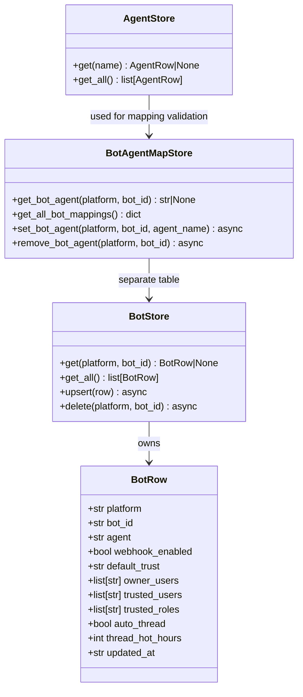
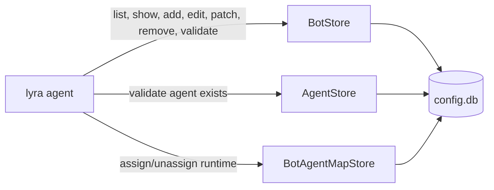

## Context

Bot configuration is currently config.toml-driven. The BotStore SQLite foundation (#1414) is in place with `get`, `get_all`, `upsert`, `delete`. BotAgentMapStore handles runtime bot→agent mappings. The CLI surface needs parity with `lyra agent` so operators can manage bots without editing TOML.

Design decision: `lyra agent <platform> <verb>` (Option B). Platform-specific sub-typers under `lyra agent` for telegram and discord.

## Goal

Operators can list, inspect, create, edit, patch, remove, assign, unassign, and validate bot records via `lyra agent telegram` and `lyra agent discord` — no TOML edits required.

## Users

- **Primary:** Operators managing bot deployments on M1/M2
- **Secondary:** Developers debugging bot-agent mappings

## Expected Behavior

### Read operations

```bash
lyra agent telegram list              # tabular: bot_id, agent, webhook, trust
lyra agent telegram show main         # full BotRow dump
```

### Write operations

```bash
lyra agent telegram add newbot --agent foo --webhook-enabled
lyra agent telegram edit main         # interactive editor (blank=keep, -=clear)
lyra agent telegram patch main --agent bar --webhook-enabled true
lyra agent telegram remove main --yes
```

### Assignment & validation

```bash
lyra agent telegram assign main --agent foo    # shortcut for patch --agent
lyra agent telegram unassign main              # revert agent to empty / default
lyra agent telegram validate                   # dry-run: agent ∃, owner_users non-empty, secret ∃
```

Same pattern for `lyra agent discord`.

Existing commands kept as-is:
- `lyra agent assign/unassign` — runtime bot_agent_map (already exists)
- `lyra agent list` — already shows bot assignments
- `lyra bot init` — seeding (separate concern)
- `lyra bot secret` — Podman secrets (separate concern)

## Data Model & Consumers

### classDiagram



### Consumer map



### Consumer summary

| Consumer | Fields consumed | When | Status |
|----------|----------------|------|--------|
| `list` | platform, bot_id, agent, webhook_enabled, default_trust | display | this issue |
| `show` | all BotRow fields | display | this issue |
| `add` | all BotRow fields (input) | upsert | this issue |
| `edit` | all BotRow fields (read → modify → write) | upsert | this issue |
| `patch` | specific field(s) | upsert | this issue |
| `remove` | platform, bot_id | delete | this issue |
| `assign` | agent | upsert | this issue |
| `unassign` | agent (set to default) | upsert | this issue |
| `validate` | agent, owner_users | check existence | this issue |
| `lyra agent list` | bot_id via get_all_bot_mappings | display | already exists |
| `lyra agent assign/unassign` | bot_agent_map | runtime mapping | already exists |

## Breadboard

### Affordance table

| ID | Affordance | Handler | Store | Notes |
|----|-----------|---------|-------|-------|
| U1 | `lyra agent telegram list` | `telegram/list_cmd.py` | BotStore.get_all() | Filter by platform |
| U2 | `lyra agent telegram show <bot_id>` | `telegram/show_cmd.py` | BotStore.get() | Full field dump |
| U3 | `lyra agent telegram add <bot_id>` | `telegram/add_cmd.py` | BotStore.upsert() | --agent, --webhook-enabled, etc. |
| U4 | `lyra agent telegram edit <bot_id>` | `telegram/edit_cmd.py` | BotStore.get() → upsert() | Interactive prompt |
| U5 | `lyra agent telegram patch <bot_id>` | `telegram/patch_cmd.py` | BotStore.get() → upsert() | --field value |
| U6 | `lyra agent telegram remove <bot_id>` | `telegram/remove_cmd.py` | BotStore.delete() | --yes flag, cascade bot_agent_map |
| U7 | `lyra agent telegram assign <bot_id>` | `telegram/assign_cmd.py` | BotStore.upsert() | --agent required |
| U8 | `lyra agent telegram unassign <bot_id>` | `telegram/unassign_cmd.py` | BotStore.upsert() | Set agent to default |
| U9 | `lyra agent telegram validate` | `telegram/validate_cmd.py` | BotStore + AgentStore | Dry-run checks |
| U10 | `lyra agent discord list` | `discord/list_cmd.py` | BotStore.get_all() | Same as U1, platform=discord |
| ... | ... | ... | ... | All U1-U9 mirrored for discord |

### Wiring

```
lyra agent telegram
  ├── list
  ├── show <bot_id>
  ├── add <bot_id>
  ├── edit <bot_id>
  ├── patch <bot_id>
  ├── remove <bot_id>
  ├── assign <bot_id>
  ├── unassign <bot_id>
  └── validate
```

Platform sub-typers registered in `cli.py` via `agent_app.add_typer()`.

Command modules live in `src/lyra/agent_cmd/platforms/telegram/` and `src/lyra/agent_cmd/platforms/discord/`.

Shared helpers (platform validation, store connection, tabular formatting) in `src/lyra/agent_cmd/platforms/_shared.py`.

## Slices

| # | Slice | Verbs | Demo-able | Files |
|---|-------|-------|-----------|-------|
| 1 | Read-only | list, show | `lyra agent telegram list` shows bots | `telegram/list_cmd.py`, `telegram/show_cmd.py`, `discord/` mirrors |
| 2 | CRUD | add, edit, patch, remove | `lyra agent telegram add test --agent foo` → appears in list | `telegram/add_cmd.py`, `telegram/edit_cmd.py`, `telegram/patch_cmd.py`, `telegram/remove_cmd.py`, `discord/` mirrors |
| 3 | Assignment + validation | assign, unassign, validate | `lyra agent telegram validate` detects missing agent | `telegram/assign_cmd.py`, `telegram/unassign_cmd.py`, `telegram/validate_cmd.py`, `discord/` mirrors |

## Success Criteria

- [ ] `lyra agent telegram list` shows all telegram bots seeded via `lyra bot init`
- [ ] `lyra agent discord list` shows all discord bots seeded via `lyra bot init`
- [ ] `lyra agent telegram show main` prints full BotRow fields
- [ ] `lyra agent telegram add newbot --agent foo` creates row + appears in `list`
- [ ] `lyra agent telegram edit main` interactive editor modifies fields
- [ ] `lyra agent telegram patch main --webhook-enabled true` mutates single field
- [ ] `lyra agent telegram remove main` deletes row + cascade cleans `bot_agent_map`
- [ ] `lyra agent telegram assign main --agent foo` sets agent field
- [ ] `lyra agent telegram unassign main` reverts agent to default
- [ ] `lyra agent telegram validate` detects: agent unknown, owner_users empty, secret missing
- [ ] All discord verbs mirror telegram behavior
- [ ] Typer rejects typo fields (`--webhook-enabel` → shell error, not silent False)
- [ ] All files ≤300 LOC (quality gate)
- [ ] Integration tests for each verb (telegram + discord)
