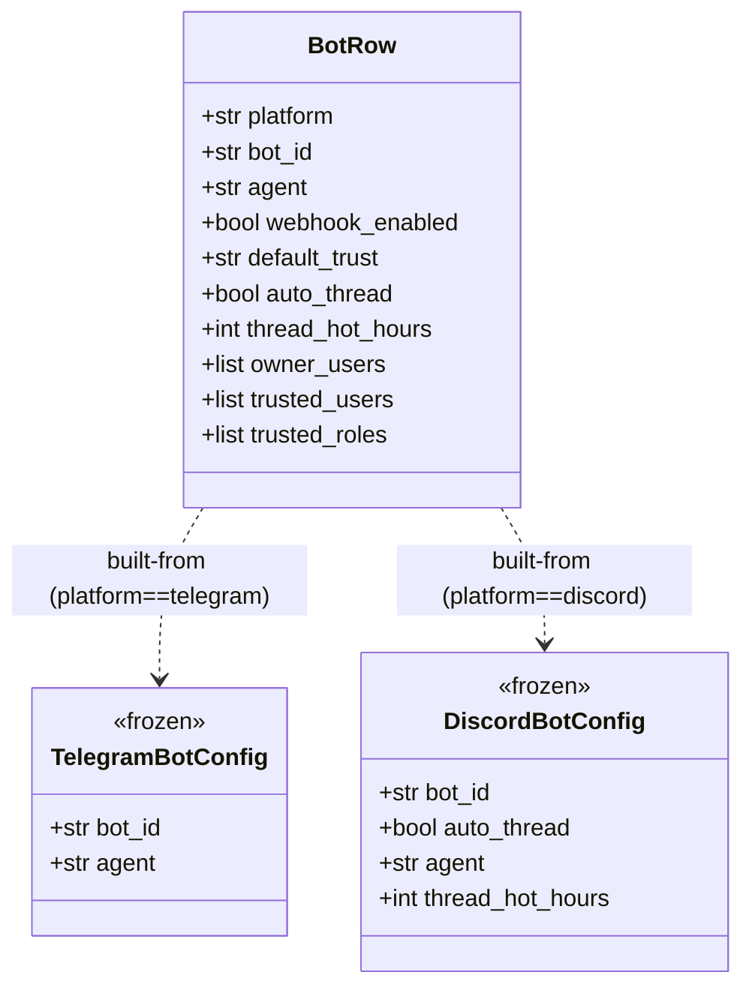
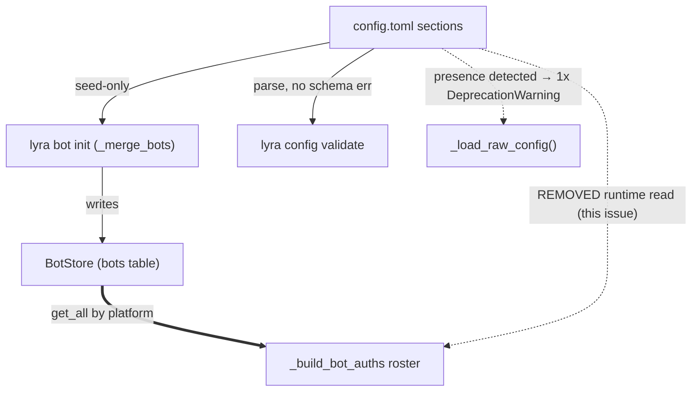

## Context

Source: `artifacts/frames/1420-deprecate-runtime-toml-bots-frame.mdx`. Closing step of
epic #1413. During framing, a falsification check revealed the issue's premise was **not**
met by the code: the original guardrail greps match only a narrow bracket pattern
(`raw["telegram"]["bots"]`) and returned 0, but **both production boot paths still read the
TOML bot roster at runtime** via `load_multibot_config(raw_config)`:

| Path | Call site | Reads |
|---|---|---|
| NATS hub | `bootstrap/standalone/hub_standalone.py:113` → `auth_seeding.build_bot_auths` | `load_multibot_config(raw_config)` → roster |
| Unified | `bootstrap/factory/unified.py:57` → `wiring_helpers._init_bot_auths_and_agents` | `load_multibot_config(raw_config)` → roster |

Both feed `bootstrap/wiring/bootstrap_wiring.py::_build_bot_auths`, which iterates
`tg_multi_cfg.bots` / `dc_multi_cfg.bots` (the TOML roster) to decide *which* bots exist,
then pulls per-bot auth from BotStore. #1416 migrated the auth *data*; the **roster** is
still TOML-sourced. So the intended `DeprecationWarning` ("no longer read at runtime")
would be false until the roster is migrated too.

`BotRow` already carries every field the runtime needs (`platform, bot_id, agent,
webhook_enabled, auto_thread, thread_hot_hours`) and `seed_grants_from_bots` already reads
from `bot_store.get_all()`, so nothing blocks sourcing the roster from BotStore.

## Goal

Make TOML bot sections genuinely seed-only: the runtime bot roster comes from BotStore,
the four legacy sections are read only by `lyra bot init`, and a one-time `DeprecationWarning`
truthfully tells operators to migrate.

## Users

- **Primary:** Operators — see a truthful one-time deprecation warning + a migration path.
- **Secondary:** Developers — `Deprecated[...]` markers in-IDE; a `lyra bot init` seed
  validator that rejects typos (G18 `webhook_enabled`) instead of silently dropping them.

## Expected Behavior

1. **Runtime boot (hub / adapter / unified):** `_load_raw_config()` parses `config.toml`.
   If any of `[[telegram.bots]]`, `[[discord.bots]]`, `[[auth.telegram_bots]]`,
   `[[auth.discord_bots]]` is present, it logs **one** `DeprecationWarning` (deduplicated).
   Bot-auth wiring builds its roster from `bot_store.get_all()` — `load_multibot_config`
   is no longer called on `raw_config` in either runtime path.
2. **`lyra bot init`:** unchanged behavior — still parses the four TOML sections as seed
   source (`tomllib.load` + `_merge_bots`), now through a Pydantic seed model that rejects
   unknown keys (`extra="forbid"`) so a `webhook_enabled` typo raises at init time (G18).
3. **`lyra config validate`:** still parses sections (no schema error).
4. A `config.toml` with **no** legacy sections produces **no** warning.

## Data Model & Consumers

### Data structure

### Consumer map

### Consumer summary

| Consumer | Reads | When | Status |
|---|---|---|---|
| `lyra bot init` (`_merge_bots`) | 4 TOML sections | manual seed | seed-only (kept) |
| `lyra config validate` | TOML sections | CLI inspect | kept (parsable) |
| `_load_raw_config` | section *presence* only | runtime boot | new: emit DeprecationWarning |
| `_build_bot_auths` roster | `bot_store.get_all()` | runtime boot | **migrated TOML→BotStore (this issue)** |

## Breadboard

| ID | Affordance | Handler | Data |
|---|---|---|---|
| N1 | `_load_raw_config()` warning hook | new `warn_deprecated_bot_sections(raw)` in `bootstrap/factory/config.py` | reads section keys, logs once |
| N2 | store-sourced roster builder | new `multibot_config_from_store(bot_store)` in `lyra/config.py` (or bootstrap helper) | `bot_store.get_all()` → `TelegramMultiConfig`/`DiscordMultiConfig` |
| N3 | runtime call swap (hub path) | `auth_seeding.build_bot_auths` | N2 instead of `load_multibot_config(raw_config)`; **also** retarget the empty-roster `ValueError` text (`auth_seeding.py:74`) at `lyra bot init` / BotStore, not `[[telegram.bots]]` |
| N4 | runtime call swap (unified path) | `wiring_helpers._init_bot_auths_and_agents` | N2 instead of `load_multibot_config(raw_config)`; **also** retarget the empty-roster `SystemExit` text (`wiring_helpers.py:193`) at `lyra bot init` / BotStore |
| N5 | `Deprecated[...]` markers | `TelegramMultiConfig` / `DiscordMultiConfig` (and `.bots`) in `lyra/config.py` | `typing_extensions.deprecated` |
| N6 | seed validator (G18) | `agent_cmd/bots/init.py::_merge_bots` | Pydantic model w/ `extra="forbid"` |
| N7 | guardrail tightening | new check script `tools/check_no_runtime_toml_bots.sh` (or inline in existing guardrail) wired into `/validate`: original 2 issue greps **+** `load_multibot_config(` in `auth_seeding.py`/`wiring_helpers.py` | CI/validate |

Wiring: N2 feeds N3 + N4 (incl. error-text retarget). N1 independent (presence warning). N5/N6 discoverability + safety. N7 verifies N3/N4.

## Slices

| # | Slice | Affordances | Demo |
|---|---|---|---|
| 1 | **Roster from BotStore** | N2, N3, N4 | hub boots with empty `[[telegram.bots]]` + seeded store → bot still wired; empty store → error tells operator to run `lyra bot init` |
| 2 | **Truthful deprecation warning** | N1 | legacy `config.toml` boot logs exactly one `DeprecationWarning`; clean config logs none |
| 3 | **Seed safety + discoverability** | N5, N6 | `webhook_enabled` typo in a bot entry raises at `lyra bot init`; IDE shows Deprecated |
| 4 | **Docs + guardrails** | N7 | `docs/bot-management.md` timeline + CHANGELOG; all guardrail greps green |

## Success Criteria

- [ ] Neither `auth_seeding.py` nor `wiring_helpers.py` calls `load_multibot_config(raw_config)`; roster built from `bot_store.get_all()`
- [ ] Integration test: with a `config.toml` containing **no** `[[telegram.bots]]`/`[[discord.bots]]` and a BotStore seeded with one telegram bot, `build_bot_auths` returns a non-empty `tg_bot_auths` list whose `bot_cfg.bot_id` equals the seeded row's `bot_id` (no `KeyError`, no `ValueError`)
- [ ] Empty-roster error text in `auth_seeding.py` and `wiring_helpers.py` instructs the operator to run `lyra bot init` / seed the BotStore — it no longer says "add a `[[telegram.bots]]` entry"
- [ ] DeprecationWarning fires **exactly once** at `_load_raw_config` when ≥1 of the 4 sections is present
- [ ] **No** warning fires when none of the 4 sections is present
- [ ] `lyra bot init` still seeds BotStore from the 4 TOML sections (sections remain parsable)
- [ ] A `webhook_enabled` (or any unknown-key) typo in a bot entry raises at `lyra bot init` (Pydantic `extra="forbid"`) — G18 closed
- [ ] `TelegramMultiConfig` / `DiscordMultiConfig` marked `Deprecated[...]`
- [ ] Original 2 issue guardrail greps return 0
- [ ] New guardrail: `grep -rn 'load_multibot_config(' src/lyra/bootstrap/auth_seeding.py src/lyra/bootstrap/factory/wiring_helpers.py` returns 0
- [ ] `docs/bot-management.md` has a `## Deprecation Timeline` section that contains the literal phrase `next major`, names a target version (`v1.0.0`, current is `0.2.1`), and names all 4 deprecated section identifiers
- [ ] CHANGELOG entry added

## Notes

- **Smart-splitting considered, rejected:** 12 criteria / 4 slices trip the Gate 2.5
  threshold, but the slices are a single cohesive closing step (roster migration is the
  precondition that makes the warning truthful). Splitting would create artificial
  cross-issue ordering with no independent value.
- `seed_grants_from_bots` already reads BotStore — no change.
- Warning lives at `_load_raw_config` (single runtime chokepoint), **not** in
  `lyra bot init`'s independent loader — init must stay quiet (it *is* the seed consumer).
- **Issue hygiene (out-of-band):** issue #1420's `<!-- complexity: 2 -->` annotation predates
  the falsification finding; true scope ≈ 5. Update on the GitHub issue, and amend the issue
  body's AC to record the corrected premise (roster migration), so auditors don't see AC
  narrower than the spec. Done as part of the PR.
- **Import layer (verified):** `multibot_config_from_store` in `lyra/config.py` may import
  `BotStoreProtocol` (`lyra.core.stores`) + `BotRow` (`lyra.core.agent`) — `.importlinter`
  `shared-modules-upper-boundary` bans only `bootstrap`/`adapters`/`infrastructure`, not
  `lyra.core`; `config.py` already imports `lyra.core.config`.
