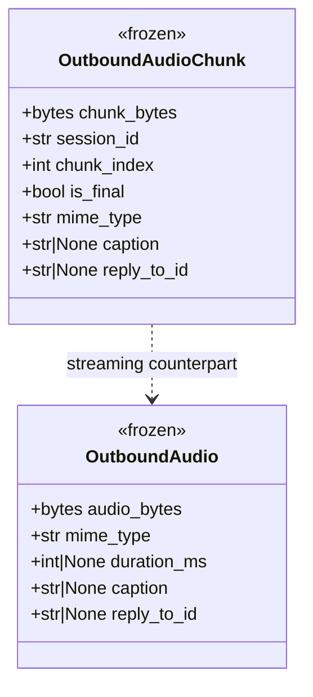
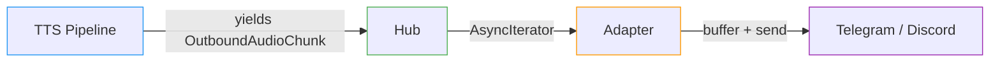

## Context

Promoted from [frame #144](../frames/144-live-audio-streaming-frame.mdx). Builds on `OutboundAudio` (#184 pattern) and `InboundAudio` (#140). Follows the bus envelope convention established by `OutboundMessage` (#138).

## Goal

Enable TTS pipelines to yield audio chunk-by-chunk through the bus so adapters can render audio with minimal end-to-end latency — buffering where the platform requires it (Telegram, Discord v1).

## Users

- **Primary:** Lyra users receiving voice responses via Telegram or Discord
- **Secondary:** Developers building new adapters or TTS integrations

## Expected Behavior

1. A TTS pipeline produces audio incrementally, yielding `OutboundAudioChunk` objects as each chunk is synthesized.
2. The hub passes the async chunk stream to the adapter's `render_audio_stream()` method.
3. The adapter consumes chunks sequentially:
   - **Telegram:** buffers all chunks into a single `BytesIO`, then sends as one voice note when `is_final=True`.
   - **Discord:** same buffer-and-send strategy for v1 (real-time voice channel streaming deferred).
4. If only one chunk arrives with `is_final=True`, behavior is equivalent to `render_audio()` (single-shot send).
5. On stream error (producer dies mid-stream), the adapter sends whatever has been buffered so far (if non-empty) as a partial voice note, logging a warning.

## Data Model & Consumers





| Consumer | Fields consumed | When | Status |
|----------|----------------|------|--------|
| Hub | `session_id` (routing), `is_final` (stream lifecycle) | On each chunk yield | This issue |
| Telegram adapter | `chunk_bytes`, `is_final`, `mime_type`, `caption`, `reply_to_id` | During `render_audio_stream()` | This issue |
| Discord adapter | `chunk_bytes`, `is_final`, `mime_type`, `caption`, `reply_to_id` | During `render_audio_stream()` | This issue |
| Future voice channel | `chunk_bytes`, `chunk_index`, `session_id` | Real-time push | Future |

### Design decisions

- **Off-protocol dispatch:** `render_audio()` is not on `ChannelAdapter` today — it's an informal contract called directly by the TTS pipeline/agent layer. `render_audio_stream()` follows the same pattern: the caller (TTS pipeline) holds the `AsyncIterator[OutboundAudioChunk]` and calls `adapter.render_audio_stream()` directly. No hub dispatch method needed. Promoting both to the protocol is a separate concern (tracked separately if desired).
- **Error recovery shape:** Adapters wrap the `async for` in `try/except Exception`, send buffered audio if non-empty, then log a warning. Pseudocode:

```python
async def render_audio_stream(self, chunks, inbound):
    buf = BytesIO()
    meta = {}
    try:
        async for chunk in chunks:
            buf.write(chunk.chunk_bytes)
            meta = {"caption": chunk.caption, "reply_to_id": chunk.reply_to_id,
                    "mime_type": chunk.mime_type}
            if chunk.is_final:
                break
    except Exception:
        logger.warning("Audio stream interrupted, sending partial buffer")
    if buf.tell() > 0:
        buf.seek(0)
        # send using platform API (same as render_audio)
```

- **No `duration_ms` on chunks:** Duration is unknown at chunk-yield time. Adapters don't need it for sending (Telegram infers from ogg headers, Discord doesn't use it).

## Breadboard

### Affordances

| ID | Element | Location |
|----|---------|----------|
| U1 | `OutboundAudioChunk` dataclass | `src/lyra/core/message.py` |
| U2 | `render_audio_stream()` method (off-protocol) | Telegram + Discord adapters |
| U3 | Telegram `render_audio_stream()` | `src/lyra/adapters/telegram.py` |
| U4 | Discord `render_audio_stream()` | `src/lyra/adapters/discord.py` |

### Wiring

| From | To | Trigger |
|------|-----|---------|
| TTS pipeline | Hub | Yields `AsyncIterator[OutboundAudioChunk]` |
| Hub | U2 | Calls `adapter.render_audio_stream(chunks, inbound)` |
| U2 → U3 | Telegram API | Buffers chunks → `bot.send_voice()` on `is_final` |
| U2 → U4 | Discord API | Buffers chunks → `channel.send(file=...)` on `is_final` |

## Slices

| # | Slice | Deliverable | Demo |
|---|-------|-------------|------|
| 1 | Chunk dataclass + protocol | `OutboundAudioChunk` in message.py, `render_audio_stream()` in ChannelAdapter protocol | Import and instantiate chunk, type-check passes |
| 2 | Telegram buffer-and-send | `render_audio_stream()` in telegram.py | Mock chunk stream → voice note sent |
| 3 | Discord buffer-and-send | `render_audio_stream()` in discord.py | Mock chunk stream → file attachment sent |

## Success Criteria

- [ ] `OutboundAudioChunk` frozen dataclass exists in `src/lyra/core/message.py` with fields: `chunk_bytes`, `session_id`, `chunk_index`, `is_final`, `mime_type`, `caption`, `reply_to_id`
- [ ] `render_audio_stream(self, chunks: AsyncIterator[OutboundAudioChunk], inbound: InboundMessage) → None` method exists on both adapters (off-protocol, same pattern as `render_audio()`)
- [ ] Telegram adapter implements `render_audio_stream()`: buffers all chunks, sends single voice note on `is_final=True`
- [ ] Discord adapter implements `render_audio_stream()`: buffers all chunks, sends single file attachment on `is_final=True`
- [ ] Partial stream handling: if producer errors mid-stream, buffered audio (if non-empty) is sent with a logged warning
- [ ] Unit tests cover: single-chunk stream, multi-chunk stream, empty stream (no send), error mid-stream
- [ ] `caption` and `reply_to_id` from the final chunk are used when sending
- [ ] pyright type-check passes with no new errors
