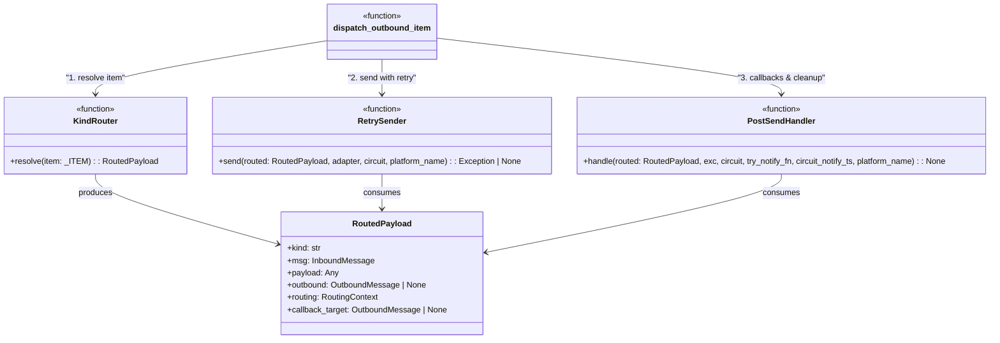
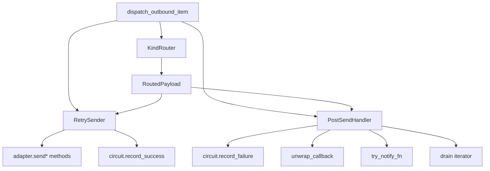

## Context

Derived from [frame](../frames/1449-extract-dispatch-outbound-smells-frame.mdx).
Origin: Quality Audit 2026-05-26 (#1426) — `dispatch_outbound_item` flagged as #1 cross-domain hotspot (24 findings, 6 domains) with explicit `noqa: C901, PLR0913, PLR0915`.

## Goal

Extract three entangled responsibilities from `dispatch_outbound_item` into independently testable top-level functions, reducing the host function to an orchestration shell without changing behavior.

## Users

- **Primary:** Lyra maintainers modifying outbound delivery paths
- **Secondary:** Contributors adding new channel kinds (clearer routing boundary)

## Constraints

- **No behavioral change** — extraction is a pure refactor; all retry semantics, routing rules, and hook sequencing must remain identical
- **Existing error handling** — exception paths and logging must not shift
- **Outbound stage contract** — changes must stay within the current outbound stage composition boundary (ADR-1279)

## Out of Scope

- Rewriting retry policy parameters or backoff strategy
- Adding new channel kinds or outbound platforms
- Changing formatter / throttle / emitter boundaries outside `dispatch_outbound_item`
- Observability instrumentation (unless already inline and moving with extracted code)

## Expected Behavior

`dispatch_outbound_item` currently performs kind-routing, retry-backed sending, and post-send callbacks in one 167-LOC function. After extraction:

1. A **kind-router** resolves the item tuple into payload, outbound, and routing context based on `kind`.
2. A **retry sender** attempts delivery with exponential backoff for transient errors (`send` kind only; streaming excluded from retry because iterators cannot be replayed).
3. A **post-send handler** invokes `_on_dispatched` callbacks, records circuit success/failure, drains iterators on error, and notifies the user on delivery failure.

The host function sequences these three units: router → circuit check → retry sender → post-send handler. No behavioral change.

### Why not the simplest alternative

The simplest version extracts only the retry loop (the largest and most self-contained unit), leaving kind-router and post-send hooks inline. This is insufficient because:

- Partial extraction leaves two mixed responsibilities in `dispatch_outbound_item`, so the function still violates SRP.
- The quality audit explicitly flagged all three concerns as distinct smells requiring separation.
- A half-measure would not resolve the cross-domain hotspot or meaningfully improve testability.

## Data Model & Consumers

### Class Diagram

### Consumer Map

### Consumer Summary

| Consumer | Fields consumed | When | Status |
|----------|----------------|------|--------|
| `KindRouter` | `item` tuple | Entry | this issue |
| `RetrySender` | `routed.kind`, `routed.payload`, `routed.outbound`, `adapter`, `circuit`, `platform_name` | After routing | this issue |
| `PostSendHandler` | `routed`, `exc`, `circuit`, `try_notify_fn`, `circuit_notify_ts`, `platform_name` | After send | this issue |
| `OutboundDispatcher._dispatch_item` | full `dispatch_outbound_item` | Per queue item | future (no change) |

## Breadboard

| Affordance | Handler | Data / State |
|------------|---------|------------|
| `_resolve_item(item)` → `RoutedPayload` | `KindRouter` | `item` tuple, `RoutingContext` |
| `_send_with_retry(routed, adapter, circuit, platform_name)` → `Exception \| None` | `RetrySender` | `_BACKOFF_DELAYS` (module constant), `_MAX_ATTEMPTS` (module constant) |
| `_handle_post_send(routed, exc, circuit, try_notify_fn, circuit_notify_ts, platform_name)` | `PostSendHandler` | `exc`, `_on_dispatched` callback, `circuit_notify_ts` dict |
| `_drain_iterator(kind, payload)` | `PostSendHandler` | `kind` (gating), `payload` (async iterator) |
| `_handle_circuit_open(routed, circuit_notify_ts, try_notify_fn)` | stays inline in host | `circuit_notify_ts` dict, debounce window `_CIRCUIT_NOTIFY_DEBOUNCE` |

### Notes on state

All extracted units are **stateless top-level functions** in `_dispatch.py`. Constants (`_BACKOFF_DELAYS`, `_MAX_ATTEMPTS`) are module-level tuples/ints. Mutable state (`circuit_notify_ts`) is owned by `OutboundDispatcher` and passed as a parameter.

### Edge cases handled

| Edge case | Location | Behavior |
|-----------|----------|----------|
| Routing mismatch | Host function (inline) | Drain streaming iterator if kind is streaming/audio_stream/voice_stream; return early |
| Circuit open | Host function (inline) | Drain iterator, invoke callback with `reply_message_id=None`, debounced user notification |
| Superseded streaming | `RetrySender` | Check `_superseded` metadata before `send_streaming`; drain and break if set |
| `BaseException` (Cancel/Keyboard) | `RetrySender` | Re-raise immediately after recording circuit failure; do not return |
| Retry exhausted | `RetrySender` | Return the last exception; do not raise |

## Slices

| # | Slice | Vertical | Demo (testable) |
|---|-------|----------|-----------------|
| 1 | Extract `KindRouter` | Resolve `item` → `RoutedPayload` for all 6 kinds | Unit tests: each kind branch produces correct payload + routing + `callback_target` |
| 2 | Extract `RetrySender` | Send with exponential backoff for transient errors | Unit tests: retry count equals 4, backoff delays are `(1.0, 2.0, 4.0)`, circuit records success on break, records failure on BaseException, streaming excluded from retry |
| 3 | Extract `PostSendHandler` | Callbacks, circuit recording, error drainage, user notification | Unit tests: callback invoked with correct `callback_target`, circuit records failure when `exc` is set, iterator drained when kind is streaming/audio_stream/voice_stream, `try_notify_fn` called when `exc` is set and kind is send/streaming |

## Success Criteria

- [ ] `dispatch_outbound_item` is ≤60 LOC after all three extractions
- [ ] Zero `noqa` complexity suppressions on `dispatch_outbound_item`
- [ ] `KindRouter` has a dedicated test file with ≥6 test cases (one per kind branch) plus ≥2 routing edge-case tests
- [ ] `RetrySender` has a dedicated test file with ≥5 test cases: success on first attempt, retry count equals 4, backoff delays match `(1.0, 2.0, 4.0)`, transient error retries vs fatal error aborts, BaseException re-raise path
- [ ] `PostSendHandler` has a dedicated test file with ≥4 test cases: callback invoked with correct target, circuit failure recorded, iterator drained on error for streaming kinds, user notification sent on delivery failure
- [ ] No behavioral change — existing outbound integration tests pass without modification (`tests/core/test_outbound_dispatcher_*.py`, `tests/outbound/`)
- [ ] New extracted units are top-level functions in `_dispatch.py` (not nested closures) and independently importable for testing
