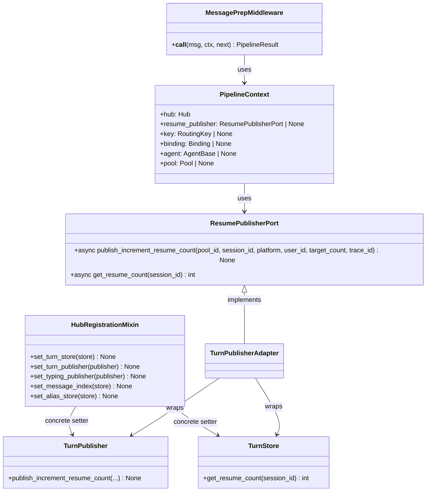
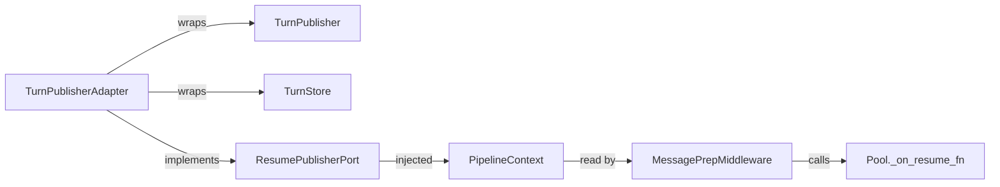

## Context

Source: [frame](../frames/1450-architecture-close-adr-048-gap-resumepublisherport-halt-concrete-setters-on-hub-frame.mdx)

P1 audit finding (#1426). ADR-048 mandates port/protocol abstraction for all external capabilities consumed by `core/`. Today, `MessagePrepMiddleware` (stage 7) drills into `ctx.hub._turn_publisher` and `ctx.hub._turn_store` to wire pool resume callbacks. The Hub registration API (`HubRegistrationMixin`) exposes 5 concrete setters (`set_turn_store`, `set_turn_publisher`, `set_typing_publisher`, `set_message_index`, `set_alias_store`) that accept infrastructure types directly, lacking `core/ports/` protocols.

This spec defines `ResumePublisherPort`, injects it into `PipelineContext`, and halts new concrete setters on Hub until protocols exist.

## Goal

Define `ResumePublisherPort` in `core/ports/`, inject it into `PipelineContext` so `MessagePrepMiddleware` no longer reaches through `ctx.hub`, and establish a hard stop on new concrete setters.

## Users

- **Primary:** Developers adding new store/transport capabilities to Hub
- **Secondary:** Architecture reviewers, future maintainers

## Expected Behavior

1. `ResumePublisherPort` is defined as a pure Protocol in `lyra.core.ports` following the `TtsProtocol` / `STTProtocol` shape (protocol + value objects + errors, no infrastructure imports).
2. `PipelineContext` gains a `resume_publisher: ResumePublisherPort | None` field.
3. `MessagePrepMiddleware` reads `ctx.resume_publisher` instead of `ctx.hub._turn_publisher` / `ctx.hub._turn_store`.
4. `build_default_pipeline()` accepts `resume_publisher` and passes it to `PipelineContext`.
5. Bootstrap/factory wiring sites pass `TurnPublisher` (wrapped or adapted) as `resume_publisher` into the pipeline.
6. A new architectural guard is added: any PR adding a new concrete setter to `HubRegistrationMixin` must be blocked until a corresponding `core/ports/` protocol exists.

## Data Model & Consumers

### Class diagram

### Consumer map

### Consumer summary

| Consumer | Fields consumed | When | Status |
|---|---|---|---|
| MessagePrepMiddleware | `publish_increment_resume_count`, `get_resume_count` | Pool creation / resume callback wiring | This issue |
| Pool._on_resume_fn | `publish_increment_resume_count` | Session resume | This issue |
| Future resume-aware middleware | `publish_increment_resume_count` | Pipeline stage | Future (port must expose) |

## Breadboard

| Affordance | ID | Handler | Data |
|---|---|---|---|
| `resume_publisher` field on `PipelineContext` | U1 | `MiddlewarePipeline.process()` passes it to `PipelineContext()` | `ResumePublisherPort | None` |
| `publish_increment_resume_count` method | U2 | `MessagePrepMiddleware.__call__()` — `pool._on_resume_fn` | `pool_id, session_id, platform, user_id, target_count, trace_id` |
| `get_resume_count` query | U3 | `MessagePrepMiddleware.__call__()` — reads current count | `session_id → int` |
| `build_default_pipeline` signature | U4 | `build_default_pipeline()` — accepts `resume_publisher` | `resume_publisher: ResumePublisherPort | None` |
| Bootstrap wiring | U5 | Factory/bootstrap — passes `TurnPublisher` wrapped as `ResumePublisherPort` | `TurnPublisherAdapter` |

**Wiring:**
- U1 → U4 → U5: pipeline context receives port from factory
- U2 → U3: resume callback needs both publish and query
- U5 → U1: factory injects adapter into pipeline

## Slices

| Slice | Scope | Demo | Acceptance |
|---|---|---|---|
| S1 | Define `ResumePublisherPort` protocol in `core/ports/` | `ResumePublisherPort` importable from `lyra.core.ports` | `- [ ] ResumePublisherPort` exists in `core/ports/` with no infrastructure imports; exposes both `publish_increment_resume_count` and `get_resume_count` |
| S2 | Create `TurnPublisherAdapter` in `lyra.infrastructure` that wraps `TurnPublisher` + `TurnStore` | `TurnPublisherAdapter` satisfies `ResumePublisherPort` | `- [ ] Adapter lives in `lyra.infrastructure`, implements `ResumePublisherPort`, wraps existing TurnPublisher + TurnStore` |
| S3 | Update `PipelineContext` + `MessagePrepMiddleware` to use port | `MessagePrepMiddleware` no longer references `ctx.hub._turn_publisher` or `ctx.hub._turn_store` | `- [ ] `ctx.hub._turn_publisher` and `ctx.hub._turn_store` removed from MessagePrepMiddleware` |
| S4 | Update `build_default_pipeline` + bootstrap wiring | `build_default_pipeline` accepts `resume_publisher` and passes it to `PipelineContext` | `- [ ] build_default_pipeline signature updated; bootstrap wiring passes TurnPublisherAdapter; `core/ports/__init__.py` re-export updated` |
| S5 | Add architectural guard — halt new concrete setters | `src/lyra/core/CLAUDE.md` documents the guard | `- [ ] `src/lyra/core/CLAUDE.md` updated: new concrete setters on Hub require a `core/ports/` protocol first` |

## Success Criteria

- [ ] `ResumePublisherPort` protocol exists in `core/ports/` with no infrastructure imports (TYPE_CHECKING-only permitted); exposes both `publish_increment_resume_count` and `get_resume_count`
- [ ] `TurnPublisherAdapter` lives in `lyra.infrastructure`, wraps `TurnPublisher` + `TurnStore`, and implements `ResumePublisherPort`
- [ ] `PipelineContext` has `resume_publisher: ResumePublisherPort | None` field
- [ ] `MessagePrepMiddleware` no longer references `ctx.hub._turn_publisher` or `ctx.hub._turn_store`
- [ ] `build_default_pipeline` accepts `resume_publisher` parameter
- [ ] Bootstrap/factory wiring passes `TurnPublisherAdapter` into `build_default_pipeline`
- [ ] `core/ports/__init__.py` re-exports `ResumePublisherPort`
- [ ] `import-linter` and `ruff` pass on changed files
- [ ] `src/lyra/core/CLAUDE.md` updated: new concrete setters on Hub require a `core/ports/` protocol first

## Edge Cases

- **Circular imports:** `core/ports/` must not import from `lyra.infrastructure` or `lyra.transport`. The adapter lives in `lyra.infrastructure` and implements the port.
- **Backward compatibility:** Existing `set_turn_publisher` / `set_turn_store` remain untouched (out of scope). Only `MessagePrepMiddleware` changes its read path.
- **Null port:** `resume_publisher` may be `None` in test contexts or when NATS is disabled. `MessagePrepMiddleware` must skip resume callback wiring when `None` (same as current `ctx.hub._turn_publisher is None` check).
- **Adapter lifecycle:** The adapter must be created after `TurnPublisher` and `TurnStore` are wired, so bootstrap ordering matters. The adapter should be created in the factory, not in `HubRegistrationMixin`.
