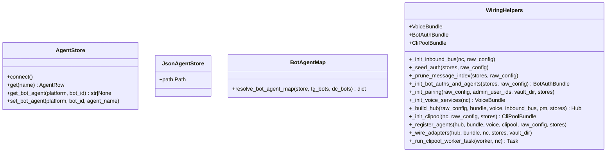

## Context

Quality Audit 2026-05-26 identified severe coverage gaps in 4 bootstrap wiring modules:

| Module | File | Lines | Current Coverage |
|--------|------|-------|------------------|
| `agent_store_factory` | `src/lyra/bootstrap/factory/agent_store_factory.py` | 48 | 0 % |
| `bot_agent_map` | `src/lyra/bootstrap/factory/bot_agent_map.py` | 97 | 12 % |
| `unified` | `src/lyra/bootstrap/factory/unified.py` | 93 | 24 % |
| `wiring_helpers` | `src/lyra/bootstrap/factory/wiring_helpers.py` | 407 | 32 % |

These modules are critical to the bootstrap path. Low coverage means regressions in agent-store construction, bot-to-agent mapping, or wiring assembly are caught late.

## Goal

Bring each of the 4 bootstrap wiring modules to ≥80 % line coverage with isolated unit tests that run in <1 s per suite and require no full hub or NATS lifecycle.

## Users

- **Primary:** Developers modifying bootstrap factory code
- **Secondary:** Reviewers and CI relying on green builds

## Expected Behavior

Each module is tested by instantiating its public functions/classes with mocked collaborators. Tests verify happy paths, boundary conditions, and error handling without pulling in `Hub`, `NatsBus`, or real NATS connections.

## Out of Scope

- Integration tests through `lyra start` or full hub spin-up
- Refactoring the modules themselves — this is test backfill only
- Coverage for modules not listed (e.g., `agent_factory`, `hub_builder`)
- End-to-end tests that exercise real NATS, SQLite, or subprocesses
- Standalone entry-point tests (`hub_standalone.py`, `adapter_standalone.py`)

## Data Model & Consumers

**Consumer summary:**

| Consumer | Fields Used | When | Status |
|----------|-------------|------|--------|
| `tests/bootstrap/test_agent_store_factory.py` | `make_agent_store`, `LYRA_DB`, `LYRA_AGENT_STORE_PATH` | Test time | This issue |
| `tests/bootstrap/test_bot_agent_map.py` | `resolve_bot_agent_map`, DB caching, TOML fallback | Test time | This issue |
| `tests/bootstrap/test_unified.py` | `_bootstrap_unified` orchestration | Test time | This issue |
| `tests/bootstrap/test_wiring_helpers.py` | All phase helpers | Test time | This issue |
| `agent_factory.py` | `resolve_bot_agent_map` | Bootstrap | Existing |
| `hub_standalone.py` | `_bootstrap_unified` | Runtime | Existing |

## Breadboard

| ID | Affordance | Handler | Data | Slice |
|----|-----------|---------|------|-------|
| U1 | Select agent store backend | `make_agent_store` | `LYRA_DB` env var, `db_path` | 1 |
| U2 | Resolve bot→agent mapping | `resolve_bot_agent_map` | `AgentStore`, `TelegramBotConfig`, `DiscordBotConfig` | 2 |
| U3 | Bootstrap unified process | `_bootstrap_unified` | `raw_config`, `asyncio.Event` | 4 |
| U4 | Init inbound bus | `_init_inbound_bus` | `NatsBus` (mocked nc) | 3a |
| U5 | Seed auth store | `_seed_auth` | `stores.auth`, config block | 3a |
| U6 | Prune message index | `_prune_message_index` | `stores.message_index`, retention config | 3a |
| U7 | Init bot auths + agents | `_init_bot_auths_and_agents` | `BotAuthBundle` | 3b |
| U8 | Init pairing manager | `_init_pairing` | `PairingManager` (conditional) | 3a |
| U9 | Init voice services | `_init_voice_services` | `VoiceBundle` (mocked nc) | 3a |
| U10 | Build hub | `_build_hub` | `Hub` (mocked stores) | 3b |
| U11 | Init clipool | `_init_clipool` | `CliPoolBundle` (mocked nc) | 3b |
| U12 | Register agents | `_register_agents` | `hub.agent_registry` | 3c |
| U13 | Wire adapters | `_wire_adapters` | `WiredAdapters` (mocked nc) | 3c |
| U14 | Run clipool worker | `_run_clipool_worker_task` | `asyncio.Task` (mocked worker) | 3a |

## Slices

| # | Module | Focus | Acceptance Criteria | Risk |
|---|--------|-------|---------------------|------|
| 1 | `agent_store_factory` | `make_agent_store` — env var routing, path resolution, deferred connect | - `LYRA_DB` unset → returns `AgentStore` with default `~/.lyra/config.db` - `LYRA_DB=json` → returns `JsonAgentStore` with `LYRA_AGENT_STORE_PATH` or default `~/.lyra/agents_test.json` - `db_path` argument overrides default when `LYRA_DB` unset - Returned store is not connected (`connect()` not yet called) | Low |
| 2 | `bot_agent_map` | `resolve_bot_agent_map` — DB cache hit, TOML fallback, missing agent skip, seed failure resilient | - DB cache hit with valid agent → included in result - DB cache hit with stale agent (deleted) → logged + skipped - No DB cache + TOML agent valid → seeded to DB + included - No DB cache + TOML agent missing → logged + skipped - No DB cache + no TOML agent → logged + skipped - `set_bot_agent` failure → logged + still included - Empty bot lists → empty result | Low |
| 3a | `wiring_helpers` (simple) | `_init_inbound_bus`, `_seed_auth`, `_prune_message_index`, `_init_pairing`, `_init_voice_services`, `_run_clipool_worker_task` | - `_init_inbound_bus`: returns `NatsBus` with correct `queue_group=HUB_INBOUND` and `staging_maxsize` from config - `_seed_auth`: calls `stores.auth.seed_from_config` once per bot entry in config block - `_prune_message_index`: calls `stores.message_index.cleanup_older_than` with retention_days from config; logs count if >0 - `_init_pairing`: returns `None` when disabled; returns `PairingManager` when enabled; calls `pm.connect()` and `set_pairing_manager(pm)` - `_init_voice_services`: returns `VoiceBundle` with all 3 services started; services are `NatsSttService`, `NatsTtsService`, `LlmClient` - `_run_clipool_worker_task`: returns `asyncio.Task` named "clipool-worker" | Low |
| 3b | `wiring_helpers` (construction) | `_init_bot_auths_and_agents`, `_build_hub`, `_init_clipool` | - `_init_bot_auths_and_agents`: calls `load_multibot_config`, `_build_bot_auths`, `_resolve_bot_agent_map`; builds `BotAuthBundle` with correct fields; raises `SystemExit` if no bots or no agent configs - `_build_hub`: constructs `HubConfig` from config subsections; constructs `Hub` with stores wired; calls `hub.set_turn_store`, `hub.set_message_index`, `hub.set_alias_store` - `_init_clipool`: constructs `CliPool`, `JetStreamAuditSink`, `CliPoolNatsWorker`; calls `audit_sink.provision(nc)`, `cli_pool.start()`, `cli_pool.set_turn_store`; returns `CliPoolBundle` | Medium |
| 3c | `wiring_helpers` (wiring) | `_register_agents`, `_wire_adapters` | - `_register_agents`: calls `_resolve_agents` with correct args; registers every agent via `hub.register_agent`; wires `identity_alias` into memory managers - `_wire_adapters`: calls `wire_telegram_adapters` and `wire_discord_adapters` with correct args; returns `WiredAdapters` with all fields populated | Medium |
| 4 | `unified` | `_bootstrap_unified` — orchestration sequence, exception handling, cleanup | - `ensure_nats` called first; `acquire_lockfile` called before try - Inside try: helpers called in order (bus → stores → auths → pairing → voice → hub → clipool → register → adapters → worker → lifecycle) - `run_lifecycle` awaited with correct `LifecycleResources` - On normal exit: `clipool_worker_task.cancel()` called; NATS closed; embedded NATS stopped; lockfile released - On exception: `finally` block still runs cleanup; voice/clipool services stopped; audit tasks drained; NATS closed; lockfile released | Medium |

## Edge Cases

| Module | Edge Case | Handling Strategy |
|--------|-----------|-------------------|
| `agent_store_factory` | `LYRA_DB` set to invalid value (not `json`) | Falls back to `AgentStore` (default branch) |
| `agent_store_factory` | `LYRA_AGENT_STORE_PATH` set to relative path | Resolved against `LYRA_VAULT_DIR` or `~/.lyra` |
| `bot_agent_map` | `agent_store.get_bot_agent` returns agent name not in agents table | Log error, skip bot (not included in result) |
| `bot_agent_map` | `await agent_store.set_bot_agent` raises | Log warning, still include bot in result (resilient seed) |
| `bot_agent_map` | All bots have no DB row and no TOML agent | Return empty dict; all bots logged as skipped |
| `wiring_helpers` | No bots configured in TOML | `_init_bot_auths_and_agents` raises `SystemExit` with clear message |
| `wiring_helpers` | No agent configs resolved | `_init_bot_auths_and_agents` raises `SystemExit` with clear message |
| `wiring_helpers` | Pairing enabled but no admin_user_ids | Log warning; still create `PairingManager` |
| `wiring_helpers` | Voice service start fails | Exception propagates (not swallowed) |
| `unified` | `ensure_nats` fails | Exception propagates before try block (no cleanup needed) |
| `unified` | `run_lifecycle` raises during operation | `finally` block runs full cleanup sequence |
| `unified` | `nc.close()` raises `nats.errors.Error` | Log warning; continue cleanup |

## Mocking Boundaries

Per-module mocking strategy to maintain isolation:

- **`agent_store_factory`**: Patch `os.environ` via `monkeypatch` or `patch.dict`. No store connect needed.
- **`bot_agent_map`**: `AgentStore` mock must provide `get_bot_agent` (sync return), `get` (sync return), and `set_bot_agent` (async — use `AsyncMock`).
- **`wiring_helpers`**: Intra-factory collaborators (`load_multibot_config`, `_build_bot_auths`, `_resolve_bot_agent_map`, `_build_agent_overrides`, `agent_row_to_config`, `_resolve_agents`) must be patched at the `wiring_helpers` module boundary. `PairingManager` and `set_pairing_manager` must be patched. `wire_telegram_adapters` / `wire_discord_adapters` must be patched. Reuse `tests.factories.bootstrap` fixtures (`_patch_nats_stubs`, `make_fake_stores`, `patch_bootstrap_common`, `_FakeTgAdapter`, `_FakeDcAdapter`) where applicable.
- **`unified`**: Mock `ensure_nats` to return `(mock_nc, mock_embedded, mock_url)`. Mock `run_lifecycle` to return immediately (or raise on demand for exception-path tests). Mock `acquire_lockfile` and `release_lockfile`. All helpers inside `try` are mocked at the `unified` module boundary.

## Success Criteria

- [ ] `agent_store_factory.py` line coverage ≥80 % (`pytest --cov=lyra.bootstrap.factory.agent_store_factory`)
- [ ] `bot_agent_map.py` line coverage ≥80 %
- [ ] `unified.py` line coverage ≥80 %
- [ ] `wiring_helpers.py` line coverage ≥80 %
- [ ] All test suites run in <1 s each (`pytest tests/bootstrap/test_*.py`)
- [ ] No test pulls in full `Hub` lifecycle or real NATS connection
- [ ] `tests.factories.bootstrap` fixtures reused for store/NATS/adapter mocks
- [ ] No new test dependencies added to `pyproject.toml`
