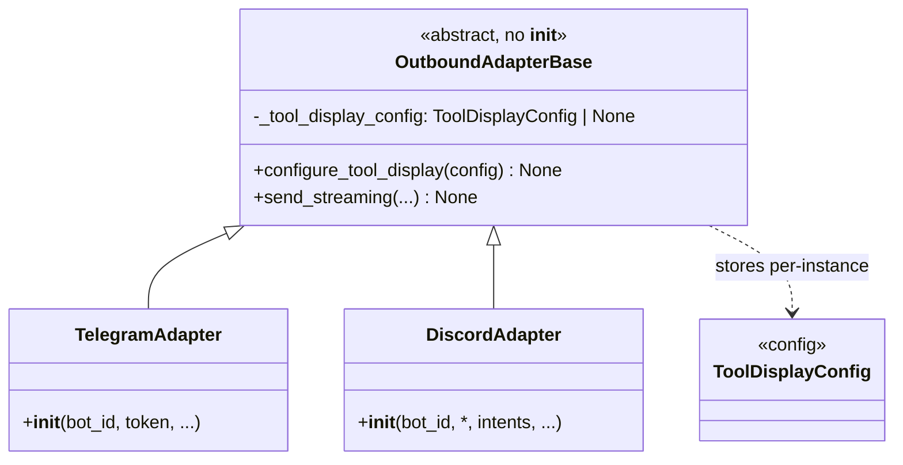
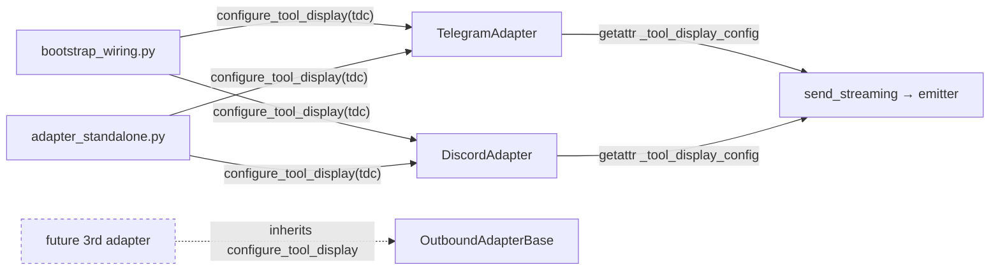

## Context

Source: [frame](../frames/1468-tool-display-config-storage-frame.mdx). Pre-emptive design tracker (#1468) before a 3rd `OutboundAdapterBase` subclass is added.

`tool_display_config` is a **per-instance** (per-bot) value, currently stored via a copy-pasted constructor kwarg + assignment in each adapter dir:

```python
def __init__(self, ..., tool_display_config: ToolDisplayConfig | None = None):
    self._tool_display_config = tool_display_config
```

Duplicated in `adapters/telegram/telegram.py` and `adapters/discord/adapter.py`. `OutboundAdapterBase` (`adapters/shared/_base_outbound.py`) has **no `__init__`** (Discord MRO with `discord.Client`), so a base constructor is forbidden. ADR-073 RC-3 (target-axis-trap) fires at a 3rd sibling dir.

The **read** path is already centralized on the base (`send_streaming`, `_base_outbound.py:70-72`):

```python
emitter.tool_display_config = (
    getattr(self, "_tool_display_config", None) or ToolDisplayConfig()
)
```

Only the **write** (storage) is duplicated.

## Goal

Define the storage write ONCE on `OutboundAdapterBase` via a `configure_tool_display(cfg)` setter, so a future 3rd adapter inherits storage with zero new per-dir code; refactor the 2 existing adapters and their 4 construction sites onto it.

## Users

- **Primary:** Lyra maintainers adding outbound platform adapters — inherit storage, never re-implement it.
- **Secondary:** axial-adr-review / ADR-073 RC-3 — recurring target-axis-trap finding removed.

## Expected Behavior

1. `OutboundAdapterBase` exposes a concrete `configure_tool_display(self, config: ToolDisplayConfig | None) -> None` that assigns `self._tool_display_config = config`. It accepts `None` and stores it as-is — normalization to a default lives **only** in the read path.
2. `TelegramAdapter` / `DiscordAdapter` no longer declare the `tool_display_config` kwarg, the assignment, or the now-unused `ToolDisplayConfig` import.
3. The 4 adapter construction sites build the adapter, then call `adapter.configure_tool_display(<config>)` immediately after instantiation (before the adapter is registered / serves traffic). The redundant `_tdc = … or ToolDisplayConfig()` normalization in `wire_telegram_adapters` / `wire_discord_adapters` is removed — the value is passed straight to the setter.
4. `send_streaming` read path keeps its defensive `getattr(..., None) or ToolDisplayConfig()` — the **sole** default site — so an un-configured adapter (e.g. a unit test that bypasses bootstrap) still defaults correctly.
5. Behavior is identical at runtime: same config value reaches the emitter; no observable change for any platform.
6. The `TelegramAdapter` `super().__init__()` no-op call (`telegram.py:97`) is untouched; the `_base_outbound.py:69` `# Single WRITE site …` comment is clarified to name the emitter-propagation site (it is no longer the only place `tool_display_config` is written, now that the setter exists).

## Data Model & Consumers

### Data structure



### Consumer map



### Consumer summary

| Consumer | Field | When | Status |
|---|---|---|---|
| `bootstrap_wiring.py` `wire_telegram_adapters` / `wire_discord_adapters` (×2) | sets `_tool_display_config` via setter; drops `_tdc` normalization | post-construction, pre-register | this issue |
| `adapter_standalone.py` (×2) | sets `_tool_display_config` via setter | post-construction, pre-register | this issue |
| `send_streaming` (base) | reads `_tool_display_config` (sole default site) | per streamed reply | logic unchanged |
| `wiring_helpers.py` `*WiringDeps(tool_display_config=…)` (×2) | DI field carries config into the wiring layer | construct-time | **kept** — not a construction/storage site; lives in `bootstrap/`, axial-confirmed not drift |
| future 3rd adapter | inherits setter | n/a | future (must require 0 new storage code) |

> **Scope note:** `TelegramWiringDeps.tool_display_config` / `DiscordWiringDeps.tool_display_config` (`bootstrap_wiring.py:52,65`) are intentionally **kept** — they are DI plumbing carrying the config from `wiring_helpers` into the wire-functions, not per-adapter-dir storage. axial-adr-review confirmed they are not axis drift (bootstrap layer, single file, no three-strikes threshold). Removing them is out of scope.

## Breadboard

| ID | Affordance | Handler | Data |
|---|---|---|---|
| N1 | `OutboundAdapterBase.configure_tool_display(config)` | assigns `self._tool_display_config = config` | `ToolDisplayConfig \| None` |
| N2 | `TelegramAdapter.__init__` | drop kwarg + assignment + import | — |
| N3 | `DiscordAdapter.__init__` | drop kwarg + assignment + import | — |
| N4 | 4 construction sites (`wire_telegram_adapters`, `wire_discord_adapters`, `adapter_standalone` ×2) | `adapter.configure_tool_display(<config>)` after instantiation; drop `_tdc` normalization in the two wire-functions | `deps.tool_display_config` / `config_bundle.tool_display` |

Wiring: N1 defines storage → N2/N3 remove duplicated storage → N4 calls N1 at each site (and removes dead `_tdc` default). `send_streaming` read/propagation logic untouched.

## Slices

| # | Slice | Affordances | Demo |
|---|---|---|---|
| 1 | Add setter to base | N1 | `configure_tool_display` exists on base; unit test sets + reads `_tool_display_config` |
| 2 | Refactor both adapters + call sites | N2, N3, N4 | both adapters drop the kwarg; 4 call sites use setter; full suite green, config still reaches emitter |

Slices are sequenced (2 depends on 1) but ship as one PR (F-lite).

## Success Criteria

- [ ] `OutboundAdapterBase.configure_tool_display(config: ToolDisplayConfig | None) -> None` exists, assigns `self._tool_display_config = config`, and stores `None` as-is (no normalization in the setter).
- [ ] `TelegramAdapter.__init__` no longer declares `tool_display_config`; the `ToolDisplayConfig` import is removed from `telegram.py`.
- [ ] `DiscordAdapter.__init__` no longer declares `tool_display_config`; the `ToolDisplayConfig` import is removed from `adapter.py`.
- [ ] All 4 construction sites (`wire_telegram_adapters`, `wire_discord_adapters` in `bootstrap_wiring.py`; `adapter_standalone.py` ×2) call `configure_tool_display(...)` after instantiation.
- [ ] The `_tdc = … or ToolDisplayConfig()` normalization in `wire_telegram_adapters` (`bootstrap_wiring.py:90-93`) and `wire_discord_adapters` (`:169-172`) is removed; `send_streaming`'s `or ToolDisplayConfig()` is the sole default site.
- [ ] `send_streaming` read/propagation **logic** is unchanged (the `_base_outbound.py:69` comment may be reworded to disambiguate the emitter-write site; no behavioral change).
- [ ] No sibling adapter dir (`adapters/telegram/`, `adapters/discord/`) contains a `self._tool_display_config = ...` assignment — grep across `src/lyra/adapters/` returns only `_base_outbound.py`.
- [ ] `uv run pytest` green; `uv run pyright` clean; `uv run ruff check .` clean.
- [ ] `adapters/CLAUDE.md` `OutboundAdapterBase` section names `configure_tool_display` as the single permitted per-instance write point, explicitly noting it is a **post-construction setter, not `__init__`** (so the "do NOT add `__init__`" constraint is not conflated), mirroring the `make_typing_factory` "define once" note.
