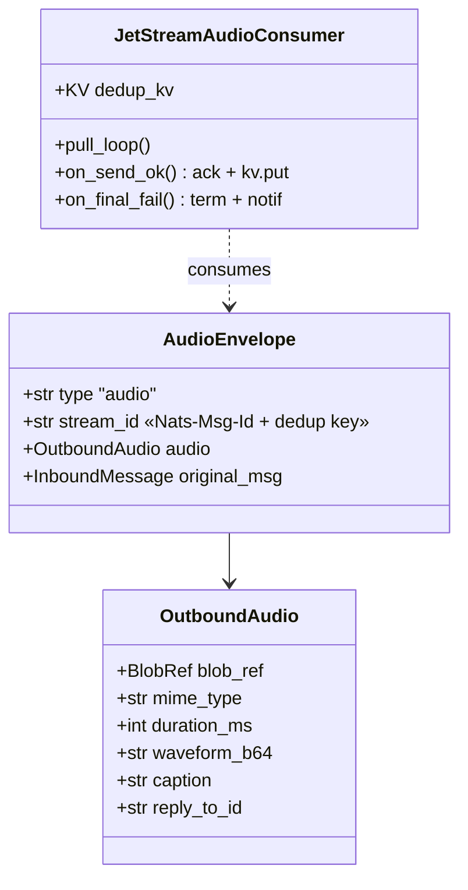
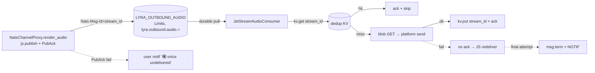

## Context

Promoted from [analysis](../analyses/1482-fiabilite-outbound-audio-analysis.mdx) (Shape 1).
Outbound audio travels hub → core NATS (at-most-once) → adapter → blob GET → platform send.
A subscriber TCP glitch drops the pointer event silently: no audio, no error. The audio
itself is durable (content-addressed in BlobStore); only the tiny `BlobRef` event is lost.

Agreed model (frame): hub does durable-publish-once (`PubAck`), holds **no retry state**;
redelivery is **JetStream-owned**; a durable consumer **acks after send-to-user succeeds**;
terminal failure → explicit user notif.

**Stage-axis placement (ADR-073, from spec review):** the JetStream delivery-guarantee logic
is a *stage* concern, not an *adapter* concern. It is therefore a **new stage module**, not a
second responsibility bolted onto `NatsOutboundListener`. Two pieces are introduced:
- `src/lyra/infrastructure/outbound_audio/stream_setup.py` — `ensure_stream`/`ensure_consumer`
  (mirrors `infrastructure/turn_writer/stream_setup.py`), called once at process bootstrap.
- `JetStreamAudioConsumer` — a dedicated stage class owning the pull loop, KV dedup, ack, and
  term-notif. `NatsOutboundListener` (core-NATS text path) is **untouched**. Bootstrap
  composes both; platform adapters stay thin (receive the bound consumer, no wiring).

## Goal

Every outbound voice either reaches the user OR the user receives an explicit "voice
undelivered" notification — zero silent drops — without making the hub stateful, and without
per-platform duplication of the delivery-guarantee logic.

## Users

- **Primary:** Lyra end users on Telegram/Discord receiving voice replies.
- **Secondary:** hub outbound path (`NatsChannelProxy.render_audio`); the new
  `JetStreamAudioConsumer` stage; ops (redelivery/term/lag observability).

## Expected Behavior

1. Hub synthesizes audio (text already dispatched first, `tts_dispatch.py:189`), PUTs the
   blob, and publishes `OutboundAudio` to `lyra.outbound.audio.{platform}.{bot_id}` via
   **`js.publish` awaiting `PubAck`** with header `Nats-Msg-Id = stream_id`. The JetStream
   context is acquired **once** (cached on the proxy), not per call. Hub keeps no per-message
   state.
2. **If the `PubAck` fails or `js.publish` raises**, the hub does NOT silently swallow it: it
   logs and fires the user "voice undelivered" notif (reusing the existing `_route_outbound`
   TTS-failure path, `tts_dispatch.py:294`). No silent drop at the publish boundary.
3. The `JetStreamAudioConsumer` durable pull consumer pulls the event, checks the **dedup KV**
   for `stream_id`, GETs the blob, sends to the platform, writes `stream_id` to the dedup KV,
   then **acks**. Send success is the only path to ack.
4. Transient failure (TCP glitch, blob GET error, platform 5xx) → no ack → JetStream
   redelivers after `AckWait` with backoff, up to `MaxDeliver` attempts.
5. A redelivery whose `stream_id` is already in the dedup KV (send already succeeded, ack lost
   — **including across an adapter restart**) is acked-and-skipped → no double-send.
6. On the **final** failed attempt the consumer calls **`msg.term()`** and sends a localized
   "🔇 voice undelivered" notif to the user. One notif per terminal failure (debounce is an
   explicit follow-up, see Out of Scope).
7. If the adapter is offline at publish time, the event waits in the stream (Limits, 24h) and
   is delivered on restart. Events older than **24h** age out (stale voice = low value) — this
   is the accepted loss bound; ops are alerted when consumer lag approaches it.
8. Text/image/streaming outbound is **unchanged** — stays on core NATS, at-most-once by design.

## Data Model & Consumers

| Consumer | Fields consumed | When | Status |
|---|---|---|---|
| `JetStreamAudioConsumer` | `audio.blob_ref.store_key`, `original_msg`, `stream_id` | on pull | this issue |
| dedup KV | `stream_id` | before send + after send | this issue |
| terminal/publish-fail notif | `original_msg` (user/chat target) | on `term()` or PubAck fail | this issue |
| ops monitoring | redelivery count, `term()` count, consumer lag | runtime | this issue |
| text/image outbound | (unchanged core-NATS `NatsOutboundListener`) | — | out of scope (by design) |

## Breadboard

### Affordances

| ID | Affordance | Handler | Data |
|----|-----------|---------|------|
| N1 | `OutboundAudioSubjects.audio(platform, bot_id)` | new contract helper in `roxabi-contracts` | `lyra.outbound.audio.{p}.{b}` |
| N2 | `NatsChannelProxy.render_audio` publish | `self._js.publish(subj, payload, headers={"Nats-Msg-Id": stream_id})` await PubAck; `self._js` cached at init | `AudioEnvelope` |
| N2b | publish-fail handling | on PubAck-fail/raise → log + fire notif (N6 path) | — |
| N3 | `infrastructure/outbound_audio/stream_setup.py` | `ensure_stream(js)` + `ensure_consumer(js,p,b)`, idempotent, called at bootstrap | Limits, `lyra.outbound.audio.>`, MaxBytes 32 MiB, MaxAge 24h, dup-window 60s |
| N4 | `JetStreamAudioConsumer` (new stage class) | `js.pull_subscribe` (durable, after ensure) + pull loop; `start()`/`stop()` (loop task cancelled on stop) | AckExplicit, AckWait 90s, MaxDeliver 5, `filter_subject = audio(p,b)` |
| N5 | dedup KV (persistent) | JetStream KV bucket `lyra_outbound_audio_sent`, per-key TTL ≥ AckWait×MaxDeliver+margin; `get` before send, `put` before ack | key `stream_id` |
| N6 | terminal + publish-fail notif | `msg.term()` (consumer) or PubAck-fail (proxy) → `_route_outbound`-style send | localized `_msg("voice_undelivered", …)` |
| N7 | ACL grants (`deploy/nats/acl-matrix.json` → regen `auth.conf`) | see ACL block below | NATS restart |
| N8 | monitoring | metrics: redelivery rate, `term()` count, consumer lag | alerts (below) |

### ACL grants (N7 — exact, from devops review)

- **Hub publish** add: `lyra.outbound.audio.>` (existing `lyra.outbound.{platform}.>` does NOT
  cover the 4-token audio subject). Hub already has `$JS.API.>`.
- **Adapter subscribe** add (telegram + discord): `lyra.outbound.audio.>`.
- **Adapter JetStream API** add (scoped to the stream): `$JS.API.STREAM.{CREATE,INFO,UPDATE}.LYRA_OUTBOUND_AUDIO`,
  `$JS.API.CONSUMER.{CREATE,INFO}.LYRA_OUTBOUND_AUDIO.*`, `$JS.API.CONSUMER.MSG.NEXT.LYRA_OUTBOUND_AUDIO.*`,
  plus KV (`$KV.lyra_outbound_audio_sent.>` and its `$JS.API.*` stream subjects). Adapters
  today have only `$JS.API.CONSUMER.CREATE.*` — insufficient.

### Monitoring alerts (N8)

- `term()` count > 0 over window → alert (a terminal failure occurred).
- consumer lag age approaching MaxAge (24h) → alert (impending stale age-out / silent loss).
- stream usage > 80% of 32 MiB → alert.

### Wiring

N1 → consumed by N2 (publish) + N3/N4 (filter_subject). N2 requires the stream (N3) + hub ACL
(N7) to exist first; N2 failure routes to N6. N3 runs at bootstrap **before** N4 binds. N4
drives the per-message path: N5 read → send → N5 write → ack on success; **final failure only**
→ N6. N2b and N6 share the one notif path. N8 observes N4/N6.

## Slices

| # | Slice | Affordances | Demo (observable) |
|---|-------|------------|-------------------|
| 1 | **Guaranteed delivery + user-visible failure** — durable publish, JS consumer stage, ack-after-send, in-memory dedup, term/publish-fail notif | N1,N2,N2b,N3,N4,N6,N7 | • kill adapter → publish → restart → audio delivered. • TCP glitch → redelivered once, no dup. • force all attempts fail → user gets exactly one "voice undelivered" notif. |
| 2 | **Cross-restart dedup + observability** — persistent KV dedup, monitoring/alerts | N5 (KV), N8 | • succeed-then-lose-ack across adapter restart → KV suppresses second send (no double voice). • terminal failure increments alertable `term()` metric. |

Slice 1 is a complete user-visible fix (P1 symptom closed). Slice 1 uses in-memory dedup
(rare cross-restart double-send possible); Slice 2 makes dedup persistent via KV to close that
residual. MaxDeliver bounds poison messages in both slices (no infinite redelivery).

## Success Criteria

- [ ] Hub publishes audio via `js.publish` awaiting `PubAck` (not `nc.publish`), with the JS
      context cached once on the proxy; publish succeeds and returns even when **no consumer is
      online** (event persisted in stream).
- [ ] `js.publish`/`PubAck` failure is **never silently swallowed** — it logs AND triggers the
      "voice undelivered" notif.
- [ ] TCP glitch mid-delivery → event redelivered within `AckWait` → send succeeds on retry →
      audio delivered exactly once (**no duplicate** to user).
- [ ] Adapter offline < 24h at publish time → on restart the pending audio is consumed and
      delivered; an event older than 24h ages out (accepted bound) and a consumer-lag alert
      fires before that window.
- [ ] In-process lost-ack redelivery → dedup suppresses the second send (Slice 1).
- [ ] Lost-ack redelivery **across an adapter restart** → persistent KV dedup suppresses the
      second send; the user never hears the same voice note twice (Slice 2).
- [ ] All `MaxDeliver` attempts fail → consumer `term()`s AND the user receives exactly one
      "voice undelivered" notif; no silent drop, no infinite redelivery.
- [ ] The JetStream delivery logic lives in `JetStreamAudioConsumer` + `infrastructure/outbound_audio/`,
      composed at bootstrap; `NatsOutboundListener` text/image code paths are unmodified and no
      new JS consumer is created for non-audio subjects.
- [ ] `acl-matrix.json` grants the enumerated hub-publish, adapter-subscribe, adapter-JS-API,
      and KV subjects; the deploy runbook states order ACL→stream→hub→adapter and a rollback path.
- [ ] `term()` count, redelivery rate, and consumer-lag metrics are emitted with the alerts in N8.
- [ ] Tests assert outcomes (not just scenario presence): redelivery-after-glitch delivers
      exactly once; offline-then-restart delivers; in-process + cross-restart dedup each yield
      zero double-send; terminal failure yields exactly one notif.

## Out of Scope (by design)

- Text/image/streaming outbound stay at-most-once (streaming "latest wins" is incompatible with
  redelivery).
- `render_audio_stream` / `render_voice_stream` (dropped over NATS today).
- **Notif debounce/batching** — one notif per terminal failure ships as-is; a per-conversation
  cooldown is a follow-up issue (flagged so a sustained outage's notif volume is a known, not a
  surprise).
- Raising text outbound to JetStream later → extract a shared `JetStreamOutboundConsumer` base,
  do **not** fork the audio impl (REVISIT note, axial review finding 4).

## NEEDS CLARIFICATION

1. `[NEEDS CLARIFICATION]` **Subject naming vs ADR-035** (`lyra.{domain}.{qualifier}`):
   `lyra.outbound.audio.*` adds an axis. Author a short ADR + update outbound CLAUDE.md table —
   confirm whether that ADR is part of this issue or a fast-follow. (Default: include in this issue.)
