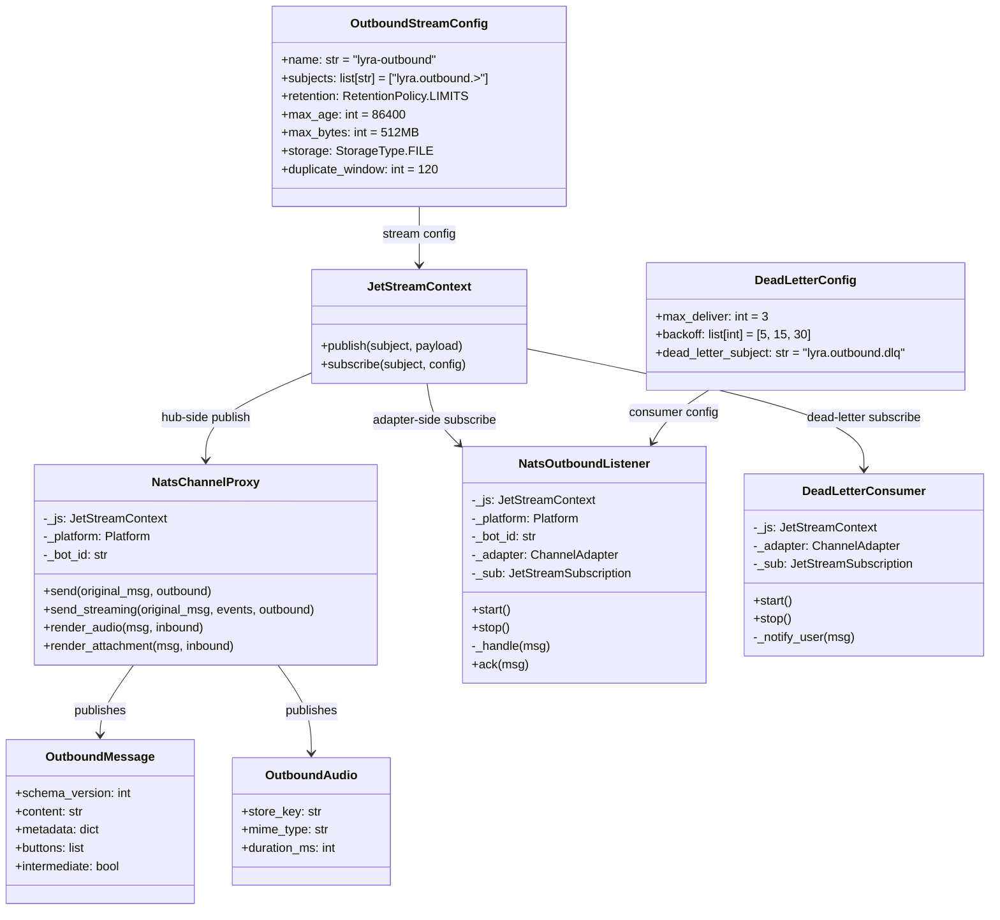
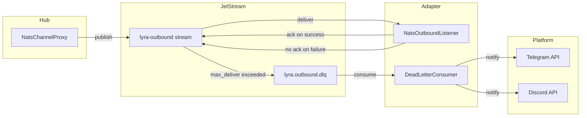

## Context

Derived from [analysis](artifacts/analyses/1482-outbound-audio-reliability-analysis.mdx) — Shape 1 selected: JetStream persistence + explicit ack + retry + dead-letter user notification.

## Goal

Outbound audio (and text/attachment/streaming) delivery is guaranteed via JetStream persistence with explicit adapter ack. User receives a notification if delivery fails after all retries.

## Users

- **U1 — End user (Telegram/Discord):** Receives audio responses or a text fallback notification on final delivery failure.
- **U2 — Hub operator:** Monitors delivery success rate, retry count, dead-letter volume via logs/metrics.

## Expected Behavior

1. Hub generates an outbound audio/text message.
2. `NatsChannelProxy` publishes to JetStream `lyra-outbound` stream (subject: `lyra.outbound.{platform}.{bot_id}`).
3. JetStream persists the message and waits for adapter ack.
4. Adapter (`NatsOutboundListener`) receives the message via JetStream subscription with `manual_ack`.
5. Adapter processes the message (deserializes, dispatches to platform API).
6. On successful platform API call, adapter acks the JetStream message.
7. On platform API failure, adapter does NOT ack — JetStream redelivers after a delay.
8. After `max_deliver` (default 3) exhausted, JetStream routes the message to a dead-letter subject.
9. `DeadLetterConsumer` receives the dead-letter message and sends a user-facing failure notification via the platform adapter.
10. User sees either the original audio/text or a notification: "⚠️ Message delivery failed after retries."

## Data Model & Consumers

### classDiagram



### Consumer Map



### Consumer Summary

| Consumer | Data | When | Status |
|----------|------|------|--------|
| NatsChannelProxy | OutboundMessage, OutboundAudio, OutboundAttachment | On hub response generation | This issue |
| NatsOutboundListener | Envelope (send, audio, attachment, stream chunk) | On JetStream delivery | This issue |
| DeadLetterConsumer | Original envelope + delivery metadata | On max_deliver exceeded | This issue |
| Platform API (Telegram/Discord) | Final formatted text/audio bytes | On adapter dispatch | This issue |

## Breadboard

### Affordance Table

| ID | Affordance | Type | Handler | Data |
|----|-----------|------|---------|------|
| U1 | Receive audio/text response | Platform UI | Telegram/Discord API | OutboundMessage, OutboundAudio |
| U1 | Receive failure notification | Platform UI | Telegram/Discord API | Failure message text |
| U2 | View delivery metrics | Logs/Metrics | JetStream metrics | delivery_count, retry_count, dlq_count |
| N1 | `lyra-outbound` stream | JetStream stream | `bootstrap_streams.py` | StreamConfig |
| N2 | `NatsChannelProxy` publish | JetStream publish | `nats_channel_proxy.py` | js.publish() |
| N3 | `NatsOutboundListener` subscribe | JetStream subscribe | `nats_outbound_listener.py` | js.subscribe() + manual_ack |
| N4 | `DeadLetterConsumer` | JetStream subscribe | `dead_letter_consumer.py` | js.subscribe() on dlq subject |
| S1 | Stream bootstrap | Config | `bootstrap_streams.py` | OutboundStreamConfig |
| S2 | Telegram failure notification | Send message | `telegram_outbound.py` | send_failure_notification() |
| S3 | Discord failure notification | Send message | `discord_outbound.py` | send_failure_notification() |

### Wiring

```
Hub
  └── NatsChannelProxy
        └── js.publish("lyra.outbound.{platform}.{bot_id}")
              └── JetStream: lyra-outbound stream
                    └── js.subscribe(manual_ack, max_deliver=3)
                          └── NatsOutboundListener
                                ├── handle_send → TelegramAdapter.send() → ack()
                                ├── handle_audio → TelegramAdapter.render_audio() → ack()
                                ├── handle_attachment → TelegramAdapter.render_attachment() → ack()
                                └── handle_chunk → _drain_stream → send_streaming() → ack()
                    └── (max_deliver exceeded)
                          └── js.publish("lyra.outbound.dlq")
                                └── DeadLetterConsumer
                                      ├── TelegramAdapter.send_failure_notification()
                                      └── DiscordAdapter.send_failure_notification()
```

## Slices

| # | Slice | Vertical | Files | Demo | AC Ref |
|---|-------|----------|-------|------|--------|
| 1 | JetStream stream + hub publish | Hub-side persistence | `bootstrap_streams.py`, `nats_channel_proxy.py`, `wiring_helpers.py` | Hub boots, publishes to JetStream, message persists | AC-1, AC-2 |
| 2 | Adapter subscribe + manual ack | Adapter-side delivery | `nats_outbound_listener.py`, `nats_envelope_handlers.py`, `wiring_helpers.py` | Adapter receives, processes, acks. No ack = redelivery | AC-3, AC-4, AC-5 |
| 3 | Dead-letter + user notification | End-to-end reliability | `dead_letter_consumer.py`, `telegram_outbound.py`, `discord_outbound.py`, `error_handler.py` | Max-deliver exceeded → user gets failure notification | AC-6, AC-7, AC-8 |

### Slice 1 Detail

- Add `lyra-outbound` stream to `bootstrap_streams.py`
- Switch `NatsChannelProxy` from `nc.publish()` to `js.publish()` for all outbound types
- Update `wiring_helpers.py` to inject `JetStreamContext` into `NatsChannelProxy`
- Backward compatibility: dual-publish mode (core NATS + JetStream) during migration

### Slice 2 Detail

- Switch `NatsOutboundListener` from `nc.subscribe()` to `js.subscribe()` with `manual_ack`
- Add `msg.ack()` calls in `handle_send`, `handle_audio`, `handle_attachment`, `handle_chunk` after successful adapter dispatch
- Add `msg.nak()` (or no-ack) on adapter dispatch failure
- Streaming: ack the terminal `stream_end` chunk or ack per-batch

### Slice 3 Detail

- Add `DeadLetterConsumer` class subscribing to `lyra.outbound.dlq`
- Add `send_failure_notification()` to `telegram_outbound.py` and `discord_outbound.py`
- Wire `DeadLetterConsumer` into bootstrap
- Add user-facing message text: "⚠️ Message delivery failed after retries. Please try again."

## Success Criteria

- [ ] AC-1: `lyra-outbound` JetStream stream exists with subjects `lyra.outbound.>`
- [ ] AC-2: Hub publishes outbound messages via `js.publish()` and awaits PubAck
- [ ] AC-3: Adapter subscribes via `js.subscribe()` with `manual_ack=True`
- [ ] AC-4: Adapter acks message after successful platform API dispatch
- [ ] AC-5: Adapter does not ack on platform API failure; JetStream redelivers with backoff
- [ ] AC-6: After `max_deliver=3` exhausted, message routes to `lyra.outbound.dlq`
- [ ] AC-7: `DeadLetterConsumer` sends user-facing failure notification on Telegram
- [ ] AC-8: `DeadLetterConsumer` sends user-facing failure notification on Discord
- [ ] AC-9: All envelope types covered: `send`, `audio`, `attachment`, `stream_start`, `chunk`, `stream_end`
- [ ] AC-10: Backward compatibility: old adapters (core NATS subscribe) still receive messages during migration
- [ ] AC-11: No regression in existing streaming behavior (placeholder, edits, tool recap, reasoning)
- [ ] AC-12: Delivery metrics exposed: success_count, retry_count, dlq_count per platform

## Edge Cases

| Case | Handling |
|------|----------|
| Streaming: adapter crashes mid-stream | Unacknowledged chunks redelivered; adapter deduplicates by `stream_id` + `seq` |
| Streaming: partial success (some chunks rendered) | Per-chunk ack is complex; use batch-ack on `stream_end` with `nak()` on failure |
| Dual-publish migration window | Hub publishes to both core NATS and JetStream for 1 deploy cycle; adapters consume whichever they support |
| DeadLetterConsumer failure | Log and drop; do not infinite-loop (dead-letter consumer must NOT produce dead-letters) |
| Telegram/Discord API rate limit on notification | `send_failure_notification` uses `send_with_retry` or `guard` with backoff; on final failure, log only |
| BlobStore fetch failure during audio render | `render_audio` raises → `handle_audio` catches → `nak()` → JetStream redelivers |
| Schema version mismatch | Existing behavior: drop + log. No change. |
