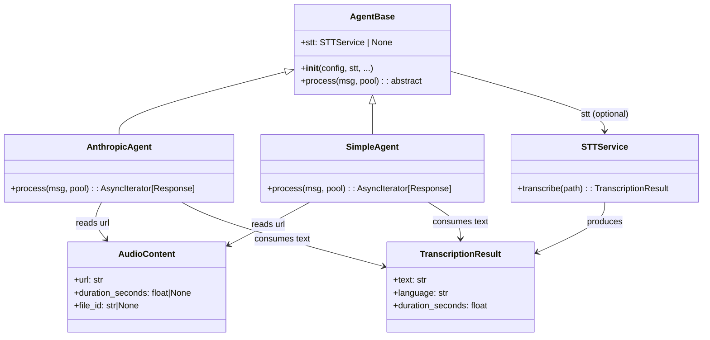
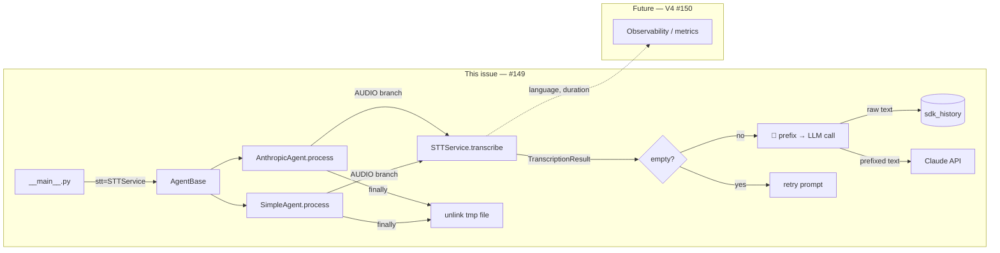

## Context

Sub-issue of #80 (voice STT epic). V1 (Telegram adapter → `MessageType.AUDIO`) and V2 (`STTService` + `STTConfig`, faster-whisper) are merged. Agents currently ignore `AUDIO`-typed messages entirely — `AnthropicAgent` and `SimpleAgent` have no AUDIO branch, `AgentBase` has no `stt` slot, and `__main__.py` does not instantiate `STTService`.

This spec covers V3: wire `STTService` into both agents, handle the AUDIO message type, and guarantee temp file cleanup per ADR-013.

See also: `docs/architecture/adr/013-media-temp-file-lifecycle-ownership.mdx` — temp file cleanup owned by the agent, not `STTService`.

## Goal

When an `AUDIO` message reaches an agent, it transcribes the audio via `STTService`, constructs a grounded LLM prompt, and replies with text — deleting the temp file in all paths.

## Users

- **Primary:** Lyra users who send Telegram voice messages — they receive a natural text reply without invoking `/transcribe`.
- **Secondary:** Future agent authors — `AgentBase.stt: STTService | None` establishes the DI pattern for any new agent type.

## Expected Behavior

1. `__main__.py` instantiates `STTService` at startup if `STT_MODEL_SIZE` env var is present (or `STT_DEVICE` / `STT_COMPUTE_TYPE`). `STTConfig.validate()` is called before the service is constructed; invalid config raises `SystemExit`.
2. `STTService` (or `None`) is passed into `AgentBase.__init__` as `stt=`.
3. When `process()` receives a `Message(type=AUDIO)`, it enters the AUDIO branch:
   - Calls `stt.transcribe(audio_content.url)` inside a `try/finally`.
   - `finally` always unlinks the temp file at `audio_content.url` via `Path(url).unlink(missing_ok=True)` — safe if the file was already removed.
4. **Empty transcript** (`TranscriptionResult.text == ""` or only Whisper noise tokens): agent returns a localised retry prompt (`"I couldn't make out your voice message, please try again."`). Temp file still deleted in `finally`.
5. **Non-empty transcript**: agent prepends `"🎤 [transcribed]: "` to form the LLM call text. The raw transcript (without prefix) is used for history storage — prefix is never persisted to `sdk_history` / conversation history.
6. **Transcription exception**: agent returns a localised error reply (`"Sorry, I couldn't transcribe your voice message."`). Temp file still deleted in `finally`.
7. When `stt is None` and an `AUDIO` message arrives: agent returns `"Voice messages are not supported — STT is not configured."` and deletes the temp file.

> **Return semantics per agent type:** `AnthropicAgent.process()` is an async generator — early exit uses `yield REPLY; return`. `SimpleAgent.process()` returns a `Response` dataclass — early exit uses `return Response(content=REPLY)`. The `finally` block runs correctly in both cases (async generator `return` raises `StopAsyncIteration` internally, `finally` still executes).

## Data Model & Consumers





| Consumer | Fields consumed | When | Status |
|----------|----------------|------|--------|
| `AnthropicAgent` | `AudioContent.url` → `TranscriptionResult.text` | AUDIO message | This issue |
| `SimpleAgent` | `AudioContent.url` → `TranscriptionResult.text` | AUDIO message | This issue |
| `AgentBase` | `stt: STTService \| None` | Injected at init from `__main__` | This issue |
| Observability (V4 #150) | `TranscriptionResult.language`, `.duration_seconds` | Post-transcription logging | Future |

## Breadboard

### Affordances

| ID | Affordance | Handler | Data in | Data out |
|----|-----------|---------|---------|---------|
| N1 | STT startup wiring | `__main__.py` | env vars | `STTService` instance (or `None`) |
| N2 | STT DI slot | `AgentBase.__init__(stt=)` | `STTService \| None` | stored as `self.stt` |
| N3 | AUDIO branch entry | `Agent.process()` | `Message.type == AUDIO` | enters transcription path |
| N4 | Transcription call | `stt.transcribe(path)` | `AudioContent.url` | `TranscriptionResult` |
| N5 | Empty/noise check | `Agent.process()` | `TranscriptionResult.text` | retry prompt ∨ continue |
| N6 | Grounding prefix | `Agent.process()` | `TranscriptionResult.text` | prefixed LLM text, raw history text |
| N7 | LLM call (text) | `AnthropicAgent` / `SimpleAgent` pipeline | prefixed transcript | text reply |
| E1 | Transcription exception | `except` in AUDIO branch | exception | error reply |
| E2 | STT not configured | `stt is None` check | — | unsupported reply |
| C1 | Temp file cleanup | `finally` block (ADR-013) | `AudioContent.url` | file unlinked |

### Wiring

```
N1 → N2 (startup)
Message(AUDIO) → N3 → N4 → N5 → N6 → N7
                              ↓ (empty/noise)
                              E1 (retry prompt)
                       ↓ (exception)
                       E1 (error reply)
       N3 → E2 (stt is None)
C1 (always, in agent finally — covers N4, E1, E2)
```

## Slices

| # | Name | Affordances | Deliverable |
|---|------|-------------|-------------|
| T3.1 | `AgentBase.stt` slot | N2 | `AgentBase.__init__` accepts `stt: STTService \| None = None`; both concrete agents updated; existing tests green |
| T3.2 | `AnthropicAgent` AUDIO branch | N3, N4, N5, N6, N7, E1, E2, C1 | `process()` handles `AUDIO` with transcription, prefix, cleanup, and error paths |
| T3.3 | `SimpleAgent` AUDIO branch | N3, N4, N5, N6, E1, E2, C1 | Same as T3.2 for `SimpleAgent` |
| T3.4 | `__main__.py` wiring | N1 | `STTService` instantiated from env vars at startup; `STTConfig.validate()` is called inside `STTService.__init__()` and raises `ValueError` — `__main__.py` must catch `ValueError` and convert to `SystemExit` before agents start; `stt=` passed into agents |
| T3.5 | Integration tests | all | `tests/agents/test_anthropic_agent.py` + `test_simple_agent.py`: 4 paths × 2 agents (success, empty, exception, no-STT); plus invalid-config `SystemExit` test in `tests/test_main.py` |

## Success Criteria

- [ ] `AgentBase.__init__` accepts `stt: STTService | None = None`; both `AnthropicAgent` and `SimpleAgent` pass it to `super().__init__`
- [ ] Voice message → LLM text reply (end-to-end, no `/transcribe` command)
- [ ] Grounding prefix `"🎤 [transcribed]: "` is present in the text passed to the LLM call
- [ ] Grounding prefix is absent from `pool.sdk_history` (raw transcript stored)
- [ ] Empty or noise-only transcript → retry prompt, not crash or empty reply
- [ ] Transcription exception → localised error reply, not crash
- [ ] Temp file is unlinked in all paths: success, empty transcript, exception, no-STT — verified by test asserting file does not exist after `process()` returns; cleanup uses `Path(url).unlink(missing_ok=True)` so no `FileNotFoundError` if file was already removed
- [ ] When `stt is None` and `AUDIO` message arrives → unsupported reply; temp file still deleted
- [ ] `__main__.py` instantiates `STTService` from env vars; `STTConfig.validate()` called at startup
- [ ] Invalid config (`float16` + `cpu`) causes `SystemExit` before agents start — tested in `tests/test_main.py`
- [ ] Non-AUDIO messages (text, images) are unaffected — no regression
- [ ] All 4 paths covered by integration tests for both `AnthropicAgent` and `SimpleAgent`
