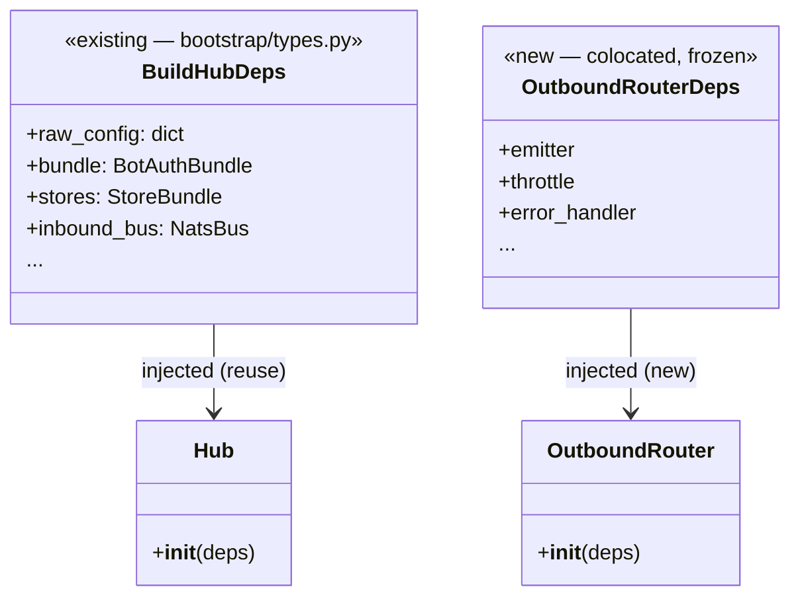

## Context

Source: [frame](../frames/1494-migrate-adapters-core-wiring-deps-frame.mdx). Issue #1494 (Phase 6 / #1283 follow-up).
`src/lyra/` carries **47** `DEBT:wiring-bootstrap-deps` markers; Phase-6 ratchet target is **≤30**. Reading all 47 sites (noqa code + inline rationale) shows they are **not** homogeneous — only a subset is real argument-list wiring debt.

## Goal

Drive `DEBT:wiring-bootstrap-deps` in `src/lyra/` from **47 → ≤30** by collapsing **genuine `PLR0913` multi-collaborator** functions into a single injected deps object — reusing a Phase-6 container where it fits, else a minimal colocated frozen dataclass — while **excluding** `C901`-complexity and Port/Protocol-contract sites. Behaviour-preserving.

## Users

- **Primary:** Lyra maintainers extending `core/` + `adapters/` wiring (a new collaborator becomes one dataclass field, not another positional arg).
- **Secondary:** Phase-6 DI epic #1283 — ratchet criterion closes once count ≤30.

## Expected Behavior

No runtime/behavioural change. The dev-facing change, per target site:

```
fn(a, b, c, d, e, f)  # noqa: PLR0913 — DEBT:wiring-bootstrap-deps
        │
        ▼
@dataclass(frozen=True)
class XxxDeps: a; b; c; d; e; f          # reuse Phase-6 container if fields match, else colocate new
fn(deps: XxxDeps)                         # marker + noqa removed; ruff green without them
        │
        ▼
all call-sites construct XxxDeps(...) and pass it
```

**Exclusions (markers left in place, by design):**
- **Category B — `C901`** (cyclomatic complexity, not args): `core/pool/pool_processor.py:36`, `core/tts_dispatch.py:172` (C901 half), `adapters/discord/discord_audio.py:132`, `adapters/telegram/telegram_normalize.py:63`, `outbound/emitter.py:275`. Collapsing args cannot clear `C901`.
- **Category C — Port/Protocol signatures** (collapsing changes the contract across all implementors): `core/ports/llm.py:49`, `core/ports/resume_publisher.py:17`, `core/cli/cli_streaming.py:32,177`, `core/cli/cli_non_streaming.py:19`.

## Data Model & Consumers

Deps-object pattern (representative — `Hub` reusing the existing Phase-6 container vs a new colocated object):



**Site → target mapping (consumer summary):**

| Group | Sites | Target deps object | Reuse / New |
|---|---|---|---|
| Hub + outbound | `hub.py:67`, `outbound_router.py:55`, `middleware_pool.py:176` | `BuildHubDeps` (reuse if fields cover) / colocated | mixed |
| Pool | `pool.py:32`, `cli_pool.py:69`, `pool_observer.py:106`, `pool_processor_streaming.py:53` | colocated `*Deps` | new |
| Agent | `agent.py:46`, `agent_builder.py:181` | `CreateAgentDeps`/`ResolveAgentsDeps` (reuse if fit) / colocated | mixed |
| Auth | `authenticator.py:41,245` | colocated `AuthenticatorDeps` | new |
| Commands | `command_router.py:46`, `builtin_commands.py:42,107` | colocated `CommandContext` | new |
| Adapters | discord `adapter.py:86`/`discord_normalize.py:26`/`discord_threads.py:45`/`discord_inbound.py:100`; telegram `telegram.py:86`/`telegram_normalize.py:37`; `adapters/shared/_shared.py:67`; `adapters/nats/nats_outbound_listener.py:42` | colocated `*Deps` / reuse `WireAdaptersDeps` where fit | mixed |
| **Reserve (Category D, genuine PLR0913)** | `llm/decorators.py`×4, `nats/`×2, `integrations/`×2 | colocated `*Deps` | new |

## Breadboard

| ID | Affordance (site) | Handler | Removes |
|---|---|---|---|
| A1 | adapters/ Category-A sites (~8) | collapse → `*Deps`, update callers | ~8 markers |
| A2 | core/ Category-A sites (~14) | collapse → `*Deps`/reuse, update callers | ~14 markers |
| A3 | Category-D reserve (llm/nats/integrations, ~8) | collapse only if A1+A2 leave count >30 | margin |

## Slices

| Slice | Scope | Sites | Stop condition |
|---|---|---|---|
| **S1** | `adapters/` Category-A (A1) | discord ×4, telegram ×2, shared, nats-listener | all adapters/ A-markers cleared; ruff+pytest green |
| **S2** | `core/` Category-A (A2) | hub/pool/agent/auth/commands constructors+builders | `grep` count ≤30 reached |
| **S3** | Category-D reserve (A3) — *conditional* | llm/decorators, nats, integrations | only if after S1+S2 count >30; stop at ≤28 (margin) |

Order **S1 → S2 → (S3 if needed)**; re-grep count after each. If file-count balloons past F-lite band → ship S1 and S2 as separate PRs (frame caveat).

## Success Criteria

- [ ] `grep -rho "DEBT:wiring-bootstrap-deps" src/lyra/ | wc -l` ≤ 30
- [ ] every collapsed site has its `# noqa: PLR0913` removed **and** `uv run ruff check src/lyra/` is green (no re-added `PLR0913`) — proves real signature-collapse, not comment deletion
- [ ] the 5 Category-C Port/Protocol signatures are unchanged (contracts intact); the 5 Category-B `C901` markers are left untouched (not stripped without a real refactor)
- [ ] `uv run pytest` green (behaviour preserved)
- [ ] `uv run pyright` clean **and** `uv run lint-imports` (import-linter) passes
- [ ] `uv run ruff format --check .` clean; file ≤300-line / folder ≤12-file gates pass
- [ ] any new deps object is a **frozen** dataclass **colocated** with its constructor (no new parallel *wiring* container; reuse a Phase-6 container where its fields fit)

## Risks

| Risk | Mitigation |
|---|---|
| ≤30 marginal from A alone (~22 candidates, several "distinct dep" rationales may resist) | S3 reserve (Category D, ~8 genuine PLR0913) provides margin; stop at ≤28 |
| Pushing a Phase-6 container into a domain constructor leaks bootstrap types into `core/` (layer break) | prefer a colocated minimal dataclass; reuse only when the container already lives at/above the consumer's layer (import-linter gate catches violations) |
| Signature change fan-out across call-sites | file-group-scoped slices; pyright + pytest catch missed callers |
| Constructing deps at call-site grows a file >300 lines | extract a small factory helper |
| Temptation to strip B/C markers to hit the number (#1162 trap) | AC explicitly forbids; B/C left in count — ≤30 must come from real A/D collapses |
