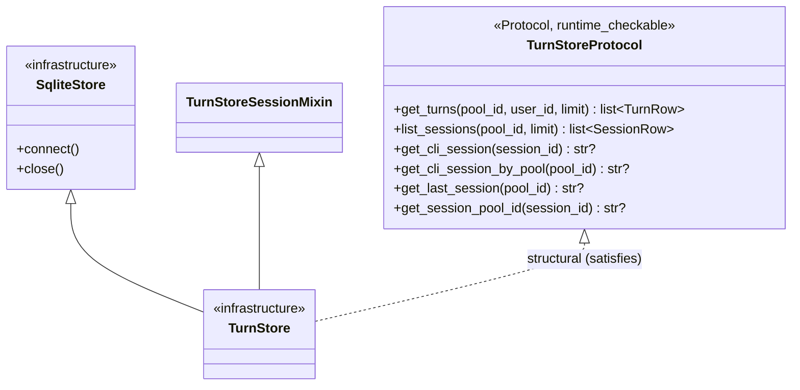
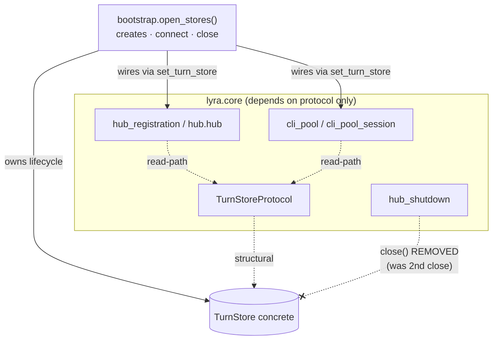

## Context

Source: `artifacts/frames/1506-widen-turnstore-wiring-protocol-frame.mdx` (approved).
Closes the ADR-078 residue: 5 `lyra.core.* -> lyra.infrastructure.stores.turn_store`
TYPE_CHECKING exemptions in `.importlinter` (lines 42–46), tagged
`DEBT:importlinter-adr048-transition`.

## Goal

Remove all 5 turn_store layering exemptions by making every `lyra.core` consumer depend on
the read-path `TurnStoreProtocol` and relocating the store's `close()` to its sole rightful
owner — the bootstrap layer.

## Users

- **Primary:** Lyra core maintainers (own the import-linter gate + `core/CLAUDE.md` layering contract).
- **Secondary:** Future alternative `TurnStore` implementors (in-memory test stub, NATS-backed) — uniform protocol dependency makes the store swappable.

## Expected Behavior

1. `Hub` and `CliPool` continue to read turns through the same methods (`get_turns`,
   `get_cli_session`, `get_cli_session_by_pool`, …) — now typed against `TurnStoreProtocol`.
2. On shutdown the turn store is closed **exactly once**, by `open_stores()`'s `finally`
   block — unchanged externally; the hub no longer issues a second close.
3. `lint-imports` passes with zero turn_store exemptions in `.importlinter`.
4. No runtime behavior change observable to adapters or users.

## Data Model & Consumers

### Type relationship

`close()` lives on `SqliteStore` (infrastructure) and is intentionally **absent** from the
read-path protocol — lifecycle is not a core concern.

### Consumer map

### Consumer summary

| Consumer | Methods used | Typed as (after) | Exemption | Status |
|---|---|---|---|---|
| `hub_registration` | `set_turn_store` wiring → `register_turn_store` | `TurnStoreProtocol` | line 43 removed | this issue |
| `hub.hub` | field declaration only (0 calls) | `TurnStoreProtocol` | line 42 removed | this issue |
| `cli_pool` | `get_cli_session`, `get_cli_session_by_pool` | `TurnStoreProtocol` | line 45 removed | this issue |
| `cli_pool_session` | `set_turn_store` wiring | `TurnStoreProtocol` | line 46 removed | this issue |
| `hub_shutdown` | `close()` → **deleted** | (no turn_store ref) | line 44 removed | this issue |
| `bootstrap.open_stores` | `connect`, `close` (lifecycle) | concrete `TurnStore` | n/a (infra layer) | unchanged |
| `pool` / `pool_observer` | read-path | `TurnStoreProtocol` | n/a | done (#1079) |

## Breadboard

| ID | Affordance (site) | Wiring / handler | Data |
|---|---|---|---|
| N1 | `hub_registration.set_turn_store(store)` | retype param + `_turn_store` field → `TurnStoreProtocol`; forwards to `pool._observer.register_turn_store(store)` (already protocol) | protocol ref |
| N2 | `hub.hub` `self._turn_store` field decl | retype `TurnStoreProtocol | None`; drop concrete import | annotation only |
| N3 | `cli_pool_session.set_turn_store(store)` | retype param + `_turn_store` field → `TurnStoreProtocol` | protocol ref |
| N4 | `cli_pool` `_turn_store` field + read calls | retype field → `TurnStoreProtocol`; calls already protocol methods | protocol ref |
| N5 | `hub_shutdown.shutdown()` | **delete** `if self._turn_store is not None: await self._turn_store.close()`; drop concrete import; drop field annotation if now unused | none |
| N6 | `.importlinter` lines 42–46 | remove all 5 turn_store `ignore_imports`; `lint-imports` proves unused | config |
| N7 | ADR-078 Consequences | flip "5 exemptions remain, tracked separately" → eliminated; add lifecycle-ownership note | docs |

## Slices

| # | Slice | Affordances | Independently demoable |
|---|---|---|---|
| S1 | Retype read-path consumers + drop their imports + drop their 4 exemptions | N1, N2, N3, N4, N6 (lines 42,43,45,46) | `lint-imports` green; pyright green; no behavior change |
| S2 | Delete redundant `hub_shutdown` close + drop import + drop 5th exemption | N5, N6 (line 44) | `lint-imports` green; test asserts store closed exactly once on shutdown |
| S3 | Discharge ADR-078 | N7 | doc reflects zero exemptions + ownership rule |

## Out of Scope — Surviving exemptions (pre-existing ADR-048 debt)

This PR makes the **turn_store** dimension fully uniform (0 residue). It does **not** make
`hub.hub` / `hub_registration` / `hub_shutdown` protocol-clean overall — they retain
concrete-infra references to *other* stores with no protocol extracted yet. These
exemptions are neither introduced nor removed here (EXPECTED_DEBT per ADR-073); listed so a
reviewer does not misread S2 as "hub_shutdown fully clean":

| Module | Surviving `.importlinter` exemptions (other stores) |
|---|---|
| `hub.hub` | `identity_alias_store`, `message_index`, `pairing`, `prefs_store` |
| `hub_registration` | `identity_alias_store`, `message_index` |
| `hub_shutdown` | `message_index` (import + `_message_index.close()` — same redundant-close pattern, deferred with the sibling follow-up) |
| `memory.memory` | `identity_alias_store` |

After S2, `hub_shutdown` is **partially** cleaned: turn_store ref gone, but it still imports
+ closes `message_index`. Each surviving store awaits its own `*StoreProtocol` extraction.

## Success Criteria

- [ ] `grep -E 'turn_store' .importlinter` returns **0** lines inside the `ignore_imports` block.
- [ ] `uv run lint-imports` exits 0.
- [ ] `uv run pyright` exits 0 (structural compatibility holds at bootstrap wiring sites).
- [ ] No `lyra.core.*` module imports `lyra.infrastructure.stores.turn_store` (verified by grep + import-linter).
- [ ] `hub_shutdown.shutdown()` no longer calls `_turn_store.close()`; a test asserts the turn store is closed exactly once across a full bootstrap→shutdown cycle (closed by `open_stores`, not double-closed).
- [ ] `TurnStoreProtocol` is unchanged — no `close()`/lifecycle method added.
- [ ] ADR-078 Consequences section states the exemptions are eliminated and documents bootstrap as the lifecycle owner.
- [ ] `uv run pytest` passes (no shutdown/teardown regression).

## Edge Cases

| Edge | Handling |
|---|---|
| A hub mode closes turn store ONLY via `hub_shutdown` (not `open_stores`) | Verified none: `hub_standalone.py:82` + `unified.py:54` both wrap in `open_stores`; adapters (`standalone_telegram/discord`) create + close their own. Test covers the standalone hub path. |
| `close()` is idempotent → removal "harmless" either way | Removal still required: the goal is the layering boundary, not just avoiding double-close. |
| Future core code needs a write/lifecycle method | Out of scope; would be a separate protocol decision, not a read-path protocol change. |
