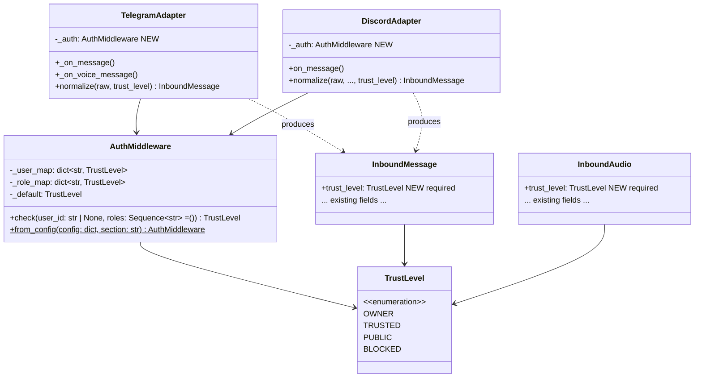
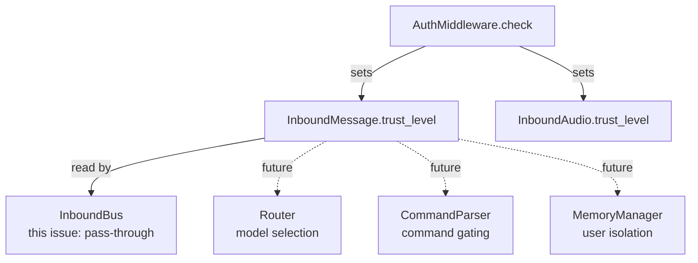

## Context

**Promoted from:** [AuthMiddleware analysis](../analyses/151-auth-middleware-trust-level-analysis.mdx)

Shape selected: **Shape 2 — AuthMiddleware class** (centralized, injected, testable).

The hub delegates authentication to adapters (`hub.py:register_adapter()`: *"The adapter is responsible for authenticating"*). Today no adapter enforces this — any Telegram or Discord user can trigger LLM calls. The existing `trust: Literal["user", "system"]` on `InboundMessage` is an internal marker (system vs user origin) with no authorization value.

## Goal

Reject unauthorized inbound messages at the adapter layer — before `normalize()` and before the InboundBus — with zero resource consumption for blocked users. Authorized messages carry a `TrustLevel` propagated downstream for future routing and command gating.

## Users &amp; Use Cases

- **Mickael (owner)** — sole authorized user in production. Auth ensures no external party triggers LLM calls via Telegram or Discord.
- **Lyra architecture (downstream)** — `TrustLevel` on inbound envelopes is consumed by future issues: model routing, command gating, memory isolation.

## Expected Behavior

### Happy path

1. `lyra.toml` defines `[auth.telegram]` and `[auth.discord]` sections:
   ```toml
   [auth.telegram]
   owner_users   = ["7377831990"]
   trusted_users = ["7377831990"]
   default       = "blocked"

   [auth.discord]
   owner_users   = ["123456789"]
   trusted_users = []
   trusted_roles = ["admin", "trusted"]
   default       = "blocked"
   ```
2. At startup, `__main__.py` calls `AuthMiddleware.from_config(raw, "telegram")` and `AuthMiddleware.from_config(raw, "discord")`, injecting instances into each adapter constructor.
3. When a message arrives at `TelegramAdapter._on_message()`, `_on_voice_message()`, or `DiscordAdapter.on_message()`, the adapter calls `self._auth.check(user_id)` (and optionally `roles` for Discord) **before** calling `normalize()`.
4. If `TrustLevel.BLOCKED`: handler returns immediately. `normalize()` is never called. A structured log line is emitted: `auth_reject user=X channel=Y`.
5. If not BLOCKED: `normalize()` and `normalize_audio()` receive `trust_level` as a parameter, producing `InboundMessage` / `InboundAudio` with the field set.
6. `TrustLevel.OWNER` and `TrustLevel.TRUSTED` are treated identically for now (differentiation is future work).

### Edge cases

| Scenario | Behavior |
|----------|----------|
| Missing `[auth.telegram]` or `[auth.discord]` at startup | `SystemExit` with message: `"Missing [auth.{section}] in lyra.toml — auth config required for networked adapters"` |
| Missing `[auth.cli]` section | Return fixed-OWNER middleware (CLI is always local/trusted) |
| Missing `lyra.toml` entirely | `_load_raw_config()` returns `{}` → missing auth sections → `SystemExit` |
| Invalid `default` value (e.g. `"open"`) | `SystemExit` with message: `"Invalid default '{value}' in [auth.{section}] — must be one of: owner, trusted, public, blocked"` |
| `user_id` is `None` (e.g. Telegram service message) | `check()` returns `self._default` |
| Discord DM (author is `User`, not `Member`) | Role check skipped — falls back to user ID lookup then `_default` |
| Discord guild message with matching role | `trusted_roles` match → highest matching trust level returned |

## Data Model &amp; Consumers





| Consumer | Field(s) consumed | When | Status |
|----------|------------------|------|--------|
| `TelegramAdapter._on_message()` | `TrustLevel` via `check()` | Inbound gate | **This issue** |
| `TelegramAdapter._on_voice_message()` | `TrustLevel` via `check()` | Inbound gate | **This issue** |
| `DiscordAdapter.on_message()` | `TrustLevel` via `check()` | Inbound gate | **This issue** |
| `normalize()` / `normalize_audio()` | `trust_level` param | Construction | **This issue** |
| Router / CommandParser | `msg.trust_level` | Command gating | Future |
| MemoryManager | `msg.trust_level` | User isolation | Future |

## Breadboard

### N1 — TrustLevel enum + AuthMiddleware

| ID | Element | Handler | Data |
|----|---------|---------|------|
| N1a | `TrustLevel(str, Enum)` | — | OWNER, TRUSTED, PUBLIC, BLOCKED |
| N1b | `AuthMiddleware.__init__(user_map, role_map, default)` | Constructor | `dict[str, TrustLevel]`, `dict[str, TrustLevel]`, `TrustLevel` |
| N1c | `auth.check(user_id, roles=())` | Lookup `_user_map` first (highest wins), then `_role_map`, fallback `_default` | Returns `TrustLevel` |
| N1d | `AuthMiddleware.from_config(raw, "telegram")` | Parse `raw["auth"]["telegram"]` → build maps | `SystemExit` if section missing or default invalid |
| N1e | `AuthMiddleware.from_config(raw, "cli")` | Missing section → fixed-OWNER middleware | Never raises |

### N2 — InboundMessage + InboundAudio update

| ID | Element | Handler | Data |
|----|---------|---------|------|
| N2a | `trust_level: TrustLevel` on `InboundMessage` | New required field (no default) | Added after `platform_meta`, before end |
| N2b | `trust_level: TrustLevel` on `InboundAudio` | New required field (no default) | Same |

### N3 — TelegramAdapter integration

| ID | Element | Handler | Data |
|----|---------|---------|------|
| N3a | `_auth: AuthMiddleware` injected in `__init__` | Stored as `self._auth` | Via `__main__.py` |
| N3b | `_on_message()` auth gate | `self._auth.check(str(msg.from_user.id))` before `normalize()` | `TrustLevel` |
| N3c | `_on_voice_message()` auth gate | Same check before `normalize_audio()` | `TrustLevel` |
| N3d | BLOCKED → `return` + log | `log.info("auth_reject user=%s channel=telegram", user_id)` | — |
| N3e | OK → `normalize(msg, trust_level=trust)` | Pass trust_level through | `TrustLevel` |

### N4 — DiscordAdapter integration

| ID | Element | Handler | Data |
|----|---------|---------|------|
| N4a | `_auth: AuthMiddleware` injected in `__init__` | Stored as `self._auth` | Via `__main__.py` |
| N4b | `on_message()` auth gate | `self._auth.check(user_id, roles=role_names)` before `normalize()` | `TrustLevel` |
| N4c | Role extraction | `[r.name for r in message.author.roles]` if `hasattr(message.author, "roles")` else `[]` | `list[str]` |
| N4d | BLOCKED → `return` + log | `log.info("auth_reject user=%s channel=discord", user_id)` | — |
| N4e | OK → `normalize(message, ..., trust_level=trust)` | Pass trust_level through | `TrustLevel` |

### N5 — CLIAdapter stub

| ID | Element | Handler | Data |
|----|---------|---------|------|
| N5a | `CLIAdapter` class | Minimal inbound-only adapter | `src/lyra/adapters/cli.py` |
| N5b | `on_input(text) -> InboundMessage` | Constructs InboundMessage with `trust_level=TrustLevel.OWNER` | Hardcoded OWNER |
| N5c | No `_auth` field | CLI is always OWNER — no config needed | — |

### N6 — __main__.py wiring

| ID | Element | Handler | Data |
|----|---------|---------|------|
| N6a | `_load_auth_config(raw)` | New function, returns `(tg_auth, dc_auth)` | `AuthMiddleware` × 2 |
| N6b | `TelegramAdapter(..., auth=tg_auth)` | Injected at construction | — |
| N6c | `DiscordAdapter(..., auth=dc_auth)` | Injected at construction | — |

## Slices

| # | Slice | Affordances | Demo-able |
|---|-------|-------------|-----------|
| S1 | `TrustLevel` enum + `AuthMiddleware` core | N1a–N1e | Unit tests: `check()` returns correct level; `from_config()` parses TOML; missing section → `SystemExit` |
| S2 | `InboundMessage` + `InboundAudio` updated with `trust_level` | N2a–N2b | All existing tests updated to pass `trust_level`; dataclass construction requires it |
| S3 | `CLIAdapter` stub | N5a–N5c | `CLIAdapter().on_input("hello")` returns `InboundMessage` with `trust_level=OWNER` |
| S4 | `TelegramAdapter` auth gate | N3a–N3e | BLOCKED user → `normalize()` not called; OK user → message has `trust_level` |
| S5 | `DiscordAdapter` auth gate + role support | N4a–N4e | BLOCKED user → early return; role match → correct trust level |
| S6 | `__main__.py` wiring + `lyra.toml` config | N6a–N6c | Service starts with valid config; `SystemExit` on missing auth section |

## Constraints

- `trust_level` must be set at construction time — never post-construction (frozen dataclass).
- `trust_level` must never appear in `msg.platform_meta`.
- Auth check must happen **before** `normalize()` — no resources consumed for BLOCKED users.
- Config in existing `lyra.toml` — no separate auth config file.

## Non-goals

- Rate-limiting per trust level (future).
- Admin interface for hot-reloading trust config (static TOML only).
- Multi-factor auth or OAuth.
- Downstream routing differentiation by trust level (future issues).
- `CLIAdapter` implementing the full `ChannelAdapter` protocol (send/streaming out of scope).

## Technical Decisions

1. **`trust_level` on both `InboundMessage` and `InboundAudio`** — audio messages need auth gating too; downstream consumers shouldn't need to distinguish message types for trust checks.
2. **`SystemExit` on missing auth section** — best DX: explicit crash with actionable error message beats a silently-blocked service that's hard to debug.
3. **`check(user_id, roles=())` signature** — single method handles both user-ID and role-based lookup. User map takes precedence over role map (explicit assignment overrides role inheritance). Highest trust level wins when multiple roles match.
4. **Role support via `trusted_roles` in Discord config** — Discord's `message.author.roles` is available in guild context. DMs fallback to user ID only.
5. **Deprecate `trust: Literal["user", "system"]`** — the old `trust` field on `InboundMessage` / `InboundAudio` is orthogonal but now redundant for authorization. In S2, mark it as deprecated with a code comment. Removal is a follow-on (separate issue) since downstream code may still read it.
6. **`normalize()` signature change is local** — no `ChannelAdapter` protocol exists today. The `trust_level` parameter addition is scoped to concrete adapter classes only, not an interface contract.

## Success Criteria

- [ ] `TrustLevel` enum has exactly 4 values: `OWNER`, `TRUSTED`, `PUBLIC`, `BLOCKED`
- [ ] `AuthMiddleware.check(user_id)` returns `BLOCKED` for unknown user when `default="blocked"`
- [ ] `AuthMiddleware.check(None)` returns configured default (not raises)
- [ ] `AuthMiddleware.check(user_id, roles=["admin"])` returns trust for matched role when user not in user_map
- [ ] User map takes precedence over role map (explicit user assignment wins)
- [ ] `from_config(raw, "telegram")` raises `SystemExit` when `[auth.telegram]` absent
- [ ] `from_config(raw, "cli")` returns fixed-OWNER middleware when `[auth.cli]` absent
- [ ] `from_config(raw, "telegram")` raises `SystemExit` when `default` value is invalid
- [ ] `TelegramAdapter._on_message()` does NOT call `normalize()` when `check()` returns BLOCKED
- [ ] `TelegramAdapter._on_voice_message()` does NOT call `normalize_audio()` when `check()` returns BLOCKED
- [ ] `DiscordAdapter.on_message()` does NOT call `normalize()` when `check()` returns BLOCKED
- [ ] Rejection log line contains `user_id` and `channel` for every BLOCKED message
- [ ] `InboundMessage` requires `trust_level` as a field (no default value)
- [ ] `InboundAudio` requires `trust_level` as a field (no default value)
- [ ] All existing tests updated to pass `trust_level` and remain green
- [ ] `CLIAdapter.on_input(text)` returns `InboundMessage` with `trust_level=OWNER`
- [ ] Service starts successfully with valid `lyra.toml` containing `[auth.telegram]` and `[auth.discord]`
- [ ] Service raises `SystemExit` when `[auth.telegram]` is absent from `lyra.toml`

## Open Questions

None — all ambiguities resolved during interview.
