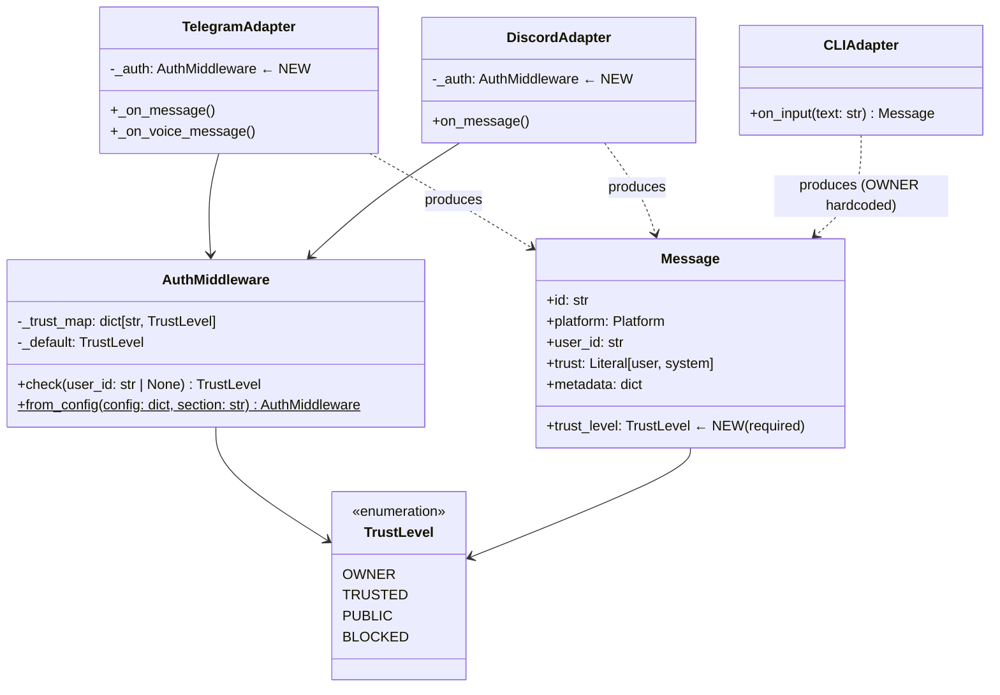
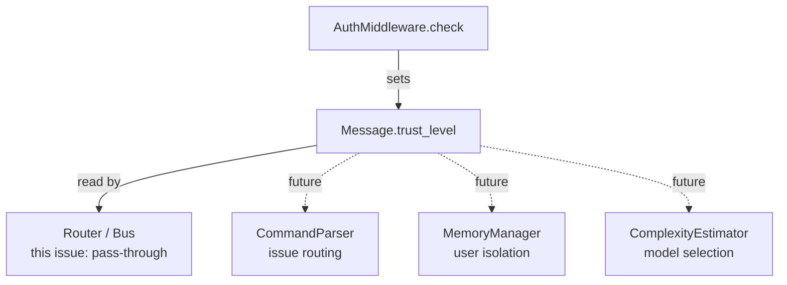

## Context

Promoted from `artifacts/analyses/151-auth-middleware-trust-level-analysis.mdx`.
See `docs/architecture/security-routing.md#auth` for the canonical design reference.

Shape selected: **Shape 2 — AuthMiddleware base class** (centralized, injected, testable).

## Goal

Reject unauthorized inbound messages at the adapter layer, before `_normalize()` and before the InboundBus, with zero LLM resource consumption for blocked users.

## Users

- **Mickael (owner)** — sole authorized user in production. Auth ensures no external party can trigger LLM calls via Telegram or Discord.
- **Lyra architecture (downstream)** — `TrustLevel` on `Message` is consumed by future issues: #routing (model selection), #commands (command gating), memory isolation.

## Expected Behavior

1. A `lyra.toml` config file lists authorized `owner_users`, `trusted_users`, and a `default` per channel:
   ```toml
   [auth.telegram]
   owner_users   = ["7377831990"]
   trusted_users = ["7377831990"]
   default       = "blocked"

   [auth.discord]
   trusted_roles = []
   default       = "blocked"
   ```
2. At startup, `__main__.py` calls `AuthMiddleware.from_config(raw, "telegram")` and `AuthMiddleware.from_config(raw, "discord")`, injecting instances into each adapter.
3. For `CLIAdapter`, a fixed-OWNER middleware is used (no config section needed — CLI is always local/trusted).
4. When a message arrives at `TelegramAdapter._on_message()` or `DiscordAdapter.on_message()`, the adapter calls `self._auth.check(user_id)` **before** calling `_normalize()`.
5. If `TrustLevel.BLOCKED`: the handler returns immediately. `_normalize()` is never called. A structured rejection is logged (`auth_reject user=X channel=Y`).
6. If not BLOCKED: `Message.from_adapter(..., trust_level=trust)` is called with the resolved `TrustLevel`. The message proceeds to the bus as normal.
7. `TrustLevel.OWNER` and `TrustLevel.TRUSTED` messages are treated identically for now (routing differentiation is future work).
8. `CLIAdapter` produces `Message` objects with `trust_level=TrustLevel.OWNER` unconditionally.

### Config failure behaviour

- Missing `[auth.telegram]` or `[auth.discord]` section at startup → **fail closed**: `SystemExit` is raised. The service must not start without auth config for networked adapters.
- Missing `[auth.cli]` section → silently return a fixed-OWNER middleware (no raise). CLI is local-only.
- Malformed value in `default` (e.g. `"open"` instead of `"blocked"`) → `SystemExit`.

## Data Model & Consumers





| Consumer | Field(s) consumed | When | Status |
|----------|------------------|------|--------|
| `TelegramAdapter._on_message()` | `TrustLevel` (via `check()`) | Inbound gate | **This issue** |
| `DiscordAdapter.on_message()` | `TrustLevel` (via `check()`) | Inbound gate | **This issue** |
| `CLIAdapter.on_input()` | Hardcoded `OWNER` | Inbound | **This issue** |
| `Message.from_adapter()` | `trust_level` param | Construction | **This issue** |
| Router / CommandParser | `msg.trust_level` | Command gating | Future (#commands) |
| MemoryManager | `msg.trust_level` | User isolation | Future (#memory-isolation) |
| ComplexityEstimator | `msg.trust_level` | Model selection | Future |

## Breadboard

### N1 — AuthMiddleware

| Element | Handler | Data |
|---------|---------|------|
| `AuthMiddleware(trust_map, default)` | `__init__` | `dict[str, TrustLevel]`, `TrustLevel` |
| `auth.check(user_id)` | Lookup `_trust_map`, fallback to `_default` | Returns `TrustLevel` |
| `AuthMiddleware.from_config(raw, "telegram")` | Parse `raw["auth"]["telegram"]`, build trust_map | Raises `SystemExit` if section missing or default invalid |
| `AuthMiddleware.from_config(raw, "cli")` | Missing section → return fixed-OWNER | Never raises |

### N2 — TelegramAdapter integration

| Element | Handler | Data |
|---------|---------|------|
| `_auth: AuthMiddleware` injected in `__init__` | Stored as `self._auth` | Via `__main__.py` wiring |
| `_on_message(msg)` — auth gate | `self._auth.check(str(msg.from_user.id))` before `_normalize()` | `TrustLevel` |
| `_on_voice_message(msg)` — auth gate | Same check, same early return | `TrustLevel` |
| BLOCKED → `return` + log | `log.info("auth_reject user=%s channel=telegram ts=%s", ...)` | user_id, timestamp |
| OK → `Message.from_adapter(..., trust_level=trust)` | Pass `trust_level` as kwarg | `TrustLevel` |

### N3 — DiscordAdapter integration

| Element | Handler | Data |
|---------|---------|------|
| `_auth: AuthMiddleware` injected in `__init__` | Stored as `self._auth` | Via `__main__.py` wiring |
| `on_message(message)` — auth gate | `self._auth.check(str(message.author.id))` before `_normalize()` | `TrustLevel` |
| BLOCKED → `return` + log | `log.info("auth_reject user=%s channel=discord ts=%s", ...)` | user_id, timestamp |
| OK → `Message.from_adapter(..., trust_level=trust)` | Pass `trust_level` as kwarg | `TrustLevel` |

### N4 — CLIAdapter stub

| Element | Handler | Data |
|---------|---------|------|
| `CLIAdapter.on_input(text)` | Constructs `Message.from_adapter(..., trust_level=TrustLevel.OWNER)` | Hardcoded OWNER |
| No `_auth` field | N/A — CLI is always OWNER | — |
| `CLIAdapter` does NOT implement `ChannelAdapter` protocol | Not registered with `hub.register_adapter()` in this issue. It is a standalone inbound-only component. `send()` / `send_streaming()` are out of scope for this stub. | — |

### N5 — Message.from_adapter() update

| Element | Handler | Data |
|---------|---------|------|
| `trust_level: TrustLevel` added as required param | Stored on `Message` | No default — caller must provide |
| `trust_level` never in `metadata` | Enforced by construction | — |
| All existing callers updated | `tests/core/test_outbound_dispatcher.py`, `tests/core/test_pool.py`, `tests/core/test_inbound_bus.py`, `tests/test_health_endpoint.py`, `tests/adapters/test_discord.py`, `demo.py` | All pass `trust_level=TrustLevel.TRUSTED` (or appropriate value) |

### N6 — __main__.py wiring

| Element | Handler | Data |
|---------|---------|------|
| `raw = _load_raw_config()` | Existing pattern | `lyra.toml` |
| `_load_auth_config(raw)` | New function, returns `(tg_auth, dc_auth)` | `AuthMiddleware` × 2 |
| `TelegramAdapter(..., auth=tg_auth)` | Injected at construction | — |
| `DiscordAdapter(..., auth=dc_auth)` | Injected at construction | — |

## Slices

| # | Slice | Affordances | Demo-able |
|---|-------|-------------|-----------|
| S1 | `TrustLevel` enum + `AuthMiddleware` core | N1 | Unit tests pass — `check()` returns correct level |
| S2 | `Message.from_adapter()` updated with `trust_level` | N5 | All callers (adapters + tests + demo.py) updated; existing tests green |
| S3 | `CLIAdapter` stub | N4 | `CLIAdapter.on_input("hello")` returns `Message` with `trust_level=OWNER` |
| S4 | `TelegramAdapter` auth gate | N2 | BLOCKED Telegram user → `_normalize()` not called |
| S5 | `DiscordAdapter` auth gate | N3 | BLOCKED Discord user → `on_message()` returns early |
| S6 | `__main__.py` wiring + `lyra.toml` config | N6 | Service starts with valid config; exits on missing auth section |

## Success Criteria

- [ ] `TrustLevel` enum has exactly 4 values: `OWNER`, `TRUSTED`, `PUBLIC`, `BLOCKED`
- [ ] `AuthMiddleware.check(user_id)` returns `TrustLevel.BLOCKED` for unknown user_id when `default="blocked"`
- [ ] `AuthMiddleware.check(None)` returns the configured default (not raises)
- [ ] `AuthMiddleware.from_config(raw, "telegram")` raises `SystemExit` when `[auth.telegram]` section is missing
- [ ] `AuthMiddleware.from_config(raw, "cli")` returns a fixed-OWNER middleware when `[auth.cli]` is missing (no raise)
- [ ] `AuthMiddleware.from_config(raw, "telegram")` raises `SystemExit` when `default` value is not a valid `TrustLevel`
- [ ] `TelegramAdapter._on_message()` does NOT call `_normalize()` when `auth.check()` returns `BLOCKED`
- [ ] `TelegramAdapter._on_voice_message()` does NOT call `_normalize()` when `auth.check()` returns `BLOCKED`
- [ ] `DiscordAdapter.on_message()` does NOT call `_normalize()` when `auth.check()` returns `BLOCKED`
- [ ] Rejection log line contains `user_id`, `channel`, and `timestamp` for every BLOCKED message
- [ ] `Message.from_adapter()` requires `trust_level` as a parameter (no default value)
- [ ] All `Message` objects produced by adapters have `trust_level` set to a non-BLOCKED value
- [ ] `trust_level` is never present in `msg.metadata`
- [ ] `CLIAdapter.on_input(text)` returns a `Message` with `trust_level=TrustLevel.OWNER`
- [ ] Service starts successfully with a valid `lyra.toml` containing `[auth.telegram]` and `[auth.discord]`
- [ ] Service raises `SystemExit` at startup when `[auth.telegram]` is absent from `lyra.toml`
- [ ] Service raises `SystemExit` at startup when `lyra.toml` is entirely absent (consistent fail-closed: missing file → empty raw dict → missing auth section → SystemExit)
- [ ] All existing adapter and hub tests remain green after `from_adapter()` signature change
