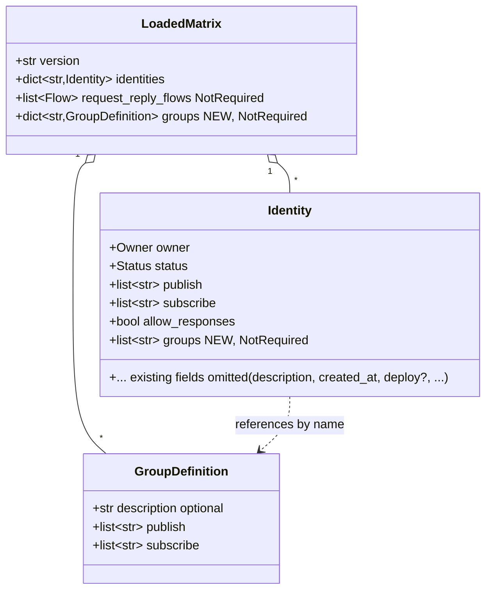
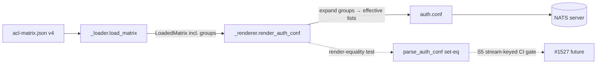

## Context

Source: `artifacts/frames/1526-s4-acl-grant-group-frame.mdx` (ADR-079 §b, slice S4 of #1521).

The audio publish/subscribe grant set is copy-pasted verbatim across the
`telegram-adapter` and `discord-adapter` blocks of `deploy/nats/acl-matrix.json`
(currently schema v3). This flat duplication is the N×M-drift root cause of the
2026-05-29 crash-loop. ADR-079 §b prescribes schema **v4**: define the grant set
once as the `audio-consumer` group; each adapter references it by name. The
generator (`scripts/_acl_models.py`, `_loader.py`, `_renderer.py`) expands the
group into the effective grant list before rendering — a source-side abstraction
only, so the rendered `auth.conf` is byte-for-set identical to v3.

## Goal

Replace per-adapter audio-grant duplication with a single referenced
`audio-consumer` group, while proving the rendered `auth.conf` is
identical-or-tighter versus v3.

## Users

- **Primary:** ACL maintainers / ops editing `acl-matrix.json` then running
  `make nats-regen-authconf`. A future 3rd adapter adds one `"groups"` line.
- **Secondary:** `lyra-telegram` / `lyra-discord` runtimes — must see an
  identical effective grant set (no auth regression at deploy).

## Expected Behavior

1. `load_matrix` accepts `version: "4"` (and still `"1"/"2"/"3"`). v4 inherits all
   v3 invariants: `request_reply_flows` are parsed (flow-parse version set becomes
   `{"2","3","4"}`), and active identities still require a `deploy` field
   (deploy-guard version set becomes `{"3","4"}`).
2. A v4 matrix MAY carry a top-level `groups` object; each group has `publish`
   and `subscribe` string lists (+ optional `description`).
3. An identity MAY carry `"groups": ["audio-consumer", ...]`. The loader rejects a
   reference to a group not defined in `groups` by exiting non-zero (`_die` →
   `sys.exit(1)`).
4. `render_auth_conf` expands each identity's referenced groups into its effective
   publish/subscribe lists **inside the first identity loop, before** request_reply
   flow injection. Expansion appends group subjects to the inline list.
5. Existing v3 matrices (no `groups` key, no identity `groups`) render exactly as
   today — `groups` defaults to `{}`, identity `groups` defaults to `[]`.
6. After migrating `acl-matrix.json` to v4, the audio grants live **only** in
   `groups.audio-consumer`; both adapters reference it; the rendered `auth.conf`
   parses **set-equal** to the rendered v3 output (the expansion re-adds exactly the
   subjects removed from inline, so the effective grant set is identical, never
   looser). Textual ordering of subjects within a user block MAY differ (audio
   subjects move to the end of each list); the proof is parse-based, not textual.

## Data Model & Consumers

### Data structure



### Consumer map



### Consumer summary

| Consumer | Fields consumed | When | Status |
|---|---|---|---|
| `load_matrix` | `version`, `groups`, `identities[].groups` | parse | this issue |
| `render_auth_conf` | `groups`, `identities[].groups`, `publish`, `subscribe` | render | this issue |
| render-equality test | rendered v4 vs v3 (via `parse_auth_conf`) | test | this issue |
| #1527 CI falsification gate | `groups.audio-consumer`, identities referencing it | CI | future (out of scope) |

## `audio-consumer` Group Definition (derived from current v3 matrix)

The group set is **exactly** the audio JetStream/dedup-KV grants currently
duplicated verbatim across `telegram-adapter` and `discord-adapter`. Enumerated
explicitly so the implementer does not guess (matches ADR-079 §b):

**publish (8):**
```
$JS.API.STREAM.INFO.LYRA_OUTBOUND_AUDIO
$JS.API.CONSUMER.CREATE.LYRA_OUTBOUND_AUDIO.>
$JS.API.CONSUMER.INFO.LYRA_OUTBOUND_AUDIO.*
$JS.API.CONSUMER.MSG.NEXT.LYRA_OUTBOUND_AUDIO.*
$JS.API.STREAM.INFO.KV_lyra_outbound_audio_sent
$JS.API.STREAM.MSG.GET.KV_lyra_outbound_audio_sent
$JS.ACK.LYRA_OUTBOUND_AUDIO.>
$KV.lyra_outbound_audio_sent.>
```

**subscribe (1):**
```
$KV.lyra_outbound_audio_sent.>
```

**Stays INLINE on each adapter (NOT in the group):**
- Platform-axis (per-platform, cannot be shared): `lyra.inbound.<platform>.>`,
  `lyra.outbound.<platform>.>`, `lyra.typing.<platform>.>`, `_inbox.<adapter>.>`,
  `_inbox.<adapter>.*.*`.
- `lyra.outbound.audio.>` (subscribe) — kept inline per ADR-079 §b (group scoped to
  JS-consumer + dedup-KV only).
- Non-audio shared grants (`lyra.system.ready`, `lyra.turns.write`, `lyra.event.>`,
  `lyra.metric.>`, `$JS.API.DIRECT.GET.LYRA_STATE.hub.ready`, `$JS.API.INFO`,
  `$JS.API.CONSUMER.CREATE.*`, `$KV.lyra-state.>`) — **out of scope** for S4; a
  future `adapter-base` group could consolidate these (backlog, not this issue).

Net per adapter: remove the 8 publish + 1 subscribe above from inline lists, add
`"groups": ["audio-consumer"]`. Effective grant set unchanged.

## Breadboard

| ID | Affordance | Location | Handler / wiring | Data |
|---|---|---|---|---|
| N1 | `GroupDefinition(TypedDict)` | `_acl_models.py` | `description?`, `publish: list[str]`, `subscribe: list[str]` | new type |
| N2 | `LoadedMatrix.groups` | `_acl_models.py` | `NotRequired[dict[str, GroupDefinition]]` | extends N1 |
| N3 | `Identity.groups` | `_acl_models.py` | `NotRequired[list[str]]` | — |
| N4 | version `"4"` + v3 invariants inherited | `_loader.py` | add `"4"` to `_VALID_VERSIONS`; flow-parse gate `{"2","3"}`→`{"2","3","4"}` (line 93); deploy-required-for-active gate `version == "3"`→`version in {"3","4"}` (line 71) | — |
| N5 | parse + validate `groups` | `_loader.py` | parse top-level `groups` → `dict[str, GroupDefinition]`; default `{}` | reads N1 |
| N6 | validate group cross-refs | `_loader.py` | each `identity.groups[i]` ∈ `groups` else `_die` (`sys.exit(1)`) | reads N5 |
| N7 | group expansion | `_renderer.py:render_auth_conf` | in **first** identity loop, before flow injection: `pub_allow[name].extend(group.publish)`, `sub_allow[name].extend(group.subscribe)`; carry `groups` into renderer via `LoadedMatrix` | reads N2,N3 |
| N8 | `groups.audio-consumer` | `acl-matrix.json` | 8 publish + 1 subscribe — exact subjects per "Group Definition" section above | data |
| N9 | adapters reference group | `acl-matrix.json` | remove the 8 pub + 1 sub inline audio grants from both adapters; add `"groups": ["audio-consumer"]` | data |
| N10 | regenerate committed auth.conf | `deploy/nats/auth.conf` | refresh via renderer/`make nats-regen-authconf`; parse-equal to prior | reads N7,N9 |
| T1 | render-equality test | `tests/scripts/test_*.py` | `frozenset(parse_auth_conf(render(v4)).users) == frozenset(parse_auth_conf(render(v3_fixture)).users)` — order-independent, covers pub+sub | reads N7,N8,N9 |
| T2 | v3-still-valid test | `tests/scripts/` | load+render an unmodified v3 matrix → byte-identical to pre-change output | reads N4 |
| T3 | dangling-ref test | `tests/scripts/` | identity references undefined group → `SystemExit` (non-zero) | reads N6 |

## Slices

| # | Slice | Affordances | Demo |
|---|---|---|---|
| 1 | Generator supports groups | N1–N7 | a v4 matrix with a group renders expanded grants; v3 matrix renders byte-identically |
| 2 | Migrate matrix to v4 + regen auth.conf | N8, N9, N10 | `acl-matrix.json` is v4; audio grants only in group; both adapters reference it; committed `auth.conf` refreshed + parse-equal |
| 3 | Render-equality + regression tests | T1, T2, T3 | `frozenset(parse(v4).users) == frozenset(parse(v3).users)`; v3 loads; dangling ref dies |

## Success Criteria

- [ ] `_acl_models.py` defines `GroupDefinition` and `LoadedMatrix` carries optional `groups`; `Identity` carries optional `groups`.
- [ ] `_loader.py` accepts `version: "4"` and still accepts `"1"/"2"/"3"`.
- [ ] `_loader.py` parses `request_reply_flows` for v4 (flow-parse gate includes `"4"`) — no inbox-injection regression.
- [ ] `_loader.py` enforces `deploy`-required-for-active on v4 (deploy-guard gate includes `"4"`).
- [ ] `_loader.py` parses a top-level `groups` object into `LoadedMatrix.groups` (defaults to `{}` when absent).
- [ ] `_loader.py` exits non-zero (`sys.exit(1)`) when an identity references a group name not present in `groups`.
- [ ] `render_auth_conf` expands referenced groups into each identity's effective publish/subscribe lists in the first identity loop, before flow injection.
- [ ] An unmodified v3 matrix renders byte-identically to pre-change output (no `groups` regression).
- [ ] `deploy/nats/acl-matrix.json` is `version: "4"`, the audio grant set (8 pub + 1 sub, enumerated above) appears only under `groups.audio-consumer`, and `telegram-adapter` + `discord-adapter` each declare `"groups": ["audio-consumer"]` with those subjects removed from inline lists.
- [ ] The committed `deploy/nats/auth.conf` is regenerated from the v4 matrix and parses set-equal to the pre-change version.
- [ ] A regression test asserts `frozenset(parse_auth_conf(render_v4).users) == frozenset(parse_auth_conf(render_v3).users)` for the migrated matrix (effective grant set identical — never looser).
- [ ] `uv run ruff check`, `uv run pyright`, and `uv run pytest tests/scripts/` pass.

## Out of Scope

- S5 / #1527 stream-keyed CI falsification gate (consumes the group but is its own slice).
- Hub identity grants / sole-provisioner (S3 / #1525, done).
- Any `src/lyra` runtime code; adding an actual 3rd adapter.
