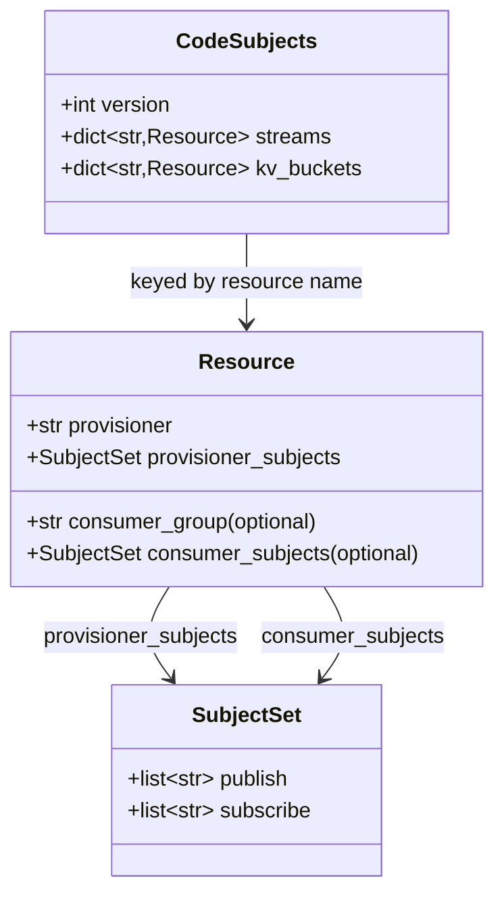
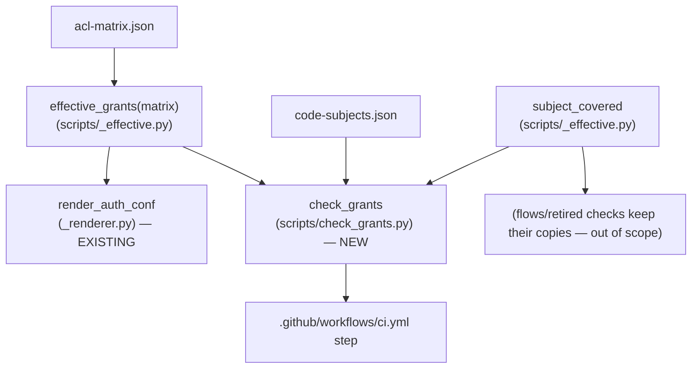

# Spec: S5 — CI code↔ACL falsification gate

## Context

Promoted from `artifacts/frames/1527-s5-ci-falsification-gate-frame.mdx` (frame approved
2026-05-31). Last slice of ADR-079 (#1521); prerequisite S4 (#1526, grant-groups) merged.
Closes the blind spot that caused the 2026-05-29 prod crash-loop: nothing in CI asserts that
the NATS subjects the code calls are a subset of the subjects the ACL grants.

## Goal

A CI gate, `factory-acl check grants`, that fails the build when any provisioner or consumer-group
identity's **effective** (post-group-expansion) ACL does not cover the JetStream/KV subjects the
code requires for that resource — keyed by stream/KV, never by identity.

## Users

- **Primary:** CI + Lyra maintainers — automated reviewer flagging under-granted PRs before merge.
- **Secondary:** prod hub + adapters (no more grant-drift crash-loops); the on-call operator.

## Expected Behavior

`uv run factory-acl check grants --matrix deploy/nats/acl-matrix.json --code-subjects deploy/nats/code-subjects.json`

1. Load + validate matrix (`load_matrix` — reuses existing group-ref validation).
2. Load + validate the code-subjects manifest (new `load_code_subjects`).
3. Compute **effective grants** per active identity via the shared `effective_grants(matrix)`
   (group-expansion + flow-inbox injection — the *same* function `render_auth_conf` uses).
4. For each stream and KV resource in the manifest:
   - **Provisioner**: assert the provisioner identity's effective `publish` covers every
     `provisioner_subjects.publish` entry (NATS-wildcard-aware `subject_covered`).
   - **Consumer-group** (if set): find every identity referencing that group; for each, assert
     effective `publish` ⊇ `consumer_subjects.publish` and effective `subscribe` ⊇
     `consumer_subjects.subscribe`.
5. Any uncovered subject → print a `FAIL:` line (identity + missing subject + resource/group
   provenance) to stderr; after checking all, `exit 1`. All covered → print `OK (N resources)`,
   `exit 0`. No network, < 2 s.

**Honest scope note (from verification):** the audio stream/KV provisioner is `hub`, which
holds the broad `$JS.API.>` grant — so the *provisioner* assertion for audio is currently
satisfied trivially. The gate's real protection for audio is the **consumer-group** branch
(telegram/discord hold narrow literal grants — exactly the 6 that were missing in the outage).
The provisioner branch bites for `LYRA_TURNS` (turn-writer holds literal grants) and guards
against any future narrowing of hub's grant. This is correct behaviour: the gate catches
*under*-granting; a broad grant is not under-granting.

**Manifest is code-derived, not matrix-derived (critical):** the manifest values are authored
from reading the code's nats-py API calls (`ensure_stream`→STREAM.CREATE/UPDATE/INFO;
`ensure_consumer`→CONSUMER.CREATE/INFO/MSG.NEXT + `$JS.ACK`; KV bind→STREAM.INFO, non-direct
get→STREAM.MSG.GET, data-plane→`$KV.…`). They currently *equal* the matrix grants because
S1–S4 fixed the matrix to satisfy the code — so the gate is GREEN today. Deriving the manifest
*from* the matrix would make the gate tautological; it must encode what the code does.

## Data Model & Consumers

### Manifest schema (`deploy/nats/code-subjects.json`)



Keyed by **resource** (`LYRA_OUTBOUND_AUDIO`, `lyra_outbound_audio_sent`, `LYRA_TURNS`) — never
by identity. Adding a platform adapter does not touch this file (consumer subjects live once,
under the resource, addressed by `consumer_group`). This is the axial invariant (ADR-079 §d).

**Manifest content SSoT = ADR-079 §d (L291-352), verbatim.** The implementation transcribes
that JSON block; it is not re-derived here. Annotate the `$KV.lyra_outbound_audio_sent.>` entry
(which legitimately appears in BOTH provisioner and consumer subject sets — hub writes readiness,
consumers write dedup) with a `_comment` so a future editor does not read it as accidental
duplication and delete one copy (axial-adr-review nit, 2026-05-31).

### Consumer map



| Consumer | Consumes | When | Status |
|---|---|---|---|
| `render_auth_conf` | `effective_grants(matrix)` | every genkeys/regen | refactor to call extracted fn (this issue) |
| `check_grants` | `effective_grants`, `subject_covered`, manifest | CI + local | new (this issue) |
| `ci.yml` | `factory-acl check grants` exit code | every PR | new (this issue) |
| `check-acl-matrix-spec.sh` (jq) | its own expansion | CI | unchanged (bash; cannot share Python — documented divergence) |

## Breadboard

### CLI affordance

| ID | Affordance | Handler | Data |
|---|---|---|---|
| C1 | `factory-acl check grants --matrix P --code-subjects P` | `_cmd_check_grants` (gen_nkeys.py) → `check_grants.run()` | matrix + manifest |
| C2 | `lyra-check-grants` (pyproject script alias) | `gen_nkeys._check_grants` → `main(["check","grants",…])` | — |
| C3 | CI step "Check ACL code coverage (ADR-079)" | `uv run factory-acl check grants …` | exit 0/1 |

### Module wiring

| ID | Module | Exposes | Notes |
|---|---|---|---|
| M1 | `scripts/_effective.py` (new) | `effective_grants(matrix) -> dict[str,(list,list)]`, `subject_covered(subject, grants) -> bool` | extracted from `_renderer.py:63-81` + canonical wildcard matcher. **Returns an entry for EVERY active identity** — incl. those with no group and no flow (e.g. `turn-writer`, inline grants only); the gate looks up provisioner identities by name and must not KeyError. Flow-inbox injection (L75-81) stays INSIDE the fn (behaviour-preserving for the renderer; irrelevant to the gate — no manifest subject is `_inbox.*`). Retired identities excluded, mirroring `_renderer.py:64`. `subject_covered` semantics IDENTICAL to existing `check_request_reply_flows._subject_covered` (exact / `>` / `.>`); sufficient because the ADR §d manifest expresses each required subject in the same wildcard form as its grant (exact-match or `.>`-covered — verified, no single-token `.*` matching needed) |
| M2 | `scripts/_renderer.py` (edit) | `render_auth_conf` calls `effective_grants` | behaviour-preserving; byte-identical output (auth.conf drift gate proves it) |
| M3 | `scripts/check_grants.py` (new) | `load_code_subjects(path)`, `run(matrix, code_subjects) -> list[str]`, `main()` | standalone-runnable, mirrors `check_request_reply_flows.py`; imports `effective_grants`+`subject_covered` from `_effective.py` (no new expansion copy). Guards: provisioner identity absent from `effective_grants` (retired/missing) → FAIL before indexing; `consumer_group` set but **zero** active identities reference it → FAIL (else the membership loop runs 0×, 0 failures, silent pass — architect 2026-05-31) |
| M4 | `scripts/gen_nkeys.py` (edit) | `_cmd_check_grants` (imports `check_grants.run`), `check grants` subparser, `_check_grants` alias | **Explicit edit:** `gen_nkeys.py:272` `ck_sub = ck.add_subparsers(... metavar="{retired,flows}")` → `"{retired,flows,grants}"` (devops 2026-05-31); add `ck_grants` subparser with `--matrix` + `--code-subjects` args mirroring `ck_flows` (L286-293); `_check_grants` console alias mirrors `_check_flows` (L312-313) |
| M5 | `pyproject.toml` (edit) | `lyra-check-grants = "scripts.gen_nkeys:_check_grants"` | — |
| M6 | `deploy/nats/code-subjects.json` (new) | the manifest | **transcribe ADR-079 §d JSON verbatim (ADR L291-352)** — audio stream, `LYRA_TURNS` stream, audio KV; `version: "1"`; add `_comment` on the dual-listed `$KV.…>` subject |
| M7 | `.github/workflows/ci.yml` (edit) | new step after "Check request-reply flows" | `uv run factory-acl check grants --matrix … --code-subjects …` |

### FAIL output format

```
FAIL: identity 'discord-adapter' publish[] does not cover required subject
      '$JS.API.CONSUMER.CREATE.LYRA_OUTBOUND_AUDIO.>'
      (stream LYRA_OUTBOUND_AUDIO, consumer-group audio-consumer)
```
Provisioner variant: `(stream LYRA_TURNS, provisioner)`. KV variant: `(kv lyra_outbound_audio_sent, …)`.

## Slices

| # | Slice | Demo-able outcome |
|---|---|---|
| S5.1 | Extract `effective_grants` + `subject_covered` into `_effective.py`; refactor `render_auth_conf` to use it | `test_renderer.py` green; auth.conf drift gate green (byte-identical) |
| S5.2 | `check_grants.py` + manifest + CLI wiring + pyproject alias + CI step + tests | `factory-acl check grants` exits 0 on real matrix; unit tests prove it exits 1 on each removed grant; CI step present |

Single PR (F-lite). S5.1 lands first in the diff so S5.2 builds on the shared fn.

## Success Criteria

- [ ] `scripts/_effective.py` exports `effective_grants(matrix)` and `subject_covered(subject, grants)`.
- [ ] `render_auth_conf` calls `effective_grants`; `uv run pytest tests/scripts/test_renderer.py` passes.
- [ ] `bash scripts/check-acl-authconf-drift.sh` passes (rendered auth.conf byte-identical to committed golden).
- [ ] `deploy/nats/code-subjects.json` exists, valid JSON, keyed by resource (streams + kv_buckets), with entries for `LYRA_OUTBOUND_AUDIO`, `lyra_outbound_audio_sent`, `LYRA_TURNS`.
- [ ] `uv run factory-acl check grants` exits 0 on the committed matrix + manifest and prints an `OK` line with the resource count.
- [ ] `lyra-check-grants` console-script alias resolves and runs the same check.
- [ ] CI workflow has a step running the gate after "Check request-reply flows".
- [ ] Unit `test_check_grants_passes_on_valid_matrix` — exit 0 on real matrix+manifest.
- [ ] Unit `test_check_grants_fails_missing_provisioner_subject` — drop `STREAM.CREATE.LYRA_TURNS` from turn-writer → exit 1 + FAIL line names it. *(Uses LYRA_TURNS, not audio: hub's broad `$JS.API.>` would mask an audio provisioner drop — this test must target the literal-grant provisioner to actually falsify.)*
- [ ] Unit `test_check_grants_fails_missing_consumer_subject` — drop a subject from the `audio-consumer` group → exit 1 + FAIL names the affected member identity.
- [ ] Unit `test_check_grants_passes_identity_not_in_group` — an identity without the consumer-group is not checked for consumer subjects.
- [ ] Unit `test_check_grants_fails_missing_provisioner_identity` — manifest names a provisioner absent/retired in matrix → exit 1.
- [ ] Unit `test_check_grants_fails_dead_consumer_group` — manifest sets `consumer_group` that exists in matrix `groups` but no active identity references it → exit 1 (guards the silent-pass hole).
- [ ] `effective_grants(matrix)` returns an entry for every active identity incl. group-less/flow-less ones; `test_renderer.py` + `check-acl-authconf-drift.sh` both green (refactor behaviour-preserving).
- [ ] Exit-code contract honoured: 0 = clean (covered or not is via stdout/stderr… here 0=covered, 1=violation, 2+=script broke) per `tools/CLAUDE.md`. *(NB: this gate is a falsification check — 1 = drift found, matching `check flows`/`check retired` siblings, not the reporter-always-0 rule.)*

## Edge Cases

| Case | Handling |
|---|---|
| Provisioner identity missing/retired in matrix | FAIL (cannot provision) — `test_check_grants_fails_missing_provisioner_identity` |
| `consumer_group` set but no identity references it | FAIL (dead group ref — code expects consumers) |
| Manifest references unknown `consumer_group` not in matrix `groups` | FAIL (typo guard) |
| Manifest malformed (missing `provisioner`, bad JSON) | `exit 2` (script broke, not drift) — distinct from drift's `exit 1` |
| `subscribe` omitted in a `SubjectSet` | treat as `[]` (publish-only resource) |
| hub broad `$JS.API.>` covers audio provisioner subjects | passes by design (not under-granting) — documented above |

## Reuse Boundary (constraint #2 — the crux)

The 2026-05-29 incident class is boundary-contract-drift: a matrix *consumer* that expands
groups differently than the renderer → the consumer lies. S4 already hit this (the jq spec
gate needed its own expansion). The structural fix here is **one Python expansion path**:
`effective_grants` in `_effective.py`, called by both `render_auth_conf` and `check_grants`.
We do NOT (a) add a 3rd reimplementation, nor (b) round-trip through rendered auth.conf text
(fragile, format-coupled). The bash/jq gate keeps its own expansion only because it cannot
import Python — that divergence is documented, not introduced.

## Open Questions

_None remaining — Q1–Q4 from the frame resolved: standalone module (M3), structured shared
`effective_grants` (M1), manifest includes LYRA_TURNS (M6), parent-plan FAIL format adopted._
