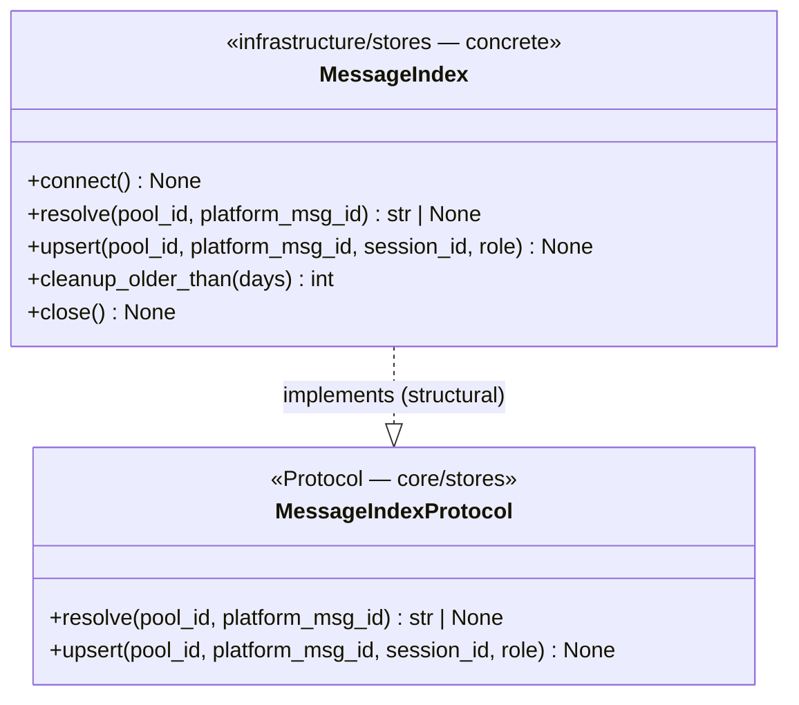

## Context

Source: `artifacts/frames/1529-relocate-hub-shutdown-closes-frame.mdx` (approved).
Precedent: #1506 / PR #1523 — relocated `turn_store.close()` to `open_stores`' finally and
established the ADR-078 lifecycle-ownership rule. This spec applies the same rule to
`message_index`, and **corrects the issue's premise for `memory`** based on investigation.

Investigation findings (this branch):

- **message_index** is a bootstrap-owned store: `StoreBundle.message_index`
  (`bootstrap_stores.py:237`), closed once by `open_stores`' `finally`
  (`bootstrap_stores.py:300`). `hub_shutdown.py:111` `self._message_index.close()` is a
  **redundant second close** + a `core → infrastructure` inversion.
- **4 concrete `MessageIndex` imports in core** (all `TYPE_CHECKING`) — exactly the 4
  `.importlinter` `DEBT:importlinter-adr048-transition` exemptions (lines 34/37/38/39):
  `hub.py:36`, `hub_registration.py:17`, `hub_shutdown.py:13`, `pool_observer.py:8`.
- **2 further core consumers reach `message_index` via the hub attribute** (no own import,
  no exemption): `path_validation.py:73` calls `.resolve()`; `pool_manager.py:73` passes it
  to `register_message_index()`. Retyping `hub._message_index` covers them transitively.
- Core's real method surface on `message_index` = **`resolve()`** (read, path_validation) +
  **`upsert()`** (write, pool_observer). `connect()`/`close()` are bootstrap-owned;
  `cleanup_older_than()` is not called from core.
- **memory premise is WRONG.** `MemoryManager` is a **core** class (`core/memory/memory.py`),
  **not** in `StoreBundle`, never connected/closed by bootstrap. `self._memory` is `None` in
  every production path (`set_memory()` has zero prod call sites). hub's `_memory.close()` is
  a hub-owned guarded call, **not** redundant-with-bootstrap, with **no exemption** attached.

## Goal

Eliminate the `message_index` `core → infrastructure` coupling: remove hub_shutdown's
redundant close and retype core's `message_index` consumers to a `MessageIndexProtocol`,
freeing all 4 `adr048-transition` exemptions — and document `memory`'s correct (hub-owned)
ownership rather than wrongly "relocating" it.

## Users

- **Primary:** Lyra `core/` maintainers — shutdown path no longer double-closes a
  bootstrap-owned store; `message_index` consumers depend on a core protocol, not a
  concrete infra type.
- **Secondary:** the `import-layers` gate — 4 sanctioned `core → infrastructure` edges removed.

## Expected Behavior

1. On hub shutdown, `message_index` is closed **exactly once** — by `open_stores`' `finally`,
   not by `HubShutdownMixin.shutdown()`.
2. Core modules referencing `message_index` are typed against
   `lyra.core.stores.message_index_protocol.MessageIndexProtocol` (a driven-port-style
   Protocol exposing `resolve()` + `upsert()`), mirroring `TurnStoreProtocol`
   (`core/stores/turn_store_protocol.py`).
3. The concrete `lyra.infrastructure.stores.message_index.MessageIndex` satisfies the
   protocol structurally — no runtime/behavioral change to the implementation.
4. `.importlinter` no longer needs the 4 `message_index` `adr048-transition` exemptions;
   the `import-layers` gate passes without them.
5. `memory`: behavior unchanged. `_memory.close()` is retained with a clarifying comment that
   `MemoryManager` is **hub-owned** (a core class, never a bootstrap store), correcting the
   issue's conflation with `message_index`.

## Data Model & Consumers

### Protocol + implementation



Lifecycle methods (`connect`/`close`) intentionally **excluded** from the protocol — owned by
`bootstrap_stores.open_stores`, not core. `cleanup_older_than` excluded — not a core consumer.

### Consumer map

```mermaid
flowchart TD
    P[MessageIndexProtocol\ncore/stores]
    H[hub.py\n_message_index annotation] -->|typed as| P
    HR[hub_registration.py\nset_message_index param] -->|typed as| P
    PO[pool_observer.py\nregister_message_index + .upsert] -->|typed as| P
    PV[path_validation.py\nhub._message_index.resolve] -.->|via hub attr| P
    PM[pool_manager.py\npasses hub._message_index| -.->|via hub attr| P
    HS[hub_shutdown.py] -.->|close REMOVED| X[no message_index ref]
    BS[bootstrap_stores.open_stores\nfinally: close once] -->|owns lifecycle| MI[MessageIndex concrete]
    MI -. implements .-> P
```

### Consumer summary

| Consumer | Uses | When | Change | Status |
|---|---|---|---|---|
| `hub.py:36,102` | annotation `_message_index` | — | import + annotate `MessageIndexProtocol` | this issue |
| `hub_registration.py:17,87,90` | `set_message_index(store)` param + wire to observer | wiring | retype param → protocol | this issue |
| `pool_observer.py:8,57,204` | `register_message_index` param + `.upsert()` | per turn (write) | retype → protocol | this issue |
| `hub_shutdown.py:13,35,111` | `.close()` only | shutdown | **remove** call + import + annotation | this issue |
| `path_validation.py:73` | `hub._message_index.resolve()` | reply-to-resume (read) | none (transitive via hub attr) | this issue |
| `pool_manager.py:73` | passes `hub._message_index` | pool create | none (transitive via hub attr) | this issue |
| `bootstrap_stores.py:300` | `connect()` + `close()` | startup/shutdown | none — already sole owner | done (#own) |

## Breadboard

| ID | Affordance | Handler / location | Wiring |
|---|---|---|---|
| N1 | `MessageIndexProtocol` | new `core/stores/message_index_protocol.py` | exported via `core/stores/__init__.py` |
| N2 | `resolve(pool_id: str, platform_msg_id: str) -> str \| None` | protocol method | verbatim from `MessageIndex.resolve` (`message_index.py:59`) |
| N3 | `upsert(pool_id: str, platform_msg_id: str \| None, session_id: str, role: Literal["user","assistant"]) -> None` | protocol method | verbatim from `MessageIndex.upsert` (`message_index.py:40`) — **`platform_msg_id` is `str \| None`**; protocol MUST match exactly or pyright structural check fails (input contravariance) |
| N4 | concrete `MessageIndex` conforms | `infrastructure/stores/message_index.py` | structural; pyright verifies |
| N5 | retype 3 core sites | `hub.py`, `hub_registration.py`, `pool_observer.py` | import N1, drop concrete import |
| N6 | remove redundant close | `hub_shutdown.py:111` (+ import :13, annotation :35) | bootstrap owns close |
| N7 | drop 4 exemptions | `.importlinter:34,37,38,39` | import-layers gate green |
| N8 | memory ownership comment | `hub_shutdown.py:105-106` | retain close; document hub-ownership |

## Slices

| # | Slice | Affordances | Independently demo-able |
|---|---|---|---|
| 1 | **hub_shutdown cleanup** — remove `_message_index.close()` + concrete import + annotation; drop exemption line 38; add `memory` ownership comment (retain `_memory.close()`) | N6, N8, partial N7 | `import-layers` green w/o line 38; shutdown closes message_index once; `pytest` green |
| 2 | **MessageIndexProtocol extraction** — create N1 (resolve+upsert), export, conform concrete `MessageIndex`; retype `hub.py`/`hub_registration.py`/`pool_observer.py`; drop exemptions 34/37/39 | N1–N5, rest of N7 | `import-layers` green w/ all 4 message_index exemptions gone; `pyright` green; `path_validation`/`pool_manager` typecheck via hub attr |

No smart-split: single cohesive refactor, 2 natural increments, criteria are verification
points (not separable deliverables). Slice 1 is shippable alone (frees 1 exemption); Slice 2
completes the goal.

## Success Criteria

- [ ] `hub_shutdown.py` no longer calls `_message_index.close()` nor imports concrete `MessageIndex`; `_memory.close()` retained with a comment documenting hub-ownership (core class, not a bootstrap store).
- [ ] `MessageIndexProtocol` exists in `core/stores/message_index_protocol.py` exposing `resolve()` + `upsert()` with signatures matching the concrete impl, exported from `core/stores/__init__.py`.
- [ ] Concrete `infrastructure/stores/message_index.MessageIndex` satisfies `MessageIndexProtocol` (pyright structural check); no behavioral change to the implementation.
- [ ] `hub.py`, `hub_registration.py`, `pool_observer.py` reference `MessageIndexProtocol`, not the concrete `MessageIndex`; `path_validation.py` + `pool_manager.py` typecheck unchanged (via hub attribute).
- [ ] All 4 `message_index` `DEBT:importlinter-adr048-transition` exemptions (`.importlinter:34,37,38,39`) removed; `import-layers` gate passes.
- [ ] `message_index` is closed exactly once (by `open_stores` finally) — no double-close; verified by an existing/added shutdown test or explicit inspection note.
- [ ] No regression: `ruff` + `pyright` + `pytest` all green in the worktree.
- [ ] `memory` left functionally unchanged and explicitly out of scope for relocation (premise correction recorded in spec + code comment).
