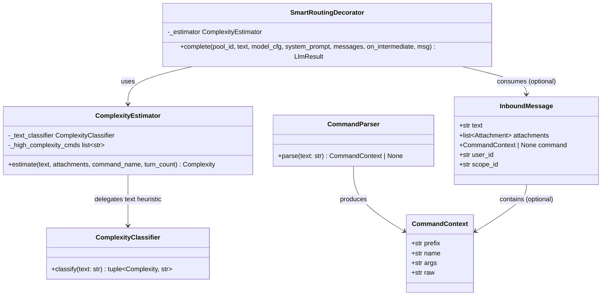
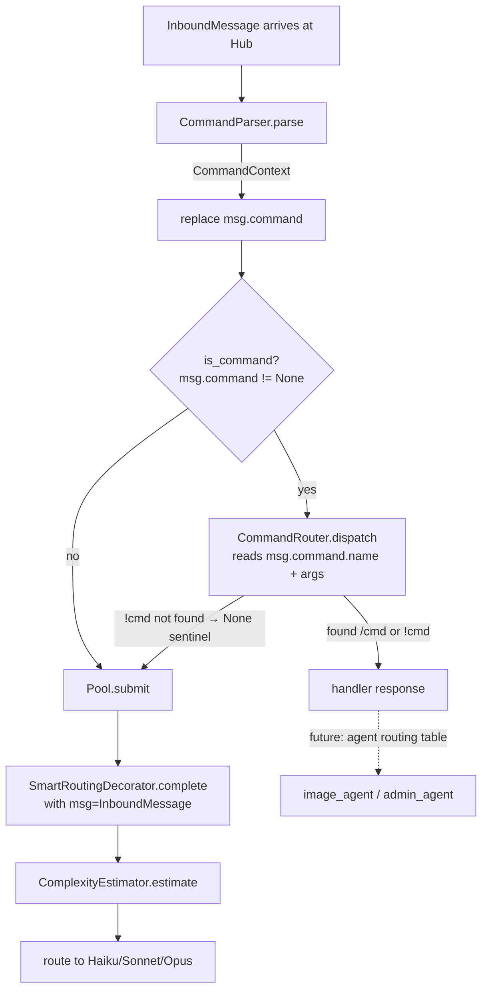

## Context

Frame: `artifacts/frames/153-command-parser-complexity-model-frame.mdx`

Two partial implementations exist:
- `CommandRouter` (`src/lyra/core/command_router.py`) — handles `/` commands only; no `CommandContext` abstraction; no `!` prefix
- `ComplexityClassifier` (`src/lyra/llm/smart_routing.py`) — text-only heuristics; no attachment, turn-count, or command-context signals
- `SmartRoutingDecorator` already in the LLM stack (`CircuitBreaker → SmartRouting → Retry → Driver`)

This spec closes the gap with four deliverables: **CommandParser**, **InboundMessage.command**, **ComplexityEstimator**, and **config wiring**.

---

## Goal

Parse both `/` and `!` command prefixes into a structured `CommandContext`, attach it to `InboundMessage`, and feed it to a richer `ComplexityEstimator` so the LLM layer selects Haiku / Sonnet / Opus based on actual message signals — not just word count.

---

## Users

- **Hub pipeline** — `_MessagePipeline._run()` enriches `InboundMessage` with `CommandContext` before routing
- **`SmartRoutingDecorator`** — consumes `InboundMessage` (or extracted signals) to pick the right model
- **Agent owners** — add commands to `HIGH_COMPLEXITY_COMMANDS` in TOML; no code changes needed

---

## Expected Behavior

### 1 — CommandParser

A standalone, stateless parser. Given message text:
- `/imagine a cat` → `CommandContext(prefix="/", name="imagine", args="a cat", raw="/imagine a cat")`
- `!help` → `CommandContext(prefix="!", name="help", args="", raw="!help")`
- `hello world` → `None`

`CommandParser.parse()` is the single source of truth for both prefixes. `CommandRouter` delegates to it instead of duplicating logic.

### 2 — InboundMessage.command field

`InboundMessage` gains an optional `command: CommandContext | None = None` field.

The Hub pipeline (`_MessagePipeline._run()`) calls `CommandParser.parse(msg.text)` and attaches the result via `dataclasses.replace(msg, command=ctx)` **before** branching to `_dispatch_command()` or `_submit_to_pool()`. This means `CommandContext` is available to all downstream consumers — ComplexityEstimator, Pool, plugins.

`CommandRouter.is_command()` checks `msg.command is not None` (reuse the already-parsed result). `get_command_name()` returns `f"{msg.command.prefix}{msg.command.name}"` when `msg.command` is set. `_pairing_gate_drop` uses `get_command_name()` directly — it must also be updated to read from `msg.command` for consistency.

`CommandRouter.dispatch()` reads `msg.command.name` and `msg.command.args` (already parsed) rather than re-splitting `msg.text`. This is a load-bearing change: removing the `msg.text.split()` re-parse ensures the `!` prefix is handled correctly.

**`!` prefix lookup contract:** `!`-prefixed commands are looked up as-is (e.g. `"!help"` key) in the plugin registry — separate from `/`-prefixed builtins. Since no current builtins use `!`-keys, all `!` commands not explicitly registered as `!cmd` fall through. When a `!cmd` is not found, `dispatch()` returns `None` (sentinel). The pipeline interprets `None` from `_dispatch_command()` as "fall through to `_submit_to_pool()`". This means `!unknown` reaches the pool as plain text — the Hub routing code at `_dispatch_command()` must check for `None` return and call `_submit_to_pool(msg, pool, key)` instead.

### 3 — ComplexityEstimator

Replaces `ComplexityClassifier` inside `SmartRoutingDecorator`. Operates on `(text, attachments, command_name, turn_count)` signals.

Default signal table:

| Signal | Adds to score |
|--------|--------------|
| Text heuristic result == COMPLEX | +2 |
| Text heuristic result == MODERATE | +1 |
| `len(attachments) > 0` | +1 |
| `command_name in HIGH_COMPLEXITY_COMMANDS` | +2 |
| `turn_count > 10` | +1 |
| `turn_count > 20` | +1 |

Score → Complexity mapping:
- 0 → TRIVIAL
- 1 → SIMPLE
- 2–3 → MODERATE
- 4+ → COMPLEX

`SmartRoutingDecorator.complete()` gains an optional `msg: InboundMessage | None = None` parameter. When `msg` is provided, `ComplexityEstimator` uses it; when absent, falls back to text-only `ComplexityClassifier` behavior (backward compat).

Turn count is derived from `len(messages)` (the `messages: list[dict]` argument already passed to `complete()`).

`ComplexityEstimator.estimate(text, attachments, command_name: str | None, turn_count)` — `command_name` is always `str | None`. The guard is `command_name is not None and command_name in HIGH_COMPLEXITY_COMMANDS`. Callers pass `msg.command.name if msg.command else None`.

### 4 — Config wiring

`SmartRoutingConfig` gains:

```toml
[smart_routing]
enabled = true
high_complexity_commands = ["analyze", "imagine", "code"]
```

`HIGH_COMPLEXITY_COMMANDS` defaults to `[]`. Agent TOML overrides. No schema change to `routing_table` — existing 4-level → model-string mapping is preserved.

`agent.py`'s `SmartRoutingConfig` dataclass and its TOML loader (`agent.py:~400`, `sr_section.get(...)`) are both in scope — the loader must read `high_complexity_commands` and populate the field.

---

## Data Model & Consumers





**Consumer summary:**

| Consumer | Fields used | When | Status |
|----------|------------|------|--------|
| `CommandRouter.is_command()` | `msg.command` | Before pool submit | This issue |
| `ComplexityEstimator` | `msg.attachments`, `msg.command.name` | Inside SmartRoutingDecorator | This issue |
| `Pool` / plugins | `msg.command.args` | At handler call | This issue |
| Agent routing table (`COMMAND_ROUTING`) | `msg.command.name` → `(agent_id, pool_id)` | Cross-agent dispatch | Future |

---

## Breadboard

### N — New/Modified Types

| ID | Element | Handler | Data |
|----|---------|---------|------|
| N1 | `CommandContext` dataclass | `CommandParser.parse()` | prefix, name, args, raw |
| N2 | `CommandParser` class | stateless `.parse(text)` | → `CommandContext \| None` |
| N3 | `InboundMessage.command` | set by Hub pipeline | `CommandContext \| None = None` |
| N4 | `ComplexityEstimator` class | `.estimate(text, attachments, command_name, turn_count)` | → `Complexity` |
| N5 | `SmartRoutingConfig.high_complexity_commands` | TOML `[smart_routing]` | `list[str]` |

### S — System Wiring

| ID | Integration point | Change |
|----|-----------------|--------|
| S1 | `Hub._MessagePipeline._run()` | Call `CommandParser.parse(msg.text)`; attach via `replace(msg, command=ctx)` before routing branch |
| S2 | `SmartRoutingDecorator.complete()` | Add `msg: InboundMessage \| None = None`; delegate to `ComplexityEstimator` when msg provided |
| S3 | `CommandRouter.is_command()` + `get_command_name()` | `is_command()` → `msg.command is not None`; `get_command_name()` → `f"{msg.command.prefix}{msg.command.name}" if msg.command else None`; also updates `_pairing_gate_drop` call site |
| S4 | `CommandRouter.dispatch()` | Reads `msg.command.name` + `.args` (no re-parse of `msg.text`); `!cmd` lookup uses `"!{name}"` key (separate from `/`-builtins); returns `None` sentinel when `!cmd` not found |
| S5 | `Hub._dispatch_command()` | Checks `None` return from `dispatch()` → calls `_submit_to_pool(msg, pool, key)` |
| S6 | `agent.py` `SmartRoutingConfig` + TOML loader | Add `high_complexity_commands: list[str]` field; loader reads `sr_section.get("high_complexity_commands", [])` |

---

## Slices

| # | Slice | Affordances | Demo |
|---|-------|------------|------|
| 1 | `CommandParser` + `CommandContext` | N1, N2 | `parser.parse("/imagine cat") == CommandContext(prefix="/", ...)` |
| 2 | Hub pipeline enrichment + dispatch rewrite | S1, N3, S3, S4 (read path) | `msg.command.name == "imagine"` after pipeline; `CommandRouter.dispatch()` reads `msg.command` not `msg.text.split()` |
| 3 | `!` prefix fallthrough | S4 (sentinel return), S5 | `!unknown` → `dispatch()` returns `None` → `_dispatch_command()` falls through to `_submit_to_pool()` |
| 4 | `ComplexityEstimator` + config wiring | N4, N5, S2, S6 | Message with attachment → MODERATE even if text is short; `/analyze` command → COMPLEX |

---

## Success Criteria

- [ ] `CommandParser.parse("/imagine a cat")` returns `CommandContext(prefix="/", name="imagine", args="a cat", raw="/imagine a cat")`
- [ ] `CommandParser.parse("!help")` returns `CommandContext(prefix="!", name="help", args="", raw="!help")`
- [ ] `CommandParser.parse("hello world")` returns `None`
- [ ] `InboundMessage` has `command: CommandContext | None = None` field; existing tests pass without changes
- [ ] Hub pipeline attaches `CommandContext` to `InboundMessage` via `replace()` before routing branch
- [ ] `CommandRouter.is_command(msg)` returns `True` iff `msg.command is not None` (no re-parsing)
- [ ] `!`-prefixed command not in router → message submitted to pool, not "Unknown command" response
- [ ] `SmartRoutingDecorator.complete()` accepts `msg=None` and behaves identically to before (backward compat)
- [ ] `SmartRoutingDecorator.complete(msg=InboundMessage(..., attachments=[a]))` → `ComplexityEstimator` used; attachment signal raises complexity
- [ ] `SmartRoutingConfig.high_complexity_commands = ["imagine"]` → message with `msg.command.name == "imagine"` routes to COMPLEX model
- [ ] `uv run pytest` passes with no regressions
- [ ] `/routing` admin command: `RoutingDecision.reason` reflects multi-signal basis when `ComplexityEstimator` is active (e.g. contains "attachment" or "command:imagine" when those signals fired — not just "complex keywords detected")
